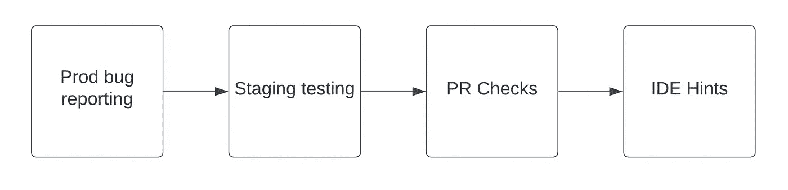
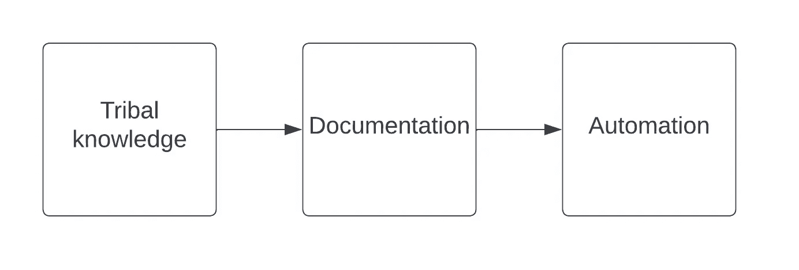

# 作为软件工程经理，你应该解决的 5 个速度瓶颈

> 原文：<https://betterprogramming.pub/5-velocity-bottlenecks-you-should-solve-as-a-software-engineering-manager-4df368f03382>

## SWE 管理日记#1

这一系列快速文章详细阐述了软件工程管理对如何提高你的工程师的速度并帮助他们在职业生涯中进步的见解。

在转向领导道路之前，我作为一名软件工程贡献者工作了六年。所有的发现都是基于我作为软件工程师的经验，而我目前的观察是从一个软件经理的角度。

unsplash.com上[安德鲁·西曼](https://unsplash.com/@amseaman)的照片

# 1.长反馈回路

这一部分关注的是减少编写代码和接收到关于其质量或应用程序行为回归的信号之间的时间。

## 代码质量

写得不好的代码最终会导致错误或技术债务。应用程序本身或代码库应该在开发生命周期的某个阶段进行测试。我更喜欢尽快这样做，因为这样可以提高速度。

图 1:代码质量方面的反馈循环速度的进展

这种方法被称为[左移](https://en.wikipedia.org/wiki/Shift-left_testing)，应该会减少对应用程序和代码质量的损害。在 IDE 中提供即时反馈并不意味着可以避免在产品中进行测试，因为在代码 lint 阶段可能检测不到高度复杂的错误。

## 构建系统

设计不良的管道会带来巨大的挫败感、生产率低下和容器使用上的金钱浪费。重要的一点是，工程师的时间比计算时间更有价值。因此，我认为在这方面有两个改进可以缩短反馈循环:

*   在 PR 级别测试，而不是在合并之后
*   主动缓存依赖关系— [GitHub 动作示例](https://www.voorhoede.nl/en/blog/super-fast-npm-install-on-github-actions/)

[极限编程](https://www.agilealliance.org/glossary/xp)的原则之一是[10 分钟构建](https://www.agilealliance.org/glossary/xp/#q=~(infinite~false~filters~(postType~(~'post~'aa_book~'aa_event_session~'aa_experience_report~'aa_glossary~'aa_research_paper~'aa_video)~tags~(~'xp))~searchTerm~'~sort~false~sortDirection~'asc~page~1))——尽可能接近这个度量标准肯定会提高团队的速度。

# 2.决策溢出

每一个软件贡献都包含了工程师为了提供解决方案而必须做出的一定数量的决定。几个例子是:

*   我应该使用什么解决方案来沟通模块 A 和模块 B？
*   我应该使用什么工具来制作元素的动画？
*   我应该如何记录我刚刚添加的可重用模块？

根据行为经济学，做决定是一个消耗注意力的过程，如果有很多选择，这种斗争会更大。

> 你给人们的选择越多，你需要提供的决策帮助就越多。— [《推动:改善关于健康、财富和幸福的决定》一书的作者理查德·h·泰勒](https://www.amazon.com/Nudge-Improving-Decisions-Health-Happiness/dp/014311526X)

为了减轻这种斗争，软件工程组织应该为软件工程师在开发过程中可能面临的某些情况提供现成的选择。一个简单的例子是使用一种自以为是的方式来处理 web 应用程序中的状态管理。

当在组织层面做出决定时，它应该被传递给所有的工程师。通过决策支持的方式应满足要求:

*   清楚的
*   高度可用
*   放在上下文中

我对开发适当支持的选择如图 2 所示。

图 2:软件工程决策支持的进展

# 3.遇到斗争

这一部分通常在《管理总论》中讨论。由于软件工程师应该专注于与解决问题相关的深层工作，避免不必要的会议将允许他们做他们喜欢的事情。

> 所以，即使你只是一个被邀请的参与者，你也应该问问自己，这个会议——以及你的出席——是否值得和合理。
> 
> [—安德鲁·S·格罗夫，高产出管理](https://www.amazon.com/High-Output-Management-Andrew-Grove/dp/0679762884)

每一次会议都应该带来一定的价值，回报工程师的时间。经理应检查是否以适当的频率召开了与项目管理相关的会议(站立会议、计划会议、回顾会议)和 1–1 会议。从我的经验来看，就会议时间而言，一周的 scrum sprints 可能是压倒性的。

# 4.跨团队沟通

在远程工作环境中，工程师可能很难与公司的其他团队沟通。最初的接触可能会令人生畏，尤其是对新加入者来说(我会留意[冒名顶替综合症](https://en.wikipedia.org/wiki/Impostor_syndrome))。因此，经理应建立一种清晰、简单的方式与特定团队沟通，例如:

*   创建与特定团队的问候会议
*   创建与这个特定团队的沟通渠道(例如，Slack)

你的工程师应该意识到你的团队和另一个团队有着共同的目标，这应该会减少寻求帮助的压力。

在 unsplash.com 的[上由](https://unsplash.com/) [Antonio Janeski](https://unsplash.com/@janesky) 拍摄的照片

# 5.门票管理

您应该检查您的工程师在以下活动上花费了多少时间:

*   更新票证状态
*   添加票证和评论
*   估计

两件事可以减少维护票证所需的时间:自动化和集成。几个例子是:

*   [将 GitHub 与 JIRA](https://support.atlassian.com/jira-cloud-administration/docs/integrate-with-github/) 集成，在推送分支和打开 PR 时更新门票状态
*   安装 [JIRA 松弛应用](https://www.atlassian.com/software/jira/guides/expand-jira/jira-slack-integration)，允许快速添加和评论门票
*   将 JIRA 与[扑克规划应用](https://marketplace.atlassian.com/apps/1212495/planning-poker)整合

你可以更进一步，使用像 [Zapier](https://zapier.com/) 这样的工具向你的工程师推荐其他类型的自动化集成。

# 摘要

除了我已经介绍的这些，还有许多可能的改进。任何瓶颈的调查都应该在价值评估之前进行。对于特定的瓶颈解决方案，每个团队可能有不同的优先级。

感谢阅读这篇文章。

有什么顾虑可以在评论区随便问我问题！