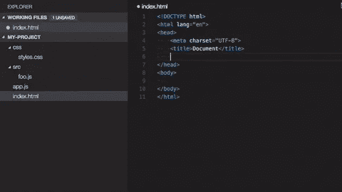

# 5 个 Visual Studio 代码扩展来提高您的工作效率

> 原文：<https://betterprogramming.pub/5-visual-studio-code-extensions-to-improve-your-productivity-3f4ede63faaf>

## 改进我们在 VS 代码中的开发工作流程

克里斯纳四世在 [Unsplash](https://unsplash.com?utm_source=medium&utm_medium=referral) 拍摄的照片

从一开始使用代码时，Visual Studio 代码就是我最喜欢的编辑器。作为开发人员，我们大多数人都喜欢能够使我们的工作更容易、更高效、更快速的工具。

在这篇文章中，我想分享我的五大 VS 代码扩展，它们每天都在提高我的工作效率。

# 1.自动导入

我用过的一个 VS 代码扩展是“[自动导入](https://marketplace.visualstudio.com/items?itemName=steoates.autoimport)”。我在从事 Angular 或 TypeScript 项目时高度依赖于此。

当你输入另一个文件中的函数、类或变量时，当你输入时，它会在 VS 代码中显示黄色气球，当你点击它时，你可以选择导入或导入所有缺少的依赖项。

这为我节省了很多输入路径的时间！

虽然这个插件只用于 TypeScript，但是还有另外一个(可能是从这个插件克隆的)支持 ES6，ts，JSX，TSX，这太棒了！

# 2.路径智能感知

例如，有时当我想在 HTML 中嵌入一个文件时，我很高兴在输入时可以看到该目录中的路径和文件。

这在白天节省了很多时间！我喜欢 [Path intellisense](https://marketplace.visualstudio.com/items?itemName=christian-kohler.path-intellisense) 扩展。

# 3.自动关闭标签

VS 代码，从版本 1.16 开始，有一个内置的特性为 HTML、[手柄](https://handlebarsjs.com/)和[剃须刀](https://docs.microsoft.com/en-us/aspnet/core/mvc/views/razor)自动关闭标签。

但是当你写 XML、PHP、Vue、JavaScript、TypeScript、JSX、TSX、Angular 代码的时候，它是如此的美好，以至于你在键入开始标签之后自动得到结束标签。

对我来说，[自动关闭标签](https://marketplace.visualstudio.com/items?itemName=formulahendry.auto-close-tag)在白天是这样一个生产力助推器，因为我不必再自己键入那些关闭标签。

# 4.自动重命名标签

也许你和我一样经常遇到这种情况，但是在我的 HTML 中，很多时候我是从制作一个`
`开始的。在用更多的 HTML 填充这些行之后，我最终发现另一个标记更有意义。

在那些时候，我很高兴我不用去寻找结束标签。[自动重命名标签](https://marketplace.visualstudio.com/items?itemName=formulahendry.auto-rename-tag)在改变开始标签的同时自动改变结束标签。超级容易！

生产力助推器…

# 5.Git 镜头

Git Lens 是在 Visual Studio 代码中使用 Git 的最佳集成。

打开一个文件，你可以看到当那一行最后一次改变的时候，旁边是你的团队成员的名字。它可以帮助您在一个文件中显示不同时间的差异，同时将它们放在一起。

如果您想查看在特定提交中哪些文件被更改，Git Lens 将帮助您完成这一任务。

这是我最喜欢的“所有东西 Git”Visual Studio 代码扩展。提高您的工作效率！

# 结论

我希望这些扩展能提高您的工作效率，就像它们为我所做的一样！如果你有另一个 Visual Studio 代码扩展，可以提高你的工作效率，但是我在列表中漏掉了它，请在评论中链接它们。

下面分享一些 VS 代码扩展！

*大家好，我是* ***Ray*** *荷兰🇳🇱的 JavaScript 开发人员，我喜欢分享我从 2009 年开始做开发人员以来学到的知识。我写关于 JavaScript、TypeScript、Angular 和任何与开发人员生活相关的东西的故事。
你可以关注我的*[*Twitter*](https://twitter.com/devbyrayray)*和*[*insta gram*](https://www.instagram.com/devbyrayray/)*或* [*订阅我的简讯*](https://buttondown.email/devbyrayray) *当我发布一个新的故事时。*

*快乐编码🚀*

# 从我这里读更多

 [## 解决 JavaScript 数组和对象重复的两种方法

### 你知道如何处理重复吗？

medium.com](https://medium.com/better-programming/2-ways-to-resolve-duplication-in-javascript-arrays-and-objects-e377e1bdc5e1)  [## 通过创建地图使您的 JavaScript 对象更加可预测

### 不再有未定义的属性

medium.com](https://medium.com/better-programming/make-your-javascript-objects-more-predictable-by-creating-maps-20ac1a795442)  [## 冠状病毒期间做程序员如何挣钱

### 程序员不需要工作就能获得报酬的 3 种方式

medium.com](https://medium.com/the-human-programmer/how-to-earn-money-as-programmer-during-the-coronavirus-a24971b15d57)  [## JavaScript 中的作用域是什么

### 关于全局范围内的变量、常量、Let、函数、对象和类的行为的解释。

itnext.io](https://itnext.io/what-is-the-scope-in-javascript-a2add52bf9d8)