# 5 VS Bash 脚本的代码扩展

> 原文：<https://betterprogramming.pub/5-vs-code-extensions-for-bash-scripting-da94a6915598>

## 编写出色的 Bash 脚本


由[克里斯多夫·高尔](https://unsplash.com/@cgower?utm_source=medium&utm_medium=referral)在 [Unsplash](https://unsplash.com?utm_source=medium&utm_medium=referral) 上拍摄的照片。

VS 代码为 Bash 脚本提供了出色的扩展。在本文中，我们将介绍一个内置的 shell 扩展、一个 linter、一个格式化程序、一个代码片段扩展、一个调试器等等。

准备好了吗？去启动 VS 代码吧。

# Shell 脚本语言基础


作者截图。

该扩展与 Visual Studio 代码捆绑在一起。它可以被禁用，但不能被卸载。它在 shell 脚本文件中提供语法突出显示和括号匹配。

您可以通过在 extensions 选项卡中键入`@builtin shell`来检查它，如上图所示。

启用后，单击底部状态栏中的“纯文本”。


在状态栏中，单击纯文本。

在选择语言模式中选择“外壳脚本”。

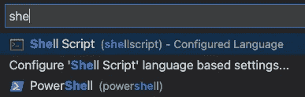

你会看到选择语言模式。

# 外壳检查

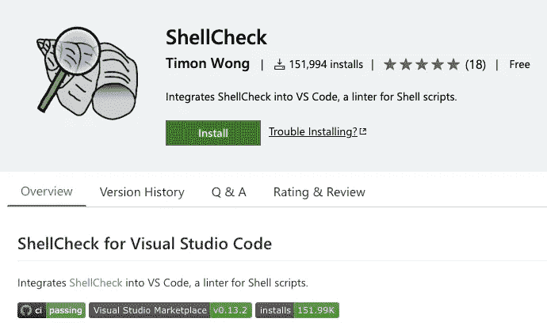

[外壳检查 VS 代码扩展](https://marketplace.visualstudio.com/items?itemName=timonwong.shellcheck)

[ShellCheck](https://github.com/koalaman/shellcheck#installing) 是一个 shell 脚本静态分析工具。通过安装 ShellCheck，你可以避免许多初学者的陷阱。

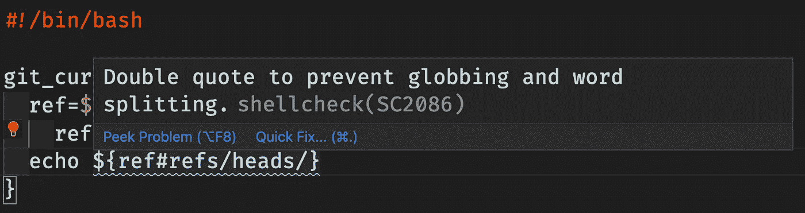

外壳检查警告。

你可以在 GitHub 上找到警告列表[或者使用 URL https://github.com/koalaman/shellcheck/wiki/SCXXXX，其中“XXXX”是警告代码(例如 2086)。](https://gist.github.com/shinokada/edbe46d08d688933f3765ec573bf7d74)

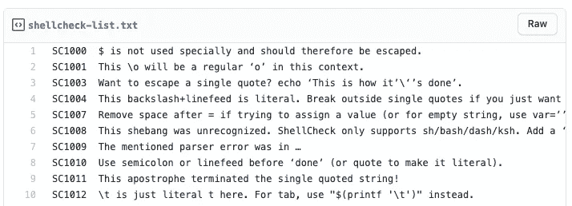

[外壳检查警告列表。](https://gist.github.com/shinokada/edbe46d08d688933f3765ec573bf7d74)

# 外壳格式

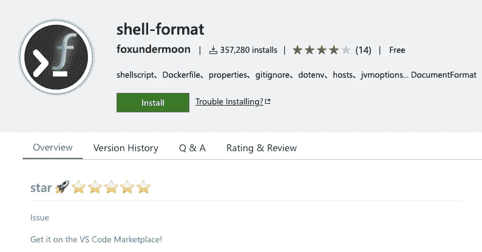

[外壳格式](https://marketplace.visualstudio.com/items?itemName=foxundermoon.shell-format)

[Shell-format](https://marketplace.visualstudio.com/items?itemName=foxundermoon.shell-format) 格式化 Shell 脚本、Dockerfiles、gitignore、dotenv 等等。Shell-format 有助于缩进、删除多余的空格和对齐。

这个扩展依赖于`shfmt`。如果您使用的是自制软件，您可以安装它:

```
$ brew install shfmt
```

# 谢尔曼

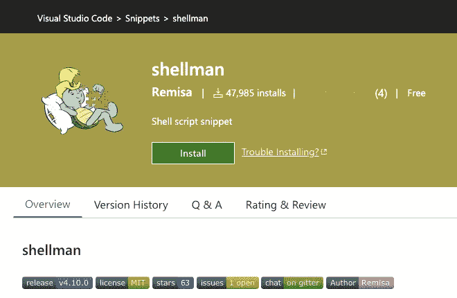

谢尔曼扩展公司

Shellman 是 shell 脚本的 VS 代码片段扩展。它提供了一个免费的电子书(PDF，epub，mobi ),其中包含脚本基础和片段。

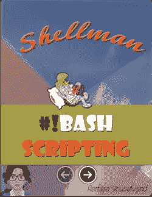

你可以下载一本关于谢尔曼的免费电子书。

你可以在 Github repo 上找到命令列表。Shellman 不仅提供了 Bash 脚本片段，如`while`、`if`和`fn`，还提供了`git`、`date`和其他命令。

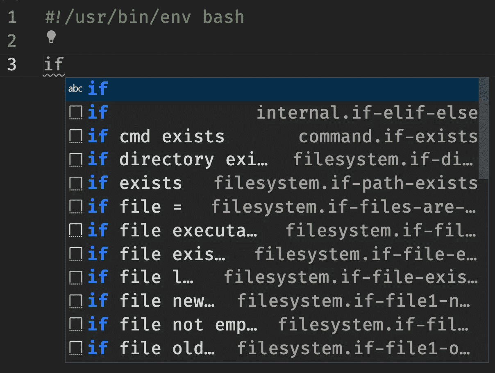

谢尔曼如果片段。

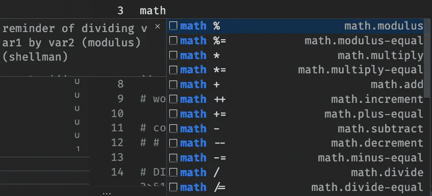

谢尔曼数学片段。

# Bash 调试

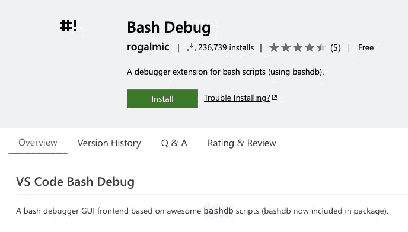

[Bash 调试扩展](https://marketplace.visualstudio.com/items?itemName=rogalmic.bash-debug)

这是最流行的 Bash 调试器。它提供了`launch.json`、暂停支持、`watch-debug`和条件断点。

# 缩进-彩虹(可选)

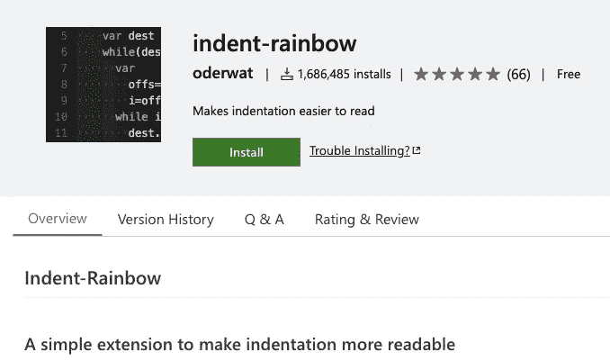

[缩进-彩虹扩展页](https://marketplace.visualstudio.com/items?itemName=oderwat.indent-rainbow)

你可以对所有编程语言使用 [Indent-rainbow](https://marketplace.visualstudio.com/items?itemName=oderwat.indent-rainbow) 。它通过对每个代码块上的缩进进行着色，使缩进更具可读性。

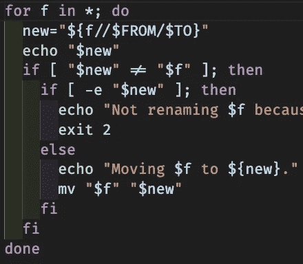

缩进-彩虹在行动。

# 结论

一旦掌握了这些扩展，您就可以开始在 VS 代码上编写出色的 Bash 脚本了。

您认为哪些扩展对 Bash 脚本有用？请让我知道。

编码快乐！

**通过** [**成为**](https://blog.codewithshin.com/membership) **会员，可以完全访问媒体上的每一个故事。**


[https://blog.codewithshin.com/subscribe](https://blog.codewithshin.com/subscribe)