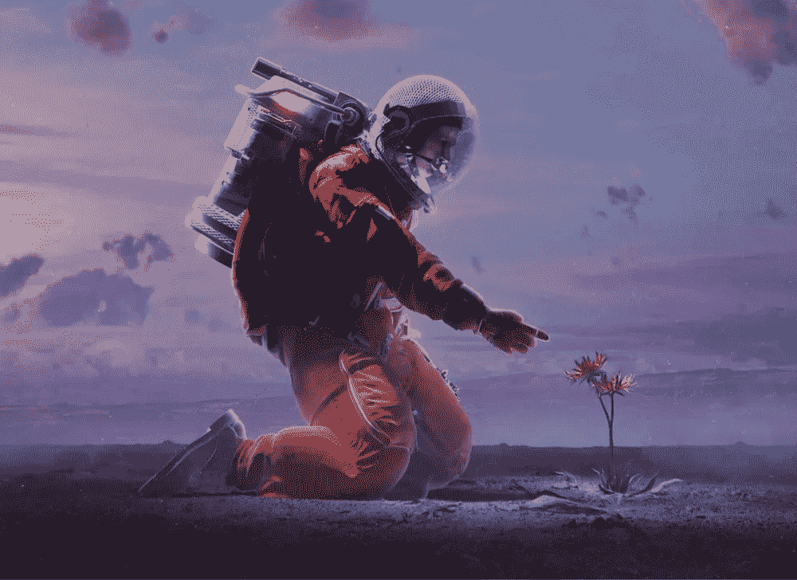
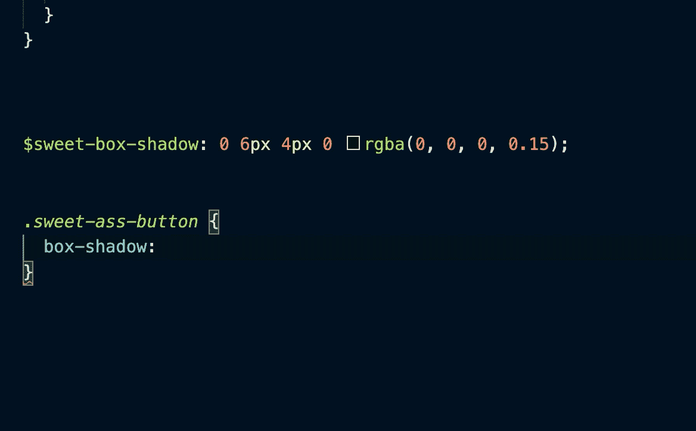
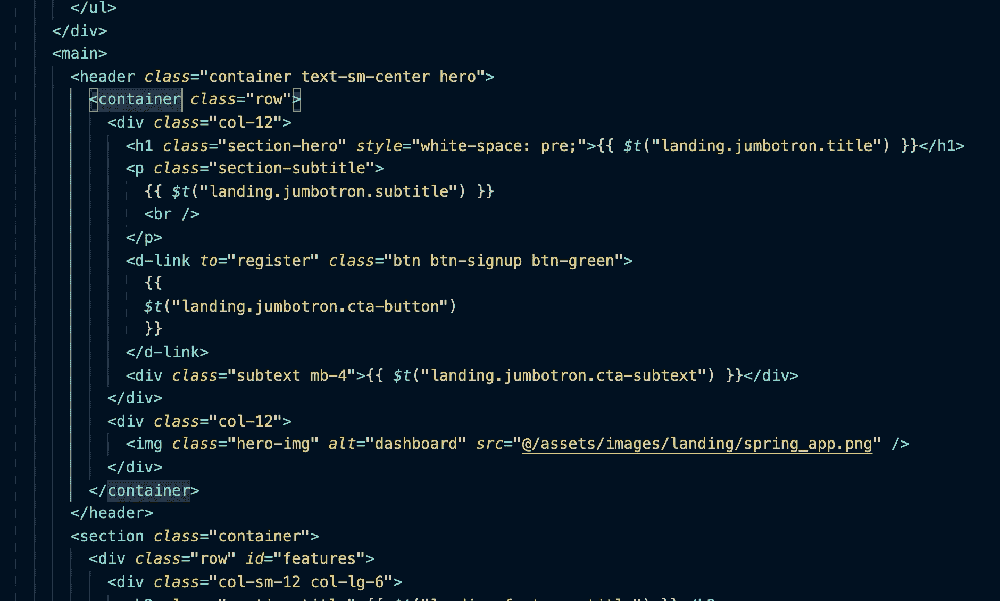
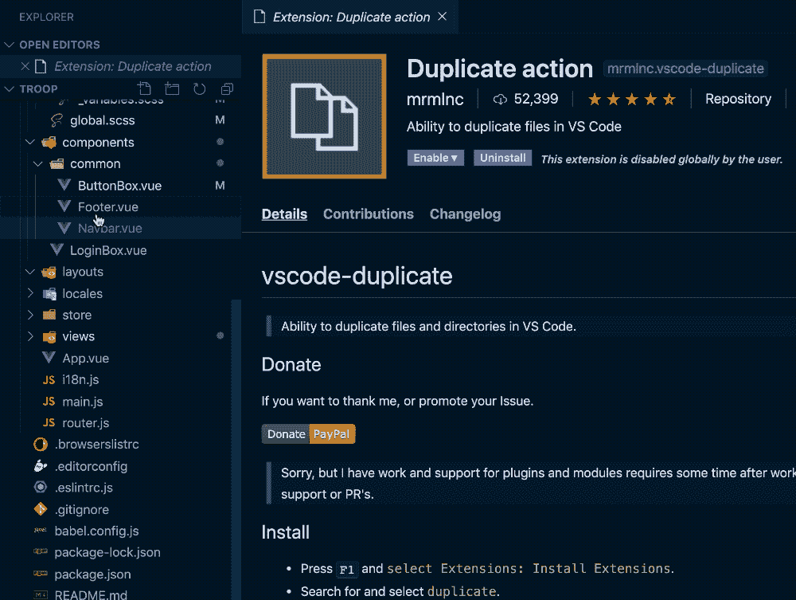
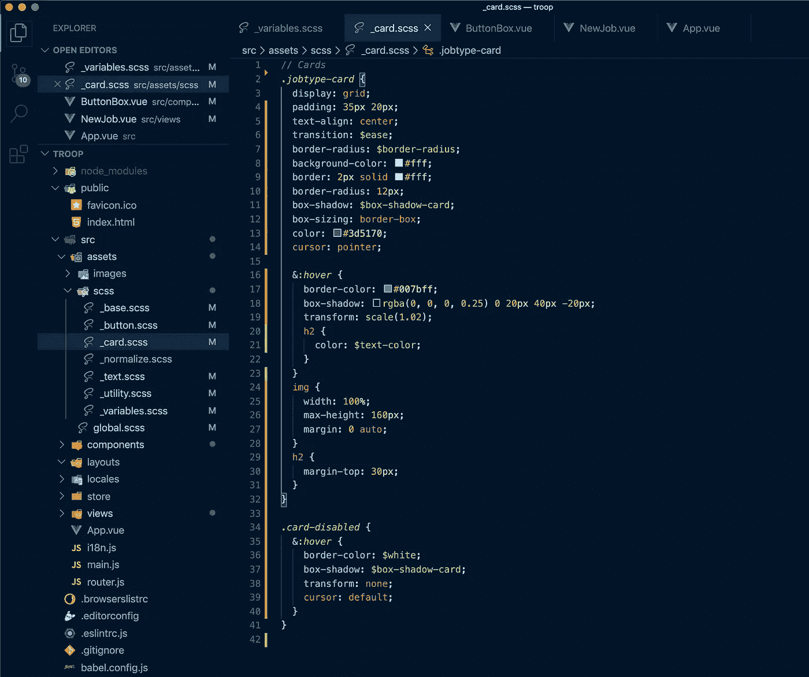

# 5 VS 代码扩展将改变您的开发生活

> 原文：<https://betterprogramming.pub/5-vs-code-extensions-thatll-change-your-dev-life-9786756a8121>

## 每一次击键都让你脸上带着微笑

由 [**变**](https://beeple-crap.com)

# **SCSS 智能感知**

在 SCSS 创造变量真是太棒了。记得他们吗？没有那么多。

如果你像我一样，你有一个`_variables.scss`部分，上面有数百个美元符号和你在前一天晚上凌晨 3 点想到的名字。这个插件使你的创造性的 SCSS 变量名在你的应用程序中的任何地方都可以立即使用。不再需要记住名字或搜索文件。

点击这里: [SCSS 智能感知](https://marketplace.visualstudio.com/items?itemName=mrmlnc.vscode-scss)

[SCSS 智能感知](https://marketplace.visualstudio.com/items?itemName=mrmlnc.vscode-scss)

# **自动重命名标签**

不管你选择什么样的框架，当你的开始和结束标签之间有 50 行时，HTML(或 JSX)的前端编码会变得令人疲惫不堪。也许你想把一辆`H2`换成一辆`H3`。也许你想把一个`div`换成一个`span`。不管怎样，除非你正在使用这个插件，否则你将很难找到结束标签。

为什么不省下所有的力气，让它自动为你改变呢？这就是你用自动重命名标签获得的能力。您在开始标记中所做的任何更改都会自动复制到结束标记中，反之亦然。

在这里获取:[自动重命名标签](https://marketplace.visualstudio.com/items?itemName=formulahendry.auto-rename-tag)

[自动重命名标记](https://marketplace.visualstudio.com/items?itemName=formulahendry.auto-rename-tag)

# **重复动作**

用右键单击复制文件的能力真的应该与 VS 代码一起提供，但是当你已经做出了这么好的产品，我认为我们可以给他们一些空间。

此外，您所需要的只是重复的动作扩展，它最终就在您所期望的地方。

拿到这里:[重复动作](https://marketplace.visualstudio.com/items?itemName=mrmlnc.vscode-duplicate)

[重复动作](https://marketplace.visualstudio.com/items?itemName=mrmlnc.vscode-duplicate)

# 代码流

简单来说，这就是类固醇上的`//comments`。

喜欢住在你的 IDE 里？用 Trello，Slack，Asana，Bitbucket，微软团队？CodeStream 支持大量的工具和 ide，因此您无需离开编码环境就可以跟踪问题。这意味着更多的时间停留在你的心流状态，更少的时间考虑如何向你的同事解释今天的问题。

在这里获取:[码流](https://marketplace.visualstudio.com/items?itemName=CodeStream.codestream)

[码流 ](https://marketplace.visualstudio.com/items?itemName=CodeStream.codestream)

# **夜猫子**

这是 IDE 有史以来最伟大的主题之一，也是我过去三年的日常驱动力(这实际上是我当前工作区的截图)。晚上保护你的眼睛，被夜猫子平静的蓝色调抚慰。

拿到这里:[夜猫子](https://marketplace.visualstudio.com/items?itemName=sdras.night-owl)

[夜猫子](https://marketplace.visualstudio.com/items?itemName=sdras.night-owl)

## **奖金优秀奖:**

# **合成波 84**

这就是给银翼杀手编码的主题。它可以搭配皮革风衣、兰博基尼 Countach 和烟雾机。打开你的 Vaporwave 背景音乐，在把你的意识融合到 Neuromancer 的数据库之前，开始敲打那个美丽的代码。

与其他主题不同，Synthwave '84 需要一点额外的修补来激活文本发光效果，但之后，我想你会同意这是值得努力的。

在这里得到它: [Synthwave '84](https://marketplace.visualstudio.com/items?itemName=RobbOwen.synthwave-vscode)

[合成波 84](https://marketplace.visualstudio.com/items?itemName=RobbOwen.synthwave-vscode)

关于 5 个更具策划性的 VS 代码扩展，请查看后续文章:

 [## 5 个 VS 代码扩展将改变您的开发生活

### 节省的时间越多，做的工作就越多

medium.com](https://medium.com/better-programming/5-more-vs-code-extensions-thatll-change-your-dev-life-16da5d563dbc)