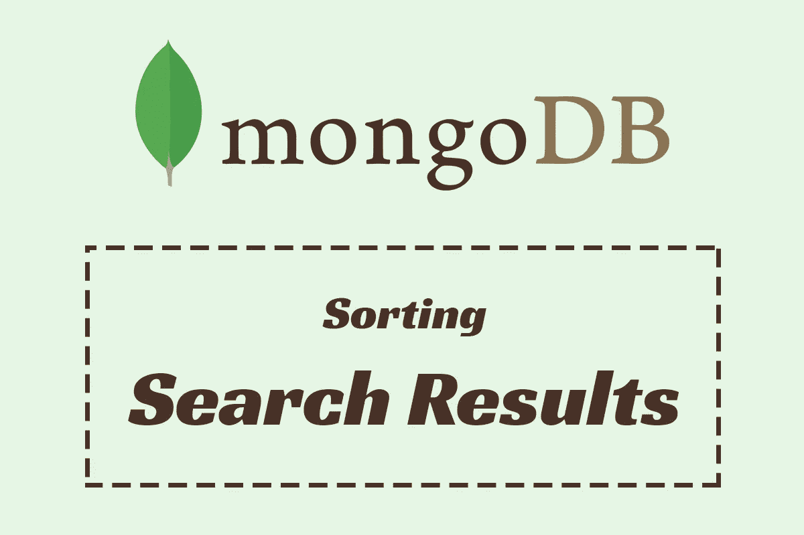

# 在 MongoDB 中对全文搜索结果进行排序的 5 种方法

> 原文：<https://betterprogramming.pub/5-ways-of-sorting-full-text-search-results-in-mongodb-4863b4eb0ae9>

## 用不同的方法提高你的技能



作者图片

MongoDB 是当今最流行的 NoSQL 数据库，它是一个面向文档的数据库，在许多现代 web 应用程序中使用。MongoDB 中的搜索可以通过许多不同的方式完成，包括传统的字符串搜索，它不如现代的索引搜索高效，或者为高级查询提供更丰富选项的全文搜索。我们将使用它来探索不同的排序结果的方法。

# 准备测试数据和文本索引

如果您有要测试的数据，那么您可以跳过这一步。如果没有，那么打开 MongoDB shell 并运行以下命令:

使用测试数据库:

`use testdb`

通过运行以下命令，导入以下示例电影数据集，该数据集包含名为`movies`的集合中的三个字段`title`、`plot`和`rating`:

为了验证插入，您可以运行这个命令`db.movies.find()`，它应该会打印出上面所有的电影。

现在剩下的就是为我们新的`movies`集合创建一个索引，我们将为字段`title`和`plot`创建一个索引，这样我们就可以用一个查询来搜索它们。在 MongoDB shell 中，运行以下命令:

`db.movies.createIndex({ "title": "text", "plot": "text" })`

要验证索引是否创建成功，运行`db.movies.getIndexes()`，它应该会打印出两个索引，一个是默认的，另一个是我们新创建的。

现在，让我们测试我们的数据集，并使用我们的新索引运行一个简单的文本搜索，让我们通过运行以下命令来搜索电影`Doctor Strange`:

`db.movies.find({ $text: { $search: "doctor strange" } })`

它应该返回以下结果:

```
{ 
  "_id" : ObjectId("62ed3dac947748ca508e093e"),
  "plot" : "After his career is destroyed, a brilliant but arrogant and conceited surgeon gets a new lease on life when a sorcerer takes him under her wing and trains him to defend the world against evil.",
  "title" : "Doctor Strange",
  "rating" : 4.5
}
```

现在，让我们开始探索如何对搜索结果进行排序。

# 1.按相关性对结果排序

当我们执行全文搜索时，我们得到一些与我们的文档相关联的元数据，其中包括每个文档的相关性分数`textScore`。默认情况下，结果不按分数排序。为了改变这种情况，让我们先来看看分数。

运行以下命令来搜索单词`world`并在我们返回的文档中的新字段`score`中投影`textScore`元数据:

```
db.movies.find({ $text: { $search: "world" } }, { _id: 0, title: 1, score: { $meta: "textScore" } })
```

它将返回以下结果:

```
{ "title" : "Doctor Strange", "score" : 0.5294117647058824 }
{ "title" : "Avatar", "score" : 0.5333333333333333 }
{ "title" : "Vikings", "score" : 0.5277777777777778 }
```

这些结果标题不包括我们的搜索词，因为我们也在搜索包含该搜索词的绘图字段。

注意分数是如何不排序的。为了改变这种情况，让我们使用以下聚合管道对它们进行排序:

现在，结果被排序为最相关的第一个:

```
{ "title" : "Avatar", "score" : 0.5333333333333333 }
{ "title" : "Doctor Strange", "score" : 0.5294117647058824 }
{ "title" : "Vikings", "score" : 0.5277777777777778 }
```

如果我们想先对最不相关的进行排序，那么我们可以按升序对分数进行排序，就像这样:

结果会是这样的:

```
{ "title" : "Vikings", "score" : 0.5277777777777778 }
{ "title" : "Doctor Strange", "score" : 0.5294117647058824 }
{ "title" : "Avatar", "score" : 0.5333333333333333 }
```

# 2.按字母顺序排列结果

要按字母顺序对搜索结果进行排序，我们需要做的就是按索引字段进行排序。要从上一个搜索词开始对标题进行升序排序，请运行以下聚合管道:

它将返回以下结果:

```
{ "title" : "Avatar" }
{ "title" : "Doctor Strange" }
{ "title" : "Vikings" }
```

如果我们想按降序排序，那么我们可以运行这个聚合管道:

结果会是这样的:

```
{ "title" : "Vikings" }
{ "title" : "Doctor Strange" }
{ "title" : "Avatar" }
```

# 3.通过自定义分数影响结果

我们的电影收藏有一个分级字段。比方说，我们希望使用该字段来影响我们的结果，并结合最相关和最评级来对我们的结果进行排序。我们可以将相关性分数与评级相乘，并将结果存储在一个新字段中，我们可以使用该字段对结果进行排序。

使用前面的搜索词，运行以下聚合管道:

你会得到这些结果:

```
{ "title" : "Avatar", "rating" : 5, "score" : 0.5333333333333333, "customScore" : 2.6666666666666665 }
{ "title" : "Vikings", "rating" : 5, "score" : 0.5277777777777778, "customScore" : 2.638888888888889 }
{ "title" : "Doctor Strange", "rating" : 4.5, "score" : 0.5294117647058824, "customScore" : 2.3823529411764706 }
```

现在请注意`Vikings`的排名如何高于`Doctor Strange`，因为它有更高的评级，尽管它的相关性分数更小。

# 4.首先对赞助结果进行排序

假设我们的一些结果得到了赞助，我们希望在其他结果之前对它们进行排序和显示。我们可以用高于所有其他得分的值来增加这些赞助结果的得分，以便首先对这些结果进行排序，然后是其他结果。

假设我们有一个想要首先播放的电影列表，例如`["The Avengers", "Vikings", "300"]`，使用前面的搜索词，让我们运行以下聚合管道:

我们所做的是检查标题是否是我们的赞助列表的一部分，如果是，则将其分数增加 100，如果不是，则保持其分数不变。

现在我们得到了这些结果:

```
{ "title" : "Vikings", "customScore" : 100.52777777777777 }
{ "title" : "Avatar", "customScore" : 0.5333333333333333 }
{ "title" : "Doctor Strange", "customScore" : 0.5294117647058824 }
```

由于`Vikings`是我们的赞助列表的一部分，它的分数会增加并排名第一，而其他结果使用它们的正常相关性分数排序。

# 5.基于搜索词位置排序

假设我们有以下列表:

```
Introduction to Computer Science
Computer Science
Advanced Computer Science
```

如果我们搜索单词`Computer`，我们将得到所有这些结果，但是假设我们希望总是根据单词`Computer`的位置对它们进行排序，那么我们将得到这些结果:

```
Computer Science
Advanced Computer Science
Introduction to Computer Science
```

在我们的电影收藏中，我们有两个复仇者联盟的标题，所以让我们应用到这些标题。我们可以使用标题中搜索词的位置作为自定义分数来影响我们的结果。

让我们使用相关性运行一个普通的排序，使用下面的聚合管道:

我们得到这些结果:

```
{ "title" : "The Avengers", "score" : 1 }
{ "title" : "Avengers: Infinity War", "score" : 0.6666666666666666 }
```

这不是我们想要的结果，所以让我们运行以下聚合管道:

现在我们得到了这些结果:

```
{ "title" : "Avengers: Infinity War", "score" : 0.6666666666666666, "customScore" : 0.6666666666666666 }
{ "title" : "The Avengers", "score" : 1, "customScore" : 5 }
```

那么，让我们来分解一下，首先`indexOfBytes`给出了我们的搜索词在标题中的位置，这意味着当我们将索引添加到我们的分数中时，单词越远，分数就越大，然后我们可以按升序排序。

```
$addFields: {
 indexValue: { $indexOfBytes: ["$title", "Avengers"] }
}
```

如果没有匹配，则`indexOfBytes`返回`-1`。这意味着最不相关的结果将首先显示，因为在我们的升序排序中`-1`会给它们最小的分数。所以我们能做的是执行一个条件，检查索引是否是`-1`，然后把它转换成一个大值。例如，100 保证它被排在具有有效索引的结果之后。

```
$addFields: {
 finalIndexValue: {
  $cond: [{ $eq: [ "$indexValue", -1 ] }, 100, "$indexValue"]
 }
}
```

现在，我们只需将最终指数添加到分数中。

```
$addFields: {
 customScore: {
  $add: ["$score", "$finalIndexValue"]
 }
}
```

并按升序排序`{ $sort: { customScore: 1 } }`

我希望这篇文章是有帮助的。感谢阅读。