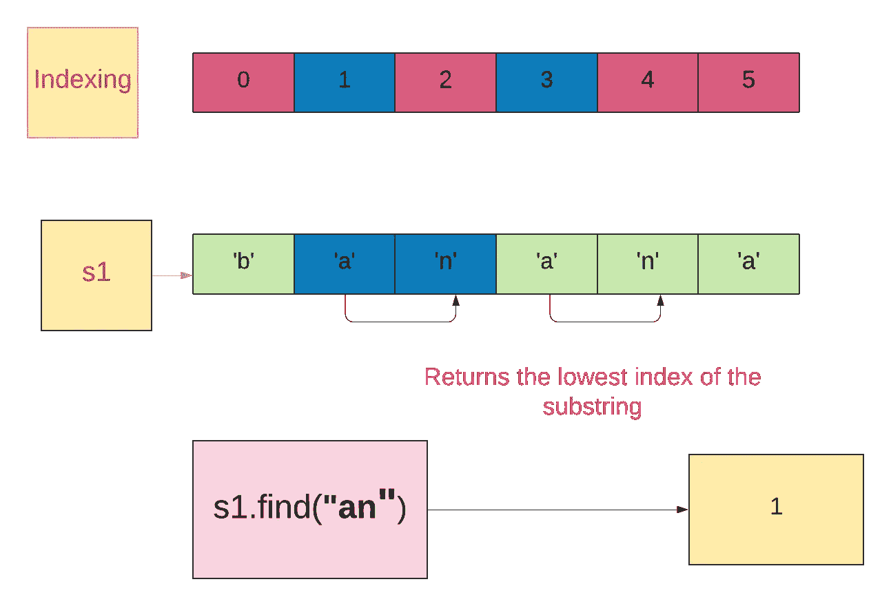
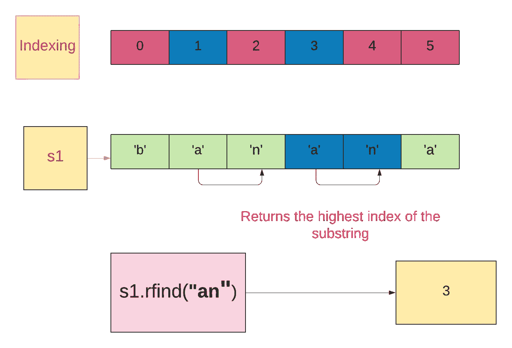

# 在 Python 中查找子串索引的 5 种方法

> 原文：<https://betterprogramming.pub/5-ways-to-find-the-index-of-a-substring-in-python-13d5293fc76d>

## 在 Python 中使用字符串方法和正则表达式


在 [Unsplash](https://unsplash.com/s/photos/strings-of-color?utm_source=unsplash&utm_medium=referral&utm_content=creditCopyText) 上由 [Maulik Sutariya](https://unsplash.com/@truemaulik?utm_source=unsplash&utm_medium=referral&utm_content=creditCopyText) 拍摄的照片

# 在 Python 中查找子串索引的 5 种方法

1.  `str.find()`
2.  `str.rfind()`
3.  `str.index()`
4.  `str.rindex()`
5.  `re.search()`

# str.find()

> `str.find()`返回子串`sub`在切片`s[start:end]`中找到的字符串中的最低索引。如果没有找到 sub，则返回`-1`。
> `start`和`end`是可选参数。- [python 文档](https://docs.python.org/3/library/stdtypes.html#str.find)

```
str.find(sub,start,end)
```

## 例 1。使用 str.find()方法



作者照片

字符串是`banana`。

子串是`an`。

子字符串在字符串中出现了两次。

`str.find(“an”)`返回子串`an`的最低索引。

```
s1=**"banana"** print (s1.find(**"an"**))
*#Output:1*
```

## 例 2。使用带有 start 参数的 str.find()方法

子串是`an`。

启动参数是`2`。它将从索引 2 开始搜索子串`an`。

```
s1=**"banana"** print (s1.find(**"an"**,2))
*#Output:3*
```

## 例 3。如果没有找到子串，它将返回-1

子串是`ba`。

启动参数为`1`，停止参数为`5`。它将从索引 1 到索引 5 开始搜索子串(排除)。

因为在给定索引的字符串中没有找到子字符串，所以它返回`-1`。

```
s1=**"banana"** print (s1.find(**"ba"**,1,5))
*#Output:-1*
```

# 2.str.rfind()

`str.rfind()`返回在`slice s[start:end]`中找到子串`sub`的字符串中的最高索引。如果没有找到 sub，它返回`-1`。
`start`和`end`是可选参数。- [python 文档](https://docs.python.org/3/library/stdtypes.html#str.rfind)

```
str.rfind(sub,start,end)
```

## 例 1。使用 str.rfind()方法



作者照片

弦是`banana`。

子串是`an`。

子字符串在字符串中出现了两次。

`str.find(“an”)`返回子串`an`的最高索引。

```
s1=**"banana"** print (s1.rfind(**"an"**))
*#Output:3*
```

## 例 2。使用 str.rfind()方法，带有提到的开始和结束参数

子串是`an`。

`start`和`end`参数分别为`1`和`4`。它将从索引 1 和索引 4 开始搜索子字符串(排除)。

```
s1=**"banana"** print (s1.rfind(**"an"**,1,4))
*#Output:1*
```

## 例 3。如果没有找到子串，它将返回-1

子串是`no`。

因为在字符串中没有找到子串，所以返回`-1`。

```
s1=**"banana"** print (s1.rfind(**"no"**))
*#Output:-1*
```

# **3。str.index()**

> 与`find()`类似，`str.index()`返回在字符串中找到的子串的最低索引。当找不到子字符串时，它会引发一个`ValueError`。- [python 文档](https://docs.python.org/3/library/stdtypes.html#str.index)

## 例 1。使用 str.index()方法

```
s1=**"banana"** print (s1.index(**"an"**))
*#Output:1*
```

## 例 2。使用 str.index()方法，给定开始和结束参数

```
s1=**"banana"** print (s1.index(**"an"**,2,6))
*#Output:3*
```

## 例 3。如果找不到子字符串，它将引发 ValueError

```
s1=**"banana"** print (s1.index(**"no"**))
*#Output:ValueError: substring not found*
```

# 4.str.rindex()

> 与`find()`类似，`str.rindex()`返回在字符串中找到的子字符串的最高索引。当找不到子串时，它引发一个`ValueError`。- [python 文档](https://docs.python.org/3/library/stdtypes.html#str.rindex)

## 例 1。使用 str.rindex()方法

```
s1=**"banana"** print (s1.rindex(**"an"**))
*#Output:3*
```

## 例 2。使用 str.index()方法，给定开始和结束参数

```
s1=**"banana"** print (s1.rindex(**"an"**,0,4))
*#Output:1*
```

## 例 3。如果找不到子字符串，它将引发 ValueError

```
s1=**"banana"** print (s1.rindex(**"no"**))
*#Output:ValueError: substring not found*
```

# 5.重新搜索()

```
re.**search**(pattern, string, flags=0)
```

> "扫描字符串，查找正则表达式模式产生匹配的第一个位置，并返回相应的 match 对象。如果字符串中没有与模式匹配的位置，则返回`None`；请注意，这不同于在字符串中的某个位置查找零长度匹配。— [Python 的官方文档](https://docs.python.org/3/library/re.html)

*   `re.search` (pattern，string):不得不提一下`string`中要搜索的`pattern`。
*   返回类型匹配包含该模式(子串)的开始和结束索引的对象。
*   我们可以使用`match.start()`和`match.end()`从匹配对象中找到`start`和`end`索引。

```
Match.**start**([*group*])Match.**end**([*group*])
```

> "返回由*组*匹配的子串的开始和结束的索引；*组*默认为零(表示匹配的整个子串)。如果*组*存在，但未参与匹配，则返回`-1`。— [Python 的文档](https://docs.python.org/3/library/re.html)

*   我们可以使用`match.span()`获得元组格式的`start`和`end`索引。

```
Match.**span**([*group*])
```

> “对于匹配的 *m* ，返回二元组`(m.start(group), m.end(group))`。注意，如果*组*没有参与匹配，这是`(-1, -1)`。*组*默认为零，整组匹配— [Python 的文档](https://docs.python.org/3/library/re.html)

## 例 1。使用重新搜索()

## 例 2。如果在字符串中找不到子字符串，则返回 None

```
**import** re
string = **'banana'** pattern = **'no'** match=(re.search(pattern, string))

*#Returns match object* print (match)*#Output: None*
```

# 结论

*   使用 Python 3.8.1。
*   `str.find()`，`str.rfind()` —未找到子字符串时返回`-1`。
*   `str.index()`，`str.rindex()` —找不到子字符串时引发`ValueError`。
*   `re.search()` —未找到子字符串时返回`None`。
*   `str.find()`，`str,index()` —返回子字符串的最低索引。
*   `str.rfind()`，`str.rindex()` —返回子字符串的最高索引。
*   `re.search()` —返回包含子字符串起始和结束索引的匹配对象。

# 我的其他博客与字符串方法有关

[](https://blog.devgenius.io/different-ways-to-replace-occurences-of-a-substring-in-python-strings-2911b1f7bf86) [## 在 Python 字符串中替换子字符串的不同方法

### 在 python 中使用字符串方法和正则表达式

blog.devgenius.io](https://blog.devgenius.io/different-ways-to-replace-occurences-of-a-substring-in-python-strings-2911b1f7bf86) [](https://levelup.gitconnected.com/remove-whitespaces-from-strings-in-python-c5ee612ee9dc) [## 在 Python 中移除字符串中的空格

### 在 Python 中使用字符串方法和正则表达式

levelup.gitconnected.com](https://levelup.gitconnected.com/remove-whitespaces-from-strings-in-python-c5ee612ee9dc) [](/split-vs-partition-in-python-strings-9505d070af55) [## Python 字符串中的 split()与 partition()

### 有什么区别？

better 编程. pub](/split-vs-partition-in-python-strings-9505d070af55) [](/5-ways-to-find-the-index-of-a-substring-in-python-13d5293fc76d) [## 在 Python 中查找子串索引的 5 种方法

### 在 Python 中使用字符串方法和正则表达式

better 编程. pub](/5-ways-to-find-the-index-of-a-substring-in-python-13d5293fc76d) 

# 资源(Python 文档)

*   [str.find](https://docs.python.org/3/library/stdtypes.html#str.find)
*   [字符串索引](https://docs.python.org/3/library/stdtypes.html#str.index)
*   [字符串查找](https://docs.python.org/3/library/stdtypes.html#str.rfind)
*   [str.rindex](https://docs.python.org/3/library/stdtypes.html#str.rindex)
*   [重新搜索](https://docs.python.org/3/library/re.html#re.search)
*   [匹配对象](https://docs.python.org/3/library/re.html#match-objects)

*关注此空间，了解更多关于 Python 和数据科学的文章。如果你喜欢看我的更多教程，就关注我的* [***中***](https://medium.com/@IndhumathyChelliah)[***LinkedIn***](https://www.linkedin.com/in/indhumathy-chelliah/)*[***推特***](https://twitter.com/IndhuChelliah) ***。****

**点击这里成为中等会员:*[*https://indhumathychelliah.medium.com/membership*](https://indhumathychelliah.medium.com/membership)*