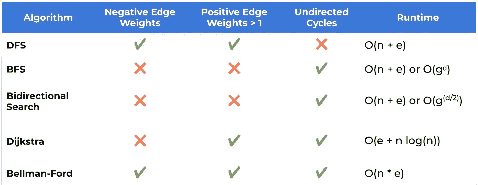
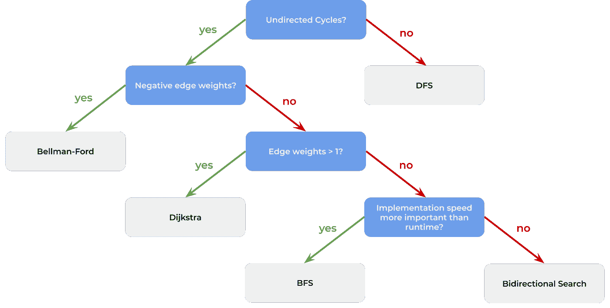

# 寻找图中最短路径的 5 种方法

> 原文：<https://betterprogramming.pub/5-ways-to-find-the-shortest-path-in-a-graph-88cfefd0030f>

## Dijkstra 的算法不是你唯一的选择。为每种情况找到最简单的算法

照片由[凯勒·琼斯](https://unsplash.com/@gcalebjones?utm_source=medium&utm_medium=referral)在 [Unsplash](https://unsplash.com?utm_source=medium&utm_medium=referral) 上拍摄。

说到求图中最短路径，大多数人想到的是 Dijkstra 的算法(也叫 Dijkstra 最短路径优先算法)。虽然 Dijkstra 的算法确实非常有用，但是基于图形的属性，可以使用更简单的方法。这些在竞争性编程竞赛或编程面试中非常有用，在这些场合你可能被迫手工编写一个最短路径算法。您需要尽可能简单的方法来减少代码中出现错误的可能性。

如果你不熟悉图或者深度优先搜索(DFS)和广度优先搜索(BFS)，我推荐你读读[这篇文章](https://medium.com/better-programming/basic-interview-data-structures-in-javascript-graphs-3f9118aeb078)。

对于以下算法，我们将假设图存储在如下形式的邻接表中:

它是一个 HashSets 的 HashMap，存储每个节点的相邻节点。

此外，每个算法将返回两个节点之间的最短距离以及一个我们称为`previous`的地图。该图保存了最短路径中包含的每个节点的前任。通过这种映射，我们可以打印最短路径上的节点，如下所示:

# 1.深度优先搜索

这可能是获得最短路径的最简单的算法。然而，也有缺点。您的图形需要是一个[树](https://en.wikipedia.org/wiki/Tree_(graph_theory))或[多树](https://en.wikipedia.org/wiki/Polytree)。如果满足这一条件，您可以使用稍加修改的 DFS 来查找最短路径:

如果`startNode`和`stopNode`之间不存在路径，则最短路径的长度为 *-1* 。我们用这个值初始化最短路径，并开始递归 DFS。递归 DFS 稍微修改了一下，它将跟踪搜索的深度，并在到达`stopNode`时立即停止。到达`stopNode`时的当前深度是我们的最短路径长度。

之所以不能用于循环图，是因为每当我们找到一条路径时，都不能确定它是最短路径。DFS 不能提供这样的保证。

## 表演

设 *n* 是我们图中的节点数，而 *e* 是我们图中的边数。该算法的时间复杂度为 O(n)。由于它的递归性质，它利用调用堆栈，因此具有渐进的内存消耗 *O(n)* 。

为什么不是 *O(n + e)* ？这是因为我们假设我们的图是非循环的。这意味着 *e ≤ n-1* 因此 *O(n+e) = O(n)。*

# 2.广度优先搜索(BFS)

稍加修改的 BFS 是一种非常有用的寻找最短路径的算法。简单适用于所有没有边权的图:

这是一个 BFS 的简单实现，只有几个细节不同。对于存储在队列中的每个节点，我们额外保存了到`startNode`的距离。当我们到达`stopNode`、*、*时，我们简单地返回与它一起存储的距离。

这是因为 BFS 的性质:在访问所有直接邻居之前，不会访问邻居的邻居。因此，在访问了所有距离为 *< x* 的节点之后，访问所有距离`startNode`为 *x* 的节点。BFS 将首先访问距离为 *0* 的节点，然后访问距离为 *1* 的所有节点，依此类推。这个性质就是为什么我们可以使用 BFS 来寻找最短路径，即使是在循环图中。

## 表演

让 *g* 描述我们图中任意节点的最大相邻节点数。而且，设 *d* 为`startNode`和`stopNode`之间最短路径的长度。那么这个算法的时间复杂度为 *O(gᵈ).*

这是为什么呢？BFS 在所谓的层次中搜索图形。一个级别中的每个节点到起始节点的距离都相同。到达级别 *1* 需要 *O(g)* 步，到达级别 *2* 需要 *O(g )* 步，以此类推。因此，需要 *O(gᵈ)* 步才能达到 *d* 级。再次使用变量 *n* 和 *e* ，运行时仍然是 *O(n + e)* 。然而，如果寻找最短的路径， *O(gᵈ)* 是更精确的说法。

在某些图中，队列可以包含它的所有节点。因此也具有 *O(n)* 的空间复杂度。

小备注:上面实现的实际运行时间比 *O(n + e)* 差。原因是 JavaScript 数组被用作队列。移位操作花费 *O(s)* 时间，其中 *s* 是队列的大小。然而，有可能在 JavaScript 中实现一个队列，允许在 *O(1)* 中的操作`enqueue`和`dequeue`，正如在[我的上一篇文章](https://medium.com/better-programming/basic-interview-data-structures-in-javascript-stacks-and-queues-b68b5a7c82a6)中所描述的。

# 3.双向搜索

我们获得最短路径的第三种方法是双向搜索。像 BFS 一样，适用于没有边权的无向图。为了执行双向搜索，我们基本上同时从`node1`和`node2`启动一个 BFS。当两个 BFS 相遇时，我们找到了最短的路径。

这不是最短的算法，但如果你了解 BFS，它仍然是简单的，很容易从零开始编码。但是相比于短得多的普通 BFS 有什么优势呢？答案是性能。如果 BFS 允许我们在合理的时间内找到长度为 *l* 的路径，那么双向搜索将允许我们找到长度为 *2l 的路径。*

更详细的性能:双向搜索在 *d/2* 级后结束，因为这是路径的中心。两个同时的 BF 各自访问 *g^(d/2)* 节点，总共是 *2g^(d/2)* 。这导致 *O(g^(d/2)和*，因此使得双向搜索比 BFS 快 *g^(d/2)* 倍！

# 4.Dijkstra 算法

这个算法可能是寻找最短路径最著名的一个。与 DFS、BFS 和双向搜索相比，它的优势在于您可以在所有边权重为正的图中使用它。不要在包含负边权重的图上尝试，因为在这种情况下不能保证终止。

## 速成班:优先队列

要理解 Dijkstra 的算法，必须理解优先级队列。优先级队列是一种抽象数据结构，它允许以下操作:

*   `isEmpty`:检查优先级队列是否包含任何元素
*   `insert`:插入一个元素和一个优先级值
*   `extractHighestPriority`:返回优先级最高的元素，并将其从优先级队列中删除

优先级是什么意思？从数学上讲，优先级必须允许在优先级队列的元素上定义偏序。在大多数情况下，它是一个简单的整数 *p* 并且具有最高优先级的元素是对于 *p* 具有最小(或最大)值的元素。在我们的例子中，我们需要优先级队列来存储图中的所有节点以及它们到起始节点的距离。所以我们的`extractHighestPriority`操作将被称为`extractMin`，，这是一个更具描述性的名称，用于检索到开始节点的距离最小的节点。

## Dijkstra 的算法是如何工作的？

在我们看代码之前，让我简短地描述一下这个算法，这样您就可以了解它是如何工作的。

我们首先初始化从起始节点到图中所有其他节点的最短路径。最初，除了起始节点本身之外，每个节点的值都是无穷大。开始节点将用 *0* 初始化，因为这是到其自身的距离。我们将所有节点插入到我们的优先级队列中，同时将它们到我们的起始节点的距离作为优先级。

现在开始实际工作。在优先级队列不为空之前，我们提取与起始节点的已知距离最短的节点。姑且称之为`currentNode`。然后我们循环遍历`currentNode`的所有邻居，对于每一个邻居，我们检查通过`currentNode`到达该邻居是否比当前已知的到该邻居的最短路径短。如果是，我们更新到邻居的最短距离并继续。但是你自己看看:

我们给了访问我们的`distances`映射的优先级队列一个回调函数。这在优先级队列实现中用于获得最小距离。然而，优先级队列的实现不应该在本文中讨论。

## 表演

该算法的时间复杂度高度依赖于优先级队列的实现。设 *n* 是图中节点的数量，而 *e* 是图中边的数量。如果用简单的数组实现，Dijkstra 的算法会以 *O(n)运行。*然而，更常见的实现使用斐波那契堆作为优先级队列。在这种情况下，运行时间在 *O(e + n log(n))以内。*

请注意，您通常可以通过使用 A*算法来提高 Dijkstra 算法的性能。它扩展了 Dijkstra 算法，提供了一个启发式函数。那种启发式取决于问题空间，需要满足一些数学条件。但是它可以提高许多实际问题的性能。试探法的一个例子是在二维表面上表示距离的图形的欧几里德距离。

# 5.贝尔曼-福特算法

我在这个故事中介绍的最后一个算法是贝尔曼-福特算法。与 Dijkstra 的算法相比，它可以处理负的边权重。只有一个限制:图不应该包含负循环。负循环是指其边总和为负值的循环。然而，该算法能够检测到负循环，因此将终止——尽管没有最短路径。

该算法与 Dijkstra 的算法非常相似，但它不使用优先级队列。相反，它在所有边上重复循环，以类似于 Dijkstra 算法的方式更新到开始节点的距离。让 *n* 再次成为我们图中的节点数。贝尔曼-福特算法在所有边上精确地循环 *n-1* 次，因为图中的无圈路径包含的边永远不会多于 *n-1* 。

在重复循环所有边之后，该算法再次循环所有边。如果其中一个距离仍然不是最优的，就意味着图中一定存在负循环。

## 表演

处理负边缘权重的能力是有代价的。贝尔曼-福特算法的运行时复杂度为 *O(n * e)。*因此，只有当你真的有负的边权重时，你才应该使用它。

# 结论

我们研究了一些在图中获得最短路径的最重要的算法，以及它们的优缺点。让我们看一下概述，以帮助您决定在何种情况下使用哪种算法:

n =节点数，e =边数，g =任意节点的最大相邻节点数， *d* =最短路径的长度

如您所见，使用哪种算法取决于图的几个属性以及算法的运行时间。然而，另一个重要因素是实施时间。如果你在参加编码竞赛或编码面试，那么实现速度很重要。在这种情况下，您可能希望在实现速度和运行时复杂性之间进行权衡。所有这些观察导致以下问题:

*   图包含负的边权重吗？
*   图包含大于 1 的正边权吗？
*   图包含无向圈吗？
*   实现速度比运行时间更重要吗？

根据这些问题，您可以确定要使用的正确算法。这里有一个有用的决策树:

决策树来确定最合适的最短路径算法

请注意，这篇文章并没有涵盖所有现有的在图中寻找最短路径的算法。它概述了最重要的算法，并推荐了适合您的情况的最佳算法。

特别是如果您的图适合用于 A*算法的启发式算法，那么对于任何具有正边权重的图，都值得考虑使用它。不过，要记住的一点是，您只能找到从源节点到带有*的目标节点的最短路径。另一方面，有了 BFS 和迪克斯特拉的算法，你可以很容易地找到从一个源节点到所有其他节点的最短路径。你只需要对这两个算法做一些小的修改。

我希望我能让你对这种情况有更深的理解，这样你下次需要时就能明智地选择一种算法。

# 参考

*   [JavaScript 中的数据结构:图形](https://medium.com/better-programming/basic-interview-data-structures-in-javascript-graphs-3f9118aeb078)
*   [树(图论)](https://en.wikipedia.org/wiki/Tree_(graph_theory))
*   [多方](https://en.wikipedia.org/wiki/Polytree)
*   [A*搜索算法](https://en.wikipedia.org/wiki/A*_search_algorithm)