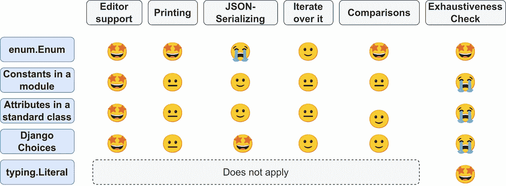

# 用 Python 获得枚举的 5 种方法

> 原文：<https://betterprogramming.pub/5-ways-to-get-enums-in-python-3e5d6e610ec1>

## 应该有一种——最好只有一种——显而易见的方法来做这件事。


斯蒂芬·莱昂纳迪在 [Unsplash](https://unsplash.com/s/photos/path?utm_source=unsplash&utm_medium=referral&utm_content=creditCopyText) 拍摄的照片

枚举是静态值的集合，通常是字符串或整数。它们经常被使用——或者至少应该被使用。在 [Cashlink](https://cashlink.de/) ，我们通常使用它们来跟踪较长流程的步骤。

枚举是对常数进行分组的一种方式。常量对于防止输入错误很有用，因为当一个值不是枚举的一部分时，您的编辑器可以警告您，但它不能警告您字符串或整数无效。在枚举中对常量进行分组有几个好处。

在深入研究之前，让我们先来看看枚举的一些应用。

# 列举的例子

*   **状态**:你正在写一个后端，你想返回一个状态码，这应该是一个 enum。你不写`return 404`而是写`return status.HTTP_404_NOT_FOUND`。一般来说，包含有限状态集的变量应该有一个 Enum 值。查找“状态”或“状态”。
*   **选择**:可以是用户可以选择的称呼，也可以是用户的角色。原产国，时区，…在你的代码中寻找“选择”或者有时仅仅是列表。
*   **类型**:你可以有不同类型的用户、订阅、产品等等
*   **步骤**:如果你跟踪用户漏斗，你可能会有一个常数为每一步。根据这一点，你可以有不同的行为。所有步骤的集合可以是一个枚举。
*   **Flags**:Unix 权限系统将读/写/执行表示为一个 3 位序列中的二进制标志，这是您希望使用 Enum 做什么的另一个例子。

# 你想对 enums 做什么

## 获得编辑支持

你总是可以使用一个常量。但是当您使用编辑器时，您通常希望编辑器自动完成。

## 打印时呈现美观

应该有很好的方法把它转换成字符串。例如，当您打印 HTTP 状态代码时，我认为 NOT_FOUND 比 404 好得多。

## 迭代所有值

枚举是静态值的集合。在某些情况下，你需要循环遍历所有的元素。

## 彻底性检查

在许多代码库中，您可以看到这种模式:

```
if value == 'a':
    ...
elif value == 'b':
    ...
elif value == 'c':
    ...
else:
    # Safeguard if a case was forgotten
    raise NotImplemented(f"The value {value} should not exist")
```

我也因为完全相同的事情看过`ValueError`。

根据这些值的来源，您可以将`value`与枚举进行比较。然后 mypy 可以进行穷举检查，这意味着它会理解有可能遇到异常。因此，mypy 可以警告您，您实际上忘记了一个案例！

## 语义有意义的比较

比较值很容易，但是比较语义很难。我们要比较的是同类的东西，而不是价值观。例如，我们想要比较我们收到的付款是否等于我们预期的金额。必须在同一个单位。如果我们期待 1000 欧元或 1000 印尼盾，那就大不一样了。如果你谈到生物性别或性身份，对一些人来说也有很大的不同。这意味着两个变量可能包含完全相同的值，但不具有可比性。至少我们会期待一个评估为`False`的比较。

## **序列化和反序列化**

我们需要经常将数据转换成 JSON，或者从 JSON 转换回来。Pydantic 非常神奇，在大多数情况下，它能很好地强迫人们接受正确的价值观，但是让我们检查一下给定的选项它们做得有多好。

# № 1:内置枚举模块

通过 [PEP 435](https://www.python.org/dev/peps/pep-0435/) 在 Python 3.4 中引入了 [enum](https://docs.python.org/3/library/enum.html) 模块。当您想要创建一个 Enum 时，首先应该想到的是:

```
from enum import Enum**class** HttpStatus(Enum):
    NOT_FOUND = 404
    SUCCESS = 200
    INTERNAL_SERVER_ERROR = 500**# Printing**
>>> print(HttpStatus.SUCCESS)
"HttpStatus.SUCCESS"**# Comparisons**
>>> HttpStatus.NOT_FOUND == 404
False>>> HttpStatus.NOT_FOUND.value == 404
True**# Iteration**
>>> for value in HttpStatus:
...     print(value)
... 
HttpStatus.NOT_FOUND
HttpStatus.SUCCESS
HttpStatus.INTERNAL_SERVER_ERROR
```

整数标志可以用 [IntFlag](https://docs.python.org/3/library/enum.html#intflag) 来完成。

如果你想检查穷尽性，你可以得到这个:

```
**from** typing **import** NoReturn**def** assert_never(value: **NoReturn**) -> **NoReturn**:
    assert False, f'Unhandled value: {value} ({type(value).__name__})' **def** print_status(status: HttpStatusBuiltin) -> None:
    if status is HttpStatusBuiltin.SUCCESS:
        print('SUCCESS')
    elif status is HttpStatusBuiltin.NOT_FOUND:
        print('NOT_FOUND')
    else:
        **assert_never(status)**
```

这将给出以下错误消息:

```
$ **mypy** main.py
main.py:35: error: Argument 1 to "assert_never" has **incompatible type** "Literal[HttpStatus.INTERNAL_SERVER_ERROR]"; expected "NoReturn"
```

您可以使 Enums JSON 可序列化，但是您必须稍微考虑一下:

[](https://py.watch/convert-a-python-enum-to-json-5eb5e94ecc9) [## 将 Python 枚举转换为 JSON

### 创建基于字符串标记 JSON-serializable 的 Python 枚举的一个简单方法是继承 str 和 Enum…

py .手表](https://py.watch/convert-a-python-enum-to-json-5eb5e94ecc9) 

# № 2:普通类属性

您可以简单地创建一个类并使用它的属性:

```
class HttpStatus:
    NOT_FOUND = 404
    SUCCESS = 200
    INTERNAL_SERVER_ERROR = 500# Printing
>>> print(HttpStatus.SUCCESS)
200# Comparisons
>>> HttpStatus.NOT_FOUND == 404
True
```

虽然这样的事情在许多代码库中仍然很常见，但缺点是显而易见的:

1.  与其他枚举的值比较会导致意外的结果。
2.  迭代这些值要困难得多。
3.  字符串表示只是很难阅读的值。

# № 3:模块中的常数

你可以直接把数值放在一个模块中，例如`.http_status_codes.py`:

```
NOT_FOUND = 404
SUCCESS = 200
INTERNAL_SERVER_ERROR = 500
```

这可能是最轻量级的选择。你仍然有所有的缺点。

这样做的一个真实例子是带有 HTTP 状态代码的 Django Rest 框架([来源](https://github.com/encode/django-rest-framework/blob/master/rest_framework/status.py))。

# № 4:姜戈模特。选择

Django 也有几种创建枚举的方法，例如 [TextChoices](https://docs.djangoproject.com/en/4.0/ref/models/fields/#enumeration-types) :

```
from django.db import modelsclass HttpStatus(models.TextChoices):
    NOT_FOUND = 404
    SUCCESS = 200
    INTERNAL_SERVER_ERROR = 500# Iteration
>>> for value in HttpStatus:
...     print(value)
... 
404
200
500# Comparisons
>>> HttpStatus.NOT_FOUND.value == '404'
True
>>> HttpStatus.NOT_FOUND == '404'
True
>>> HttpStatus.NOT_FOUND.value <= '404'
True# Custom functions
>>> HttpStatus.choices
[('404', 'Not Found'), ('200', 'Success'), ('500', 'Internal Server Error')]
>>> HttpStatus.names
['NOT_FOUND', 'SUCCESS', 'INTERNAL_SERVER_ERROR']
>>> HttpStatus.labels
['Not Found', 'Success', 'Internal Server Error']
>>> HttpStatus.values
['404', '200', '500']
```

还有`models.Choices`和`models.IntegerChoices`。

Django TextChoices 枚举添加了一些可能会派上用场的函数。如果你使用 Django，我会推荐你使用它们。他们可以连接到 Django ORM，这很好。

Django 选择也是直接 JSON 可序列化的。

# № 5:打字。逐字的

[文字类型](https://docs.python.org/3/library/typing.html#typing.Literal)是在 [PEP 586](https://www.python.org/dev/peps/pep-0586/) 中引入的，作为一种指示变量必须有一组特定值的方式。例如，除了声明一个函数应该返回一个整数作为参数之外，您还可以这样注释:

```
from typing import LiteralStatusCode = Literal[404, 200, 500]def set_color(self, http_status_code: StatusCode):
    self.color = color
```

# 现在…我该拿哪一个？

首先，确保枚举类型满足您的需求:



图片作者:马丁·托马斯

还有一些其他的选择:

*   需要支持 Python 3.3 或更早版本吗？那么你不能选择`enum.Enum`。
*   你只是想让 mypy 有更好的检查问题的能力吗？使用`typing.Literal`！
*   你用姜戈吗？那么姜戈的选择就是你要走的路！

我喜欢写关于软件开发和技术的文章🤩不要错过更新: [**获取我的免费电子邮件简讯**](https://martinthoma.medium.com/subscribe) 📧或者[如果你还没有报名参加 medium](https://martinthoma.medium.com/membership)✍️——这两者都鼓励我写更多🤗