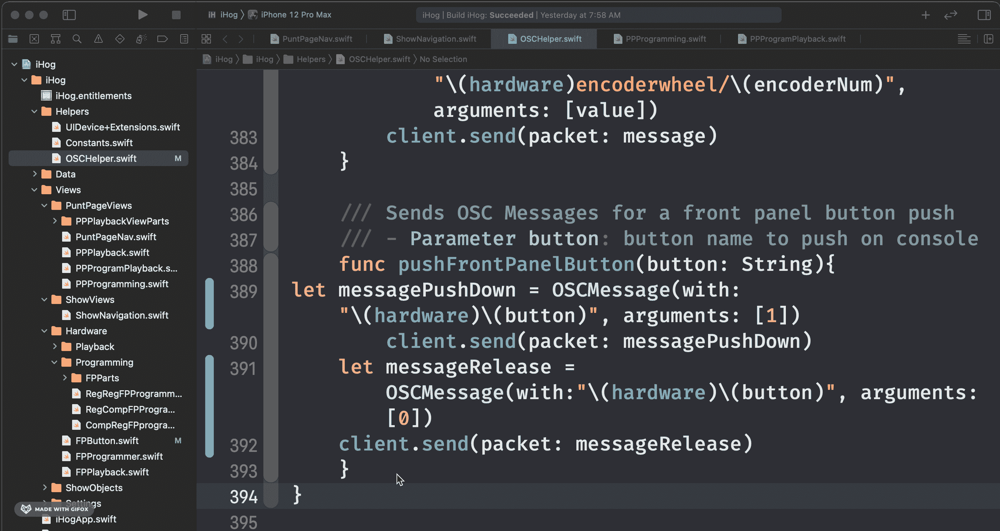
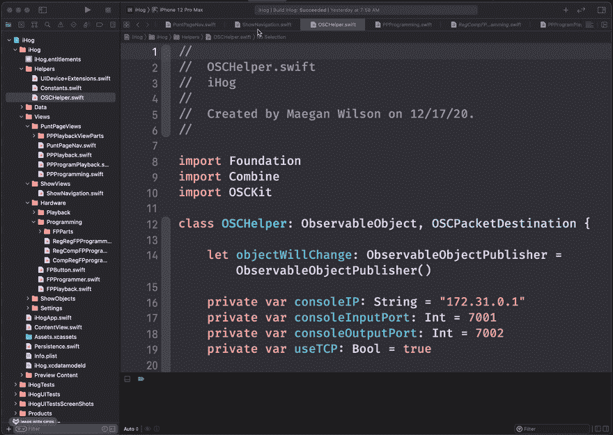
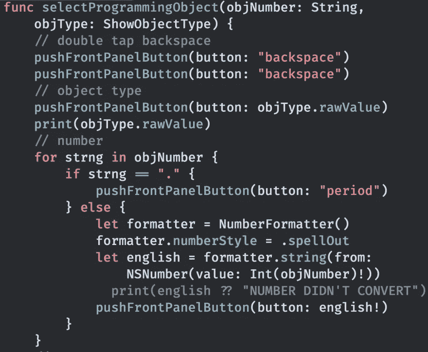
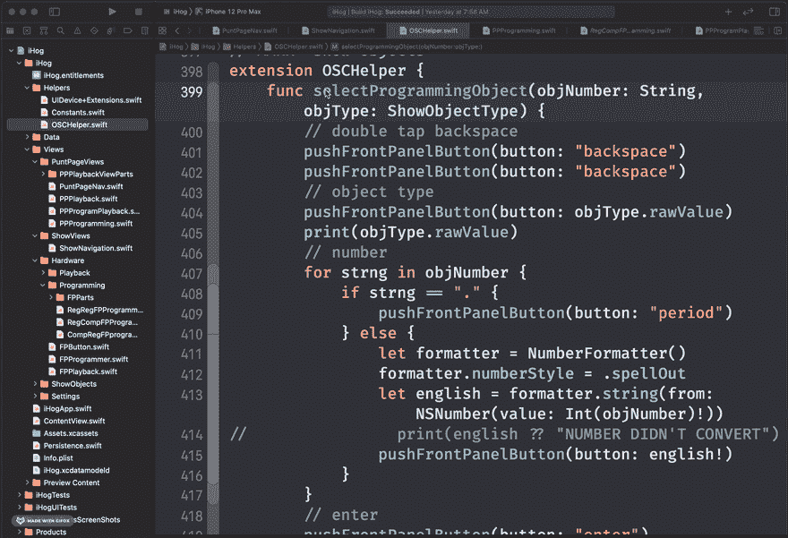
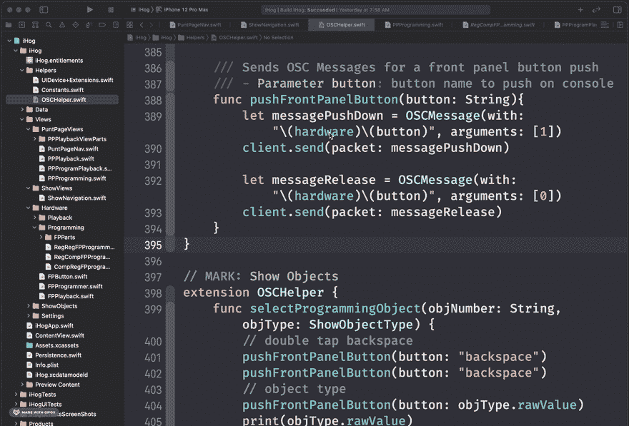

# 改进 Xcode 工作流程的 5 种方法

> 原文：<https://betterprogramming.pub/5-ways-to-improve-your-xcode-workflow-802fcdfd8dd0>

## 我使用 Xcode 的最佳技巧

Elise Bouet 在 [Unsplash](https://unsplash.com?utm_source=medium&utm_medium=referral) 上拍摄的照片。

如果你有任何其他的建议，请在评论中告诉我，因为我很乐意分享它们。

# 1.构建和运行快捷方式

首先，利用构建和运行应用程序的快捷方式。这些是你会经常做的动作:

*   命令+ b =构建
*   命令+ r =运行

从长远来看，这会节省你的时间，因为你的手已经在键盘上了，你不必去点击工具栏上的“运行”按钮。

如果您使用画布，请务必记下重新启动实时预览的快捷方式。当您调整视图本身之外的任何内容时，画布将停止更新，因此如果您添加一个变量或环境对象，您将需要重新启动它。快捷键是 Command + Option + p。

这些大概是我用的最多的快捷键了。

下一个最常用的快捷键在下一部分。

# 2.保持文件的格式

有多少次你会回到你的代码中去寻找一个特定的行或者只是阅读一个部分来理解发生了什么？我知道我一直都这样。因为格式是相同的，所以具有正确缩进的文件是容易理解的。这造成了一个不同的世界。

Xcode 有一种方法来格式化代码的一部分。选择要格式化的部分，然后按 Control + i。要对整个文件执行此操作，请选择全部，然后按 control + i。

命令+ a →控制+ i:

作者 GIF。

格式化文件的另一个原因是为了容易知道语法上是否有问题。有时，这比等到构建时才发现错误要快。

我刚刚谈到保持文件格式正确，以帮助阅读文件，但让我们转移到导航您的文件。也许我知道我想去哪里。这很容易做到。

下一部分是关于如何像专业人士一样浏览你的文件。

# 3.像专业人士一样浏览文件

利用文件名上的下拉菜单导航您的文件。那里有什么？

*   财产申报
*   功能声明
*   标记的注释
*   待办事项注释

你可以点击这些项目中的任何一个，并立即被带到那里。这有助于准确地找到您需要的位置，并快速浏览特定文件中正在发生的事情。

最后两个部分是关于如何通过你的努力让你的代码变得更好。

# 4.添加文档功能

有时候，你可以按住 Option 键并点击一个属性名来获取关于它的信息——尤其是当它是苹果公司提供的一个类或函数时。你也可以对你的代码这样做！

按住 Command 键并单击类、结构或方法，然后选择“添加文档”然后会给你一个模板来填写！最好的部分是，如果你在一个需要属性的方法或函数上这样做，那么它也会给出这些属性。

让我们通过查看`OSCHelper`来看看这一点。在下面，你可以看到在`selectProgrammingObject`中没有任何关于它做什么或者什么时候使用它的文档，所以我要改变它。

1.  按住 Command 键并单击函数名。
2.  选取“添加文稿”
3.  填写文档

现在，当我按住 option 键并单击名称时，我会得到摘要和所需的参数。

最后一个技巧是菜单中另一个选项:重命名功能。

# 5.重命名功能

我相信我们都经历过:一个变量被声明，名字不符合你使用它的目的，但是它已经在八百万个不同的地方被使用。这就是重命名功能派上用场的地方。

无论您在哪里，按住 Command 键并单击属性名称都会提供一些选项。它还将遍历项目，并完全重命名该属性、方法或函数的所有实例。

这是一个非常有用的工具，节省了我很多时间和头痛。

希望这五个技巧能帮助你开发应用程序。感谢阅读！