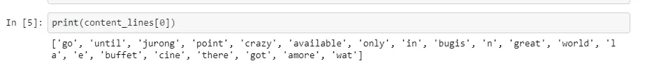
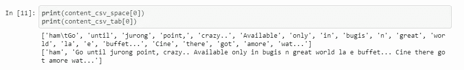
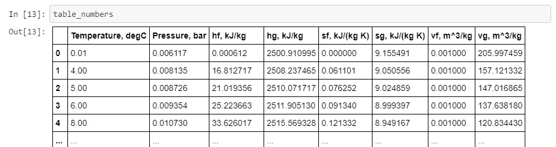
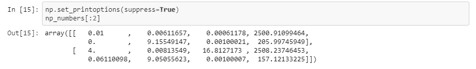

# 使用 Python 打开和读取数据集的 5 种方法

> 原文：<https://betterprogramming.pub/5-ways-to-open-and-read-your-dataset-using-python-780770199776>

## 不同目的的不同方法

马库斯·斯皮斯克在 [Unsplash](https://unsplash.com?utm_source=medium&utm_medium=referral) 上的照片。

数据分析过程的第一步是什么？我相信首先你要打开数据集来获取数据。如果使用 Tableau，那么它会执行大部分检测文件类型、数据类型、分隔符和编码的工作。但是如果直接在 Jupyter 工作应该怎么进行呢？

根据分析的目的和文档的类型，有几种打开数据集的方法。

# 1.用于自定义分析的自定义文件

处理原始或未准备好的数据是一种常见的情况。嗯，为进一步分析或建模准备数据集是数据科学家工作的一个阶段。没有友好的 CSV 格式，没有结构，自定义分隔符等。这就是为什么掌握有关原生 Python 文件功能的技能非常重要。

例如，我们有[一个针对](https://archive.ics.uci.edu/ml/datasets/sms+spam+collection)[垃圾邮件检测](https://towardsdatascience.com/comparing-a-variety-of-naive-bayes-classification-algorithms-fc5fa298379e) [算法](https://towardsdatascience.com/how-to-build-and-apply-naive-bayes-classification-for-spam-filtering-2b8d3308501)的短信数据集。但是所有的信息都有标点符号，不同的单词大小写，还有一些问题。因此，我们的任务是将每条消息转换成一组标记或至少是单独的单词。在这种情况下，我们将借助 Python 文件函数读取每一行，并手动拆分:

现在我们有了某种秩序:

看起来这种方法可行，但是如果我们有一个非标准编码的文件呢？

# 2.带有自定义编码的文件

与 Python 中几乎所有的东西一样，已经存在一个库([编解码器](https://docs.python.org/3/library/codecs.html#module-codecs))，它提供了对不同类型编码的访问。除了额外的包装器之外，代码与前面的示例几乎相同:

正如预测的那样，输出是相同的。

因此，这是处理数据集最灵活的方式。但是，如果我们对已定义的数据类型已经有了解决方案，为什么我们还需要重新发明轮子呢？

# 3.带本地库的 CSV 文件

我认为 CSV 格式是最常见和最方便的——至少在我的经验中是这样。Python [为这种类型提供了一个单独的库](https://docs.python.org/3/library/csv.html)，这并不奇怪。此外，它还可以处理几乎任何带有单分隔符符号的有组织的数据集。让我们将它应用于垃圾邮件:

这里我们看到，使用不同分隔符的解析有不同的输出:

这可能没什么大不了的，因为我们可以用几行代码[来纠正它，或者提供额外的解析](https://medium.com/better-programming/10-python-tricks-and-scripts-for-strings-transformation-and-decomposing-e82ecac0a4d0)。但是我相信您会更喜欢一种更方便的方式来解析您的数据集。

# 4.熊猫

是的，我知道 [pandas](https://pandas.pydata.org/) 库被过度使用了，但是我需要提到它，因为它的文件读取功能是我遇到的所有功能中最方便的。它允许你用几个分隔符读取文件，跳过一些行，选择具体的列，等等。[深入文档](https://pandas.pydata.org/pandas-docs/stable/reference/api/pandas.read_table.html)了解更多详情。还有，由于标准的`read_csv()`和其他函数都建立在`read_table()`之上，所以单个例子就足够了。我们将使用带有热循环变量参数的数值数据集:

如您所见，它是最短的变体，因为它已经吸收了我们手工编写的所有包装器。作为输出，我们得到了一个结构良好的表:

但是，如果存在一种更整洁的数据集读取变体，并且具有具体的功能焦点，那会怎么样呢？

# 5.读取数值数据集

[NumPy](https://numpy.org/) 库也有文件读取功能，但是它们被低估了，并被 pandas 模拟所掩盖。`np.loadtxt()`不像`pd.read_table()`那样通用，但是它非常适合数值数据集，就像我们前面的例子一样。

结果，我们有了一个纯功能的 NumPy 表准备进行分析和计算:

# 结论

几乎任何编程任务都可以用几种方式来完成，尤其是当我们在谈论 Python 的时候。这就是为什么打开一个文件有不止一种方法。也就是说，每个功能都有其目的和能力。

您可以在我的 GitHub 上找到带有工作示例的 Jupyter 笔记本:

 [## 中级/中等 _jupyter_notes

### permalink dissolve GitHub 是 4000 多万开发人员的家园，他们一起工作来托管和审查代码，管理…

github.com](https://github.com/Midvel/medium_jupyter_notes/blob/master/read_dataset/read-dataset.ipynb) 

此外，您可以自由分享自己的数据处理方法。