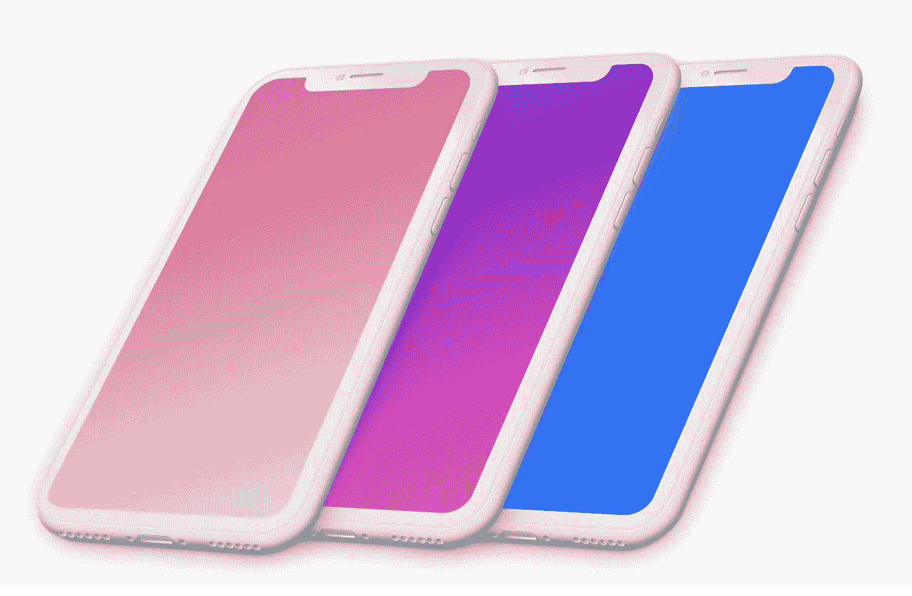
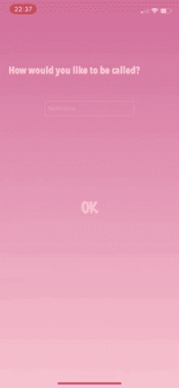
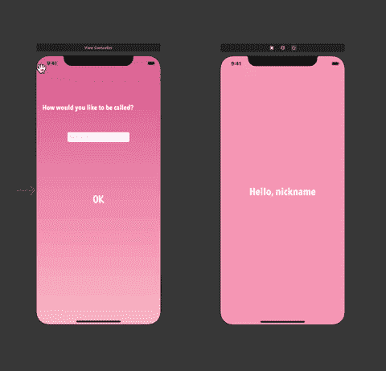
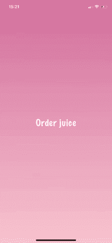
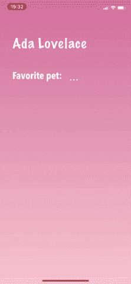

# 在视图控制器之间传递数据的 5 种方式

> 原文：<https://betterprogramming.pub/5-ways-to-pass-data-between-view-controllers-18acb467f5ec>

## 序列、委托、单例等等



作者照片。

在本文中，我们将探索在视图控制器之间传递数据的五种方法，并提供 Swift 代码片段和示例。这五种方式是:

1.  塞格斯
2.  委托设计模式
3.  单一设计模式
4.  关闭
5.  通知中心

# 1.塞格斯

Segues 是一种传递数据的故事板模式。

假设您的应用程序有一个 onboarding 屏幕，您希望询问用户的姓名，以便稍后在另一个屏幕上显示:



通过故事板开始创作情节。按住 Control 键并点击你要用来制作桥梁的 UI 元素，拖动到第二个视图控制器。从“动作继续”菜单中选择“显示”选项。



按住 Control 键并单击按钮，拖动到第二个视图 Controller，然后选择“显示”

现在，在第一个`ViewController`类中，您需要覆盖`prepare(for segue)`方法:

您的`SecondViewController`类应该是这样的:

# 2.委托设计模式

Delegate 是 iOS 开发中广泛使用的一种模式，用于在对象之间交换消息。它允许一个对象与它的所有者通信。

想象一下，一家餐馆提供几种口味的果汁。有人负责接受订单并将产品交付给客户，另一个人负责有效地制作正确的果汁。说明任务划分的应用程序应该是这样的:



要使用 delegate 实现类似的东西，您基本上需要四样东西:

1.  定义交付果汁需求的委托协议。
2.  一个`Juice`视图控制器使果汁具有合适的味道。
3.  一个`Restaurant` 视图控制器，必须符合协议。
4.  您需要将委托方法和变量放在正确的位置。

开始创建委派协议。以类命名是一个好的习惯。这个协议说明了一个想要遵守它的类(在这个例子中，是一个想要提供果汁的类)需要实现什么:

现在，在`Juice`视图控制器上，当选择了口味时，我们需要通知餐馆。为此，我们使用委托来传递味道。将委托属性创建为弱属性`var`,以避免保留周期和内存泄漏。此外，创建一个方法(在本例中，我们使用了按下按钮的动作)来通知某人何时采取了动作:

创建一个符合`JuiceDelegate`协议的类。在类声明中使用`JuiceDelegate`。这样做的时候，编译器会抱怨你需要实现`flavourWasChosen`方法。在方法内部，通知客户端果汁准备好了。当调用`Juice`视图控制器时，记得将代理分配给`self`:

# 3.单一设计模式

尽管很多 iOS 开发人员在不应该的时候使用 singleton(这是另一个讨论)，但确实有这种模式是一个好选择的情况。

使用 singleton 保证您的应用程序将只包含某个类的单个实例，可以在项目中的任何地方访问该实例。这是一个全局变量。

管理应用程序的设置是可以接受使用 singleton 的一个例子。假设用户关闭了`Settings`视图控制器上的声音。这个选择需要通过 app 的其余部分来体现。

这么多人使用这种模式的主要原因是它实现起来真的很简单。看看这个:

这就是创建单例的全部内容。要访问`isSoundOn` 布尔值，要么覆盖它，要么获取它的值，您只需键入:

```
Settings.instance.isSoundOn
```

# 4.关闭

闭包是可以在代码中传递的代码块，用于在视图控制器之间共享数据。例如，当您使用本机`dismiss`方法时，您正在使用一个闭包:

```
dismiss(animated: true, completion: nil)
```

虽然我们通常用`nil`填充`completion`参数，但它实际上可以接收另一个函数作为参数。

假设您有一个在视图中呈现给用户的概要文件，并且可以在另一个视图中回答一个表单来填充概要文件的一些字段。当您关闭表单视图时，您希望该数据返回到配置文件屏幕。像这样:



使用闭包实现这一点非常简单。首先，在您的`Profile`视图控制器上，创建一个接收数据的变量和一个设置该变量的方法:

现在，在您的`Form`视图控制器上，创建一个获取所选宠物的方法(带有`String`返回)和一个调用`dismiss`闭包的方法:

注意第 9-13 行发生了什么。我们使用`dismiss`方法，并发送一个字符串作为完成参数。怎么会？

首先，通过创建一个`Profile`视图控制器的实例。还记得这个`viewController`有一个`setPet`方法吗？我们从`viewController`实例中调用这个方法，由于这个函数(`setPet`)需要一个字符串参数，我们从`getFavoritePet`方法中发送给它`return` ，这是一个字符串。

事件的顺序如下:

*   用户选择一只宠物。
*   宠物的名字作为字符串存储在`favoritePet` 变量中。
*   `getFavoritePet`方法返回这个名字。
*   我们使用这个返回作为`setPet`方法的参数。
*   在创建了实现它的类的实例之后，我们调用了`setPet`方法。
*   我们关闭当前的`Form`视图控制器，回到`Profile`视图控制器。
*   然后，我们使用从`Form`视图控制器获得的数据。

# 5.通知中心

NotificationCenter 是一种在视图控制器之间传递数据的“观察者设计模式”方式。当你期待的事情发生时，你可以用它来传递信息。例如，您可以等待玩家进入等候室玩多人游戏。当所有玩家都准备好了，你发送一个通知开始处理比赛。

基本上有三件事需要注意:观察、发送和处理通知。

要开始观察通知，创建一个通知并使用它向`NotificationCenter`添加一个观察者:

要在通知被发送时处理它，您应该实现一个方法，并将其用作上面实现的`addObserver`的`selector`参数:

最后，要从另一个视图控制器发送通知，只需使用`post`方法和您的通知名称:

# 结论

因此，这是在 Swift 视图控制器之间传递数据的五种方式。有疑问吗？反馈？欢迎在评论区联系我。

感谢阅读！