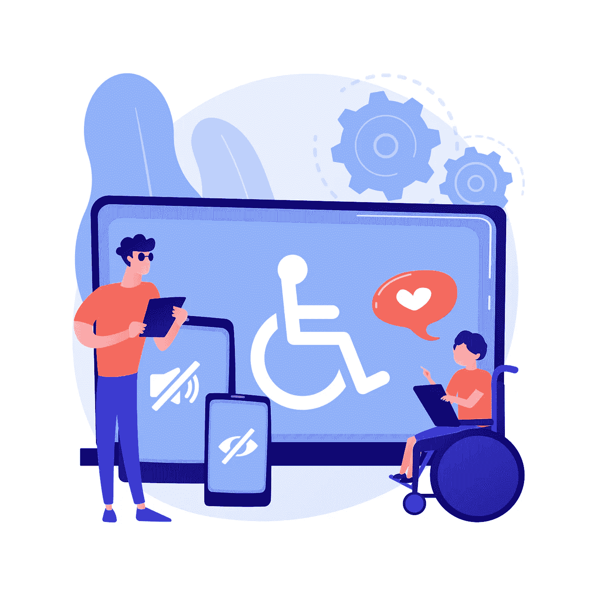
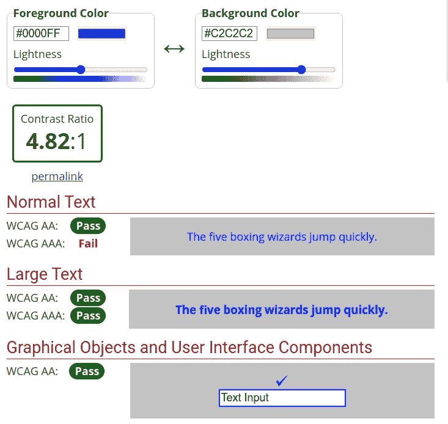
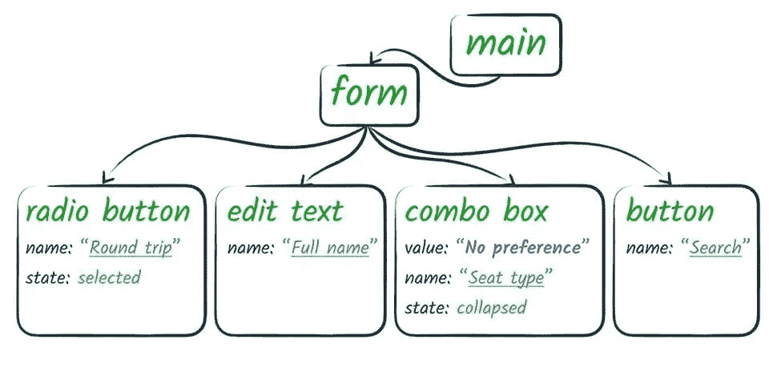
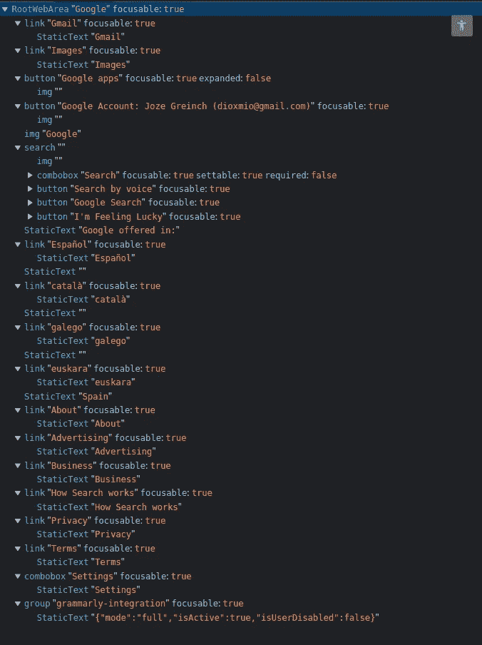
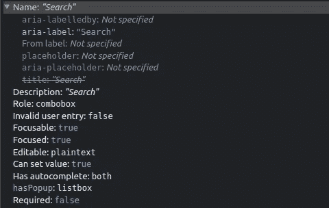

# 掌握网页可访问性的 5 个技巧

> 原文：<https://betterprogramming.pub/5-web-accessibility-tips-e2ba0d3726e5>

## HTML 语义、ARIA、可访问性树等等



[由 vectorjuice / Freepik 设计](http://www.freepik.com")

2011 年，世界卫生组织报告称，世界人口中有`15%`人患有某种残疾。残疾种类繁多:

*   身体的
*   认知的
*   神经病学的

我们的责任是创造任何人都能享受的体验。这是我们的责任，无论我们的用户年龄或残疾，我们的网站可以被消费。我们如何做到这一点？

浏览器网页布局是生成的`Render Tree`的结果。`Render Tree`是 CSS 树(`CSSOM`)和`DOM Tree`的组合。然而，浏览器并不止于此。它不止于此。多建了一棵树`Accessibility Tree`。它来源于 DOMTREE。

这个可访问性树用于使我们的网站在其他设备上可用，如屏幕阅读器。即使这一切都发生在幕后，我们也有责任去了解这一代树。我们需要利用它来扩大我们网络应用的覆盖范围。

那棵树对于让我们的网站更易访问至关重要。然而，我们还可以做更多的事情。在本文中，我们将探讨如何生成一个更好的可访问性树，以及我们可以做些什么来使我们的网站更易访问。

# 1.注意 HTML 语义

浏览器派生 DOM 树来创建可访问性树。这是可能的，因为 DOM 树有一些隐含在 HTML 中的语义。这意味着通过正确使用 HTML 语义，我们将会得到一个更易访问的站点。

让我们看看一些需要考虑的重要事项:

## 拥抱元素的本性

我们需要为正确的工作使用正确的工具。例如，我们可以使用一个`div`来创建一个闪亮的按钮。

```
**<div** onClick={addToCart()}**>**Add to cart**</div>**
```

浏览器不会理解上面的`div`是一个按钮。有一些方法可以提示屏幕阅读器。但是不建议这样做。修复上述代码的简单方法就是使用`button`元素

```
**<button** onClick={addToCard()}**>**Add to card**</button>**
```

现在，没有任何额外的努力，这是公认的按钮。浏览器会为我们处理诸如键盘导航和交互之类的事情。这使得导航更容易访问，因为它还添加了一些 UI 提示来改善用户体验。

我们不应该滥用`div`元素。相反，我们可以使用像`nav`、`footer`、`article`、`section`、`address`、`aside`这样的元素。它们将为用户的设备提供一些重要的隐含内容。

## 非文本内容

对于那些不产生文本内容的元素，浏览器很难做出判断。

对于`input`元素，有一个简单的语义解决方案:使用`label`元素。我们有两种方法使用它。

*   **1。**显式(推荐):通过使用带有`for`属性的`label`元素
*   **2。**隐式:通过将`input`包装在标签元素中

有几件事需要记住。输入`label`应该可见。否则，屏幕阅读器不会给它配音。任何`label`内部都不鼓励链接等交互元素。它们可能会导致意外的滴答声，或者只是无法正常发声。

## 标题的正确使用

在 HTML `<h1>`到`<h6>`中有六个级别的节标题。它们与用户和搜索引擎都相关。一个适当的结构将有助于更好地定位用户，并对你的网站进行适当的排名。

这是一个需要记住的事情列表:

*   在任何时候你的站点都应该只有一个`h1`。它应该是你页面的标题。它应该包含内容的相关描述。
*   避免使用这些元素来调整文本大小。在这种情况下，应该使用`font-size`。
*   避免跳过标题级别。从`h1`开始一直到`h6`。

## 给链接起一个合适的名字

最好是链接内容本身有意义。他们不应该依赖周围的元素来保持清晰。此外，链接文本应该是唯一的。

一些有用的指南:

*   `Click Here`、`More`、`Read More`的课文都应该被劝阻。
*   首选唯一的链接文本
*   首选文本链接超过图像链接。必要时，图像应包含`alt`属性。

# 2.包括图像的替代文本

我们之前已经看到屏幕阅读器是如何面临挑战的。图像也是如此。屏幕阅读器需要另一种方式来理解图像的内容。

这就是`alt`属性发挥作用的地方。它是一个本地 HTML 属性，当用户无法查看元素时，它为用户提供替代信息。这可能是因为他正在使用屏幕阅读器，或者因为图像加载失败。即使爬虫现在可以“看到”图像，拥有一个准确的描述将有助于搜索引擎优化。

一些有用的指南:

*   如果图像包含信息，文本应该描述图像
*   如果图像是一个链接，它应该描述它要去哪里
*   `alt=""`可能用于与用户无关的化妆品装饰图像。

# 3.使用 ARIA 属性

可访问的应用程序是一组旨在提高页面可访问性的属性。当使用正确的 HTML 语义时，你可以免费得到它们。因此，只有当原生 HTML 语义需要额外输入时，才应该使用它们。

让我们看一个明显的例子:

```
// ❌ bad usage
<div **role="checkbox”**>...</div>// ✅ recommended, `role=checkbox` is implicit
<input **type=”checkbox”** name="terms">
```

让我们看一个更复杂的例子:

让我们看另一个例子。如果我们想展示一些咨询信息，我们可以使用`role="status"`。屏幕阅读器会正确地将消息传达给用户。

```
// ✅ Using status for success messages
<p role="status">Your changes were saved.</p>
```

我们如何确保在我们的代码库中实施 ARIA 可访问性？通过使用这些标签在我们的`e2e`、`component`和`integration`测试中进行查询和断言。整个团队会更加了解 ARIA，我们会有一些语义选择器。

# 4.色对比度

当建立一个网站时，在背景和前景内容之间保持良好的颜色对比是很重要的。这将确保你的内容对任何人都清晰可辨。

WCAG 制定了一些比率。成功是由你的网站登陆的地点来衡量的:

*   最小对比度(AA)
*   增强对比度(AAA)
*   非文本对比度(AA)

有一些像 WebAim 这样的工具可以帮助实现预期的成功输出。



截图自 webaim.org

# 5.键盘可访问性

这是网页可访问性最重要的方面之一。它使我们的用户能够在常规的鼠标/触摸输入之外与我们的页面进行交互。这是高度用于那些有运动障碍。

使用键盘时，浏览器会产生一些 UI 反馈指示器。这是为了帮助用户理解选择发生在哪里。它们呈现围绕这些元素的轮廓。它被称为`focus indicator`。即使浏览器允许我们隐藏该轮廓，我们也不建议这样做:

```
// ❌ will damage accessiblity
{
  **outline: none;
  outline: 0;**
}
```

相反，我们需要专注于根据我们的口味设计这些轮廓。

我们必须注意的另一个主要问题是导航。浏览器通常会为我们处理所有的事情。如果需要，可以使用`tabindex`属性调整序列顺序。只有交互式项目应该是可选择的。

导航流程是从左到右和从上到下。这意味着，首先是标题，然后是主导航，页面导航，最后是页脚。

# 验证我们网站的可访问性

我们如何确保我们的 ARIA 树被正确地创建？为此，我们可以使用像 Lighthouse 这样的工具。它们帮助我们了解我们在可访问性方面的进展。

有时，我们可能希望进行手动检查或检查可访问性树。在`Dev Tools -> Elements -> Accessibility`下，我们可以访问完整的树。

让我们来看一个可访问性树的表示:



可访问性树的表示

现在，让我们来看看通过访问 google.com 构建的网站:



Google.com 可访问性树的标题

我们可以使用浏览器开发工具检查单个元素:



Google.com 搜索元素可访问性的标题

# 包裹

有了上面的提示和技巧，你将提高你的网站的可访问性。这将使每个人都能访问你的内容。

这不需要太多努力。唯一需要做的就是提前做一些计划和思考。这是一个双赢的局面。拥有一个更易访问的站点的副作用将会影响 SEO 和代码的可读性。

[](/creating-accessible-markups-with-css-display-contents-9cdba5f1eaa8) [## 使用 CSS 显示内容创建可访问的标记

### 用这个 CSS 特性改进你的 HTML 标记

better 编程. pub](/creating-accessible-markups-with-css-display-contents-9cdba5f1eaa8)