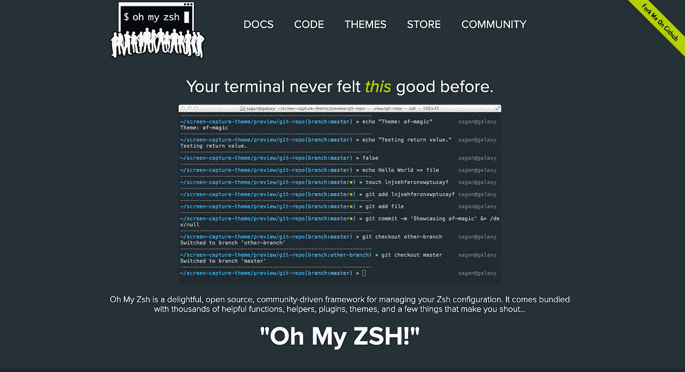
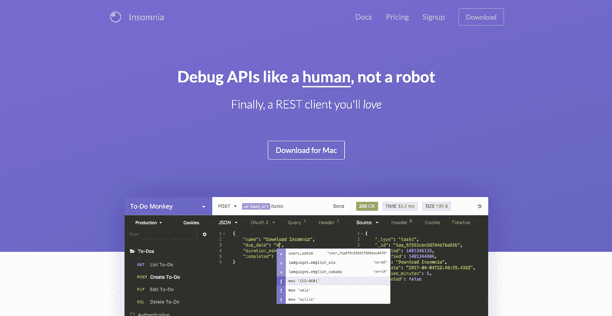
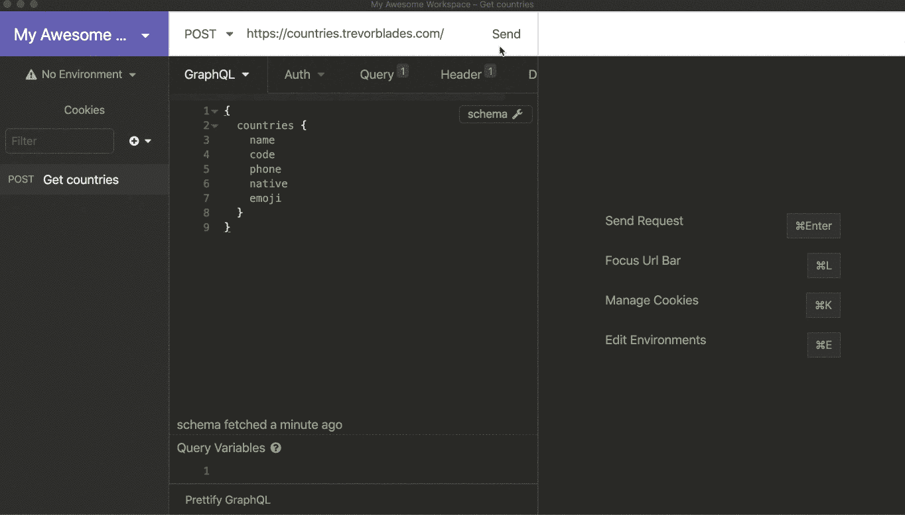
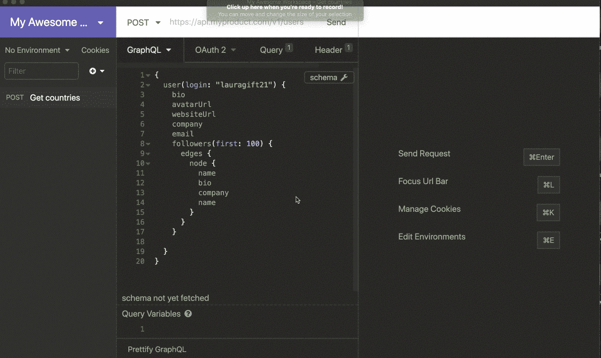
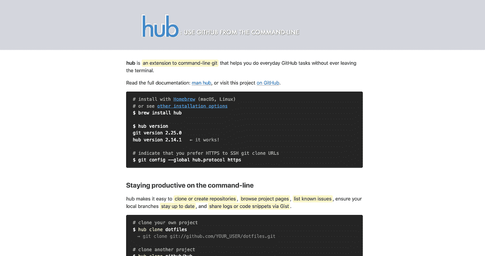
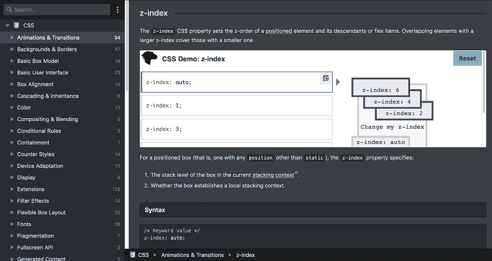

# 5 个可以提高你工作效率的网络开发工具

> 原文：<https://betterprogramming.pub/5-web-development-tools-that-can-improve-your-productivity-2c776685952>

## 失眠、Hub、DevDocs 等等

安内特·lūsiņa 在 [Unsplash](https://unsplash.com/s/photos/productivity?utm_source=unsplash&utm_medium=referral&utm_content=creditCopyText) 上拍摄的照片

时间对于开发者来说永远是稀缺资源。

从紧迫的截止日期到多个项目，再到意想不到的需求，我们的时间总是很紧张。这就是为什么我们总是在寻找能够帮助我们提高生产力的工具和流程。

在这篇文章中，我们将看看五种 web 开发工具，它们可能会给你带来你所需要的额外的生产力提升。

# 用 [Oh My Zsh](https://ohmyz.sh/) 掌握命令行

Windows 和 OS X 的默认命令行界面([命令提示符](https://en.wikipedia.org/wiki/Cmd.exe)和 [Bash](https://www.gnu.org/software/bash/) )可能令人望而生畏，难以定制。如果你不是专家，你可能会重复那些可以自动化的琐碎任务。

[Oh My Zsh](https://ohmyz.sh/) 是一个开源的、社区驱动的框架，构建在 [Zsh —](https://www.zsh.org/) 命令行 shell 之上，许多人发现它比默认选项更简单、更好。

Oh My Zsh 提供了大量开箱即用的[插件](https://github.com/ohmyzsh/ohmyzsh/tree/master/plugins) (250)和[主题](https://github.com/ohmyzsh/ohmyzsh/tree/master/themes/) (140)，让你根据自己的喜好定制终端。

哦，我的 Zsh 速度更快，使用起来更舒适，并允许您轻松地自动化您的日常任务。因为命令行越来越成为每个 web 开发人员工作流程的一部分，所以这可能是一个很好的生产力工具，可以融入到您的日常工作中。

在你的电脑上安装 Oh My Zsh 非常简单。

`$ sh -c "$(curl -fsSL https://raw.github.com/ohmyzsh/ohmyzsh/master/tools/install.sh)"`

同样简单的是安装[插件](https://github.com/ohmyzsh/ohmyzsh/tree/master/plugins)和[可定制的主题。](https://github.com/ohmyzsh/ohmyzsh/wiki/Themes)

哦，我的 Zsh 也有一个庞大而活跃的贡献者社区。事实上，已经有超过 1500 人对这个项目做出了贡献。

我已经使用这个工具一年多了，我喜欢它如何简化我的工作流程，以及它如何使在终端工作变得简单。使用 Oh My Zsh 帮助我在命令行上变得更加舒适和高效。特别是自动暗示和别名，加快了我的工作流程，提高了我的工作效率。我最喜欢的一些插件包括:

*   **Heroku:[Heroku CLI](https://devcenter.heroku.com/articles/heroku-ci)的自动补全**
*   **zsh-自动建议:**自动建议任何之前的命令
*   **npm:** 自动完成和 [npm](https://npmjs.org) 的别名

# 在[失眠](https://insomnia.rest/)的情况下即时测试 API

测试 REST 端点可能很麻烦、耗时且令人困惑。[失眠症](https://insomnia.rest/)是一个免费的开源、跨平台的 GraphQL 和 REST 客户端，它不仅功能强大，而且提供了一个直观简单的用户界面，使测试变得更加容易。它简化了我的一天。失眠的一些特征包括:

*   **代码片段生成:**失眠症患者可以生成 20 多种不同语言的客户端代码，包括 Node.js、Go、Swift、Python、Java 和 c。
*   **插件系统:**插件系统允许你扩展失眠的功能。您可以创建一个定制的模板标签来呈现定制的值，或者使用[插件 API](https://support.insomnia.rest/article/26-plugins) 创建一个定制的颜色主题。
*   **环境变量:**这些是可重用的值，用于任何在失眠症中输入的文本。一些常见的变量是基本 URL、身份验证令牌和资源 id。

失眠症的一个主要有益特性是支持 GraphQL。下面的演示展示了查询 GraphQL 端点的典型工作流。

在这个例子中，我使用名为 [countries](https://countries.trevorblades.com/) 的公共 GraphQL API 发送请求。当 URL 被传递时，失眠症自动生成模式。在左侧发送查询后，它在右侧返回响应。

该应用程序附带了许多有用的功能，可以简化您的工作流程。例如，这里我们可以看到使用环境变量的能力。

使用 API 时，在多个请求中重复相同的值是很常见的。手动执行此任务可能会变得耗时且困难。使用环境变量可以解决这个问题，它允许您定义一个值，然后在任何需要的地方引用这个值。

# 用[中枢](https://github.com/github/hub)增强 Git 超能力

我们大多数人在 GitHub 花了很多时间。

hub 是一个命令行工具，可以帮助您执行日常 GitHub 任务，而无需不断地在终端之间来回切换。

hub 包装了 Git，并用额外的功能对其进行了扩展，包括克隆存储库、列出最新的开放问题，以及通过 Gist 共享日志或代码片段。Hub 不仅使使用 GitHub 变得更容易，而且通过将所有工具集中到一个环境中，提高了生产率。

您可以使用 hub 执行大量的命令和操作。[这里是安装命令的完整列表](https://github.com/github/hub#installation)。您也可以通过在终端上运行命令`man hub`来查找列表。

# 使用 [DevDocs](https://devdocs.io/) 访问离线文档

我们都使用文档(有些人相当多)。当您在多种技术的堆栈中工作时，不断地在文档集之间来回切换会非常耗时且不方便。

[DevDocs](https://devdocs.io/) 解决了这个问题。DevDocs 是一个免费的开源工具，可以在一个整洁有序的 web UI 中浏览各种编程语言和开发工具文档。

## DevDocs 提供:

*   即时搜索
*   离线支持
*   移动支持
*   黑暗主题
*   快捷键
*   更多

我用它来处理多种语言或工具。例如，我广泛地使用它来同时阅读和搜索 Vue 和 Cypress 的文档。

# 用 [SVGOMG](https://jakearchibald.github.io/svgomg/) 缩放 SVG 图像

最后，切换到一个更实用的工具，我们有[SVG OMG](https://jakearchibald.github.io/svgomg/)——一个用于优化可缩放矢量图形(SVG)文件的免费在线工具。

SVG 图像优于其他格式(如 PNG 或 JPG ),因为它们能够跨各种设备和屏幕尺寸进行缩放并保持响应。使用 SVG 的一个缺点是，由于冗余信息，如编辑器元数据、注释、隐藏元素、默认值或非最佳值，文件可能会变得非常大。

SVGOMG 是一个工具，可以安全地删除和优化这些数据，以减少文件大小。

上图展示了一个典型的场景，其中一个 SVG 文件被优化了 69.42%。这是一个非常简单的工具，但它可以帮助提高网站的整体性能，并避免网页膨胀。 [SVGOMG](https://jakearchibald.github.io/svgomg/) 是 [SVGO 优化器](https://github.com/svg/svgo)的 UI 实现，后者是基于 Node.js 的命令行工具。

# 结论

找到改进我们工作方式的方法很重要。通过利用上述工具，您可以提高工作效率并简化工作流程。

开始优先选择有助于自动化您的工作流程的工具，您将获得节省时间和提高生产力的回报。