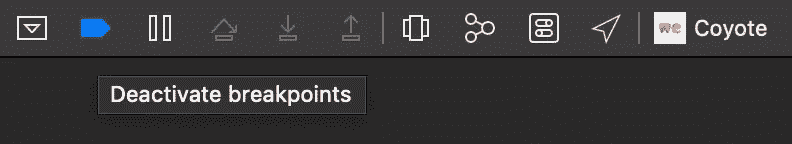
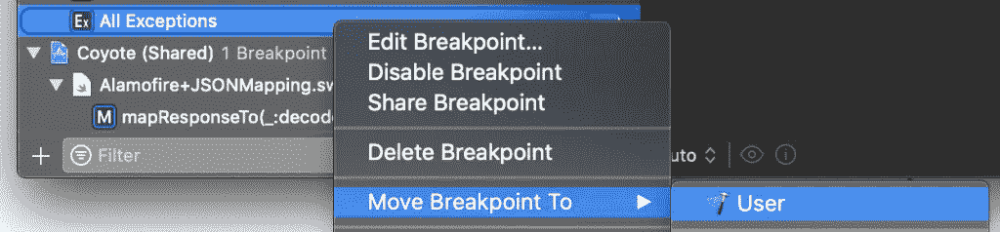
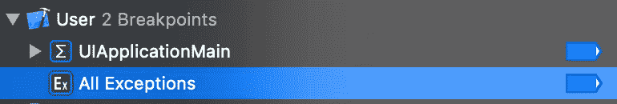
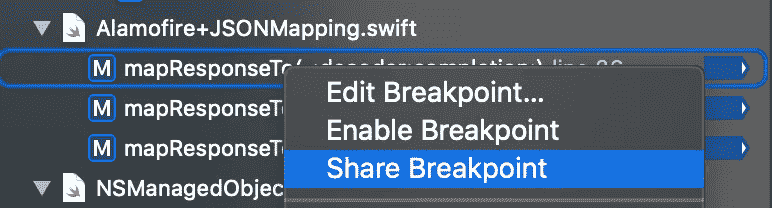
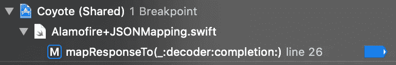
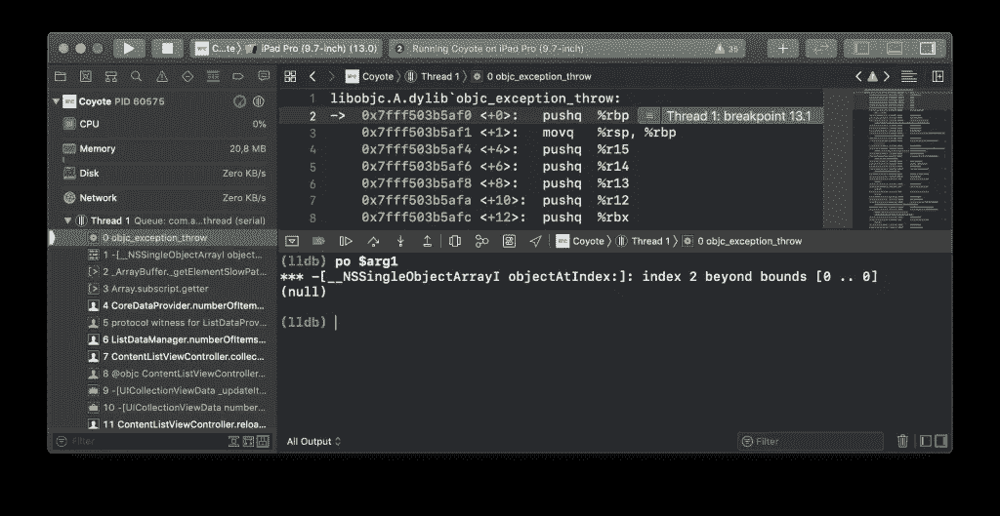
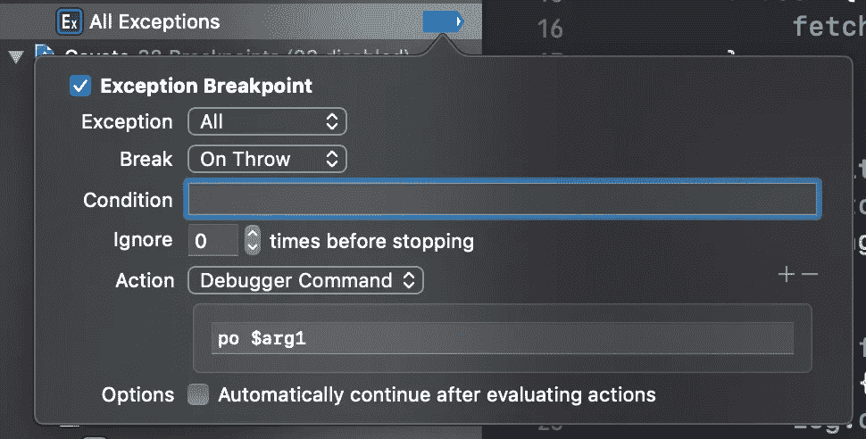
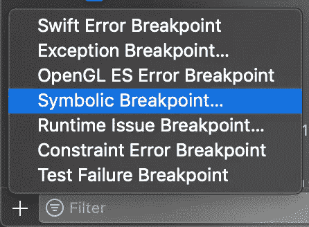
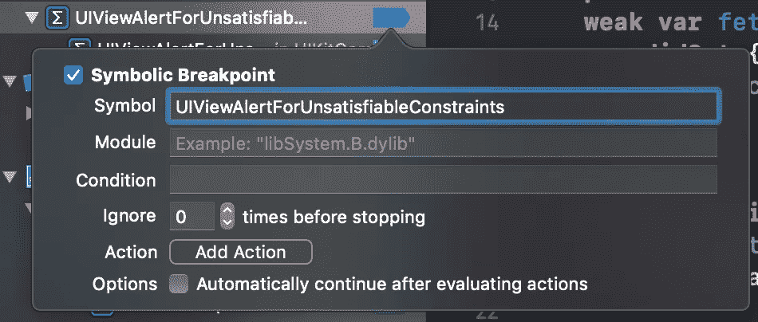
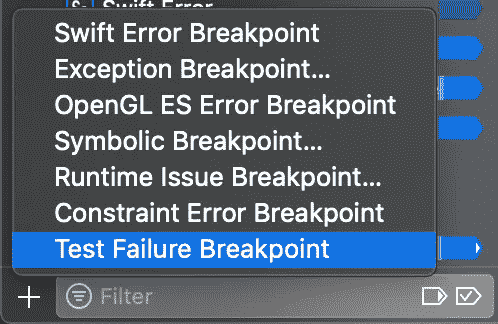

# 你可能还不知道的 5 个 Xcode 断点提示

> 原文：<https://betterprogramming.pub/5-xcode-breakpoints-tips-you-might-not-yet-know-13ed4976ce3e>

## Xcode 断点允许我们调试并找到令人讨厌的 bug 的解决方案


在 [Unsplash](https://unsplash.com/s/photos/break-point?utm_source=unsplash&utm_medium=referral&utm_content=creditCopyText) 上由 [carlos manich](https://unsplash.com/@carlosmanich?utm_source=unsplash&utm_medium=referral&utm_content=creditCopyText) 拍摄的照片

如果没有断点，代码中到处都是大量的打印语句将会是一场有趣的盛宴。断点的基本原理我们可能都知道，但是还有更多需要发现！

# Xcode 中有哪些断点？

断点可以放置在某一行代码上，并在执行过程中暂停应用程序，以检查应用程序在该点的状态。断点可以在任何时候设置，在你的应用程序运行之前和运行期间。

可以在断点导航器中找到一个概述，它显示了所有激活和禁用的断点。调试栏包含一个断点激活按钮，用于临时禁止断点暂停应用程序。



Xcode 中的蓝色断点激活按钮

# 1.用户定义的断点

对于您创建的每个新 Xcode 项目，您可能要做的少数几件事情之一是添加那些方便的断点，帮助您调试许多错误。这是一个多余的过程，可以用 Xcode 中用户定义的断点来解决。



在 Xcode 中移动断点

移动断点后，它将显示在自己的部分，包含所有用户定义的断点。



Xcode 中用户断点概述

这将使您的断点在您打开的每个 Xcode 项目中都可用。这包括您创建的项目以及从 internet 下载的项目。任何项目！

# 2.通过 Git 共享断点

有时，你发现自己在查看同事的工作流程，并意识到他有一些很棒且有用的断点。

不要问他关于设置相同断点的指令，你可以让他通过 Git 分享。



在 Xcode 中通过 Git 共享断点

这将把断点移到它自己的带有共享断点的部分。这使得获得所有共享断点的概述变得非常容易。



断点导航器中的共享断点概述

因为断点是共享的，所以保持它们活动也是共享的责任。

因此，如果您的一位同事决定移除断点，那么一旦您从 Git 中提取最新的更改，它也会从您的断点列表中移除。

# 3.带有调试器命令操作的异常断点

我多年来一直使用的一个用户自定义断点是异常断点。

当引发或捕获特定类型的异常时，会触发异常断点。每当遇到异常断点时，我会在点击`objc_exception_throw`后立即输入`po $arg1`语句，以获得关于抛出异常的更多信息:



打印出抛出异常的额外信息

这可以通过在断点中定义一个动作很容易地实现自动化。任何已定义的操作都将在遇到断点时执行，这对于调试应用程序来说是一种很有价值的方法。



打印出异常断点中的参数

当然，现在您将直接使其成为用户定义的断点，这样您就不必在每次创建新的 Xcode 项目时都创建这个断点了！

# 4.符号断点

在调试过程中，控制台中的消息经常会帮助我们创建一个符号断点。可能最著名的一个是与自动布局相关的符号断点:

```
// Will attempt to recover by breaking constraint 
<NSLayoutConstraint:0x600000d7aad0 UIView:0x7fbe55e95420.leading == UILabel:0x7fbe55e95d20.leading + 8   (active)>

// Make a symbolic breakpoint at UIViewAlertForUnsatisfiableConstraints to catch this in the debugger.
```

当调用特定的方法或函数时，会触发符号断点。可以从断点导航器添加它们:



添加符号断点

您在断点中填入关键字，无论何时调用该符号，它都会暂停您的应用程序以开始调试。



为 UIViewAlertForUnsatisfiableConstraints 添加符号断点

在这种特定情况下，它允许您快速导航到激活不可满足约束的代码。相当整洁！

## 但这不就是约束错误断点吗？

令人惊讶的是，这些错误并没有触发约束错误断点。根据苹果论坛上的[这个帖子，这个断点只对](https://forums.developer.apple.com/thread/98280) [AppKit](https://developer.apple.com/documentation/appkit) 有效。

## 用于集合视图布局调试的有用符号断点

像上面一样创建一个断点，但是使用`UICollectionViewFlowLayoutBreakForInvalidSizes`符号允许您调试集合视图流布局的任何布局问题。

尽管调试这类问题仍然不容易，但它至少会为您指明正确的方向，并为您提供调试的起点。

# 5.用测试失败断点捕获失败的测试

当一个测试失败时，您通常会开始浏览测试列表来找到失败的测试。尽管这是可行的，但如果你在心流中，这并不是真正有效的。

为此，我们有测试失败断点，它将直接跳转到测试中失败的断言，允许您直接开始修复失败的测试。



添加测试失败断点

# 结论

就是这样！更好地利用断点的五个技巧。这是加快调试工作流程的一个好方法。