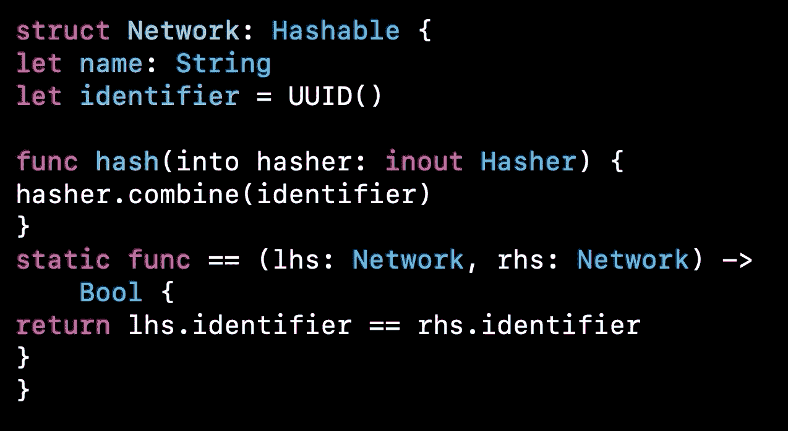
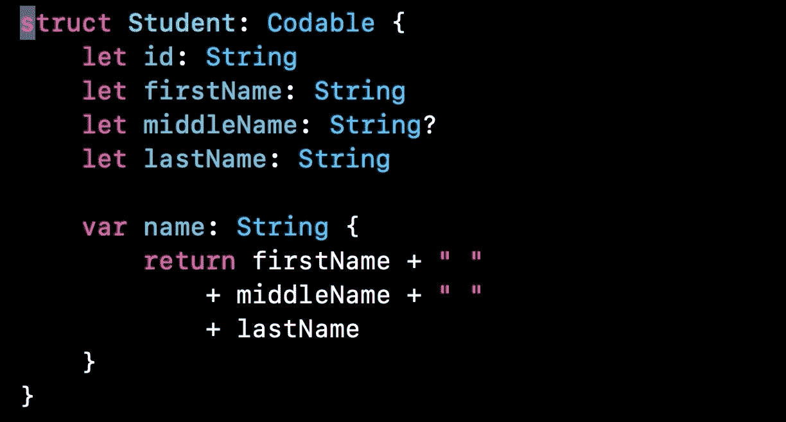
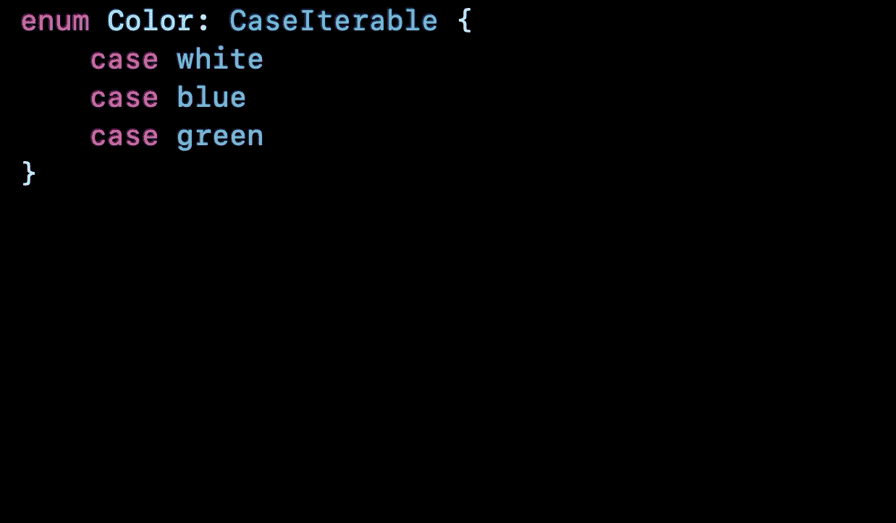
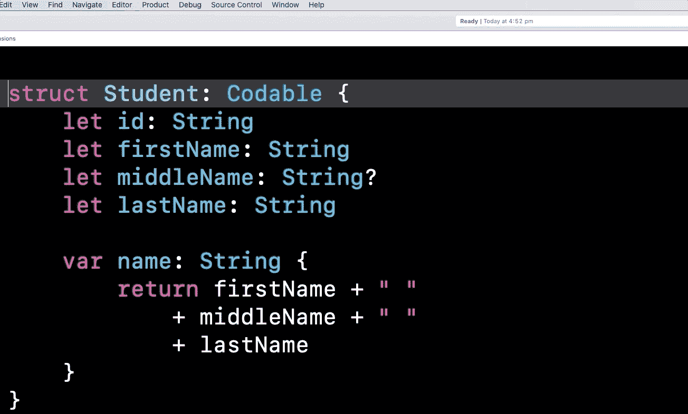
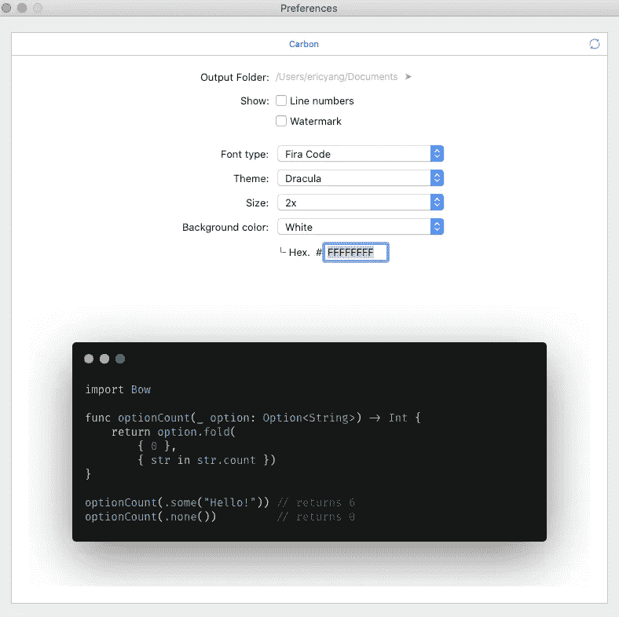
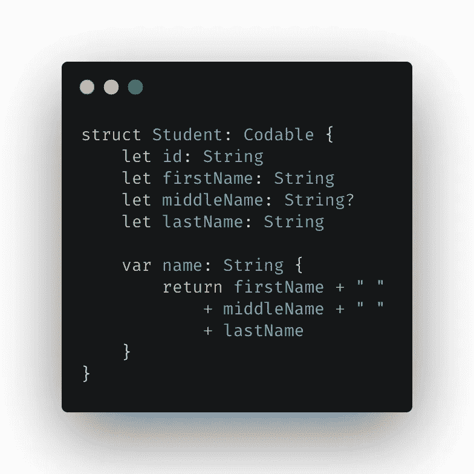

# 您必须拥有的 5 个 Xcode 扩展

> 原文：<https://betterprogramming.pub/5-xcode-extensions-you-must-have-46fb1fd39e7a>

## 使用正确的 Xcode 扩展可以让你更有效率

[Guillaume Jaillet](https://unsplash.com/@i_am_g?utm_source=medium&utm_medium=referral) 在 [Unsplash](https://unsplash.com?utm_source=medium&utm_medium=referral) 上拍摄的照片

虽然 Xcode 的可用性这些年来一直在提高，但它仍然远远不能令人满意。今天，我们将探索一些你可以利用的伟大的 Xcode 扩展。在 Xcode 环境中进行 iOS 开发时，它们可以帮助您提高生产率和效率。

# 游泳

快速格式化混乱的代码块可能是开发人员最常见的需求。

`Swimat`是一个 Xcode 扩展，用于格式化您的 Swift 代码。它支持最新的 Xcode 11。Xcode 上的重新缩进和`Swimat`的工作原理一样，但是`Swimat`更方便，因为它不需要处理代码选择。

要安装和启用扩展，我们可以从 [GitHub repo](https://github.com/Jintin/Swimat\) 下载 zip 文件，然后在系统偏好设置的扩展中启用它。

在“系统偏好设置”中启用扩展。

安装后，要格式化当前活动的文件，请在 Xcode 菜单中单击编辑器-> Swimat ->格式化。

游泳演示。

 [## Jintin/Swimat

### Swimat 是一个 Xcode 插件，用于格式化您的 Swift 代码。有三种安装方式。通过自制桶安装…

github.com](https://github.com/Jintin/Swimat) 

# TrikerX

在 Swift 4 中引入的`Codable`利用编译器生成编码和解码数据所需的代码。序列化键可能使用稍微不同的命名约定。我们必须定制`Codable`在解码或编码时使用的密钥。

有一个名为`TrikerX`的 Xcode 扩展可以让`CodingKeys`自动省去我们很多容易出错的工作。

要生成`CodingKeys`，在 Xcode 菜单中点击 Editor->Codable->Make Coding Key。

TrickerX 演示。

除此之外，`TrickerX`还支持将自定义键定义为注释:

自定义密钥。

 [## wleii/TrickerX

### 一个 Xcode9+扩展，可以自动生成编码密钥。- wleii/TrickerX

github.com](https://github.com/wleii/TrickerX) 

# AccessControlKitty

开发 Swift 包时，指定代码的访问级别非常重要。手动将`public`或`private`添加到一个结构中的数百个属性会非常耗时。为什么不用`AccessControlKitty`？

`AccessControlKitty`在 [Mac App Store](https://apps.apple.com/us/app/accesscontrolkitty/id1450391666?mt=12) 及其 [GitHub repo](https://github.com/zoejessica/accesscontrolkitty) 中有售。它可以很容易地改变所选代码的访问级别，在`public`、`private`、`fileprivate`、`internal`或无访问控制修饰符之间切换。

下面展示了我们如何将`public`添加到结构及其属性中:

AccessControlKitty 演示。

 [## zoejessica/AccessControlKitty

### Xcode 扩展，用于更改从 Mac App Store 下载的 Swift 代码选择的访问控制级别-版本…

github.com](https://github.com/zoejessica/accesscontrolkitty) 

# 开关

手动实现所有的`enum` switch 语句也容易出错且耗时。`SwitchIt`让你轻松许多。

从 [Mac App Store](https://apps.apple.com/ie/app/switchit/id1244401606?mt=12) 或 [GitHub repo](https://github.com/HarmVanRisk/SwitchIt) 安装，然后在 Xcode 菜单中点击 Editor->Switch it->Create Switch。它将自动为您创建所选`enum`案例的 switch 语句。

SwitchIt 演示。

 [## 危害风险/开关 It

### 一个用于 XCode 的 Enum to Switch 语句扩展，可以与 Swift 和 Objective-C 一起使用。我创建了它…

github.com](https://github.com/HarmVanRisk/SwitchIt) 

# 内夫

最后但同样重要的是，`Nef`让您的代码片段在与他人分享或嵌入到您的文章中时更加美观。

你可以从 [Mac App Store](https://apps.apple.com/app/nef/id1479391704?mt=8) 或者 [GitHub repo](https://github.com/bow-swift/nef-plugin) 安装扩展。在“系统偏好设置”中启用后，您可以选择要共享的代码，并在 Xcode 菜单中单击编辑器- > nef - >代码选择- >图像，以将代码片段生成为 PNG 图像。

Nef 演示。

图像的默认背景颜色是紫色，但是你可以通过点击编辑器-> nef ->代码选择->首选项来选择你喜欢的颜色。

更改背景颜色。

带有一点阴影的白色背景色使代码片段看起来很突出:

代码片段。

`Nef`还可以从您的 Swift 包中创建一本 Playground Book 或从 Playground 生成一个 markdown 文件。都等着你去探索。

 [## bow-swift/nef-插件

### 这个项目为 Xcode 提供了一个扩展，可以直接在 IDE 中集成一些 nef 特性。使用 nef 的核心…

github.com](https://github.com/bow-swift/nef-plugin) 

# 结论

用于演示的所有代码都可以在 GitHub 上找到[。](https://gist.github.com/ericleiyang/ad48b0ae109596233e6ff985e7976b13)