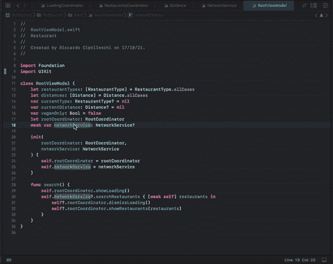
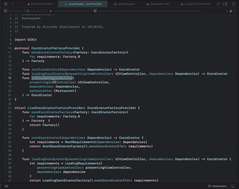
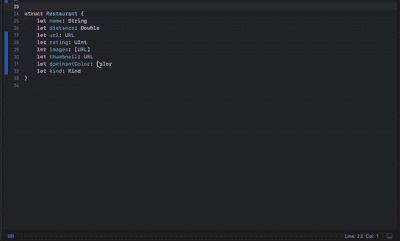
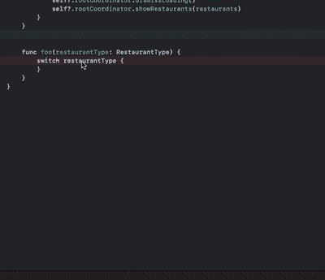
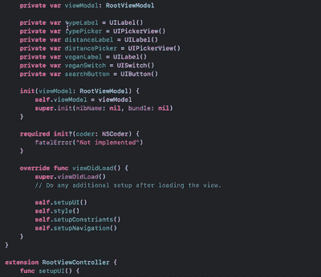
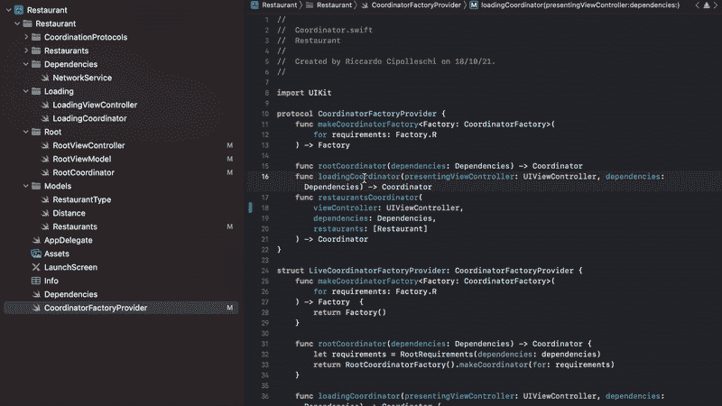

# 重构代码的 5 个 Xcode 技巧

> 原文：<https://betterprogramming.pub/5-xcode-tricks-to-refactor-your-code-2b7a45e110da>

## 如何利用 Xcode 快速有效地重构代码

[帕克·伯德](https://unsplash.com/@parkerabyrd?utm_source=medium&utm_medium=referral)在 [Unsplash](https://unsplash.com?utm_source=medium&utm_medium=referral) 上的照片

作为软件工程师，我们 60%以上的时间都在重构代码。知道如何正确地重构一段代码是软件工程师需要开发的最重要的技能之一。它有很多好处，例如:

*   我们从一开始就编写更干净、更安全的代码。
*   我们能够简化我们的代码库。
*   我们改进了代码库的可测试性。
*   我们更擅长进行代码评审，因为我们知道要寻找什么。

这个话题如此重要，以至于有[本书](https://www.amazon.it/Refactoring-Improving-Design-Existing-Code/dp/0201485672)和[个网站](https://refactoring.guru/)致力于如何正确检测代码气味以及如何重构代码库。

今天，我想展示一些我们可以使用 Xcode 重构代码的技巧。

# 1.从上下文菜单中重命名

为我们的类型、变量和方法选择正确的名称可以使代码库更容易理解。当我们选择一个糟糕的名字时，我们可能想要改变它，并更新我们代码库中所有使用该元素的地方。Xcode 可以帮助我们一次性更新所有的名字。

我们可以通过右击定义了的代码元素**来触发该功能。上下文菜单打开，我们可以选择`Refactor`，然后选择`Rename`。**

Xcode 将花费几秒钟搜索所有使用该元素的站点，然后将高亮显示的布局更改为我们可以编辑的内容。通过更改元素名称，所有使用地点都将被更新。

这种机制不仅可以用于变量！我们也可以用它来重构`types`、`enum`案例和`function`名字。将它与函数一起使用的一个很酷的事情是，我们还可以重命名参数的名称和标签。

> **注意:**使用该功能时要小心。Xcode 可以深入其他模块，有时它也会考虑文档。在更改元素之前，查看所有的调用位置，并取消选中您不想修改的调用位置。

# 2.生成成员式初始值设定项

尤其是在处理模块、SDK 和库时，我们不能完全依赖初始化器的自动合成。很多时候我们需要创建公共的初始化器，我们需要通过复制粘贴一个`struct`的所有属性来烦自己。幸运的是，Xcode 有一个方便的特性，可以自动创建成员式初始化器。

要使用该功能，我们必须右击需要`init`的类型，选择`Refactor`，然后选择`Generate Memberwise Initializer`。

Xcode 用`internal`关键字在类型声明的正下方创建初始化器。我们可以把关键字改成`public`(或者改成我们需要的值)，剪切粘贴到我们想要的地方。

# 3.展开开关盒

如果我们使用许多带有许多情况和复杂关联值的`enums`, Xcode 可能需要一段时间才能意识到我们正在编写一个`switch`,我们希望所有情况都显式展开。

我们可以通过明确要求 IDE 填充所有缺失的案例来给它一点帮助。为了启用这个特性，我们必须首先编写一个`switch`语句的语法。然后，通过右键单击`switch`，我们可以选择`Refactor`，并在项目列表的最末端选择`Expand Switch Cases`。

# 4.多行编辑

在某些情况下，我们需要编写完全相同的代码行，并将其应用于不同的元素。

一个典型的例子是`UIView`中的`view.addSubview`，或者将一组元素的`translatesAutoresizingMaskIntoConstraints`属性设置为`false`。

虽然我们可以创建助手或者利用`[Mirror API](https://developer.apple.com/documentation/swift/mirror)`来自动完成这项工作，但是使用多行编辑来快速输入这些行通常更容易，也没那么糟糕。

我们有两种方法激活它:

1.  按住`control+shift` ( `⌃+⇧`)并向上或向下按箭头。
2.  通过选择多行代码，然后点击`Editor`、`Selection`和`Split Selection By Lines`。

一旦激活，我们就可以开始打字，字符将通过光标添加到每一行。

# 5.快速找到所有呼叫站点

这不是重构技巧，而是我在任何情况下都愿意分享的技巧。当处理大型代码库时，我们可能会想知道所有使用函数或变量的地方。

Xcode 可以通过使用上下文菜单中`Refactor`下面的`Find`菜单来帮助我们进行搜索。例如，如果我们突出显示一个函数声明，我们可以选择`Find`，然后选择`Find Call Hierarchy`来搜索调用该函数的所有站点。

搜索调用层次结构后，我们不仅可以看到所搜索方法的所有调用位置。我们还可以更深入，检查所有调用调用被搜索方法的方法的二级方法。

这让我们可以创建一种可能调用的静态堆栈跟踪。这是一个非常有用的工具，用于:

1.  了解代码库如何工作。
2.  调查我们在应用程序中观察到的错误或奇怪行为。

# 结论

在今天的文章中，我们探索了一些利用 Xcode 更快重构代码的方法。我们学习了如何在一个镜头中改变许多元素的名称；如何自动创建成员式初始值设定项；如何要求 Xcode 展开一个开关的所有案例；如何一次编辑多行；以及如何搜索使用某个元素的所有位置。

知道如何使用我们的工具是变得高效和有效的必要条件。它不会让我们成为更好的软件工程师，但它肯定会让我们的工作和生活更轻松。

最重要的是，这表明我们花时间了解我们的环境，这可以给你的同事甚至是检查你编码技能的面试官留下深刻印象。