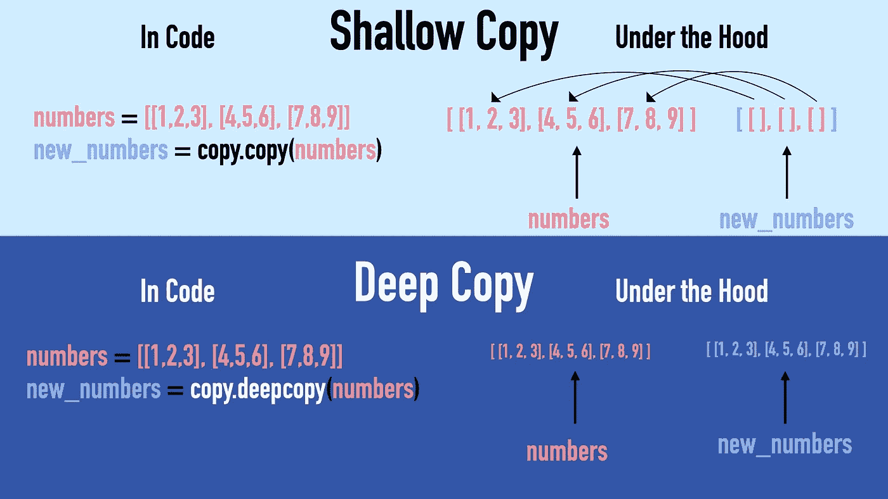
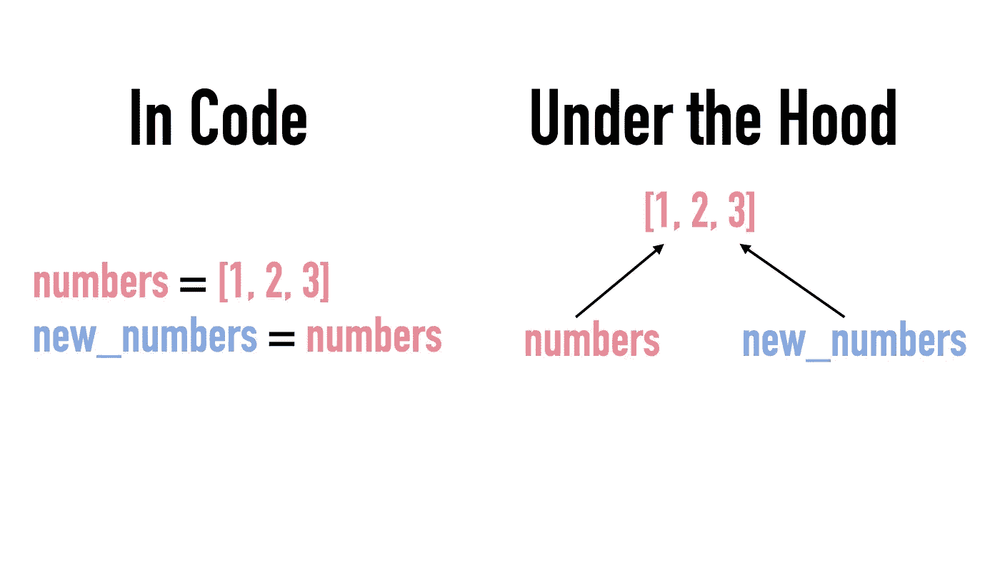

# 50 Python 面试问答

> 原文：<https://betterprogramming.pub/50-python-interview-questions-and-answers-5230fe2a0db6>

## Ace 您的下一次编码面试


照片由[克里斯蒂娜@ wocintechchat.com](https://unsplash.com/@wocintechchat?utm_source=medium&utm_medium=referral)在 [Unsplash](https://unsplash.com?utm_source=medium&utm_medium=referral) 上拍摄

你是在准备工作面试还是准备涉及 Python 知识的考试？还是想快速浏览 Python 的常见主题？

以下是 50 个面试问题及其答案。名单没有特定的顺序。

我希望你喜欢它。

# 1.列表和元组之间的名称差异

## 目录

*   易变的
*   更高的内存消耗
*   有许多内置的方法可用
*   较慢的迭代
*   更适合插入和删除等操作

## 元组

*   不变的
*   更低的内存消耗
*   少数内置方法可用
*   更快的迭代
*   更适合访问元素

# 2.Range()函数的作用是什么？

内置的`range()`函数创建一个整数范围。

这里有几个使用案例:

# 3.Map()函数是如何工作的？

一个`map()`函数可以用来将一个 iterable，比如一个 list，转换成另一个。`map()`函数返回一个地图对象。这可以通过`list()`功能转换回列表。

例如，通过使用`map()`函数并将结果对象转换为列表，可以对一系列数字求平方:

```
numbers = [1, 2, 3, 4]
squared_numbers = map(lambda x: x ** 2, numbers)print(list(squared_numbers))
```

输出:

```
[1, 4, 9, 16]
```

# 4.“是”和“==”有什么区别？

*   `==`运算符比较两个值是否相等。
*   `is`操作符检查两个变量是否指向同一个内存地址。

# 5.什么是室内设计师？

装饰者提供了一种扩展函数或类功能的方法。

一个简单的例子:假设您有一个`divide()`函数:

```
**def** divide(x, y):
    **return** x / y
```

问题是除以`0`是非法的。并且该功能不检查`y`是否为`0`。您可以通过 if-check 来解决这个问题。但是为了演示起见，让我们使用一个装饰器。

1.  让我们实现装饰器。该函数将一个函数作为其输入，并创建一个新函数，其扩展行为是对照`0`进行检查。

2.现在您可以修饰原始功能:

```
@guard_zero
**def** divide(x, y):
    **return** x / y
```

3.现在`divide()`函数检查除数是否为 0。

```
print(divide(10,0))
```

输出:

```
Cannot divide by 0.
```

# 6.Reduce()函数是如何工作的？

函数将一个函数应用于一个列表的元素，并累加结果。该功能在`functools`模块中定义。要使用它，需要导入它。

例如，让我们使用`reduce()`来计算一组数字的总和:

## **它是如何工作的**

1.  它从列表的前两个元素开始。它将给定的函数应用于它们并存储结果。在这种情况下，它取两者之和。
2.  然后，它选取第三个元素，并将函数应用于该元素和之前的**结果。**
3.  它继续这样做，直到列表结束。

# 7.Filter()函数是如何工作的？

`filter()`函数可用于根据条件过滤元素。filter 函数有两个参数:

1.  λ表达式，即对列表中的每个元素执行的函数。

2.它将要操作的列表。

例如，让我们从列表中过滤偶数:

输出:

```
[2, 4, 6]
```

# 8.浅层拷贝和深层拷贝有什么区别？

*   在 Python 中，浅拷贝是“一级深”拷贝。这意味着复制的对象包含对原始对象的子对象的引用。
*   深层副本是原始对象的独立副本。

下面是一个例子:



图片鸣谢:作者。原文：</shallow-copy-vs-deep-copy-in-python-357e5f502bf9>

# 9.Any()函数是做什么的？

如果一个可迭代的(比如一个列表)的任何元素是`True`，那么`any()`函数返回`True`。如果没有，则返回`False`。

例如:

```
any([False, False, False]) # Returns False
any([True, False, False])  # Returns True
```

# 10.All()函数是做什么的？

`all()`函数可以用来测试一个 iterable(比如一个 list)中的所有值是否都是`True`。例如:

```
all([False, False, False]) # Returns False
all([True, False, False])  # Returns False
all([True, True, True])    # Returns True
```

# 11.方法和函数的区别是什么？

两者本质上做同样的事情，但是调用一个依赖于上下文。

*   方法与对象/类相关联。
*   函数不与对象/类关联。

函数的示例:

```
**def** greet(name):
    print("Hello, {}".format(name))
```

与方法相同的示例:

```
**class** Person:
    **def** greet(self, name):
        print("Hello, {}".format(name))
```

在上面的例子中，`greet()`方法和`greet()`函数做同样的事情。唯一的区别是方法依赖于类，而函数独立于上下文。

# 12.下面的输出是什么？为什么？

```
nums = [1, 2, 3]
copied_nums = nums

copied_nums[0] = 1000

print(nums)
```

## 回答

输出是:

```
[1000, 2, 3]
```

在 Python 中，`=`不会创建对象的副本。相反，它创建了一个新变量，使*将*指向原始对象。这意味着更改副本中的值也会更改原始对象的值。

下面是引擎盖下发生的事情的简单说明:



图片鸣谢:作者。原文：</shallow-copy-vs-deep-copy-in-python-357e5f502bf9>

# 13.如何在 Python 中反转一个列表？

您可以使用列表的内置`reverse()`方法来反转列表。

```
nums = [1, 2, 3]nums.reverse()print(nums)
```

输出:

```
[3, 2, 1]
```

# 14.在一个班里 Self 是什么意思？

`self`参数指的是类实例本身。它可用于访问属于该类的属性。

例如:

输出:

```
True
```

使用`self`，类实例可以访问它的`age`属性。

旁注:`self`不需要取名`self`。只要它是这个类的任何函数的第一个参数，你可以给它起任何名字。

# 15.如何在 Python 中连接一个列表？

```
nums1 = [1,2,3]
nums2 = [4,5,6]allNums = nums1 + nums2print(allNums)
```

输出:

```
[1, 2, 3, 4, 5, 6]
```

# 16.什么是概念上的酸洗和拆洗？

酸洗和反酸洗序列化 Python 对象。

*   Pickling 是将 Python 对象转换成字节流的过程
*   拆线与腌制相反

在文件或数据库中存储对象时会用到这些技术。

# 17.字典查找起来比列表快吗？

*   列表查找时间为`O(n)`。这是因为在最坏的情况下，需要遍历整个列表才能找到值。
*   一个字典查找时间是`O(1)`。这是因为字典是一个哈希表。

换句话说，字典查找比列表查找更快。

# 18.Python 中的模块是什么？

[模块](https://www.codingem.com/python-modules/)是一个 Python 文件。它包含可以在程序中使用的函数和全局变量。如果你想使用一个模块，你需要把它导入到你的程序中(使用`import`语句)。

例如:

```
import math
```

# 19.Python 中的包是什么？

包是包含模块的目录(参见上面的模块)。

# 20.Python 中什么被认为是库？

库是公开可用的包或模块。

# 21.为什么将列表转换为集合会删除重复项？

如果您不在乎列表的顺序，您可以通过将重复项转换为一个集合，然后再转换回列表来移除它们。例如:

```
nums = [1,2,1,2,2,2,1,2,3]
nums = list(set(nums))print(nums)
```

输出:

```
[1,2,3]
```

这是因为集合是值的唯一集合。因此，它不能保存重复的值。实际上，当你添加一个重复的值到一个集合中时，它会忽略它并保持不变。

# 22.没有第三个变量，你能交换两个变量吗？

是的，通过使用元组销毁:

输出:

```
2 1
```

# 23.Python 中的理解是什么？

[理解](https://medium.com/codex/python-make-your-code-fly-with-comprehensions-147873eea0ef)是用 Python 写 for 循环的简写。Python 支持四种不同的理解:

*   列出理解
*   词典释义
*   集合理解
*   生成器理解

例如，列表理解遵循以下语法:

```
newlist = [*expression* **for** *item* **in** *iterable* **if** *condition* == True]
```

其他类型的理解看起来相似。

# 24.为什么以及何时使用列表理解？

理解是用来使代码更加清晰和简洁的。当它能提高代码质量时，使用它可能是明智的。

例如，让我们创建一个从 0 到 9 的偶数列表:

输出:

```
[0, 2, 4, 6, 8]
```

这个 for 循环很容易理解，但是它占用了一些代码行。通过利用列表理解，您可以用一行代码实现同样的目的:

输出:

```
[0, 2, 4, 6, 8]
```

# 25.Enumerate()函数是做什么的？

枚举函数将一个列表与索引结合起来。

```
letters = ["a", "b", "c"]
indexed_letters = enumerate(letters)print(list(indexed_letters))
```

输出:

```
[(0, 'a'), (1, 'b'), (2, 'c')]
```

当循环一个列表并且需要跟踪元素的索引时，使用`enumerate()`非常有用。

例如，使用`enumerate()`允许您替换这个:

有了这个:

给出相同的结果:

```
Jack is at 1\. position
Ann is at 2\. position
Sofie is at 3\. position
```

# 26.什么是 Itertools 模块？

Itertools 是一个流行的 Python 模块。它有一些有用的方法来执行与遍历 iterables 相关的任务。

例如，您可以使用 Itertools 来获得一组值的排列。或者你可以创建一组无限的均匀分布的数字。

例如，您可以使用 Itertools 来查找列表的所有排列:

输出:

```
[(1, 2, 3), (1, 3, 2), (2, 1, 3), (2, 3, 1), (3, 1, 2), (3, 2, 1)]
```

# 27.Pass、Continue 和 Break 语句之间有什么区别？

*   `[**pass**](https://www.educative.io/edpresso/what-is-pass-statement-in-python)`指无所事事。这是因为您不能创建空的类、方法等。在 Python 中。
*   `[**continue**](https://www.codingem.com/python-continue-statement/)`停止循环迭代的执行，并跳转到下一个循环。
*   `[**break**](https://www.geeksforgeeks.org/python-break-statement/)`停止循环的迭代并跳出循环。

# 28.什么是三元运算符？

三元运算符允许您编写[单行 if-else](https://www.codingem.com/python-one-line-if-else/) 语句。

例如:

使用三元条件，您可以将 if-else 缩短为一行。

但是要小心，只使用它们来使你的代码更整洁。不要为了减少代码行而这样做。有些人根本不喜欢做这种速记。

# 29.你怎么能简化它呢？

```
**if** n == 0 **or** n == 1 **or** n == 2 **or** n == 3 **or** n == 4 **or** n == 5:
```

回答:

```
**if** n **in** [0, 1, 2, 3, 4, 5]:
```

# 30.解释 Pop()、Remove()和 Del 的区别？

## Pop()函数

您可以使用`pop()`方法，通过向其传递项目的索引来删除具有特定索引的元素。

```
nums = [1, 2, 3]
nums.pop(1)print(nums)
```

输出:

```
[1,3]
```

## 移除()函数

您可以使用`remove()`删除**列表中参数的第一个匹配值**:

```
nums = [1,1,2,2,3,3]
nums.remove(2)print(nums)
```

输出:

```
[1,1,2,3,3]
```

## Del 语句

您可以使用 del 删除特定索引处的项目:

```
nums = [1,2,3]
del nums[0]print(nums)
```

输出:

```
[2,3]
```

# 31.什么是枚举？你如何创造一个？

枚举是一组与唯一常数值相关的符号名。

```
**from** enum **import** Enum**class** Color(Enum):
   RED = 1
   GREEN = 2
   BLUE = 3
```

# 32.如何检查字典中是否存在某个键？

用`in`的说法:

```
data = {"Ronaldo": 7, "Bale": 9, "Messi": 10}
print("Ronaldo" in data)
```

输出:

```
True
```

# 33.什么是 Docstring？

[Docstring](https://www.codingem.com/python-comment-blocks/#:~:text=docstrings%20in%20python) 用来记录你的 Python 代码。

它是用三重引号创建的。它还充当“多行注释”，尽管这不是它的最初目的。

为了使它按预期工作，您将 docstring 作为类、方法等的第一个语句。

例如，当您调用`help()`方法时，您会看到函数的 docstring:

输出:

```
Help on function sum in module __main__:sum(num1, num2)
    This is a method that sums up two numbers
```

# 34.什么是 Lambda 表达式？

在 Python 中， [a *lambda 函数*](/understand-python-lambdas-in-3-minutes-8ce4997134fe) 是一个匿名函数。它接受任意数量的参数，但只包含一个表达式。

例如，下面是一个将一个数乘以 3 的 lambda:

```
**lambda** x : x * 3
```

这不是有用的，因为没有办法调用它。但是，您可以将它赋给一个变量，然后像调用常规函数一样调用它:

```
mult3 = **lambda** x : x * 3
mult3(15.0) # returns 45
```

你实际上不需要给一个变量赋一个 lambda。你也可以这样称呼它:

```
(**lambda** x : x * 3)(15.0) # returns 45.0
```

Lambda 函数在短时间内需要该功能时非常有用。在这种情况下，您不希望创建一个单独的方法来完成这项工作，从而浪费资源。

# 35.Python 中的 F-String 是什么？

格式化字符串或 F-string 可以像这样格式化字符串:

```
name = "Nick"
print(f"My name is {name}")
```

输出:

```
My name is Nick
```

与使用`[format](https://www.codingem.com/python-all-string-methods/#:~:text=5-,format,-The)`方法的老派方法相反:

```
name = "Nick"
print("My name is {}".format(name))
```

f-string 更方便，尤其是当嵌入变量的数量很大时。

# 36.Dictionary 和 JSON 有什么区别？

*   字典是一种数据结构。
*   JSON 是一种数据格式(字符串)。

# 37.Python 列表 vs. Numpy 数组？

## 目录

列表是一个可调整大小的集合。它可能包含不同类型的元素。Python 列表有局限性:

*   列表不能被视为数学中的向量:它不支持元素加法和乘法。
*   此外，列表可以包含不同类型的元素。这意味着 Python 需要存储每个元素的类型信息，并在操作每个元素时处理这些信息。这意味着性能下降。

## 数字阵列

与内置列表相比，数组是一种更高效、更方便的存储元素的方式。它给你向量和矩阵运算。此外，`NumPy`数组的实现使它更加高效。`NumPy`阵列:

*   占用更少的空间。
*   比列表更快。
*   提供执行线性代数的功能。

## 效率比较

例如，让我们比较使用 Python 列表和`NumPy`数组对两个数字列表求和的效率:

输出(可能略有不同):

```
Numpy was 18.811023622047244 x faster!
```

# 38.Pep8 是什么？

PEP 或 Python 增强提案定义了一组规定如何格式化 Python 代码的规则。

# 39.__Init__()方法是什么？

`__init__()`是 Python 中的一个构造器方法。所有的类都需要有一个。

当创建类的新实例时，会自动调用此方法。其目的是初始化/设置实例。

例如，在 Person 类中，初始化器将名称设置为新的类实例:

输出:

```
Nick
```

# 40.什么是全局变量和局部变量？

*   全局变量在函数外部声明。可以在代码中的任何地方访问全局变量。
*   局部变量是在函数内部声明的。该变量只能在函数中访问。

# 41.在 Python 中如何处理异常？

[异常处理](https://www.codingem.com/try-catch-in-python/)遵循 try-except 结构:

例如:

输出:

```
Exception encountered! Default value will be used
This is always run
10
```

在上面的例子中，`test = 1 + "one"`失败是因为对一个字符串和一个数字求和是不可能的。`except`块捕捉这个错误并运行一些代码。

有了异常处理，你的程序不会崩溃。相反，它会解决错误情况并继续运行。

# 42.如何检查一个值是否存在于一个列表中？

使用`in`语句:

```
'A' in ['A','B','C']   # True
'A' in [1,2,3]         # False
```

# 43.元组可以是字典键吗？

是的，元组可以用作字典中的键。这是因为元组是一个可哈希的值。

# 44.Join()方法是什么？它是如何工作的？

`[join()](https://www.codingem.com/python-all-string-methods/#:~:text=False.-,join,-To)`方法是内置的[字符串方法](https://www.codingem.com/python-all-string-methods)。它使用分隔符字符串连接 iterable(比如 list)的元素。

例如，让我们通过用空字符串分隔来连接列表中的字符:

```
chars = ["H", "e", "l", "l", "o"]word = "".join(chars)
print(word)
```

输出:

```
Hello
```

分隔符可以是您喜欢的任何字符串。例如，要使用破折号`-`加入，只需这样做:

```
chars = ["H", "e", "l", "l", "o"]word = "-".join(chars)
print(word)
```

输出:

```
H-e-l-l-o
```

# 45.什么是可迭代的？

iterable 是一个 Python 对象，它能够一次返回一个成员。换句话说，它允许循环。

列表、字典和元组是可迭代的常见例子。

# 46.什么是迭代器？

迭代器是一种用于迭代可迭代对象的对象，例如列表、元组和字典。它有可计数的项目。

迭代器符合迭代器协议。这意味着它实现了方法`__iter__()`和`__next__()`来使它工作。

例如，让我们为一组水果创建一个迭代器，并使用`next()`函数一个接一个地打印水果:

输出:

```
apple
banana
orange
```

# 47.什么是集合？

Set 是 Python 中的内置数据类型。这是一个既无序又无索引的集合。这意味着没有秩序。此外，集合不能包含重复的值。

集合可以通过花括号内逗号分隔的元素来创建。例如:

```
num_set = {1,2,3,4,5}print(num_set)
```

输出:

```
{1, 2, 3, 4, 5}
```

# 48.如何对列表进行逆序排序？

使用列表的`sort()`方法对列表进行排序。要以相反的顺序排序，设置`reverse`参数`True`:

```
fruits = ["Banana", "Apple", "Cranberry"]fruits.sort(reverse=True)
print(fruits)
```

输出:

```
['Cranberry', 'Banana', 'Apple']
```

# 49.你如何随机化一个 Python 列表？

使用随机模块中的`shuffle()`功能:

输出示例:

```
[2, 4, 5, 1, 3]
```

# 50.负指数是什么意思？

负索引意味着索引从序列的“另一端”开始。

这意味着列表的最后一个元素在索引 `-1`处，第二个在`-2`处，依此类推。

例如:

```
nums = [1,2,3,4,5]
print(nums[-2])
```

输出:

```
4
```

# 结论

感谢阅读。祝编码快乐，祝考试或编码面试好运！

我很想加入你的 LinkedIn 网络。请随意连接 [Artturi Jalli](https://www.linkedin.com/in/artturi-jalli-29619413a) 。

# 你可能会发现见解深刻

[](/10-useful-python-snippets-to-code-like-a-pro-e3d9a34e6145) [## 10 个有用的 Python 片段，让你像专业人士一样编写代码

### 我每天使用的有用的提示和技巧

better 编程. pub](/10-useful-python-snippets-to-code-like-a-pro-e3d9a34e6145) 

# 参考

 [## 文件

### 欢迎光临！这是 Python 3.9.5 的文档。

docs.python.org](https://docs.python.org/3/)