# 50 Python 面试问答

> 原文：<https://betterprogramming.pub/50-python-interview-questions-and-answers-f8e80d031bd3>

## 测试你对 Python 的理解和你的编码技能，并在下一次工作面试中胜出

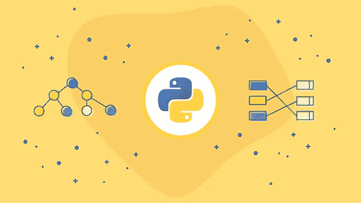

本文将涵盖 Python 编程语言的面试问题。虽然这个列表并不详尽，但它应该会让你对你可能遇到的问题类型有一个很好的了解。

# Python 面试问题—特定于语言

## 问题 1:链表和元组有什么区别？

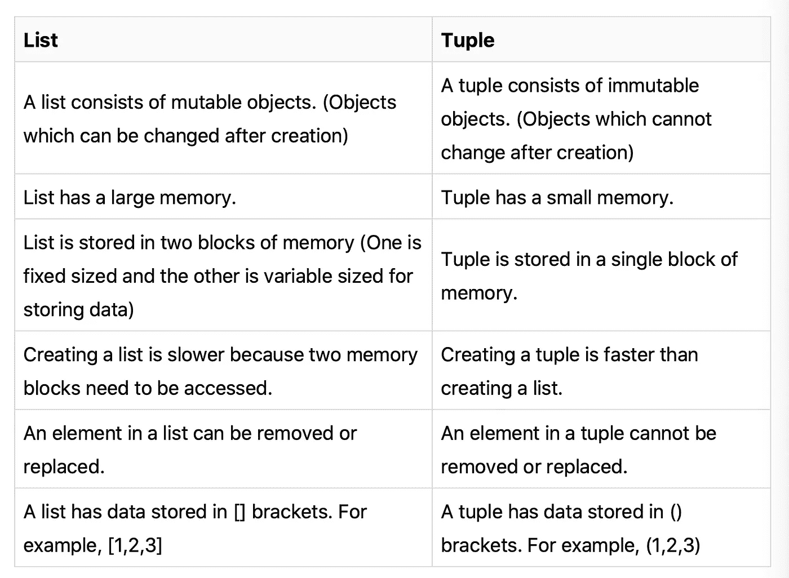

## **何时使用它们**

只要用户知道元组中插入了什么，就应该使用元组**。假设一所大学将学生的信息存储在一个数据结构中——为了使这些信息保持不变，应该将其存储在一个元组中。**

由于**列表**为用户提供了更容易的可访问性，所以只要需要存储相似类型的对象，就应该使用它们。例如，如果一家杂货店需要在一个区域存储所有的乳制品，它应该使用一个列表。

## 问题 2:如何将列表转换成元组？

```
my_list = [50, "Twenty", 110, "Fifty", "Ten", 20, 10, 80, "Eighty"]my_tuple = (my_list[0], my_list[len(my_list) - 1], len(my_list))
print(my_tuple)
```

输出:`50, ‘Eighty’, 9`

我们所要做的就是创建一个包含三个元素的元组。元组的第一个元素是列表的第一个元素，可以使用`my_list[0]`找到。

元组的第二个元素是列表中的最后一个元素。`my_list[len(my_list) - 1]`会给我们这种元素。我们也可以使用`pop()`方法，但是那样会改变列表。

## 问题 3:数组和列表有什么区别？

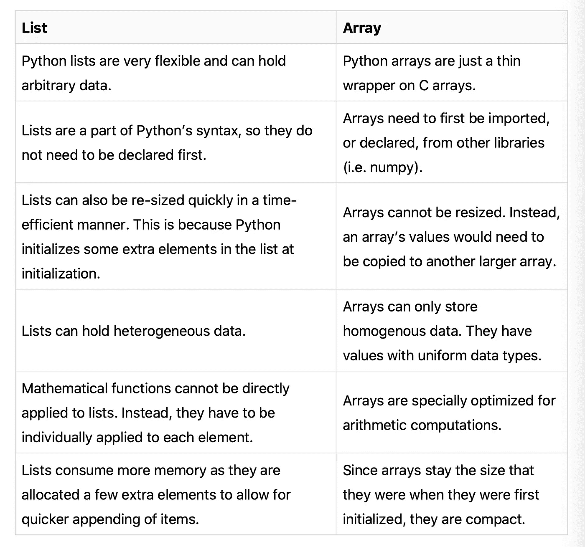

## 问题 4:如何将一个列表转换成一个数组？

在编程时，有时您需要将现有的列表转换为数组，以便对它们执行某些操作(数组支持以列表不支持的方式对它们执行数学运算)。

这里我们将使用`numpy.array()`。numpy 库的这个函数将一个列表作为参数，并返回一个包含列表中所有元素的数组。请参见下面的示例:

```
import numpy as np
my_list = [2,4,6,8,10]
my_array = np.array(my_list)
# printing my_array
print my_array
# printing the type of my_array
print type(my_array)
```

输出:`[ 2 4 6 8 10]`

## 问题 Python 中内存是如何管理的？

*   内存管理由 Python 私有堆空间处理。所有 Python 对象和数据结构都位于私有堆中。程序员无权访问这个私有堆。Python 解释器负责这个。
*   Python 对象的堆空间是由 Python 的内存管理器分配的。核心 API 为程序员提供了一些编程工具。
*   Python 还有一个内置的垃圾收集器，它可以回收所有未使用的内存，这样就可以将这些内存用于堆空间。

## 问题 Python 中如何实现多线程？

*   Python 有一个多线程包，但是如果你想要多线程来加速你的代码，那么使用它通常不是一个好主意。
*   Python 有一个称为全局解释器锁(GIL)的构造。GIL 确保任何时候只有一个线程可以执行。一个线程获取 GIL，做一点工作，然后将 GIL 传递给下一个线程。
*   这发生得非常快。看起来您的线程是并行执行的，但是它们实际上是轮流使用同一个 CPU 内核。
*   所有这些 GIL 传递增加了执行的开销。这意味着如果你想让你的代码运行得更快，那么使用线程包通常不是一个好主意。

## 问题 7:什么是猴子打补丁？

在 Python 中，术语 monkey patch 指的是运行时对类或模块的动态修改。

## 问题 8:什么是 lambda 函数？举例说明什么时候有用，什么时候没用。

lambda 函数是一个小型匿名函数，它返回一个对象。lambda 返回的对象通常被赋给一个变量，或者被用作其他更大函数的一部分。

使用 lambda 关键字定义 lambda 函数，而不是使用传统的`def`关键字来创建函数。lambda 的结构如下所示:

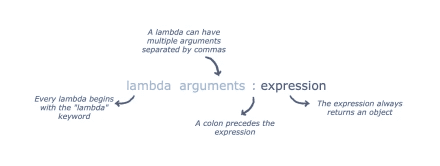

## **兰姆达斯的目的**

lambda 比完整的函数更具可读性，因为它可以内嵌编写。所以当函数表达式很小时，使用 lambdas 是一个很好的做法。

lambda 函数的美妙之处在于它们返回函数对象。这使得它们在用于像`map`或`filter`这样需要函数对象作为参数的函数时非常有用。

当表达式超过一行时，Lambdas 没有用。

## 问题 9:什么是酸洗和拆线？

Pickle 模块接受任何 Python 对象，并将其转换为字符串表示形式，然后使用 dump 函数将其转储到一个文件中。这个过程称为 pickling，而从存储的字符串表示中检索原始 Python 对象的过程称为 unpickling。

## 问题 10:NumPy 数组比(嵌套)Python 列表有什么优势？

*   Python 的列表是高效的通用容器。它们支持(相当)有效的插入、删除、追加和连接，Python 的列表理解使它们易于构造和操作。
*   它们有一定的局限性。它们不支持像元素加法和乘法这样的“矢量化”操作，并且它们可以包含不同类型的对象这一事实意味着 Python 必须存储每个元素的类型信息，并且在对每个元素进行操作时必须执行类型调度代码。
*   `NumPy`不仅更高效，也更方便。你可以免费获得大量的向量和矩阵运算，这有时可以避免不必要的工作。它们也能有效地实现。
*   `NumPy`数组速度更快，内置了很多功能——FFT、卷积、快速搜索、基本统计、线性代数、直方图等。

## 问题 11:用例子解释 Python 中的继承

继承允许一个类获得另一个类的所有成员(比如属性和方法)。继承提供了代码的可重用性，使得创建和维护应用程序变得更加容易。我们从其中继承的类被称为超类，被继承的类被称为派生类/子类。

Python 支持不同类型的继承:

*   单一继承——派生类获得单一超类的成员。
*   多级继承—派生类 d1 继承自基类 base1，d2 继承自 base2。
*   分层继承——从一个基类可以继承任意数量的子类。
*   多重继承—派生类从多个基类继承。

## 问题 12:Python 中的多态性是什么？

多态性意味着采取多种形式的能力。例如，如果父类有一个名为 ABC 的方法，那么子类也可以有一个同名的方法，它有自己的参数和变量。Python 允许多态性。

## 问题 13:解释`range()`和`xrange()`的区别

在很大程度上，`xrange`和`range`具有完全相同的功能。它们都会生成一个整数列表供您使用。唯一的区别是`range`返回一个 Python 列表对象，而`xrange`返回一个`xrange`对象。

这意味着`xrange`并不像 range 那样在运行时生成静态列表。它用一种叫做让步的特殊技术创造出你需要的价值。这种技术用于一种称为发生器的对象。

## 问题 14:解释 Flask 和 Django 的区别

Django 是一个 Python web 框架，它提供了一个开源的高级框架，“鼓励快速开发和干净、实用的设计。”它快速、安全且可扩展。Django 提供了强大的社区支持和详细的文档。

该框架是一个包容性的包，在创建应用程序时，您可以获得管理面板、数据库界面和目录结构。此外，它包括许多特性，因此您不必添加单独的库和依赖项。它提供的特性包括用户认证、模板引擎、路由、数据库模式迁移等等。

Django 框架非常灵活，您可以在其中与大型公司的 MVP 一起工作。从某种角度来看，使用 Django 的一些最大的公司是 Instagram、Dropbox、Pinterest 和 Spotify。

Flask 被认为是一个微框架，是一个极简的 web 框架。它不是“包含电池的”，这意味着它缺少像 Django 这样的全栈框架所提供的许多特性和功能，比如 web 模板引擎、帐户授权和身份验证。

Flask 是极简和轻量级的，这意味着您可以在编码时添加所需的扩展和库，而无需框架自动提供。Flask 背后的理念是，它只提供构建应用程序所需的组件，这样你就有了灵活性和控制力。换句话说，就是不固执己见。它提供的一些特性包括 build-int dev 服务器、Restful 请求调度、HTTP 请求处理等等。

## 问题 15:python path 是什么？

它是一个环境变量，在导入模块时使用。每当导入一个模块时，还会查找`PYTHONPATH`来检查在不同的目录中是否存在导入的模块。解释器用它来决定加载哪个模块。

## 问题 16:什么是 PEP 8？

PEP 代表 Python 增强提案。它是一组规定如何格式化 Python 代码以获得最大可读性的规则。

## 问题 17:什么是 Python decorators？

装饰器是 Python 中的一种设计模式，它允许用户向现有对象添加新功能，而无需修改其结构。装饰器通常在你想要装饰的函数定义之前被调用。

## 问题 18:什么是 init？

`__init__`是 Python 中的方法或构造函数。当创建类的新对象/实例时，会自动调用此方法来分配内存。所有的类都有`__init__`方法。

## 问题 19:什么是三元运算符？

三元运算符是用 Python 编写条件语句的一种方式。顾名思义，这个 Python 操作符由三个操作数组成。

*注意:三元运算符可以被认为是 if-else 语句的一个简化的单行版本，用于测试条件。*

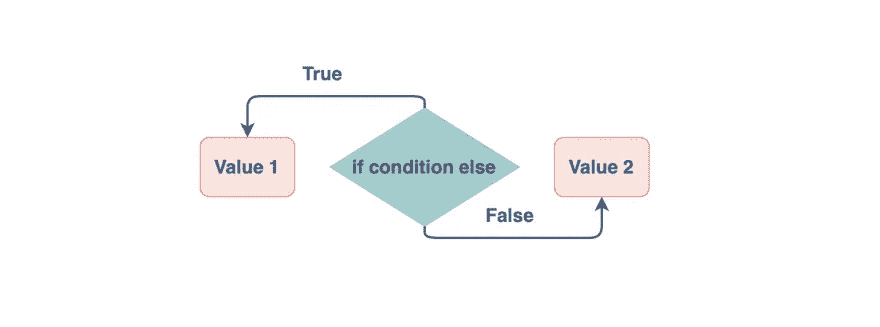

## **语法**

三元运算符中的三个操作数包括:

*   条件:计算结果为 true 或 false 的布尔表达式。
*   `true_val`:表达式求值为真时要赋值的值。
*   `false_val`:如果表达式的计算结果为假，则为其赋值。

```
var = true_val if condition else false_val
```

`=`(赋值)操作符左侧的变量`var`将被赋值:

*   `value1`如果`booleanExpression`评估为`true`。
*   `value2`如果`booleanExpression`评估为`false`。

## **示例**

```
# USING TERNARY OPERATOR
to_check = 6
msg = "Even" if to_check%2 == 0 else "Odd"
print(msg) # USING USUAL IF-ELSE
msg = ""
if(to_check%2 == 0):
  msg = "Even"
else:
  msg = "Odd"
print(msg)
```

**输出:**
偶数
偶数

## **解释**

上面的代码使用三元运算符来判断一个数是奇数还是偶数。

*   如果条件(to_check % 2 == 0)为`true`，则`msg`将被分配为“偶数”。
*   如果条件(to_check % 2 == 0)为`false`，则`msg`将被指定为“奇数”。

## 问题 20:Python 中的全局和局部变量是什么？

**全局变量:**声明在函数外部或全局空间中的变量称为全局变量。程序中的任何函数都可以访问这些变量。

**局部变量:**任何在函数内部声明的变量都称为局部变量。这个变量存在于局部空间，而不存在于全局空间。

## 问题 21:Python 中的`@property`是什么？

`@property`是一名室内装潢师。在 Python 中，decorators 使用户能够以同样的方式使用类(不管对其属性或方法做了什么更改)。装饰器允许像访问属性一样访问函数。

## 问题 22:try/except 在 Python 中是如何使用的？

异常是程序执行时发生的错误。当这个错误发生时，程序将停止并生成一个异常，然后处理这个异常以防止程序崩溃。

程序产生的异常在`try`块中被捕获，并在`except`块中被处理。

*   `Try`:让您测试代码块的错误。
*   `Except`:让您处理错误。

## 问题 23:解释 Python 2 和 Python 3 的区别

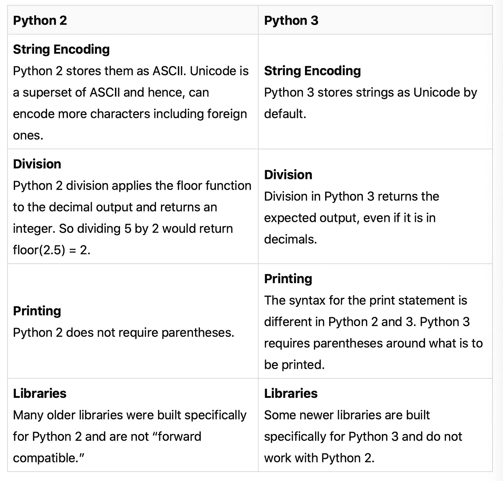

Python 2 在软件领域根深蒂固，几个软件之间的相互依赖使得这种转变几乎不可能。

## 问题 24:Python 中的 join 方法是什么？

Python 中的`join`方法获取可迭代数据结构的元素，并使用特定的字符串连接器值将它们连接在一起。

## **`**join**`**如何工作？****

**Python 中的 join 方法是一个 string 方法，它连接 string iterable 结构的元素，string iterable 结构也包含字符串或字符(数组、列表等。)通过使用特定的字符串作为连接器。**

**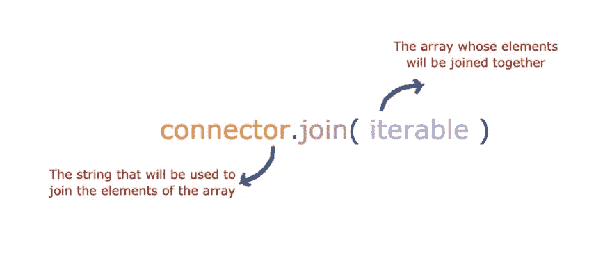**

## ****示例:使用空字符串连接元素****

**这将使用每个元素之间的空字符串来连接数组中的元素。**

```
array = ['H','E','L','L','O']
connector = ""
joined_string = connector.join(array)
print(joined_string)
```

****输出:**
您好**

## **问题 25:什么是词典理解？**

**字典理解是用 Python 创建字典的一种方式。它通过合并两组数据来创建一个字典，这两组数据要么是列表，要么是数组。**

**两个列表/数组之一的数据将作为字典的键，而第二个列表/数组的数据将作为值。每个键充当每个值的唯一标识符，因此两个列表/数组的大小应该相同。**

**这里我们来看看简单的合并。简单合并是没有任何限制地合并或组合两个列表。换句话说，这是无条件的合并。**

**一般语法如下:**

**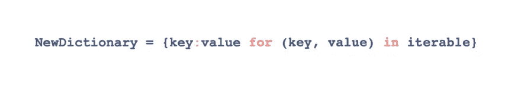**

## ****例子****

**以下示例运行于学院的数据库，并使用简单的合并。想象一下，一个大学数据库存储了大量数据，例如，学生的地址、成绩、班级、费用、卷号等等。现在，我们需要唯一地标识每个学生，并创建一个只存储所有学生的新字典。我们的决定仅仅取决于两个问题:**

*   **关键应该是什么？**
*   **价值应该是多少？**

**这里我们将选择 roll numbers 作为键，names 作为值，因为 roll numbers 是惟一的，名称可以重复。因此，亚历克斯的滚动编号是 122，所以元组看起来像 122:亚历克斯。一旦你尝试下面附加的代码，这将得到更好的解释。**

```
rollNumbers =[122,233,353,456]
names = ['alex','bob','can', 'don'] 
NewDictionary={ i:j for (i,j) in zip (rollNumbers,names)}
print(NewDictionary)
```

****输出:**
`{456: ‘don’, 233: ‘bob’, 122: ‘alex’, 353: ‘can’}`**

## **问题 26:如何用 Python 做深度拷贝？**

**深层拷贝是指克隆对象。当我们使用`=`操作符时，我们不是在克隆对象——相反，我们引用我们的变量到同一个对象(也称为浅层拷贝)。**

**这意味着更改一个变量的值会影响另一个变量的值，因为它们引用(或指向)同一个对象。浅拷贝和深拷贝之间的这种差异只适用于包含其他对象的对象，如类的列表和实例。**

## ****方法****

**为了对一个对象进行深层复制(或克隆)，我们在 Python 中导入了内置的`copy`模块。这个模块有`deepcopy()`方法，它简化了我们的任务。**

## ****语法****

**该函数将我们想要克隆的对象作为唯一的参数，并返回克隆对象。**

**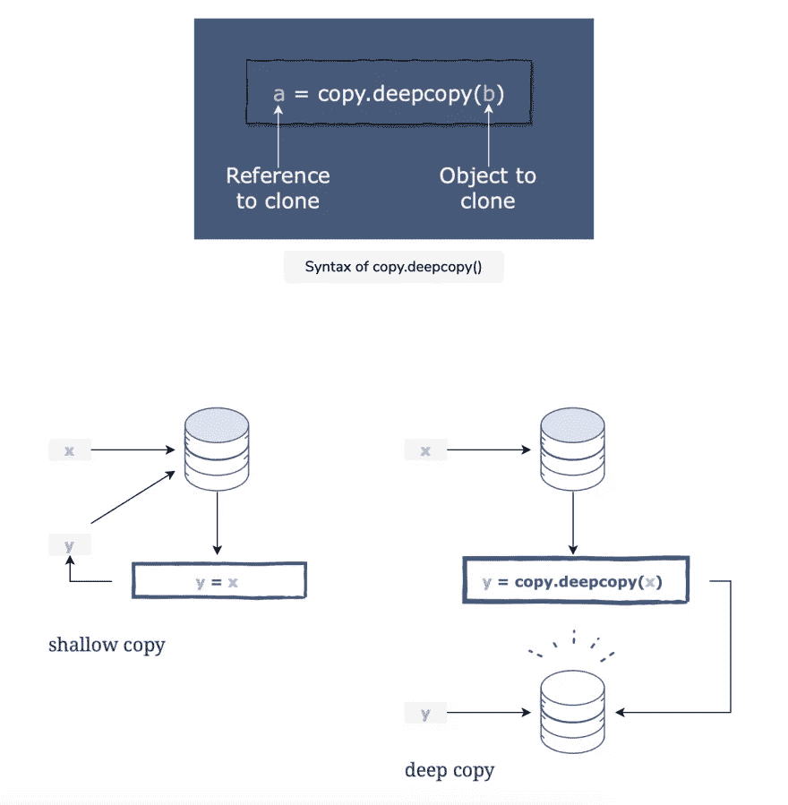**

```
import copy# Using '=' operator
x = [1, 2, 3]
y = x
x[0] = 5    # value of 'y' also changes as it is the SAME object
x[1] = 15
print "Shallow copy: ", y# Using copy.deepcopy()
a = [10, 20, 30]
b = copy.deepcopy(a)
a[1] = 70   # value of 'b' does NOT change because it is ANOTHER object
print "Deep copy: ", b
```

****输出:**
浅层复制:`[5, 15, 3]`
深层复制:`[10, 20, 30]`**

## **问题 27:如何检查一个键是否存在于 Python 字典中？**

**在提取该键的值之前，检查字典中是否存在该键是一种安全的做法。为此，Python 提供了两个内置函数:**

*   **`has_key()`**

**如果字典中有给定的键，那么`has_key`方法返回 true，否则返回 false。**

```
Fruits = {'a': "Apple", 'b':"Banana", 'c':"Carrot"}
key_to_lookup = 'a'
if Fruits.has_key(key_to_lookup):
  print "Key exists"
else:
  print "Key does not exist"
```

****输出:**键存在**

*   **`if-in`声明**

**这种方法使用`if-in`语句来检查字典中是否存在给定的键。**

```
Fruits = {'a': "Apple", 'b':"Banana", 'c':"Carrot"}
key_to_lookup = 'a'
if key_to_lookup in Fruits:
  print "Key exists"
else:
  print "Key does not exist"
```

****输出:**键存在**

## **问题 28:你如何在 Python 中实现记忆化？**

**考虑一下这段计算开销很大的代码:**

```
# Fibonacci Numbers
def fib(num):
    if num == 0:
        return 0
    elif num == 1:
        return 1
    return fib(num - 1) + fib(n - 2)
```

**记忆化可以通过 Python decorators 来实现。下面是完整的实现。**

****输出:**
`4.9035000301955733e-05`
`1.374000021314714e-06`
`1.2790005712304264e-06`**

## **问题 29:你如何用 Python 对字典进行排序？**

**我们可以通过键或值对这种类型的数据进行排序，这是通过使用`sorted()`函数来完成的。**

**首先，我们需要知道如何从字典中检索数据并传递给这个函数。从字典中获取数据有两种基本方法:**

**`Dictionary.keys()`:只返回任意顺序的键。
`Dictionary.values()`:返回数值列表。
`Dictionary.items()`:以键值对列表的形式返回所有数据。**

## **`Sorted()`语法**

**此方法采用一个强制参数和两个可选参数:**

*   **Data(必填):要排序的数据。我们将传递使用上述方法之一检索的数据。**
*   **Key(可选):一个函数(或标准)，我们希望基于它对列表进行排序。例如，标准可以是根据字符串的长度或任何其他任意函数对字符串进行排序。该函数应用于列表的每个元素，并对结果数据进行排序。将其留空将根据原始值对列表进行排序。**
*   **Reverse(可选):将第三个参数设置为 true 将按降序对列表进行排序。让这个空的按升序排序。**

**`**keys()**`**

**`**values()**`**

**`**items()**`**

## **问题 30:你将如何以及何时使用`any()` 和`all()`？**

**`any()`是一个函数，接受一个 iterable(比如列表、元组、集合等。)并返回`True`，如果任何一个元素评估为`True`，但是如果所有元素评估为`False`，它返回`False`。**

**向`any()`传递一个 iterable 来检查是否有任何元素是`True`可以这样做:**

```
one_truth = [True, False, False]
three_lies = [0, '', None]print(any(one_truth))print(any(three_lies))
```

****输出:**
`True`
`False`**

**第一个 print 语句打印`True`，因为`one_truth`中的一个元素是`True`。**

**另一方面，第二个 print 语句打印`False`，因为没有一个元素是`True`；即所有元素都是`False`。**

***当需要检查一长串* `*or*` *条件时使用* `*any()*` *。***

## ****什么是** `**all()**` **？****

**`all()`是另一个 Python 函数，它接受一个 iterable，如果所有元素的计算结果都是`True`，则返回`True`，否则返回`False`。**

**与`any()`类似，`all()`接受一个列表、元组、集合或任何可迭代的对象，如下所示:**

```
all_true = [True, 1, 'a', object()]
one_true = [True, False, False, 0]
all_false = [None, '', False, 0]print(all(all_true))
print(all(one_true))
print(all(all_false))
```

****输出:**
`True`
`False`
`False`**

**第一个函数调用返回了`True`，因为`all_true`中充满了真值。将`one_true`传递给`all()`返回了`False`，因为列表包含一个或多个 falsy 值。最后，将`all_false`传递给`all()`会返回`False`，因为它也包含一个或多个 falsy 值。**

***需要检查一长串* `*and*` *条件时使用* `*all()*` *。***

## **问题 31:什么是 Python Docstring？**

**Python 文档字符串提供了一种将文档与以下内容相关联的合适方式:**

*   **Python 模块**
*   **Python 函数**
*   **Python 类**

**这是书面代码的指定文档。与传统的代码注释不同，篡改应该描述一个函数做什么，而不是它如何工作。**

**可以使用以下方法访问 docstring**

*   **对象的`__doc__`方法。**
*   **`help`功能。**

## ****例子****

```
def Examplefunc(str): #function that outputs the str parameter
  print "The value is", str 
  #no return statement needed in this functiondef Multiply(x,y): #function that computes the product of x and y 
  return x*y #returning the product of x and y#Calling the functions
Examplefunc(9) #9 passed as the parameter)
answer = Multiply(4,2) #4 and 2 passed as the parameters
print "The product of x and y is:",answer
```

****输出:**
值为`9`。
x 和 y 的乘积是`8`。**

## ****解释****

**函数`Examplefunc`将变量`str`作为参数，并打印该值。因为它只打印值，所以不需要返回命令。**

**函数`Multiply`将两个参数`x`和`y`作为参数。然后它计算乘积，并使用`return`语句返回答案。**

## **问题 33:解释 Python 中生成器和迭代器的区别。**

**Python 中的迭代器充当对象的容器，因此可以对它们进行迭代。生成器有助于创建自定义迭代器。**

**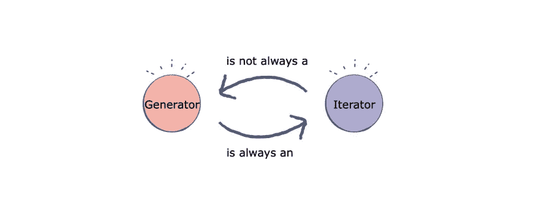**

**除了明显的句法差异，还有一些其他值得注意的差异。**

**`GeneratorIteratorImplemented`正在使用一个函数。它是使用一个类实现的。它使用了`yield`关键字。使用会产生简洁的代码。使用会导致代码相对不太简洁。存储`yield` 语句之前的所有局部变量。不使用局部变量。**

## ****迭代器的实现****

****输出:**
**

## ****发电机的实现****

****输出:**
`0
1
2
3
4
5`**

## **问题 34:Python 中的`defaultdict`是什么？**

**Python 字典`dict`包含单词和含义，以及任何数据类型的键值对。`defaultdict`是内置`dict`类的另一个细分。**

## ****`**defaultdict**`**有何不同？******

****`defaultdict`是`dict`类的一个细分。它的重要性在于，它允许根据所创建的字典类型为每个新键赋予一个默认值。****

****一个`defaultdict`可以通过给出它的声明来创建，一个参数可以有三个值:`list`、`set`或`int`。根据指定的数据类型创建字典。当添加或访问`defaultdict`中不存在的任何键时，它被赋予一个默认值，而不是给出一个`KeyError`。****

## ******示例******

****下面的代码片段显示了一个简单的字典，当访问一个不存在于`dict`中的键时，它给出一个错误:****

```
**dict_demo = dict()
print(dict_demo[3])**
```

****我们来介绍一个`defaultdict`，看看会发生什么。****

```
**from collections import defaultdictdefaultdict_demo = defaultdict(int)
print(defaultdict_demo[3])**
```

******输出:** `0`****

****在这种情况下，我们将`int`作为数据类型传递给了`defaultdict`。因此，任何不存在于`defaultdict_demo`中的键都将被赋予一个值`0`，除非为其定义了一个值。****

*****注意:也可以将* `*set*` *或* `*list*` *作为参数*****

## ****问题 35:什么是 Python 模块？****

****Python 模块是一个 Python 文件，包含一组要在应用程序中使用的函数和变量。变量可以是任何类型——数组、字典、对象等。****

****模块可以是内置的，也可以是用户定义的。****

## ******Python 中模块的好处******

****在 Python 中创建和使用模块有几个好处:****

*   ****结构化代码:通过分组到一个 Python 文件中进行逻辑组织，这使得开发更容易，更不容易出错，代码更容易理解和使用。****
*   ****可重用性:在单个模块中定义的功能可以很容易地被应用程序的其他部分重用。这消除了创建重复代码的需要。****

# ****Python 面试问题—编码****

****在这一节中，我们将看看与列表、链表、图、树、多线程/并发性等相关的常见编码面试问题。****

## ****问题 36:在 Python 中反转一个字符串****

****让我们使用切片方法反转字符串`Python`。要反转一个字符串，我们只需创建一个片段，从字符串的长度开始，到索引`0`结束。****

****要使用切片反转字符串，请编写以下代码:****

```
**stringname[stringlength::-1] # method 1**
```

****要在不指定字符串长度的情况下反转字符串，请编写:****

```
**stringname[::-1] # method2**
```

****slice 语句的意思是从字符串`length`开始，到位置`0`结束，并以`-1`为步长移动(或后退一步)。****

```
**str="Python" # initial string
stringlength=len(str) # calculate length of the list
slicedString=str[stringlength::-1] # slicing 
print (slicedString) # print the reversed string**
```

******输出:******

****这只是 Python 中反转字符串的一种方法。另外两个值得注意的方法是`Loop`和`Use Join`。****

## ****问题 37:检查一个 Python 字符串是否包含另一个字符串****

****有几种方法可以做到这一点。在本文中，我们将看看`find`方法。****

****`find`方法检查字符串是否包含子串。如果是，该方法返回字符串中子串的起始索引，否则返回`-1`。****

****一般语法如下:****

```
**string.find(substring)a_string="Python Programming" 
substring1="Programming" 
substring2="Language" 
print("Check if "+a_string+" contains "+substring1+":")
print(a_string.find(substring1)) 
print("Check if "+a_string+" contains "+substring2+":")
print(a_string.find(substring2))**
```

******输出:**
检查`Python Programming`是否包含`Programming` : `7`
检查`Python Programming`是否包含`Language` : `-1`****

****检查一个字符串是否包含另一个字符串的另外两个值得注意的方法是使用`in`操作符或使用`count`方法。****

## ****问题 38:用 Python 实现广度优先搜索(BFS)****

****考虑下面代码中实现的图形:****

****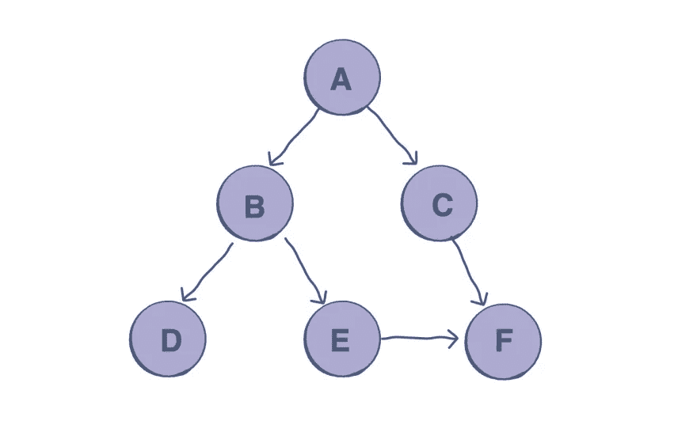****

******输出:** `A B C D E F`****

## ******解释******

******第 3–10 行:**图示的图形使用邻接表表示。在 Python 中实现这一点的一个简单方法是使用字典数据结构，其中每个顶点都存储有其相邻节点的列表。****

******第 12 行:** `visited`是用于跟踪被访问节点的列表。****

******第 13 行:** `queue`是用于跟踪当前队列中的节点的列表。****

******第 29 行:**`bfs`函数的参数是`visited`列表，字典形式的`graph`，起始节点`A`。****

******第 15–26 行:** `bfs`遵循上述算法:****

1.  ****它检查起始节点并将其添加到`visited`列表和`queue`中。****
2.  ****然后，当队列包含元素时，它继续从队列中取出节点，将该节点的邻居(如果它们未被访问)附加到队列中，并将它们标记为已访问。****
3.  ****这一直持续到队列为空。****

## ******时间复杂度******

****因为访问了所有的节点和顶点，所以图中 BFS 的时间复杂度是 O(V + E)，其中 V 是顶点的数量，E 是边的数量。****

## ****问题 39:在 Python 中实现深度优先搜索(DFS)****

****考虑这个图形，用下面的代码实现:****

****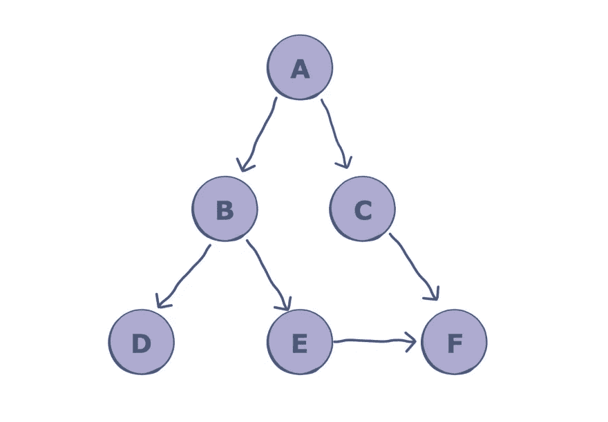****

******输出:******

## ******解释******

******第 2–9 行:**图示的图形是用邻接表表示的——在 Python 中，一种简单的方法是使用字典数据结构。每个顶点都存储有其相邻节点的列表。****

******第 11 行:** `visited`是用来跟踪被访问节点的集合。****

******第 21 行:**`dfs`函数被调用，并通过`visited`集合、`graph`字典和`A`传递，T5 是起始节点。****

******第 13–18 行:** `dfs`遵循上述算法:****

1.  ****它首先检查当前节点是否未被访问——如果是，它被追加到`visited`集合中。****
2.  ****然后对于当前节点的每个邻居，再次调用`dfs`函数。****
3.  ****当所有节点都被访问时，调用基本情况。该函数随后返回。****

## ******时间复杂度******

****由于所有的节点和顶点都被访问，图的 DFS 的平均时间复杂度是 O(V + E)，其中 V 是顶点的数目，E 是边的数目。对于树上的 DFS，时间复杂度是 O(V)，其中 V 是节点的数量。****

## ****问题 40:在 Python 中实现通配符****

****在 Python 中，可以使用`regex`(正则表达式)库实现通配符。****

****点`.`字符用于代替问号`?`符号。因此，要搜索与颜色模式匹配的所有单词，代码应该如下所示:****

******输出:** `color`****

## ****问题 41:在 Python 中实现合并排序****

****以下是 Python 中合并排序的代码:****

******输出:** `[17, 20, 26, 31, 44, 54, 55, 77, 93]`****

## ******解释******

****这是实现合并排序的递归方法。采取的步骤如下:****

1.  ****列表在每次递归调用中被分成`left`和`right`，直到获得两个相邻的元素。****
2.  ****分类过程开始。在每次调用中，`i`和`j`迭代器遍历两半。`k`迭代器遍历整个列表，并一路修改。****
3.  ****如果`i`处的值小于`j`处的值，则将`left[i]`分配给`myList[k]`槽，并且`i`递增。如果不是，则选择`right[j]`。****
4.  ****这样，通过`k`分配的值都被排序。****
5.  ****在这个循环结束时，其中的一半可能没有被完全遍历，如果是这样，它的值就被简单地分配给列表中剩余的槽。****

## ******时间复杂度******

****该算法在 O(n.logn)中工作。这是因为列表被分成 log(n)个调用，合并过程在每个调用中花费线性时间。****

## ****问题 42:用 Python 实现 Dijkstra 的算法****

******基本算法:******

1.  ****从每个未访问的顶点中，选择距离最小的顶点并访问它。****
2.  ****更新所访问顶点的每个相邻顶点的距离，这些顶点的当前距离大于其总和以及它们之间的边的权重。****
3.  ****重复直到所有的顶点都被访问。****

******实施:******

******输出**
a 到源顶点 a 的最短距离是:`0`
b 到源顶点 a 的最短距离是:`3`
c 到源顶点 a 的最短距离是:`3.5`
d 到源顶点 a 的最短距离是:`4.5`****

## ****问题 43:合并两个排序列表****

******输出:** `[-2, -1, 0, 4, 5, 6, 7]`****

****这是解决这个问题比较直观的方法。****

*   ****首先创建一个新的空列表。这个列表将被两个列表中的所有元素按排序顺序填充并返回。****
*   ****然后将三个变量初始化为零，以存储每个列表的当前索引。****
*   ****然后比较两个给定列表中当前索引处的元素，将较小的元素附加到新列表中，并将该列表的索引增加 1。****
*   ****重复直到到达其中一个列表的末尾，并将另一个列表追加到合并列表中。****

## ******时间复杂度******

****该算法的时间复杂度为 O(n+m)O(n+m ),其中 nn 和 mm 是列表的长度。这是因为两个列表都至少被迭代了一次。****

****注意，这个问题也可以通过就地合并来解决。****

## ****问题 44:找出两个加起来等于 k 的数字****

******输出:**
`None
[1,4]`****

****你可以通过首先对列表进行排序来解决这个问题。然后，对于列表中的每个元素，使用二分搜索法查找该元素与预期总和之间的差异。换句话说，如果预期的总和是`k`，排序列表的第一个元素是`a0`，我们将为`a0`做一个二分搜索法。重复搜索，直到找到一个。您可以按照自己喜欢的方式递归或迭代地实现`binarySearch()`函数。****

## ******时间复杂度******

****因为大多数基于比较的最优排序函数都取 O(nlogn)，所以让我们假设 Python `.sort()`函数取相同的值。此外，由于二分搜索法查找单个元素需要 O(logn)时间，因此所有 n 个元素的二分搜索法将需要 O(nlogn)时间。****

## ****问题 45:找到列表中第一个不重复的整数****

****在这里，您可以使用 Python 字典来记录重复次数。****

****样本输入:****

******输出:** `2`****

****`counts`字典中的键是给定列表的元素，值是每个元素在列表中出现的次数。我们返回列表中最多出现一次的元素，在第 23 行。我们需要维护元组值中每个键的更新顺序。****

## ******时间复杂度******

****由于该列表只迭代两次，并且用线性时间复杂度初始化`counts`字典，因此该解决方案的时间复杂度是线性的，即 O(n)。****

## ****问题 46:求链表的中间值****

****这个问题的代码解决方案涉及多个`.py`文件要查看运行中的代码，请前往[原始帖子](https://www.educative.io/blog/python-interview-questions#q46)。****

****这里你可以使用两个指针同时工作:****

*   ****快速指针一次移动两步，直到列表结束。****
*   ****慢速指针一次移动一步。****
*   ****当快指针到达终点时，慢指针将在中间。****

****有了这个算法，你可以使这个过程更快，因为计算长度和遍历到中间是并行发生的。****

## ******时间复杂度******

****你以两倍的速度遍历链表，所以肯定会更快。但是，瓶颈复杂度仍然是 O(n)。****

# ****问题 47:反转队列的前“k”个元素****

****这个问题的代码解决方案涉及多个`.py`文件。要查看代码解决方案，请访问[原始帖子](https://www.educative.io/blog/python-interview-questions#q47)。****

## ******解说******

1.  ****检查无效输入，即队列是否为空，是否`k`大于队列，以及**行 2** 上的`k`是否为负。如果输入有效，开始创建一个`Stack`。可用的堆栈函数有:****

*   ******建造者:** `myStack()`。****
*   ******推送元素:** `push(int)`将元素添加到堆栈中。****
*   ******弹出元素:** `pop()`从堆栈中移除或弹出顶层元素。****
*   ******检查是否为空:** `isEmpty()`堆栈为空则返回 true，否则返回 false。****
*   ******Return back:** `back()`返回已经添加到末尾的元素，而不将其从堆栈中移除。****
*   ******Return front:** `front()`返回顶部元素(已添加到开头)，但不将其从堆栈中移除。****

****2.我们的函数`reverseK(queue, k)`将 queue 作为输入参数。`k`代表我们要反转的元素个数。可用的队列函数有:****

*   ******入队:** `enqueue(int)`。****
*   ******出列:** `dequeue()`。****
*   ******构造函数:** `myQueue(size)` size 应该是指定队列大小的整数。****
*   ******检查是否为空:**。****
*   ******检查尺寸:** `size()`。****

****3.转到实际的逻辑——将第一个`k`元素从队列的前面出列，并将其放入我们之前在第 8 行使用`stack.push(queue.dequeue())`创建的堆栈中。****

****4.一旦所有的`k`值都被压入堆栈，就开始弹出它们，并按顺序将它们放入队列的后面。我们将在第 12 行中使用`queue.enqueue(stack.pop())`来实现这一点。在这一步的最后，我们将留下一个空栈，而`k`反转的元素将被追加到队列的后面。****

****5.我们将这些反转的元素移到队列的前面。为此，我们在第 16 行中使用了`queue.enqueue(queue.dequeue())`。每个元素首先从后面出列。****

## ****问题 48:求二叉查找树的高度****

****这里你可以使用递归来找到左右子树的高度。这个问题的代码解决方案涉及多个`.py`文件。要查看代码解决方案，请访问[原始帖子](https://www.educative.io/blog/python-interview-questions#q48)。****

## ******解说******

****这里，如果给定的节点是`None`，我们返回-1。然后，我们调用左右子树上的`findHeight()`函数，并返回具有较大值加 1 的那个。如果给定节点是`None`，我们将不会返回`0`，因为叶节点的高度是`0`。****

## ******时间复杂度******

****代码的时间复杂度是 O(n)O(n ),因为必须遍历整个树的所有节点。****

## ****问题 49:将最大堆转换为最小堆****

****这里我们将`minHeapify`所有父节点:****

******输出:** `[-2, 1, 5, 9, 4, 6, 7]`****

## ******解释******

****请记住，我们可以将给定的`maxHeap`视为一个常规的元素列表，并对其重新排序，以便它准确地表示一个`minHeap`——这正是我们在这个解决方案中所做的。`convertMax()`函数通过调用每个节点上的`minHeapify()`函数，从最低的父节点恢复所有节点上的堆属性。****

## ******时间复杂度******

****为堆中一半的节点调用`minHeapify()`函数。`minHeapify()`函数花费 O(log(n))时间，并且它在 n/2 个节点上被调用，所以这个解决方案花费 O(nlog(n))时间。****

## ****问题 50:检测链表中的循环****

****这个问题的代码解决方案涉及多个`.py`文件。要查看代码解决方案，请访问[的原始帖子](https://www.educative.io/blog/python-interview-questions#q50)。****

## ******解说******

****遍历整个链表，并将每个访问过的节点添加到一个`visited_nodes`集合中。在每个节点，我们检查它是否被访问过。原则上，如果重新访问一个节点，则存在一个循环！****

## ******时间复杂度******

****我们迭代列表一次。平均而言，在集合中查找需要 O(1)时间。因此，该算法的平均运行时间为 O(n)。然而，在最坏的情况下，查找可以增加到 O(n)，这将导致算法在 O(n)中工作。****

# ****现在不要停！****

****你的学习和准备才刚刚开始。通过练习 Python 面试中最常见的问题，将你的自信提升到一个全新的水平。最好的准备方式是研究编码面试的总体模式。目标不仅仅是记住这些问题，而是理解驱动它们的潜在模式。这样，你就有能力解决任何出现在你面前的问题。一些主要模式是:****

*   ****推拉窗****
*   ****两点****
*   ****快速和慢速指针****
*   ****合并间隔****
*   ****循环排序****
*   ****广度优先搜索树****
*   ****链表的就地反转****
*   ****两堆****
*   ****按位异或****
*   ****k 路合并****