# 50 个微小的网络开发项目今天开始

> 原文：<https://betterprogramming.pub/50-tiny-web-development-projects-32d662eb592e>

## 帮助你度过起步阶段的低谷

图片由 [geralt](https://pixabay.com/illustrations/artificial-intelligence-brain-think-5291510/) 在 Pixabay | **版权所有 Traversy Media**[https://traversymedia.com](https://traversymedia.com/)**为代号**

> "从未开始的工作需要最长的时间才能完成。"——托尔金

我们经常被告知要么做大，要么不要做，但当你刚刚起步时，这并不总是最好的建议。

开始会很可怕，这就是为什么我们把它推迟到没有时间了。通常，我们跳到负面，重读手册，重新观看教程，花几个小时学不到什么，什么也没完成。

因此，与其谈论需要几个月或几年才能完成的大项目，不如让我们谈谈 50 天内完成的 50 个小项目。

无论如何，你不必在 50 天内完成这些，但这里有 Brad Traversy 和 Florin Pop 的 Udemy 课程，他们会教你 HTML、CSS 和 JavaScript，最重要的是，如何从小做起。

如果你感兴趣，这里是 GitHub 的主页面，在这里你可以看到代码和每个项目的现场演示。

# 1.扩展卡

这个项目并排显示图像的图片。当你点击一个，它会展开显示完整的图像。欣赏美丽的日落、岛屿和其他景观。

[GitHub 页面](https://github.com/bradtraversy/50projects50days/tree/master/expanding-cards)

# 2.进度步骤

按下“上一个”或“下一个”按钮后，进度条会移动到(或回到)一行中的另一个数字。

[GitHub 页面](https://github.com/bradtraversy/50projects50days/tree/master/progress-steps)

# 3.旋转导航动画

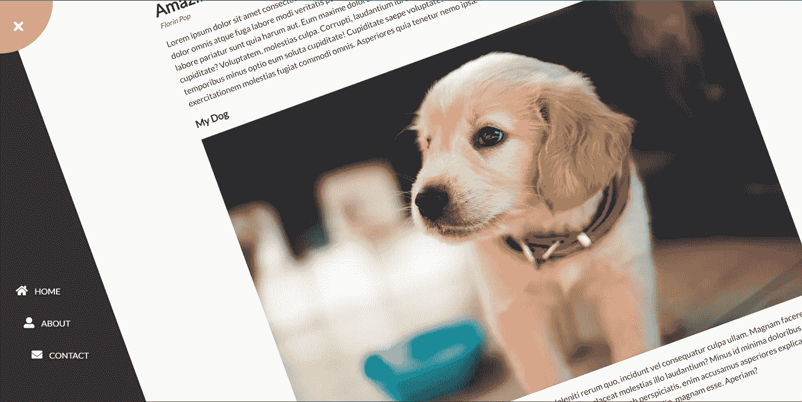

按下左上角的菜单按钮，整个主图像将旋转显示“主页”、“关于”和“联系人”链接。太酷了！

[GitHub 页面](https://github.com/bradtraversy/50projects50days/tree/master/rotating-nav-animation)

# 4.隐藏搜索小工具

从隐藏到被发现。单击搜索图标，获得搜索栏。好玩！

[GitHub 页面](https://github.com/bradtraversy/50projects50days/tree/master/hidden-search)

# 5.模糊装载

你的网站的访问者会得到一个模糊的图像，当图片变得更清晰时，加载计数器从 0%到 100%。

[GitHub 页面](https://github.com/bradtraversy/50projects50days/tree/master/blurry-loading)

# 6.滚动动画

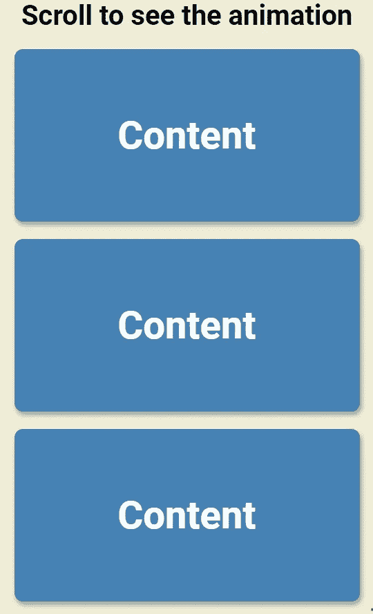

向上或向下滚动可以看到更多的内容框从左右两边飞进。看起来棒极了！

[GitHub 页面](https://github.com/bradtraversy/50projects50days/tree/master/scroll-animation)

# 7.分割登录页面

不确定你的访客想要 PS5 还是 Xbox 系列 X？为他们提供这个滑动的登录页面，当他们将光标从一边移动到另一边时，它会显示更多的内容。

[现场演示](https://50projects50days.com/projects/split-landing-page/)

[GitHub 页面](https://github.com/bradtraversy/50projects50days/tree/master/split-landing-page)

# 8.形成波形

不要让照片欺骗了你。这个看起来很普通的表单在它的文本上有一个很酷的波形特征。

[现场演示](https://50projects50days.com/projects/form-wave/)

[GitHub 页面](https://github.com/bradtraversy/50projects50days/tree/master/form-input-wave)

# 9.音板

用这个有趣的共鸣板听听不那么舒缓的嘘声。你也得到了掌声、喘息声、欢呼、胜利和错误。Lol！

[GitHub 页面](https://github.com/bradtraversy/50projects50days/tree/master/sound-board)

# 10.爸爸开玩笑

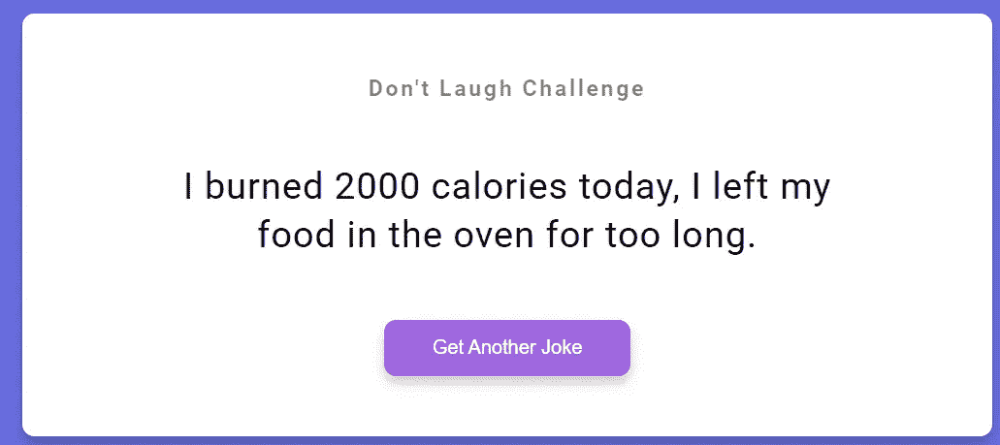

你今天喜欢爸爸的笑话吗？如果没有，你应该做一些。

比如上面的笑话说“我今天燃烧了 2000 卡路里；我把食物放在烤箱里太久了。”哈哈。

现在，按下按钮，“得到另一个笑话。”

[GitHub 页面](https://github.com/bradtraversy/50projects50days/tree/master/dad-jokes)

# 11.事件键码

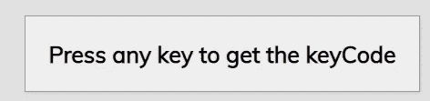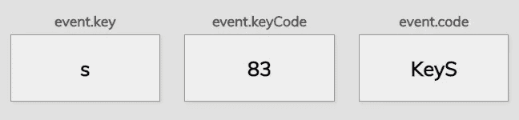

按任意键，得到一个键码。呜-呼！

[GitHub 页面](https://github.com/bradtraversy/50projects50days/tree/master/event-keycodes)

# 12.常见问题折叠

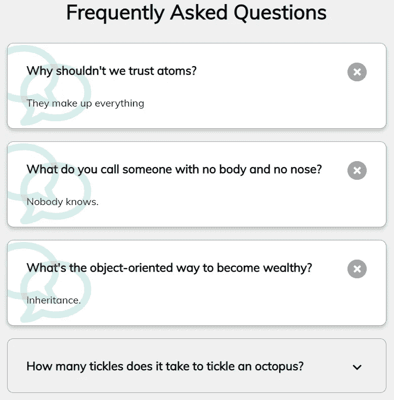

当您正在寻找一个时尚的下拉菜单来回答问题或提供信息时。

[GitHub 页面](https://github.com/bradtraversy/50projects50days/tree/master/faq-collapse)

# 13.随机选择选择器

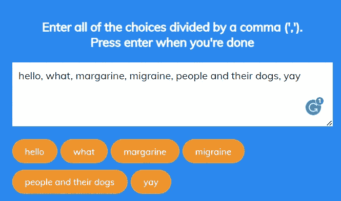

哈哈。这很有趣。

[GitHub 页面](https://github.com/bradtraversy/50projects50days/tree/master/random-choice-picker)

# 14.动画导航

这个你要亲眼看到才会相信。动画是一流的。

[现场演示](https://50projects50days.com/projects/animated-navigation/)

[GitHub 页面](https://github.com/bradtraversy/50projects50days/tree/master/animated-navigation)

# 15.递增计数器

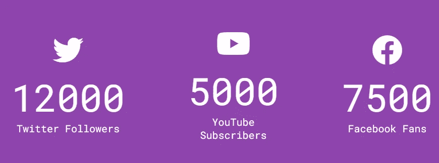

想为你的社交媒体粉丝建一个柜台吗？这是一个很棒的例子，当你加载页面的时候就开始了。

[GitHub 页面](https://github.com/bradtraversy/50projects50days/tree/master/incrementing-counter)

# 16.喝水

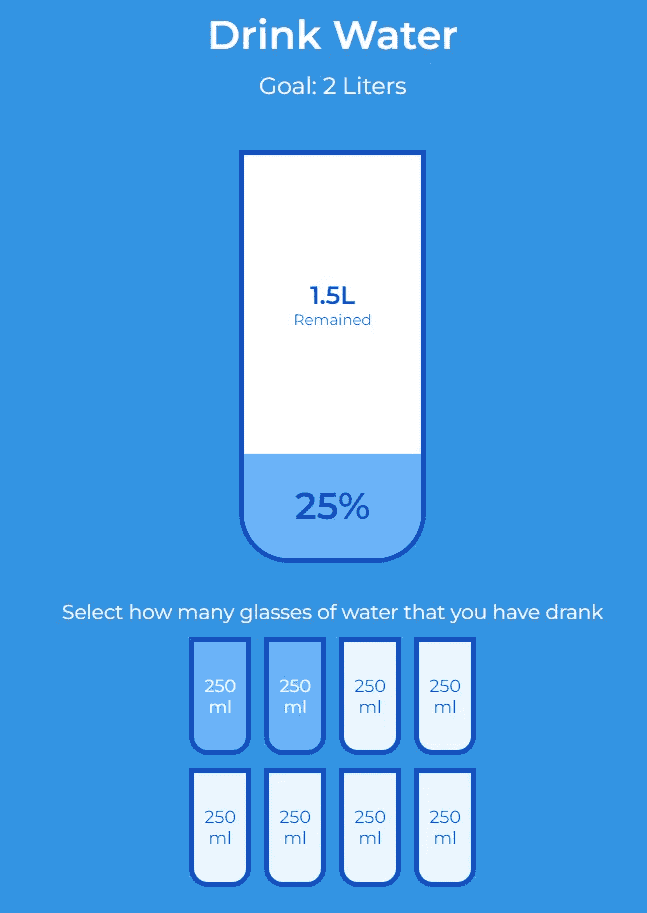

跟踪你喝了多少水的乐趣-和视觉！—方式。

[GitHub 页面](https://github.com/bradtraversy/50projects50days/tree/master/drink-water)

# 17.电影应用

爱电影？有热爱电影的朋友吗？为他们创建这个奇妙的电影应用程序。当他们悬停在电影的封面上时，他们可以阅读它的概要。

[现场演示](https://50projects50days.com/projects/movie-app/)

[GitHub 页面](https://github.com/bradtraversy/50projects50days/tree/master/movie-app)

# 18.背景滑块

非常时尚的外观。

[GitHub 页面](https://github.com/bradtraversy/50projects50days/tree/master/background-slider)

# 19.主题时钟

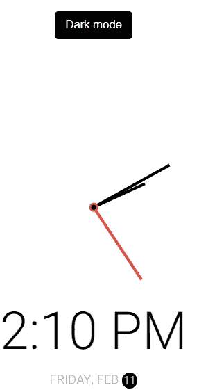

这个简约的时钟使用你电脑的日期和时间。而且…它有黑暗模式。

[GitHub 页面](https://github.com/bradtraversy/50projects50days/tree/master/theme-clock)

# 20.按钮波纹效应

[现场演示](https://50projects50days.com/projects/button-ripple-effect/)

[GitHub 页面](https://github.com/bradtraversy/50projects50days/tree/master/button-ripple-effect)

# 21.拖放

很酷的拖放功能！

[GitHub 页面](https://github.com/bradtraversy/50projects50days/tree/master/drag-n-drop)

# 22.绘图应用程序

很酷的应用。我写道:“祝你有愉快的一天:”

[GitHub 页面](https://github.com/bradtraversy/50projects50days/tree/master/drawing-app)

# 23.动力装载机

旋转三角形。

[现场演示](https://50projects50days.com/projects/kinetic-loader/)

[GitHub 页面](https://github.com/bradtraversy/50projects50days/tree/master/kinetic-loader)

# 24.内容占位符

很酷的图片和一些更酷的占位符文本。

[GitHub 页面](https://github.com/bradtraversy/50projects50days/tree/master/content-placeholder)

# 25.粘性导航条

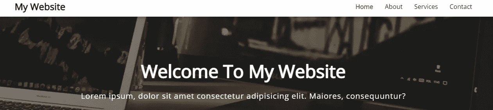

滚动时保持导航条在顶部。

[现场演示](https://50projects50days.com/projects/sticky-navbar/)

[GitHub 页面](https://github.com/bradtraversy/50projects50days/tree/master/sticky-navigation)

# 26.双垂直滑块

同时滑动图像的两侧，然后观察它们锁定到位。请看下面的演示。酷！

[现场演示](https://50projects50days.com/projects/double-vertical-slider/)

[GitHub 页面](https://github.com/bradtraversy/50projects50days/tree/master/double-vertical-slider)

# 27.Toast 通知

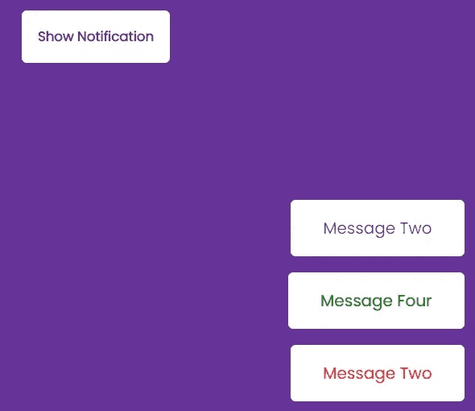

点按按钮，并查看通知。小心；他们消失得很快。

[GitHub 页面](https://github.com/bradtraversy/50projects50days/tree/master/toast-notification)

# 28.Github 档案

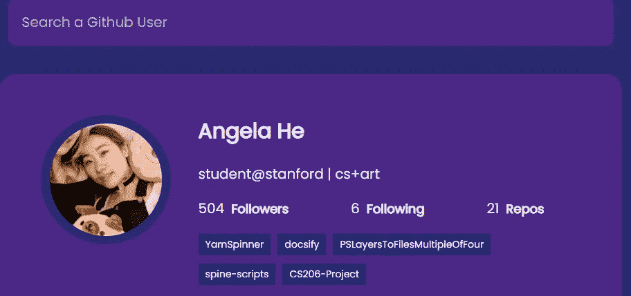

搜索了“何安琪”看看她惊人的游戏！

[GitHub 页面](https://github.com/bradtraversy/50projects50days/tree/master/github-profiles)

# 29.双击心形

这个项目允许您单击图像来添加心形；当你点击图片时，它有一个可爱的动画。

[GitHub 页面](https://github.com/bradtraversy/50projects50days/tree/master/double-click-heart)

# 30.自动文本效果

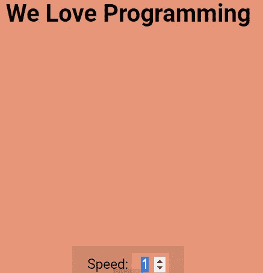

在屏幕上显示一些文本。调整速度，使其显示得更快或更慢。耶！

[GitHub 页面](https://github.com/bradtraversy/50projects50days/tree/master/auto-text-effect)

# 31.密码生成器

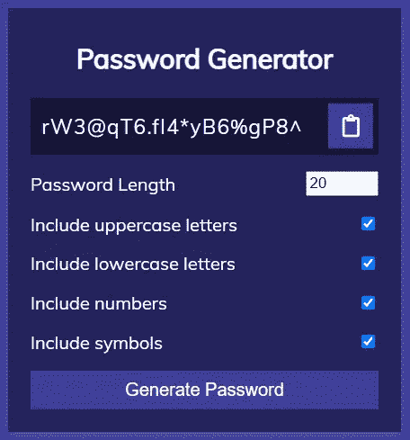

如果需要，可以设定密码长度，包括大写字母、小写字母、数字和符号。很有型。

[GitHub 页面](https://github.com/bradtraversy/50projects50days/tree/master/password-generator)

# 32.好便宜快

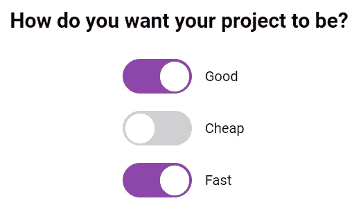

不，哈哈。你不能三者兼得。

[现场演示](https://50projects50days.com/projects/good-cheap-fast/)

[GitHub 页面](https://github.com/bradtraversy/50projects50days/tree/master/good-cheap-fast)

# 33.便签应用

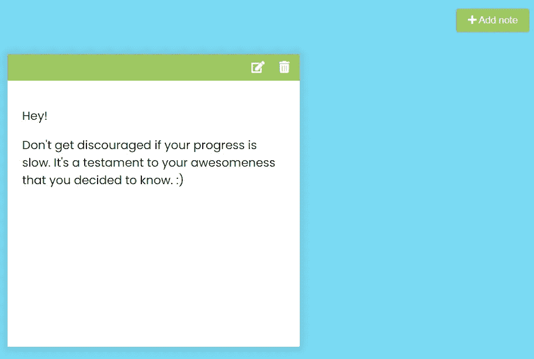

[GitHub 页面](https://github.com/bradtraversy/50projects50days/tree/master/notes-app)

# 34.动画倒计时

可爱的动画。

[GitHub 页面](https://github.com/bradtraversy/50projects50days/tree/master/animated-countdown)

# 35.图像传送带

惊人的旋转木马与上一个和下一个按钮。

[GitHub 页面](https://github.com/bradtraversy/50projects50days/tree/master/image-carousel)

# 36.悬浮滑板

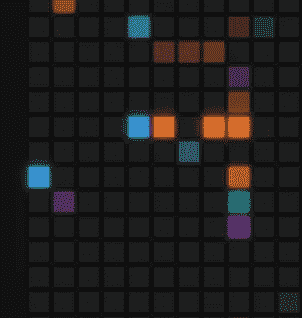

使用您的光标在屏幕上创建凉爽的彩色瓷砖！:)

[GitHub 页面](https://github.com/bradtraversy/50projects50days/tree/master/hoverboard)

# 37.Pokedex

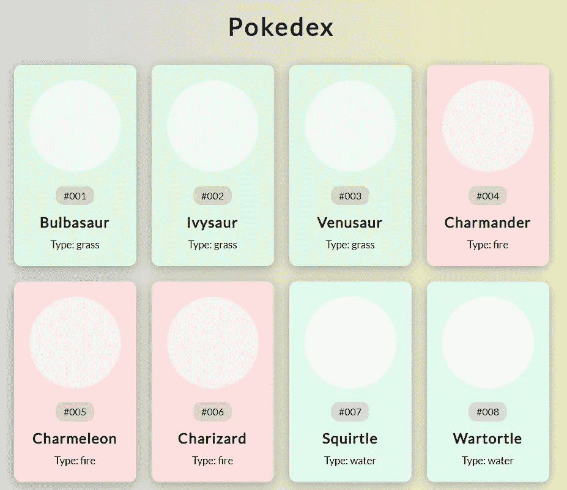

当你需要一个口袋妖怪的名片夹时——按类型分开。

红色代表火，绿色代表草。你明白了。

[GitHub 页面](https://github.com/bradtraversy/50projects50days/tree/master/pokedex)

# 38.移动标签导航

单击四个按钮之一—主页、工作、博客和关于我们—并查看不同的信息。

[GitHub 页面](https://github.com/bradtraversy/50projects50days/tree/master/mobile-tab-navigation)

# 39.密码强度背景

你的密码越复杂，背景越清晰。非常酷。试试看。

[现场演示](https://50projects50days.com/projects/password-strength-background/)

[GitHub 页面](https://github.com/bradtraversy/50projects50days/tree/master/password-strength-background)

# 40.三维背景框

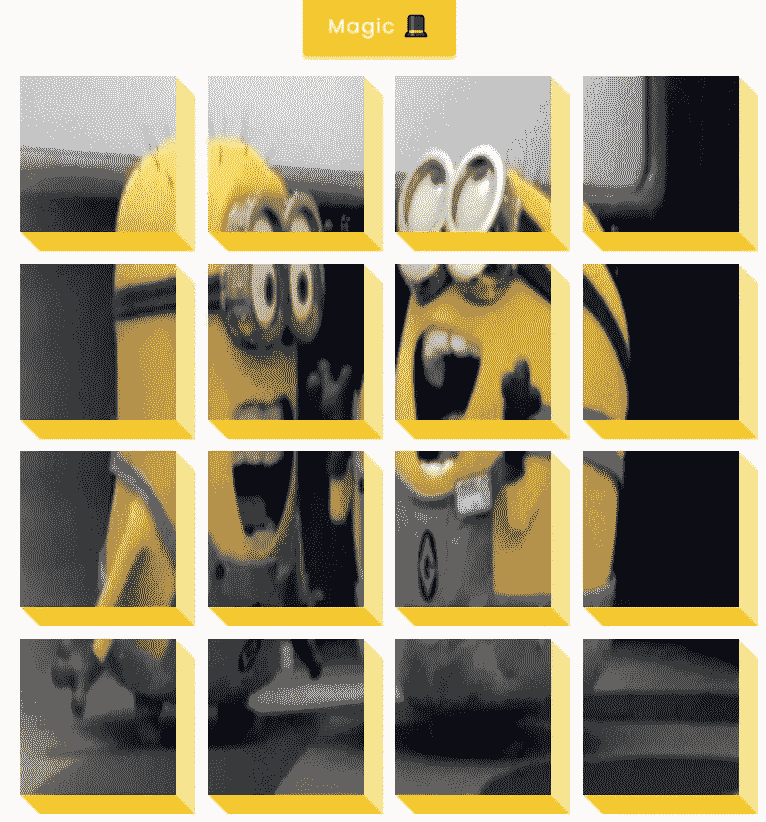

将此图像分成多个 3D 框，然后用“魔法”按钮将它们重新组合在一起。

[现场演示](https://50projects50days.com/projects/3d-background-boxes/)

[GitHub 页面](https://github.com/bradtraversy/50projects50days/tree/master/3d-boxes-background)

# 41.验证帐户用户界面

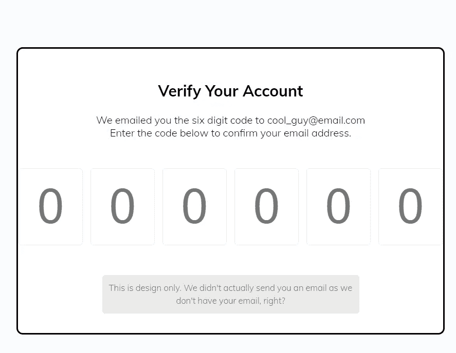

如果他们有你的电子邮件，他们会验证你的帐户。但是，既然他们没有，享受让你自己。

[GitHub 页面](https://github.com/bradtraversy/50projects50days/tree/master/verify-account-ui)

# 42.实时用户过滤器

使用这个实时用户过滤器找到你的下一个灵魂伴侣。按名称和/或位置搜索。他们在外面。说实话。

注:开玩笑。创造者推销这个不是为了找到你的灵魂伴侣。真可惜。

[GitHub 页面](https://github.com/bradtraversy/50projects50days/tree/master/live-user-filter)

# 43.反馈用户界面设计

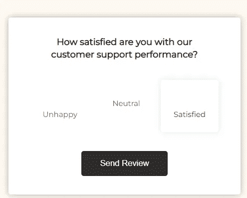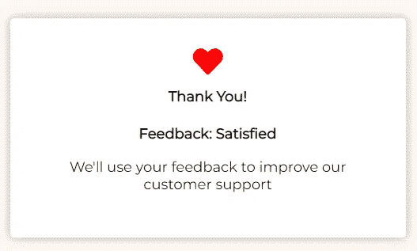

可爱的设计，易于阅读。

[GitHub 页面](https://github.com/bradtraversy/50projects50days/tree/master/feedback-ui-design)

# 44.自定义范围滑块

从 0 到 100，这个滑块可以帮助你做很多事情。

[GitHub 页面](https://github.com/bradtraversy/50projects50days/tree/master/custom-range-slider)

# 45.网飞手机导航

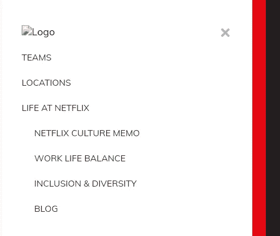

出色的网飞风格导航。

[现场演示](https://50projects50days.com/projects/netflix-mobile-navigation/#)

[GitHub 页面](https://github.com/bradtraversy/50projects50days/tree/master/netflix-mobile-navigation)

# 46.测验应用程序

回答问题，看看你最后做得怎么样！

[现场演示](https://50projects50days.com/projects/quiz-app/)

[GitHub 页面](https://github.com/bradtraversy/50projects50days/tree/master/quiz-app)

# 47.奖状箱切换器

为你的评价框添加倒计时，并自动进入下一个评价。

注意:出于可访问性的原因，这个倒计时可能会让一些访问者感到紧张。或者让他们很难阅读所有的内容。

[GitHub 页面](https://github.com/bradtraversy/50projects50days/tree/master/testimonial-box-switcher)

# 48.随机图像馈送

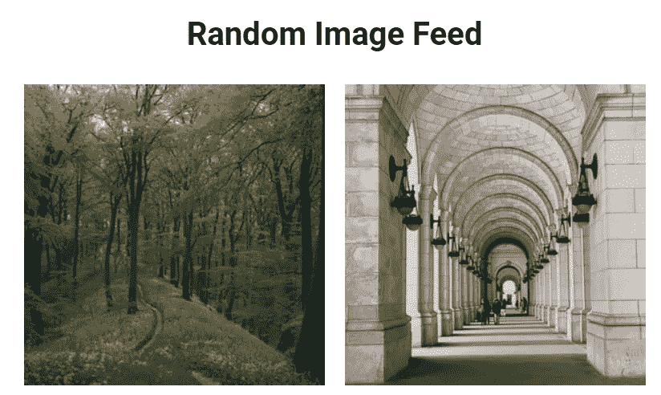

抓取随机图像并显示它们。刷新演示以获得一组新的图像。

[现场演示](https://50projects50days.com/projects/random-image-feed/)

[GitHub 页面](https://github.com/bradtraversy/50projects50days/tree/master/random-image-generator)

# 49.待办事项列表

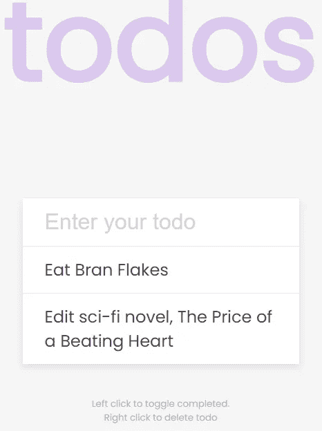

创建一个待办事项列表。

[GitHub 页面](https://github.com/bradtraversy/50projects50days/tree/master/todo-list)

# 50.昆虫捕捉游戏

好玩的游戏！

[现场演示](https://50projects50days.com/projects/insect-catch-game/)

[GitHub 页面](https://github.com/bradtraversy/50projects50days/tree/master/insect-catch-game)

好了，这是所有 50 个小项目。

同样，这是布拉德·特拉弗斯和弗罗林·波普的 Udemy 课程，他们会教你 HTML、CSS 和 JavaScript。

祝你好运，不要害怕探索、调整、复杂化和完成它们。

科幻、哲学、营销技巧