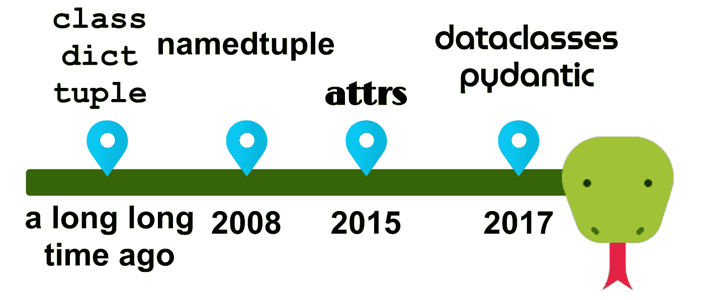

# Python 中类的 6 种替代方案

> 原文：<https://betterprogramming.pub/6-alternatives-to-classes-in-python-6ecb7206377>

## 开发速度、执行时间、(反)序列化和可维护性都在让您的代码熠熠生辉中扮演着重要角色



作者照片。

作为开发人员，我们到处扔很多数据。数据的表示非常重要，我们需要能够跟踪哪些变量代表哪些属性。配置是复杂数据的一个典型例子。

在下面的文章中，我将使用位置作为例子。它必须有经度、纬度，并且可以有地址。在 C 语言中，你可以用一个`struct`来做这件事。在 Java 中，你可以简单地创建一个类。在 Python 中，有六种选择。让我们来探讨一下它们各自的优缺点吧！

# 普通班级

普通类是标准库提供的组织数据的默认方式。你可以(也应该！)[使用类型注释](https://medium.com/analytics-vidhya/type-annotations-in-python-3-8-3b401384403d)，如下例所示:

您可以看到我们如何需要编写一个样板构造函数`__init__`。构造函数的代码并不总是看起来那么简单，但是在很多情况下，它确实很简单。

您可以看到使用位置参数或关键字参数是可能的。如果在构造函数中定义了默认值，当从类创建对象时，也可以不考虑这些值。这发生在`pos2`身上，那里的`address`没有给构造者。

您还可以看到,`get_distance`函数的注释看起来非常干净。意思很清楚。

工具支持非常好，因为每个编辑器都必须支持普通类，所有重要信息都在那里。

# 1.元组

元组是一种本地数据类型。它们的内存开销非常低，所以我们可以很快地通过索引来寻址这些元素。元组的问题是没有成员属性的名称。你必须记住每个指数代表什么。元组总是不可变的。

`get_distance`的注释看起来很乱。人类应该被告知`p1`代表一个位置——而不是这个位置包含两个浮点数和一个可选的字符串。那是编辑应该为你做的工作。

编辑的支持取决于你注释的彻底程度。在上面的例子中，你也可以只写`Tuple`而不指定元组包含什么。由于人们懒惰，我会说编辑支持不好。这不是编辑的错，但往往不能给予很好的支持。

# 2.字典

字典是一种本地数据类型，可能是 Python 中最常见的数据处理方式。与元组相比，字典有更大的内存开销，因为你必须把名字存储在某个地方，但是它们仍然可以。按索引访问元素是*快*。字典总是可变的，但是有第三方包 [frozendict](https://pypi.org/project/frozendict/) 来解决这个问题。

实践中的注解确实不好。几乎总是在最好的情况下。通常，没有注释。

[typed dict](https://medium.com/analytics-vidhya/type-annotations-in-python-3-8-3b401384403d)([PEP 589](https://www.python.org/dev/peps/pep-0589/))从 Python 3.8 开始就有了，但我从未在任何更大的代码库中见过。 [TypedDict 是一个杀手级特性](https://python.plainenglish.io/killer-features-by-python-version-c84ca12dba8)，但这无关紧要，因为我们想要支持遗留的 Python 版本。

由于这些原因，编辑器的支持甚至不如元组。

# 3.命名元组

[命名元组](https://docs.python.org/3/library/collections.html#collections.namedtuple)被添加到 Python 2.6 中，所以它们已经存在了相当一段时间。它们实际上是元组，但是它们有一个名称和一个接受关键字参数的构造函数。大多数人使用工厂函数`collections.namedtuple`来生成命名元组类，但我更喜欢从`typing.NamedTuple`继承，并使用继承结合类型注释:

`NamedTuples`解决注释变得难以阅读的问题。因此，它们也解决了我前面提到的编辑器支持问题。

有趣的是，`NamedTuples`并不*知道类型:*

# 4.属性

attrs 是一个减少样板代码的第三方库。开发人员可以通过在类上方添加`@attrs.s`装饰器来使用它。属性被赋予`attr.ib()`功能:

您可以通过将装饰器更改为`[@attr.s(frozen=True)](https://www.attrs.org/en/stable/api.html)`来使其不可变。

您还可以在构造函数的输入上自动运行代码。这被称为“转换器”，文档[展示了一个很好的例子:](https://www.attrs.org/en/stable/examples.html#conversion)

```
**>>> @attr**.s
**... class** **C**(object):
**... **    x = attr.ib(converter=int)
**>>>** o = C("1")
**>>>** o.x
```

[Visual Studio 代码](https://towardsdatascience.com/visual-studio-code-python-editors-in-review-e5e4f269b4e4)不喜欢类型注释。

# 5.数据类

数据类是在 Python 3.7 中用 [PEP 557](https://www.python.org/dev/peps/pep-0557/) 添加的。它们类似于 attrs，但是在标准库中。特别重要的是要注意，dataclasses“只是”普通的类，碰巧其中有很多数据。

与 attrs 相反，数据类使用类型注释而不是`attr.ib()`符号。我认为这大大增加了可读性。此外，编辑器支持更好了，因为您现在必须注释属性。

通过将装饰器改为`@dataclass(frozen=True)`，可以很容易地使它成为不可变的——就像 attrs 一样。

我在这里缺少的一部分是属性验证。我可以用`__post_init__(self)`来做建筑；

您还可以将数据类与属性结合起来:

然而，我不太喜欢那样。它又是超级冗长的，并且去掉了许多数据类的魅力。如果您需要类型没有涵盖的验证，那么使用 Pydantic。

# 6.Pydantic

[Pydantic](https://pydantic-docs.helpmanual.io/) 是一个专注于数据验证和设置管理的第三方库。您可以从`pydantic.BaseModel`继承或者用 Pydantic 创建一个 dataclass:

乍一看，这与标准的`@dataclass`完全相同——除了您从 Pydantic 获得了`dataclass`装饰器。

# 可变性和可散列性

我不倾向于有意识地考虑可变性，但是在很多情况下，我希望我的类是不可变的。最大的例外是数据库模型，但它们本身是一个完整的故事。

可以选择将类标记为冻结，以使它们的对象不可变，这非常好。

为可变对象实现`__hash__`是有问题的，因为当对象改变时，散列可能会改变。这意味着如果对象在字典中，字典需要知道对象的散列已经改变，并将它存储在不同的位置。因此，dataclasses 和 Pydantic 在默认情况下都阻止可变类的散列。不过他们有`unsafe_hash`。

# 默认字符串表示

拥有一个合理的字符串表示非常有帮助(例如，对于日志记录)。老实说:很多人都在做`print`调试。

如果我们从上面的例子中打印出`pos1`，下面是我们将得到的结果。添加换行符和对齐方式是为了保持可读性。原始结果在一行中:

```
>>> print(pos1)Plain class   : <__main__.Position object at 0x7f1562750640>
# 1 Tuples    : (49.0127913, 8.4231381, 'Parkstraße 17')
# 2 Dicts     : {'longitude': 49.0127913,
                 'latitude': 8.4231381,
                 'address': 'Parkstraße 17'}
# 3 NamedTuple: Position(longitude=49.0127913,
                         latitude=8.4231381,
                         address='Parkstraße 17')
# 4 attrs     : Position(longitude=49.0127913,
                         latitude=8.4231381,
                         address='Parkstraße 17')
# 5 dataclass : Position(longitude=49.0127913,
                         latitude=8.4231381,
                         address='Parkstraße 17')
```

可以看出，从普通类创建的对象的字符串表示是没有用的。元组更好，但是没有指明哪个索引代表哪个属性。所有剩下的表现都很棒。它们很容易理解，甚至可以用来重新创建对象！

# 数据有效性

您已经看到了如何为普通类、属性、数据类和 Pydantic 实现数据验证。您没有看到的是错误消息的样子。

下面，我将尝试创建`Position(1234, 567)`。所以经度和纬度都不对。以下是由此触发的错误消息:

```
# Plain Class
ValueError: Longitude was 11111, but has to be in [-180, 180]# 4: attr
ValueError: Longitude was 1234, but must be in [-180, +180]# 5: dataclasses
(same as plain classes is possible)# 6: Pydantic
pydantic.error_wrappers.ValidationError: 2 validation errors for Position
longitude
  Longitude was 1234.0, but must be in [-180, +180] (type=value_error)
latitude
  Latitude was 567.0, but must be in [-90, +90] (type=value_error)
```

这是我想说的观点:Pydantic 以一种非常清晰的方式给你所有的错误。普通类和属性只是给你第一个错误。

# 序列化到 JSON

JSON 是在网络上交换数据的方式。GitLab API 也不例外。假设我们想让 Python 对象序列化为 JSON，然后[得到一个 MR](https://docs.gitlab.com/ee/api/merge_requests.html#get-single-mr) 。在 Pydantic 中，就是这么简单(为了可读性，去掉了很多属性):

这给了你:

```
{"id": 1, "squash": true, "web_url": "[http://foo](http://foo)", "title": "title", "author": {"id": 42, "username": "Joe"}}
```

对于数据类，`[dataclasses.asdict](https://docs.python.org/3/library/dataclasses.html#dataclasses.asdict)`大有帮助。然后，您可能能够直接将字典序列化为 JSON。有了`DateTime`或[十进制](https://docs.python.org/3/library/decimal.html)对象就变得有趣了。对于 attrs，类似的事情也是可能的。

# 从 JSON 取消序列化

用 Pydantic 将 JSON 字符串中的嵌套类用户化是微不足道的。使用上面的示例，您可以编写:

```
mr = GitlabMr.parse_raw(json_str)
```

有一些非常肮脏的黑客用数据类做类似的事情。反序列化的 [attrs 方式看起来更好，但我猜它也很难处理嵌套结构。当谈到`DateTime`或小数时，我很确定两者都比小数显示出更多的问题。序列化、反序列化和验证是 Pydantic 的亮点。](https://stackoverflow.com/q/44801927/562769)

# 记忆

在`pos1`上使用这个`[getsize](https://stackoverflow.com/a/30316760/562769)`实现，我得到:

```
Raw float    :   8 B ("double")
Raw string   :   1 B per char => 13B
Raw data     :  29 B = 8B + 8B + 13BFloat object :  24 B
Str object   :  86 B
3 objects    : 134 B = 24B + 24B + 86BNative class : 286 B
#1 Tuple     : 198 B
#2 Dict      : 366 B
#3 NamedTuple: 198 B
#4 attrs     : 286 B
#5 dataclass : 286 B
#6 pydantic  : 442 B (the "dataclass" version)
#6 pydantic  : 801 B (the "BaseModel" version)
```

Pydantic 基本模型有相当大的开销，但是你必须始终保持正确的观点。你会创建多少这样的对象？让我们假设你大概有 100 个。他们中的每一个人都可能比更高效的替代品多消耗 5000 亿英镑。那将是 50kB。引用唐纳德·克努特的话:

> "过早优化是万恶之源."

如果内存出现问题，那么就不能从 Pydantic 切换到 dataclasses 或 attrs。你将切换到更结构化的东西，比如 NumPy 数组或者熊猫`DataFrames`。

# 执行时间

在这个上下文中,“执行时间”有多种含义:

*   带或不带验证或转换的对象创建时间
*   来自 JSON 的解析时间
*   从字典中解析时间

我确信 JSON 的解析时间决定了其余的时间。Python 中有多种可用的 JSON 解析器:

[](https://levelup.gitconnected.com/json-encoding-decoding-with-python-62a2cae63a6a) [## 用 Python 进行 JSON 编码/解码

### 从速度、成熟度和操作安全性方面比较库

levelup.gitconnected.com](https://levelup.gitconnected.com/json-encoding-decoding-with-python-62a2cae63a6a) 

# 那我什么时候用什么？

使用您需要的东西:

*   `Dict`当你事先不知道会有什么补充的时候。请注意，您可以使用`dict`混合所有其他选项，反之亦然。所以如果你知道数据结构的一部分是什么样子，那么就用不同的东西。我认为`dict`是最后的手段。
*   `NamedTuple`当你需要一种快速的方法对数据进行分组并且不需要可变性时。当你可以不知道类型的时候。
*   当您需要可变性、希望能够识别类型或者希望能够从创建的数据类继承时，可以使用。
*   当你需要反序列化数据时。

请注意，我没有提到 tuple 和 attrs。我只是找不到一个有效的用例，在这个用例中，你会更喜欢新代码而不是其他选择。如果我错过了，请让我知道。

我也没提平原班。无论如何，如果我想覆盖`__init__`、`__eq__`、`__str__`、`__repr__`和`__hash__`，我想我只会使用普通类。或者我是否必须支持旧的 Python 版本。

# 资源

*   raymond Hettinger:"[data classes:结束所有代码生成器的代码生成器](https://www.youtube.com/watch?v=T-TwcmT6Rcw)"在 PyCon 2018 上，在 YouTube 上。