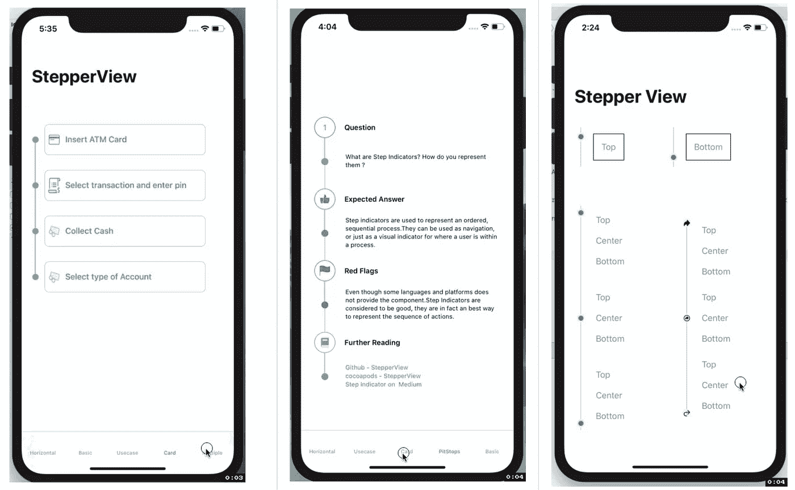
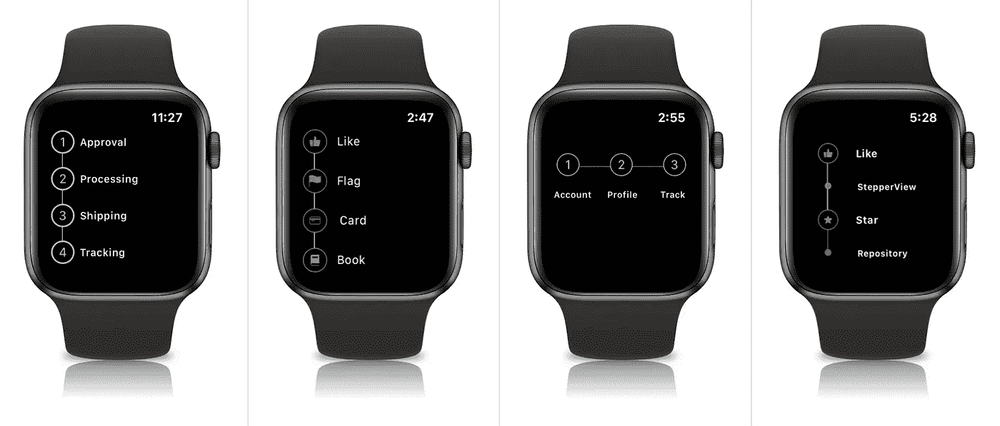
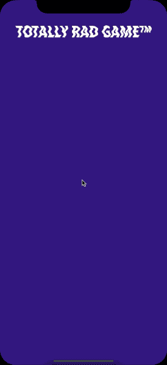
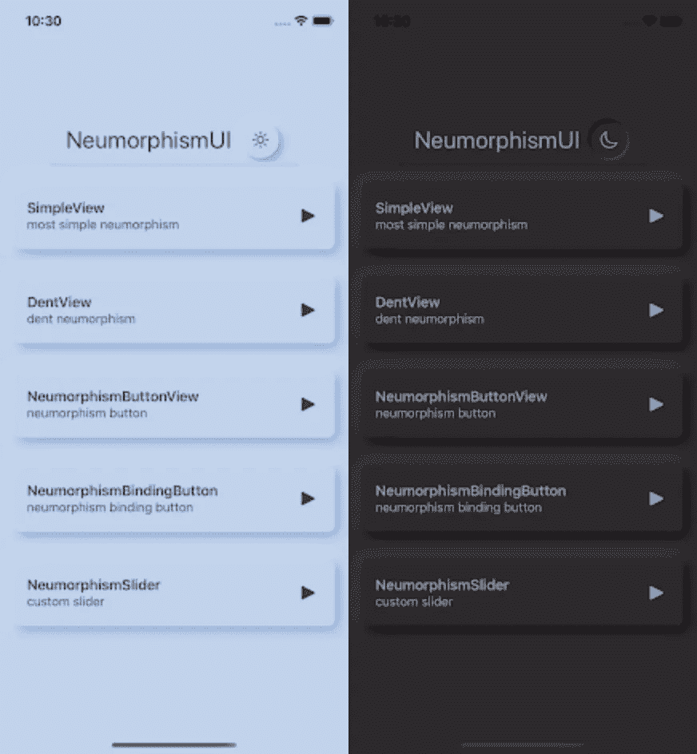
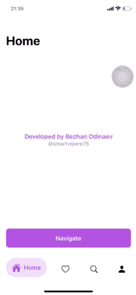

# 将在您的下一个项目中使用的 6 个惊人的 SwiftUI 库(第 2 部分)

> 原文：<https://betterprogramming.pub/6-amazing-swiftui-libraries-to-use-in-your-next-project-part-2-df5fb94680bc>

## 这些库可以帮助您填补下一个基于 SwiftUI 的 iOS 应用程序的空白

杰佛逊·桑托斯在 [Unsplash](https://unsplash.com?utm_source=medium&utm_medium=referral) 上的照片

这是我的文章 [8 在您的下一个项目中使用的惊人的 SwiftUI 库](https://medium.com/better-programming/8-amazing-swiftui-libraries-to-use-in-your-next-project-52efaf211143)的第二部分，我是在第一篇文章得到大量回应后写的。

如果你已经开始使用 SwiftUI 或者在你的爱好项目中使用它，这六个库可以帮助你提高你的水平。

大多数库都可以通过 [Swift 包管理器](https://swift.org/package-manager/)获得。

# 1.Badarinath 的 StepperView

[StepperView](https://github.com/badrinathvm/StepperView) 是用于步骤指示的 SwiftUI iOS 组件。

# 2.Shinryaku Tako 的章鱼套装

[OctopusKit](https://github.com/InvadingOctopus/octopuskit) 是一个基于 ECS 的 2D 游戏引擎，为 iOS、macOS 和 tvOS 用 100% Swift 编写。

正如文档所述，OctopusKit 包装并扩展了苹果的框架:

*   GameplayKit 用于灵活的实体-组件-系统架构，以动态组合游戏行为
*   用于 2D 图形、物理和 GPU 着色器的 SpriteKit
*   SwiftUI 使用声明式语法快速设计流畅、可扩展的 hud
*   金属，确保发动机罩下的最佳自然性能
*   独立于操作系统的组件让您可以用相同的代码处理鼠标/触摸或键盘/游戏手柄输入，并在不需要 Catalyst 的情况下针对 iOS + macOS 进行本机编译。

# 3.按 Exyte 弹出视图

[弹出视图](https://github.com/exyte/PopupView)是一个用 SwiftUI 编写的吐司和弹出窗口库。

## 必需的参数

`presented`:确定弹出窗口是在屏幕上显示还是隐藏的绑定
`view`:您希望在弹出窗口上显示的视图

## 可用自定义-可选参数

`type`:吐司、浮动、默认
`position`:顶部或底部(默认情况下只是决定动画方向)
`animation`:自定义弹出滑动到屏幕上的动画
`autohideIn`:弹出消失的时间

# 4.由 Ryo Tsuzukihashi 创作

neuromophismuia 是一个非常有用的库，允许你在 SwiftUI 中轻松使用 neumorphistic 设计。

## 可用视图

*   简单的观点
*   神经变形凹面
*   神经变形按钮
*   异形滑块

# 5.Bezhan 的 BottomBar

[底栏](https://github.com/smartvipere75/bottombar-swiftui)是一个标签栏组件，灵感来自[谷歌底栏导航模式](https://dribbble.com/shots/5925052-Google-Bottom-Bar-Navigation-Pattern)。

# **6。尼尔·马赫查的 AlertX**

AlertX 是一个用于 SwiftUI 项目的库，可以以非常简单的方式实现定制警报，就像实现内置系统警报一样。

AlertX 的外观可以根据主题进行定制。已经包含了一些预定义的主题，但是你也可以有自己的主题。

AlertX 的所有主题都是类型`AlertX.Theme`。每个预定义的主题都有静态方法。

# 结论

随着 WWDC 2020 的最新变化，我对开源社区将为 SwiftUI 2.0 推出的下一个产品感到兴奋。

我希望你喜欢这些库，并将它们融入到你的项目中，同时注明它们的作者。