# Web 开发人员的自动填充功能

> 原文：<https://betterprogramming.pub/6-autofill-features-for-web-developers-ac76b725b28a>

## 深入了解浏览器如何管理通用字段、信用卡、地址和密码的自动填充


凯莉·西克玛在 [Unsplash](https://unsplash.com?utm_source=medium&utm_medium=referral) 上的照片

## 什么是自动填充？

当用户在 web 上填写表单时，浏览器足够智能，可以根据用户过去输入的类似值来填写值。

## 什么是自动完成？

当用户在 web 上填写表单时，浏览器足够智能，可以根据用户过去输入的类似值显示可能的值。用户可以选择并接受提示值。

自动填充或自动完成适用于用户名、密码、电话号码、地址、电子邮件、信用卡信息或任何随机字段。

自动填充和自动完成之间的区别是微妙的。也有可能一个网站在一个单一的形式中执行两者。例如，当用户键入用户名时，它提供自动完成建议。选择用户名后，相应的密码会自动填充。

在许多情况下，自动填充和自动完成可以互换使用。在 [HTML 规范](https://html.spec.whatwg.org/multipage/form-control-infrastructure.html)中，自动填充是帮助用户填写表单的官方术语。这是通过使用 HTML 的`autocomplete`属性来提示浏览器如何或者是否提供这样的特性来实现的。

## 为什么我们使用自动填充/自动完成？

它帮助用户更快地填写 web 表单，尤其是在移动设备上。建议用户为每个网站创建强而唯一的密码。后果就是复杂的密码很难记住。自动填充/自动完成是浏览器记忆信息的一种方式，如密码、信用卡号、地址等。是否信任浏览器的安全处理成为用户的选择。

在本文中，我们仔细观察浏览器如何管理通用字段、信用卡、地址和密码的自动填充。

# 启用/禁用自动填充

`autocomplete`是`<form>`的一个属性。它指示控件的值是否可以由浏览器自动完成。自动完成有两个基本值:

*   `"on"`:允许浏览器根据之前输入的值建议或完成该值。浏览器必须使用试探法来决定建议什么样的自动补全值。`"on"`是默认值。
*   `"off"`:浏览器不会自动完成输入。相反，每次使用时，用户都必须在字段中明确输入一个值。通常，它表示字段信息太敏感而无法缓存，或者该值永远不会被重用，或者应用程序提供了自己的自动完成机制。

# 自动填充输入字段

可以在`<form>`级别设置`autocomplete`属性来控制其输入字段，也可以直接为每个输入字段设置。这些输入字段由`<input>`、`<textarea>`和`<select>`元素定义。

下面是在 VSCode Live 服务器上运行的`<input>`代码[:](https://javascript.plainenglish.io/interview-prep-build-web-application-using-html-css-and-javascript-d6489132daaf)

我们在浏览器中看到输入字段:


为什么字段不自动填充，而`"on"`是默认值？

为了让`autocomplete`发挥作用，它*通常*需要三样东西:

*   `<input>` / `<select>` / `<textarea>`元素有一个`name`和/或`id`属性。
*   `<input>` / `<select>` / `<textarea>`元素是`<form>`元素的后代。
*   该表单有一个提交按钮。

这里我们使用“一般”一词，因为每个浏览器实现自动填充的方式略有不同。建议同时使用`name`和`id`来确保浏览器的启发式工作。

我们修改 HTML 代码以满足要求，如下所示:

在第 6 行，设置了`name`和`id`，尽管在这种情况下没有必要。

在第 7 行，添加了一个提交按钮。

执行代码。键入`a`并提交表单。

再次执行代码。通过点击该字段，可选择之前的输入`a`。

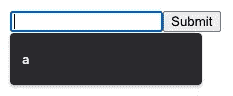

对于`<input>`，`autocomplete`属性作用于`hidden`，`text`，`search`，`url`，`tel`，`email`，`date`，`month`，`week`，`time`，`datetime-local`，`number`，`range`，`color`，`password`类型。`autocomplete`对`checkbox`、`radio`、`file`类型或任何不返回数字或文本数据的按钮类型没有影响。

`<textarea>`怎么样？

它的工作原理应该类似于`<input>`。然而，我们还没有看到很多在浏览器上的实现。

`<select>`怎么样？

该规范给出了一个示例，将前面的选择`Zambia`显示为突出选择。

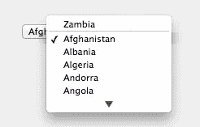

然而，我们还没有看到很多在浏览器上的实现。

大多数情况下，自动填充功能用于`<input>`元素。

# 自动填充详细令牌

当为输入字段指定了`autocomplete`属性时，除了`"on"`和`"off"`之外，它还可以有其他值。这些其他值被称为*自动填充细节标记*，它是一组有序的空格分隔标记，定义如下:

```
[section-](optional) [shipping|billing](optional) [home|work|mobile|fax|pager](optional) [autofill field name]
```

自动填充字段名称通常是下列值之一:

```
"name"
"honorific-prefix"
"given-name"
"additional-name"
"family-name"
"honorific-suffix"
"nickname"
"username"
"new-password"
"current-password"
"one-time-code"
"organization-title"
"organization"
"street-address"
"address-line1"
"address-line2"
"address-line3"
"address-level4"
"address-level3"
"address-level2"
"address-level1"
"country"
"country-name"
"postal-code"
"cc-name"
"cc-given-name"
"cc-additional-name"
"cc-family-name"
"cc-number"
"cc-exp"
"cc-exp-month"
"cc-exp-year"
"cc-csc"
"cc-type"
"transaction-currency"
"transaction-amount"
"language"
"bday"
"bday-day"
"bday-month"
"bday-year"
"sex"
"url"
"photo"
```

除了解释字段名，`"cc"`表示信用卡，`"bday"`表示生日。

以下是有效的例子:

```
section-blue shipping home street-address
shipping home street-address
home street-address
street-address
```

自动填充细节标记指定了预期值的类型。允许浏览器根据该值提供自动完成值，但浏览器不一定要接受它。

试试下面的例子:

这里，`autocomplete="name"`(第 6 行)对输入字段没有影响:


指定`name`和/或`id`可能更有效。

当`name`和/或`id`设置为`"name"`时，浏览器能够提供有意义的建议。

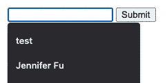

# 特殊自动填充字段

我们以 Chrome 为例；其他浏览器以稍微不同的方式做类似的事情。

下面是 Chrome 上的自动填充设置:`chrome://settings/autofill`。

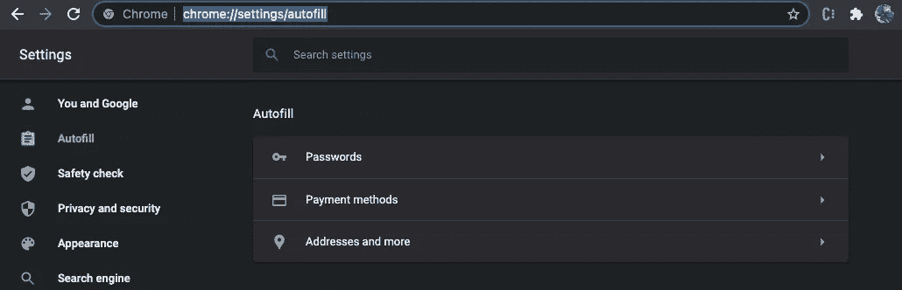

在上面的截图中，有三种自动填充类型:`Passwords`、`Payment methods`和`Addresses and more`。

让我们一个一个地检查它们。

## 信用卡字段

前往 Chrome 上的付款自动填充设置:`chrome://settings/payments`。

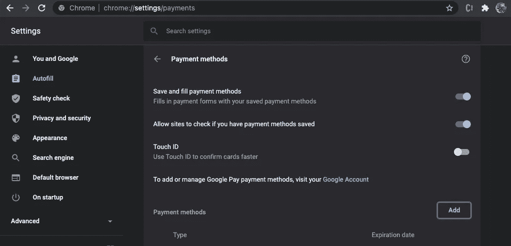

在上面的截图中，有选择`whether Save and fill payment methods`和`Allow sites to check if you have payment methods saved`。

我们添加一种支付方式。

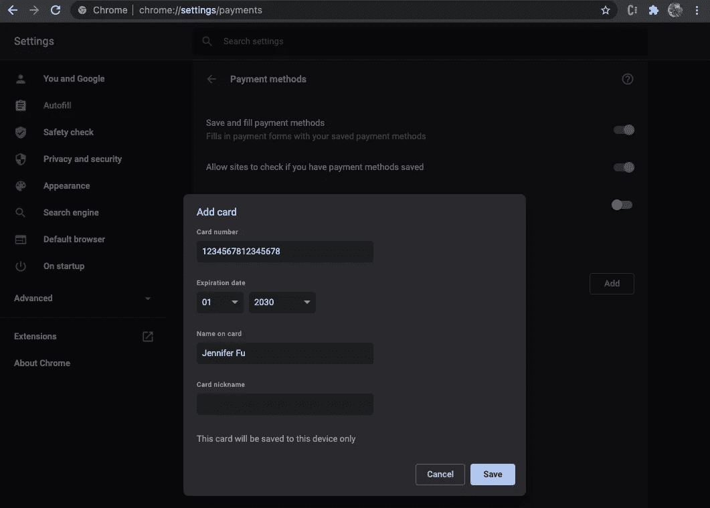

在`localhost.`上运行以下代码

对于第 6、7 和 8 行，每个输入字段都有`name`、`id`和`autocomplete`属性。对于要自动填充的信用卡信息，其中一个属性就足够了。

在`localhost`上，显示自动填充信用卡被禁用。

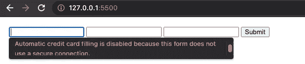

我们安装 [surge](https://surge.sh/) 来发布 HTML 代码:

```
$ npm install --global surge
$ surge
project: /Users/jenniferfu/form/
         domain: white-book.surge.sh
         upload: [====================] 100% eta: 0.0s (1 files, 432 bytes)
            CDN: [====================] 100%
     encryption: *.surge.sh, surge.sh (275 days)
             IP: 138.197.235.123Success! - Published to white-book.surge.sh
```

在 URL 中键入`[white-book.surge.sh](https://white-book.surge.sh)`,自动填充信用卡示例就可以工作了。

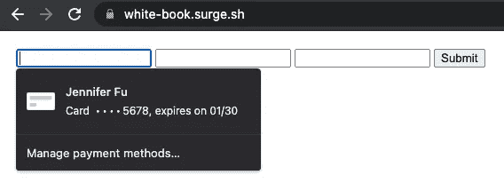

选择信用卡信息，然后信用卡名称、号码和到期日期会自动填充。

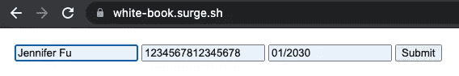

## 地址字段

转到 Chrome 上的地址自动填充设置:`chrome://settings/addresses`。

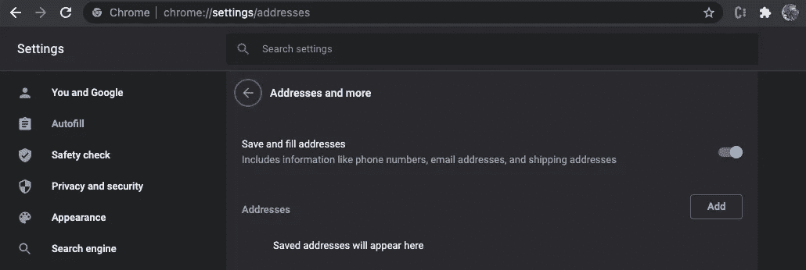

在上面的截图中，我们可以选择`whether Save and fill addresses`。

我们添加一个地址。

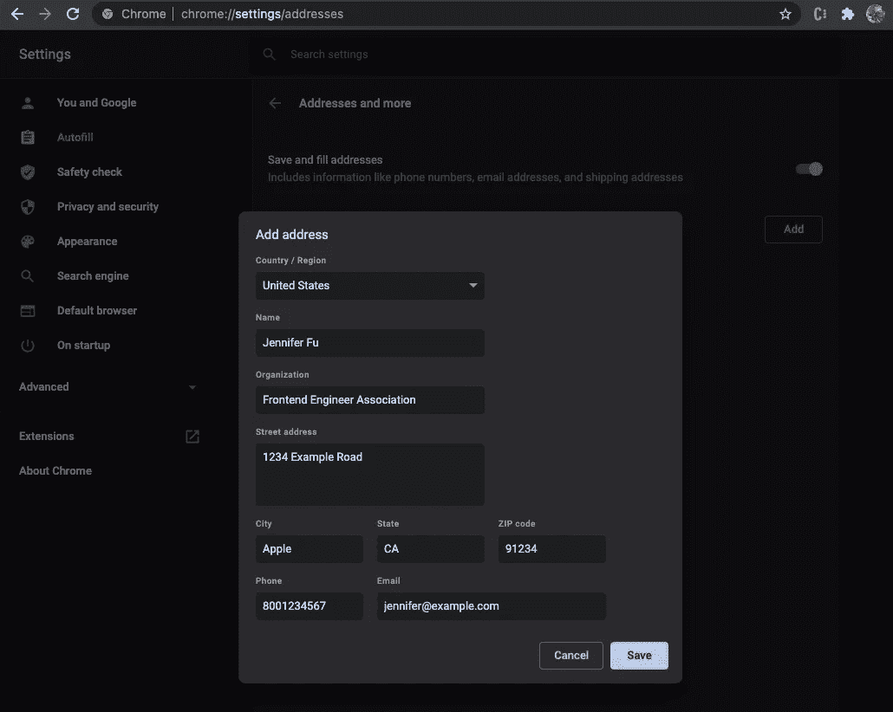

在 localhost 上运行以下代码:

对于第 9、10、11、12 和 14 行，我们使用了`shipping`标记。您可能会注意到`locality`和`region`不是自动填充字段名称的一部分。它们是 Chrome 的实现。

地址自动填充适用于`localhost`。

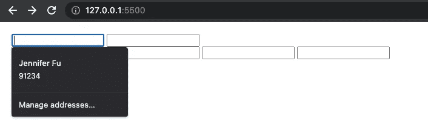

选择地址信息，然后名称、组织和地址字段会自动填充。

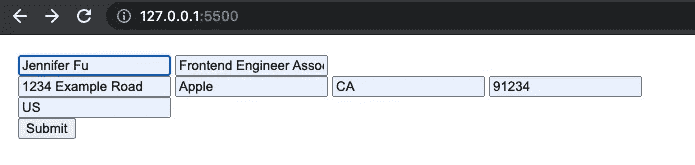

## 密码字段

进入 Chrome 上的密码自动填充设置:`chrome://settings/passwords`。

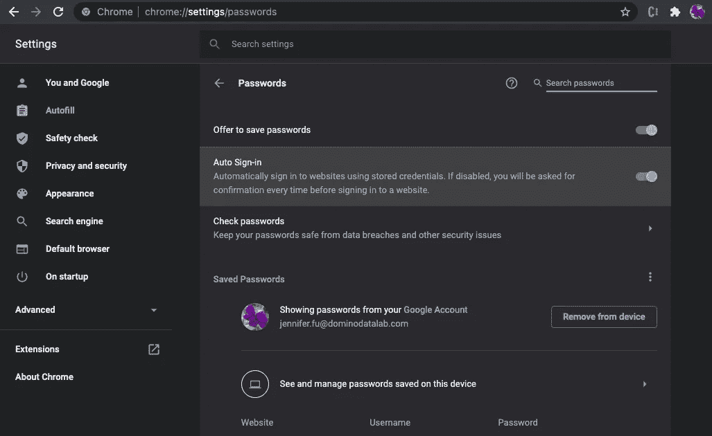

在上面的截图中，有`Offer to save passwords` 和`Auto Sign-in`的选择。

对于密码自动填充，有三个参数，`website`、`username`和`password`(列在上面截图的底部)。`website`由浏览器管理，`username`和`password`由代码配置。根据是本地主机，还是浪涌型主机，还是普通域名，浏览器可能会区别对待。它可以忽略密码设置，或者在地址栏中提供钥匙图标供用户手动保存密码设置，或者自动弹出对话框供用户保存密码设置。

下面是自动填充用户名和密码字段的代码。

代码发布到`[quaint-garden.surge.sh](https://quaint-garden.surge.sh)`。键入用户名和密码。

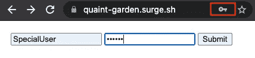

单击上面地址栏中的钥匙图标。它会弹出一个对话框，让用户保存密码设置。点击`Save`。

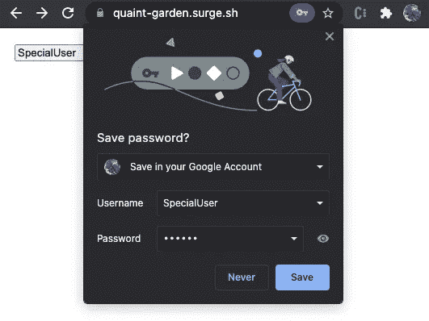

它对`localhost`和`[quaint-garden.surge.sh](https://quaint-garden.surge.sh)`都有效。保存的密码显示在密码设置中。

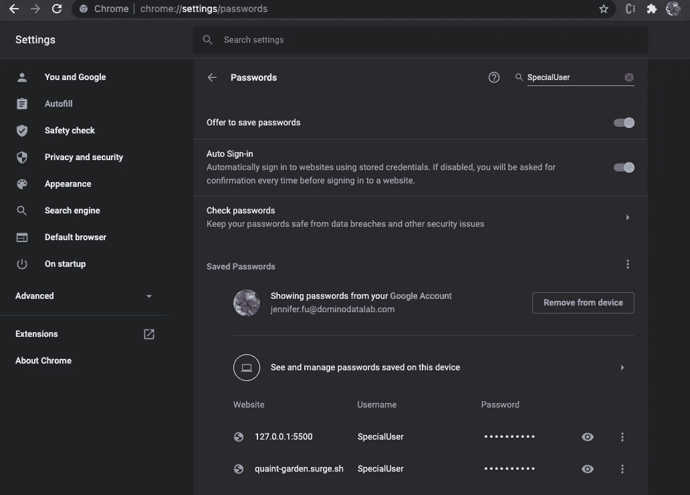

转到`[quaint-garden.surge.sh](https://quaint-garden.surge.sh/)`，并且`username`和`password`都被自动填充。

如果我们想关闭密码自动完成功能，我们应该使用`autocomplete="off"`吗？

不幸的是，浏览器不支持`autocomplete="off"`用于登录字段。如果站点为具有`username`和`password`字段的`<form>`设置`autocomplete="off"`，或者直接在`username`和`password`字段上设置`autocomplete="off"`，自动填充将不会关闭。

为了关闭密码自动完成功能，我们需要对`password`字段使用`autocomplete="new-password"`。

代码发布到`[plastic-snail.surge.sh](https://plastic-snail.surge.sh)`。`username`的自动填充功能已关闭。`password`字段将询问是否重用先前保存的`username` / `password`组合。

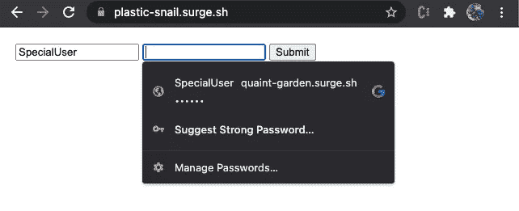

# 清除自动填充的数据

有时，我们希望清理自动填充数据。我们可以前往`chrome://settings/autofill`更改自动填充设置，或者删除保存的密码、支付方式和地址。

如果我们想清除所有自动填充的数据，请转到`chrome://settings/?search=history`，并点击`Clear browsing data`。

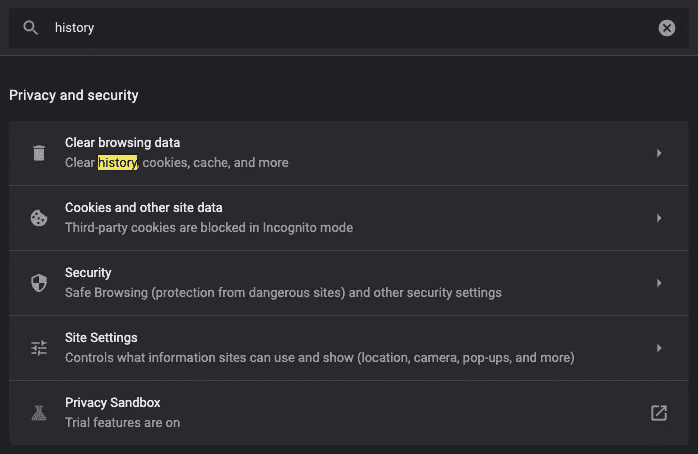

在下面的`Advanced`选项卡上，选择`Autofill form data`，点击`Clear data`。

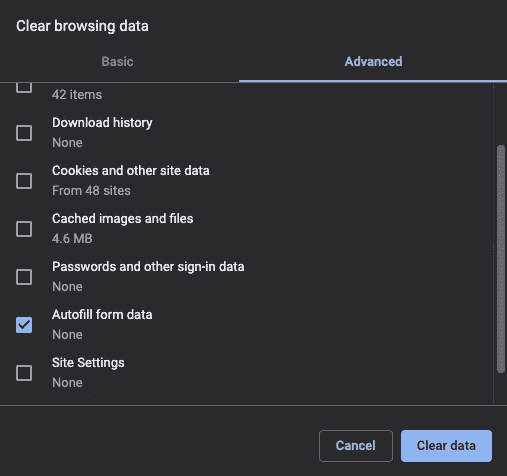

所有自动填充的数据都将被清除。

您可能需要重新启动浏览器以获得干净的状态。

# 结论

在本文中，我们将介绍什么是自动填充，它是如何工作的，如何为通用字段、信用卡、地址和密码设置自动填充。

掌握自动填充对于构建用户友好的 web 应用程序至关重要。

感谢阅读。我希望这有所帮助。