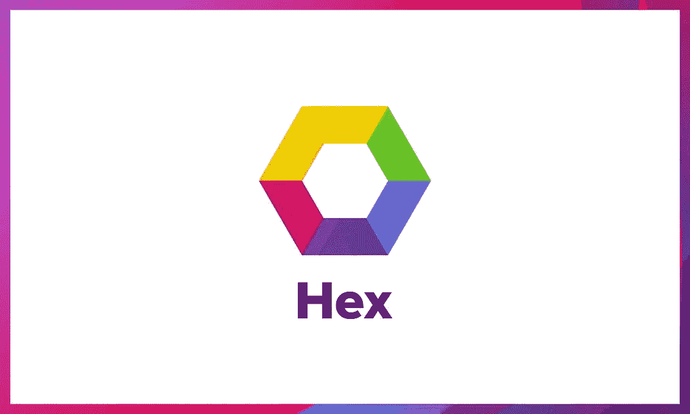

# 6 个令人惊叹的开源项目

> 原文：<https://betterprogramming.pub/6-awesome-elixir-open-source-projects-15e5ef1c7a63>

## 就其年龄而言，Elixir 拥有一个活跃的生态系统，其中有许多成熟而稳定的库

# 泰斯拉马特

Teslamate 是一款功能强大的自托管数据记录器，适用于您的特斯拉汽车。它具有仪表板，挤满了驱动器统计，访问地址，和效率报告。Teslamate 一直是 GitHub 上的热门仙丹库之一，所以如果你有一个 Tesla 并且想用仙丹做一些很酷的事情，我建议你尝试一下。

# Supabase 实时

[Realtime](https://github.com/supabase/realtime) 是一个监听 PostgreSQL 数据库变化的应用程序。它是一个 Phoenix 服务器，侦听 PostgreSQL 的复制功能，将字节流转换为 JSON，然后通过 websockets 广播。

# 苦艾酒

[苦艾酒](https://github.com/absinthe-graphql/absinthe)是 [GraphQL](https://graphql.org/) 的仙丹实现。苦艾酒实现了 GraphQL 的工作草案，同时为 Elixir 用户提供了一个漂亮的、惯用的 API。此外，它还有一些额外的功能，比如易读的模式、对 Phoenix、Plug 和 Relay 的支持，以及一个非常可配置的查询管道。

如果您还没有听说过 GraphQL，它基本上是由脸书创建和发明的更好的 REST，允许通过单个端点查询 API，而不是从多个端点获取大量数据。你可以在 [How To GraphQL](https://www.howtographql.com/basics/0-introduction/) 了解更多信息。

# 十六进制

Hex 是 Erlang 和 Elixir 的一个包管理器，拥有超过 11 000 个公共包。

要查看 Phoenix 项目的示例，您也可以查看 Hex.pm 的网站。

# ExVenture

一旦你更深入地钻研开源灵药，你就能发现一些宝藏。特别是 [ExVenture](https://github.com/oestrich/ex_venture) 。如果你曾经想建立你自己的基于文本的 MUD，你可以在 Elixir 中实现。

建立你自己的想象世界，有妖精、龙和其他生物。反正图形都这么 2019 了。

如果你想了解更多关于 ExVenture 的信息，你可以在 [Elixir Wizards](https://smartlogic.io/podcast/elixir-wizards/season-two-oestrich/) 上听一听对其创造者的采访。

# 凤凰城实时景观

以一个最有希望的长生不老药项目结束是有意义的。

Phoenix LiveView 能够让你通过 Elixir 的力量从你的网页中抛弃 JavaScript(大部分)。LiveView 为客户端单页应用程序提供了一个很好的替代方案，就像你用 React 或 Vue.js 制作的那些应用程序一样

了解如何使用 LiveView 在 15 分钟内实现 Twitter 克隆:

如果你想了解更多关于 LiveView 的知识，我建议你尝试一下[的免费实用工作室课程](https://online.pragmaticstudio.com/courses/liveview)或者听听《凤凰框架》的作者 Chris McCord 在[的软件工程广播节目](https://www.se-radio.net/2020/01/episode-394-chris-mccord-on-phoenix-liveview/)。

# 结论

总的来说，Elixir 的开源生态系统相当大，有几个高质量的项目被许多公司用于生产。要了解它能提供的更多内容，你可以查看这个精选的药剂库列表。