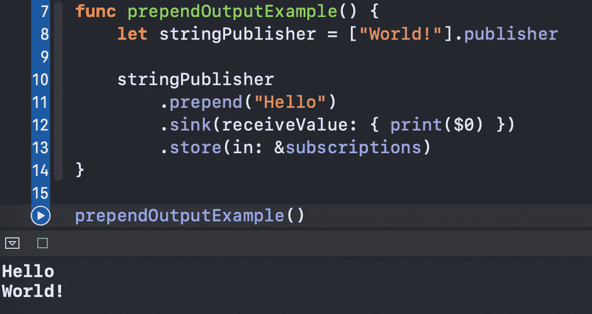
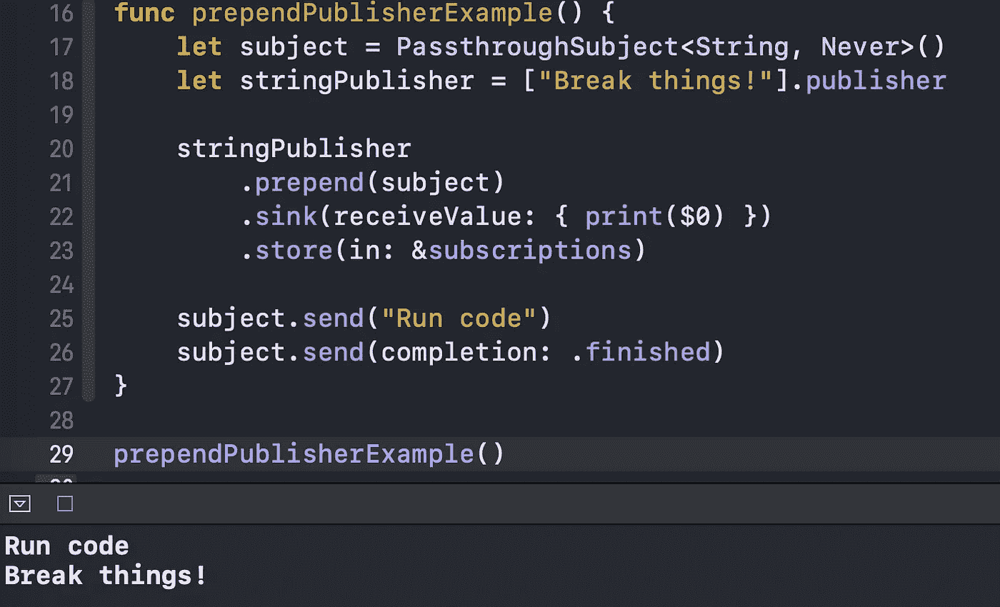
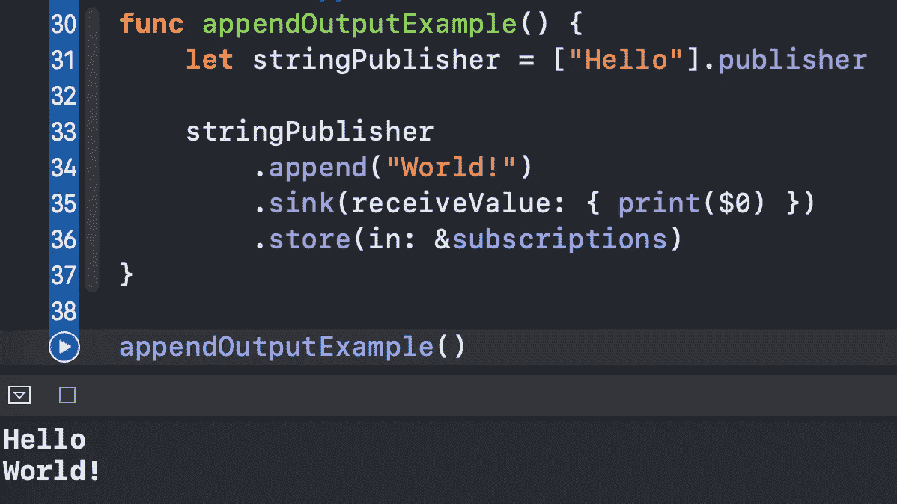
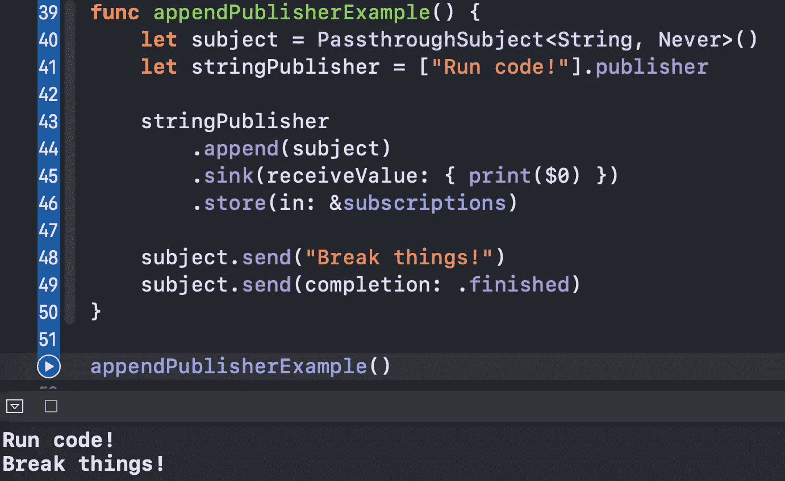
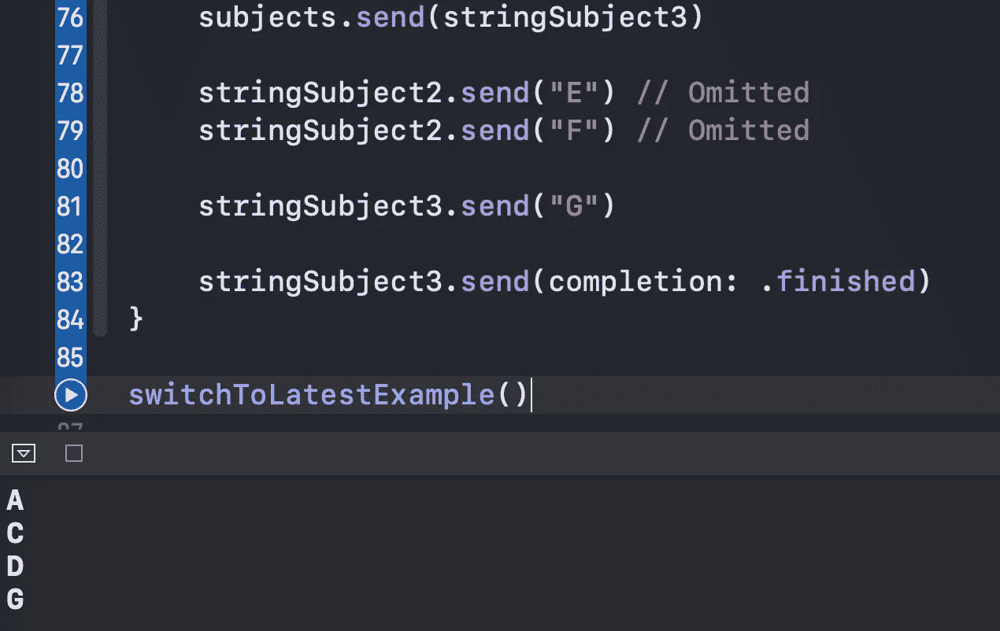
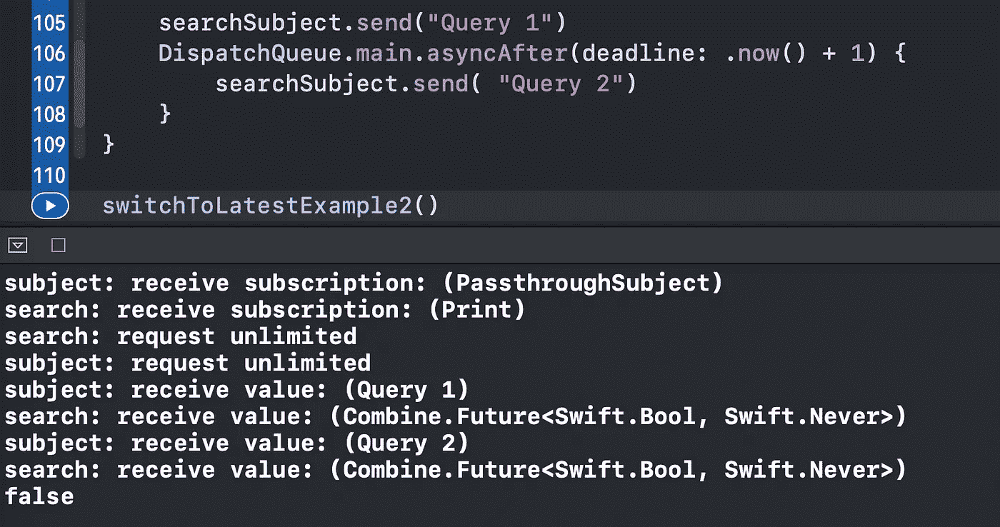
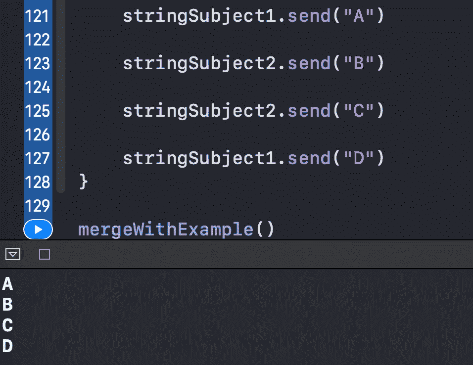
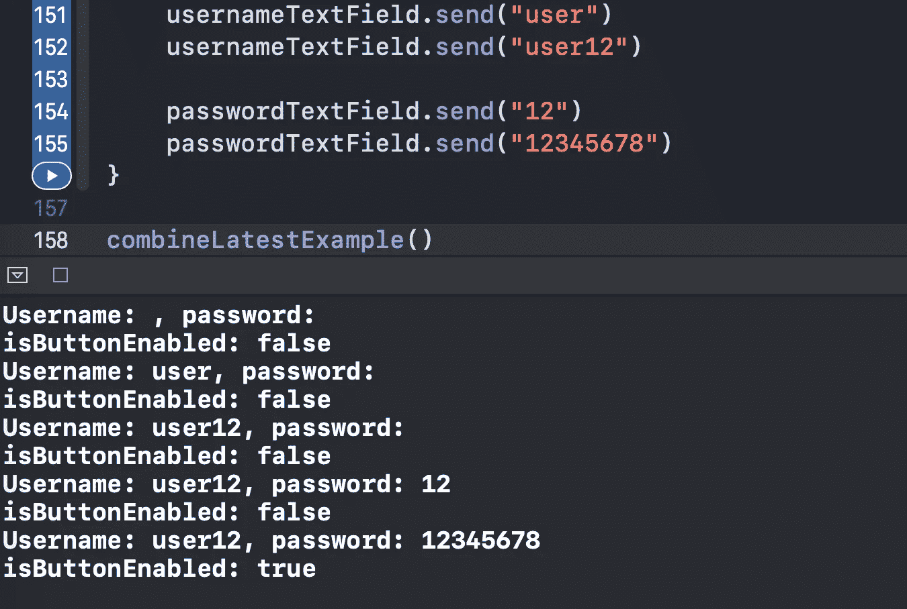
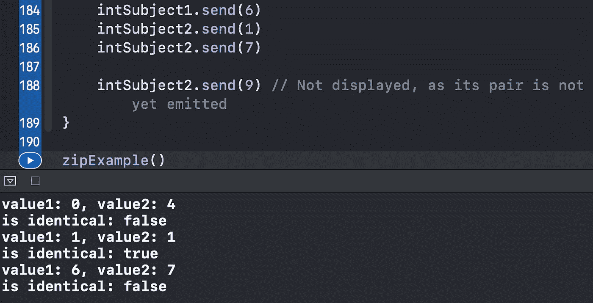

# 您应该从 Swift Combine 了解的 6 个合并运算符

> 原文：<https://betterprogramming.pub/6-combining-operators-you-should-know-from-swift-combine-17ea69d9dad7>

## 使用这些功能在您的 iOS 应用中做更多事情

照片由[韦斯·希克斯](https://unsplash.com/@sickhews?utm_source=medium&utm_medium=referral)在 [Unsplash](https://unsplash.com?utm_source=medium&utm_medium=referral) 上拍摄

在本文中，我们将探索 Combine 中六个方便的合并操作符。我们将通过在 Xcode 操场上快速试验每一个来做到这一点。

源代码可以在文章的底部找到。

事不宜迟，我们开始吧。

# 1.预先考虑

这组操作符允许我们将事件、值或其他发布者添加到源发布者之前:

结果是按顺序打印的`Hello`和`World!`:

现在让我们预先考虑另一个相同类型的发布者:

结果与前一个类似(注意，我们需要向主题发送一个`.finished`事件，以便`.prepend`操作符工作):

# 2.附加

`.append`操作符的工作方式类似于`.prepend`，但是在这种情况下，我们向源发布者添加值:

结果，我们看到控制台中打印出`Hello`和`World!`:

类似于我们之前如何预加另一个`Publisher`，我们也有相同的选项用于`.append`操作符:

# 3.switchToLatest

一个更复杂的操作符，`.switchToLatest`允许我们将一系列发布者整合成一个事件流:

下面是代码中发生的情况:

*   我们创建三个`PassthroughSubjects`来发送值。
*   我们创建主`PassthroughSubject`，它本身发出其他`PassthroughSubjects`。
*   我们将`stringSubject1`发送到主主题。
*   `stringSubject1`接收一个`A`值。
*   我们将`stringSubject2`发送到主主题，自动忽略`stringSubject1`的事件。
*   类似地，我们将值发送到`stringSubject2`，连接到`stringSubject3`，并向其发送一个完成事件。

结果，我们打印出了`A`、`C`、`D`和`G`:

让我们考虑一个现实世界的例子:您有一个搜索文本字段，用于检测一个项目是否可用。一旦用户输入了什么，我们就触发一个请求。我们的目标是，如果用户输入了新的值，则取消之前的请求:

为简单起见，`isAvailable`函数在延迟一段时间后返回一个随机的`Bool`值。

感谢`.switchToLatest`操作员，我们实现了我们想要的。只有一个`Bool`值被打印出来:

# 4.合并(与:)

我们使用`.merge(with:)`来组合两个`Publishers`，就好像我们只从一个接收值:

结果是元素的交错序列:

# 5.组合测试

`.combineLatest`操作符发布一个包含每个发布者的最新值的元组。

为了说明这一点，考虑下面的真实例子:我们有用户名和密码`UITextFields`以及一个允许我们继续的按钮。我们希望保持按钮禁用，直到用户名至少有五个字符长，密码至少有八个字符长。我们可以通过使用`.combineLatest`操作符轻松实现这一点:

当`usernameTextField`和`passwordTextField`相应地接收到`user12`和`12345678`时，条件满足，按钮被激活:

# 6.活力

`.zip`操作符从每个发布者传递一对对应的值。假设我们想要检测两个发布者是否发出相同的`Int`值:

我们从`intSubject1`和`intSubject2`得到以下对应值:

*   `0`和`4`
*   `1`和`1`
*   `6`和`7`

最后一个`9`值没有打印出来，因为`intSubject1`还没有发布其相应的值:

# 资源

源代码可以在[要点](https://gist.github.com/zafarivaev/64f48ec746996a0e76fe3b4a69a7e696)中找到。

# 包扎

对其他类型的联合运算符感兴趣吗？欢迎访问我的其他相关文章:

 [## 5 你应该知道的变换组合运算符

### 用清晰的例子

medium.com](https://medium.com/better-programming/5-transforming-combine-operators-you-should-know-4603fe112d74)  [## 你应该知道的 9 个过滤组合运算符

### 用清晰的例子

levelup.gitconnected.com](https://levelup.gitconnected.com/9-filtering-combine-operators-you-should-know-9c1ef2911352) 

感谢阅读！