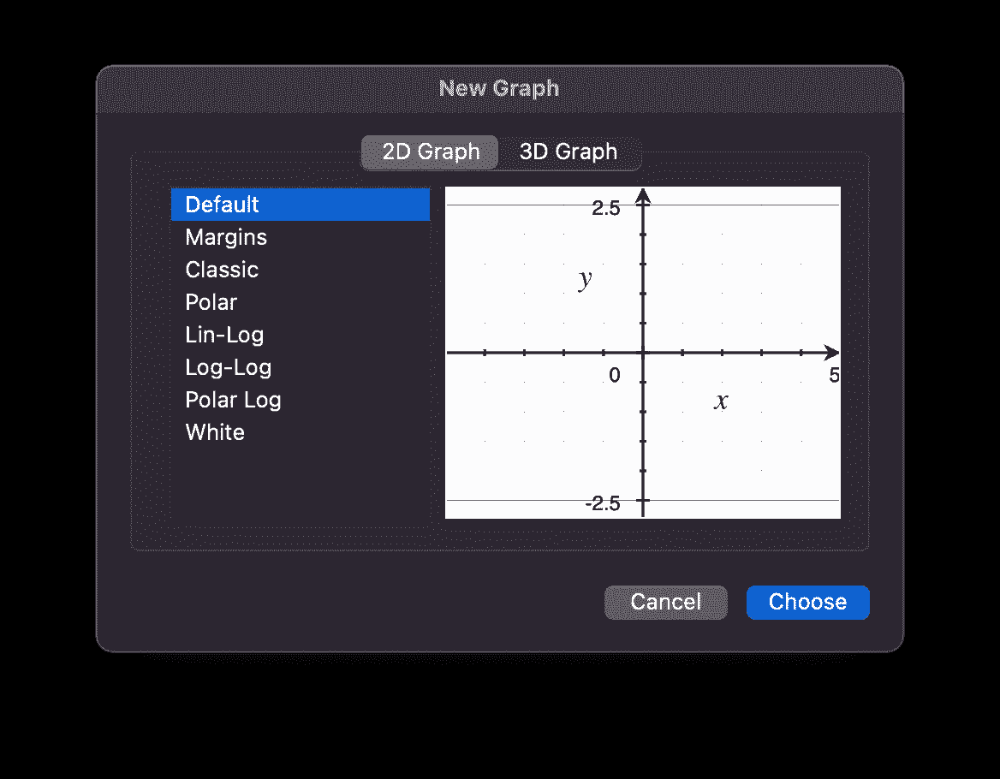
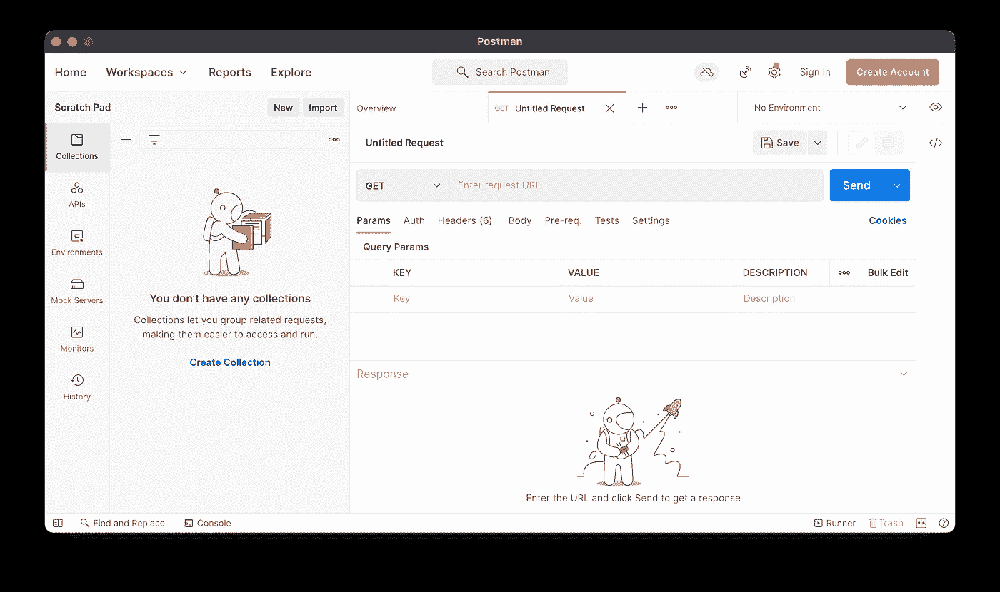
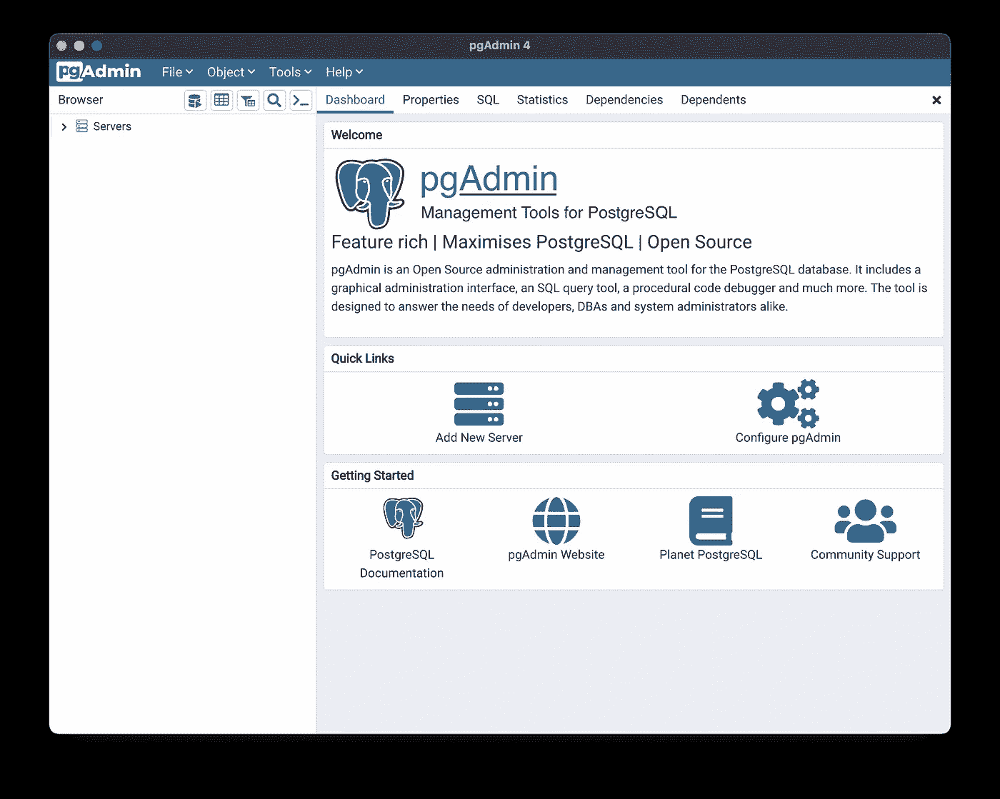
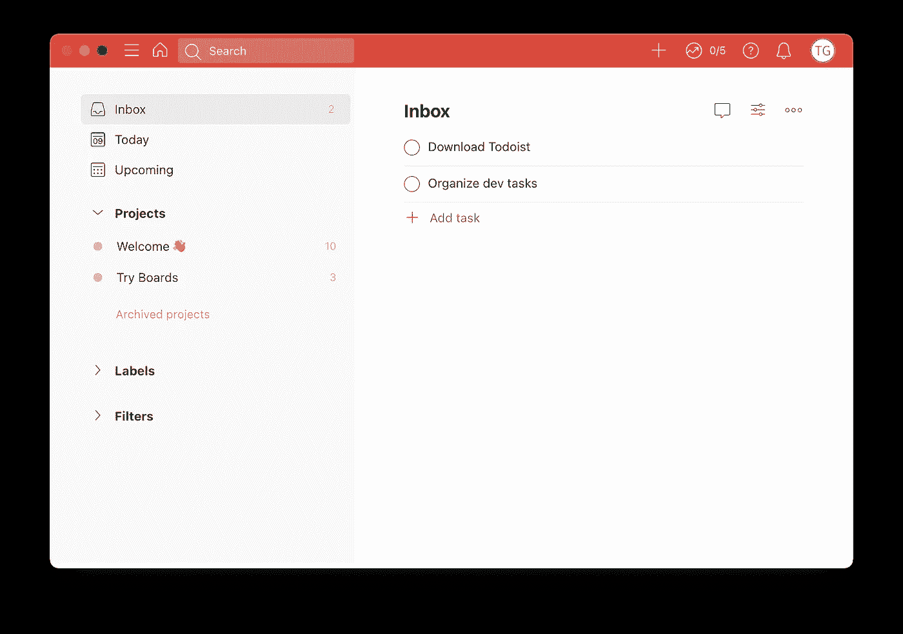

# 6 个非 ide 的 Mac 开发工具

> 原文：<https://betterprogramming.pub/6-developer-tools-for-mac-that-arent-ides-b1419ffec2c1>

## 处理各种软件工程任务的专用应用程序

丹-克里斯蒂安·pădureț在 [Unsplash](https://unsplash.com/s/photos/tools?utm_source=unsplash&utm_medium=referral&utm_content=creditCopyText) 上拍摄的照片

ide 很棒，但是在 Mac 上开发时，它们并不是你的武器库中唯一应该有的东西。如果您已经在 IDE 中生活了很长一段时间，那么现在是时候看看有哪些优秀的独立工具了。

这些工具执行一小部分面向特定任务的功能，但是它们做得非常好。即使你可以在你的 IDE 中增加大量的功能，它也很有可能不能做好每一件事。第三方插件只能做到这一步。

在本文中，我们将探索一些轻量级的独立应用程序，它们是任何开发人员工具箱中的绝佳补充。无论您是测试 API、构建固件还是绘制一些数据，这些应用程序对任何工作流程都是一个福音。让我们来看看。

# 1.Grapher

您已经安装了这个工具，并且您可能甚至不知道它。这个工具从 2005 年开始就和 macOS 捆绑在一起了，并且极其擅长一项工作。绘制方程式。

在 Grapher 中创建新图表。

正在处理一个涉及复杂数学的问题，并想快速查看图形？Grapher 是一个奇妙的内置选项。您甚至可以绘制一些 3D 选项，并将一些动画输出渲染到视频文件中。

要试用 [Grapher](https://en.wikipedia.org/wiki/Grapher) ，只需从应用程序菜单中找到它或使用 Spotlight 搜索它。

# 2.邮递员

如果您正在使用或构建 API，这是最方便的应用程序之一。Postman 让您可以手工定制各种 web 请求，并以多种方式操纵响应数据。多年来，Postman 已经发展成为一个功能极其丰富的应用程序，能够构建复杂的请求框架和健壮的测试套件。

用 Postman 创建新的 GET 请求。

使用 Postman，您可以快速创建标准的 GET 或 POST 请求来开始调查响应数据。您甚至可以添加简单的 JavaScript 片段，以便在触发请求之前执行。使用它，您可以获取变量，解析一些数据，等等。

Postman 维护了所有请求的非常详细的日志，因此您可以比以往任何时候都更容易地调整和排除故障。

从官网下载邮差[。](https://www.postman.com/downloads/)

# 3.告发人

每个人都对[家酿](https://brew.sh/)又爱又恨，但是其他的选择呢？MacPorts 已经存在很久了，而且相当容易使用，但是 Fink 是另一个有趣的(也是不太为人所知的)选择。

这个包管理器被设计成更接近 Linux 上可用的`apt`实用程序。事实上，使用 [Fink](https://github.com/fink/fink) 你可以在你的 Mac 上运行`apt-get`。

[finkproject.org](https://www.finkproject.org)

虽然 Fink 已经有 20 多年的历史了，但它仍然定期更新，并有一个像样的支持社区。然而，项目本身并不是最容易开始的。安装 Fink 还有待改进，对 macOS 最新版本的支持也尚未发布。

然而，Fink 是一个雄心勃勃的项目，它包含了 macOS 软件包管理器的大量功能。你可以在这里阅读更多关于 Fink 项目的信息。

# 4.蚀刻师

需要将图像闪存到 USB 驱动器上吗？Balena 的 [Etcher](https://www.balena.io/etcher/) 应用可以做到。它不仅可以闪存设备，而且可以做到有风格。蚀刻机的用户界面是华丽的，设计良好。界面流畅，闪烁状态的反馈清晰简洁。不再有丑陋、笨重的 90 年代风格的共享软件。

蚀刻机中的闪烁界面。

Etcher 还具有硬盘识别功能，可防止意外擦除外部硬盘上的重要数据。另一个奇妙的特性是自动数据验证。在每个闪存蚀刻机将验证数据实际上是正确写入设备。这确保了无论你将硬盘插入什么，都有机会读取它。

从 Balena 官网下载 Etcher [。](https://www.balena.io/etcher/)

# 5.pgAdmin

管理 PostgreSQL 实例不是一项简单的任务。有大量的配置供您使用，还有大量的指标需要关注。有了 pgAdmin，一些令人困惑的数据库问题被一个圆滑、详细且易于使用的界面解决了。

pgAdmin 4 用户界面。

使用 pgAdmin，您可以在一个仪表板上可视化地构建查询、调试复杂语句和管理 Postgres 性能。

pgAdmin 的众多好处之一是能够真正探索 Postgres 的结构。您可以直观地深入到模式中，看到所有的表都显示为一棵大树。

从官方资料库[下载 pgAdmin 4，此处有](https://www.pgadmin.org/download/pgadmin-4-macos/)。

# 6.Todoist

有十亿个待办事项列表应用程序。他们每个人都声称自己是最好的。每一个都有一些利基或整合，应该把他们从所有其他人。但是，如果你想要的只是一份坚如磐石的待办事项清单，而这份清单让你无路可走，那该怎么办呢？

即使你使用的是像吉拉这样的高级票务系统，有时你也需要一些更轻量级、更专注于你个人任务的东西。Todoist 是我发现的符合要求的最干净的清单应用程序之一。

Todoist 收件箱。

尽管能够设置复杂的过滤器、电路板和其他复杂的系统， [Todoist](https://todoist.com/) 让你想用多少就用多少。例如，除了收件箱，我很少使用其他东西。有时我会把任务放在其他日子，但实际上我想要的只是一个地方来存放当天的清单。

Todoist 没有充斥着广告，它不会不断地催促你去尝试新的高级功能，它只是一个优雅的待办事项列表应用。然而，有一些有趣的小奖励元素让它与众不同。Todoist 有一个调平系统；没错，就像一个 RPG。你列出的待办事项越多，你的排名就越靠前。这是一种新颖有趣的跟踪你工作效率的方式，尤其是和其他人相比(如果那是你的事情的话)。

在应用商店上查看[的 Mac 应用版本。此外，你也可以为你的手机下载 iOS 版本。](https://apps.apple.com/us/app/todoist-to-do-list-tasks/id585829637?mt=12)

*感谢阅读！我希望您发现这些应用程序足够有用，可以添加到您的日常工具包中。你最喜欢开发哪些独立的 Mac 应用程序？*