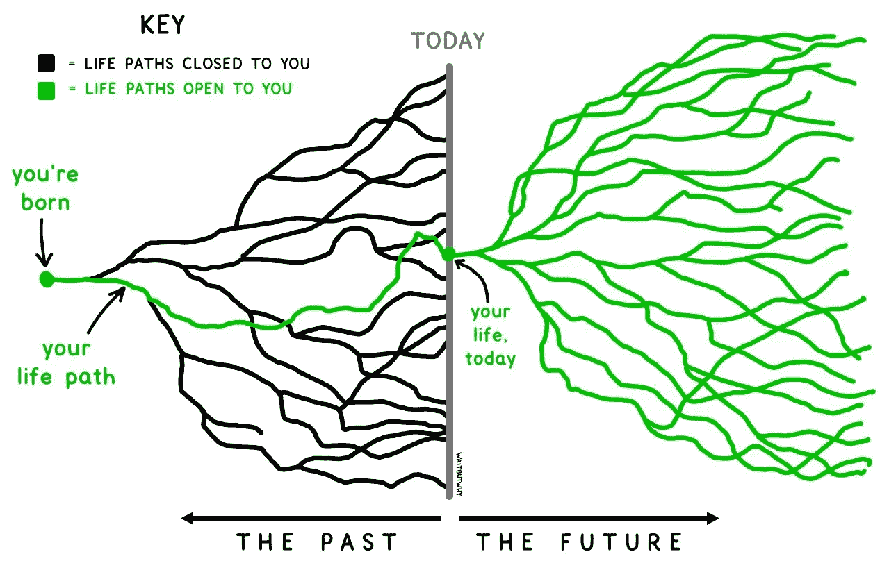
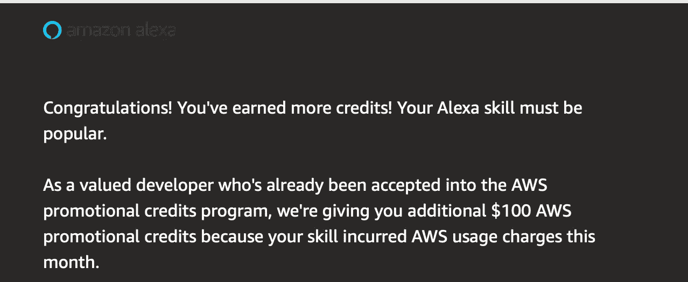
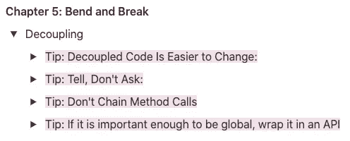
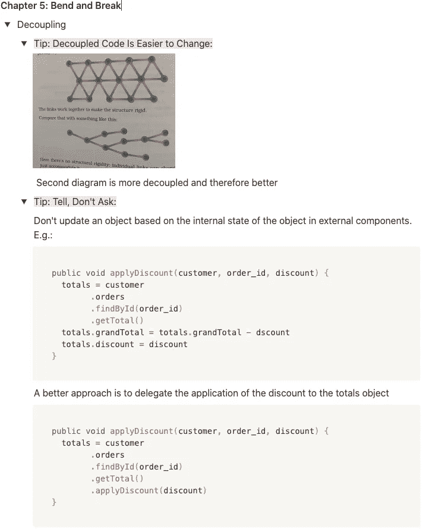

# 让我成为更好的软件工程师的 6 次经历

> 原文：<https://betterprogramming.pub/6-experiences-that-made-me-a-better-software-engineer-47d3ee3fdfce>

## 一个人可以走很多条路

蒂姆·厄本摄

每个工程师都有一套独特的技能。通往这些技能的道路因人而异，可以向任何方向发展。

在这篇文章中，我想强调使我成为一名更好的软件工程师的个人习惯，我如何获得我的技能，以及我应该做些什么。

我们将了解以下主题:

*   辅助项目
*   解决算法问题
*   教我表哥如何编码
*   开源编程
*   阅读书籍
*   挑战其他工程师的工作

# 辅助项目:亚马逊 Alexa 技能

我们都知道在大学期间有副业是有价值的。

大学的时候，我买了第一代 Alexa。我一点也不知道它会对我的生活产生重大影响。我发表了几个 [Alexa 技能](https://www.amazon.com/alexa-skills/b?ie=UTF8&node=13727921011)。这些兼职项目教会了我一些东西:

*   失败的能力
*   将一个项目从起点带到终点
*   任何人都可以爱上编码
*   为用户保持简单

## **失败的能力**

我的 Alexa 技能都不成功。我在这里和那里有一些用户，但这还不足以产生任何真正的影响或产生任何收入。

我在这些技能上投入了大量的时间和精力。意识到我的软件并没有我想象的那么好，我会产生一些怀疑。让我坚持下去的是我提高质量的意愿。

我在多年的时间里发表了几项技能。我的技能质量每次都在提高。回想起来，我认为每一项技能都是失败的。

然而，并非一切都是坏事。

我每月获得 100 美元 [AWS 促销积分](https://developer.amazon.com/en-US/alexa/alexa-skills-kit/new/aws-promotional-credits)。

促销积分包括我的 Alexa 技能的使用费。好的一面是，很有可能一项技能会招致这样的收费。更好的是，这些费用非常低(比如 3 美元)。

这意味着我有 97 美元可以花在其他 AWS 服务上。我正在运行一个带有 MySQL 数据库的弹性 Beanstalk 环境。这个服务器运行其他项目(例如一个[加密机器人](https://medium.com/coinmonks/how-to-implement-a-crypto-trading-bot-for-dummies-overview-b9511664ed74))和其他我喜欢在生活中自动化的任务。

AWS 促销积分

我实现了一个开源技能[电报连接](https://github.com/LorenzHW/Telegram-Connect)。即使我没有完成最后一步并在技能商店中发布，其他开发人员可能会发现它很有用。

## 将一个项目从起点带到终点

经历这个过程是一种很棒的感觉:

1.  在你的脑海中有一个想法
2.  用代码实现这个想法
3.  发布这个想法，接收反馈，看看用户如何与之互动

一旦达到第三点，那是一种非常满意和释然的感觉。

## 任何人都可以爱上编码

刚开始学计算机的时候没做过什么编码。在我学士学位的前两年，我只做了要求的最少量的编码。

一旦我开始学习 Alexa 技能，我就爱上了编码。进入“状态”，忘记周围的一切，这种感觉太棒了。或者当你意识到你比以前更快地理解概念时。或者当你最终解决了一个困扰你的问题。

## 为用户保持简单

我的第一个技能有很多不好的评价。问题是我没有保持可用性足够简单。我对用户的技术知识做了太多的假设。我应该做的唯一假设是，典型用户没有技术知识。

一开始，我对谁留差评都很生气。然后我学会了接受不好的反馈，并努力在下次做得更好。

这不是用户的错，因为用户不明白如何利用已建成的东西。是我的错，因为我没有把它说得足够简单。

对我来说，这意味着仔细阅读[谷歌](https://developers.google.com/assistant/conversation-design/welcome)和[亚马逊](https://developer.amazon.com/en-US/docs/alexa/alexa-design/get-started.html)的语音设计文档，并应用最佳实践。

# 解决算法问题

我们知道，如今顶级科技公司的面试过程非常特殊。然而，我真的相信解决 LeetCode 风格的问题会大大提高你的技术能力。我在这里写了一篇关于这个特定话题的博客文章。

# 教我表哥如何编码

我的表弟最近开始学习计算机科学。当他在编程任务中遇到问题时，他会向我寻求帮助。一开始，我有点恼火，因为和他进行这些一对一的谈话要花费很多时间。我意识到，教他对我也有一些积极的影响。

我必须用简单的方式解释最简单的编程概念。刚开始的时候，我不太擅长那个，因为技术人员很难用一种简单的方式向非技术人员解释技术概念。

在与商务人士交流时，我将其中一些沟通技巧直接运用到了我的工作中。

看到有人因为你的教导而成功并提高了他们的技能，这是一个令人满足的时刻。

老实说，这并不容易。一开始，我非常怀疑他是否会成为一名软件工程师。我不得不多次解释最简单的概念。尽管时不时地，他会给我一些我没想到的惊喜，这让我少了一些怀疑。

当我们开始一起工作时，我为他做了很多编码工作(由于时间限制)。在我完成之后，我们一行一行地检查代码。我知道这不是他正确学习编码的正确方法。他需要自己打字；否则，他不会明白代码是如何工作的。

当我们改变工作方法时，他的技能提高了。我在谷歌文档中解释了他的问题解决方案的高级概念，然后我看着他一行一行地编写代码。是的…一行一行的。这极大地考验了我的耐心，因为他写一行代码所需的时间对我来说已经足够编写整个函数了。

然而，我们的新工作方法有一些巨大的长期利益。在某些时候，我不需要看着他一行一行地编写代码。我只是给了他解决方案的高层次概念，他会自己执行。

# 开源编程

2019 年参加[谷歌代码之夏](https://levelup.gitconnected.com/6-useful-things-i-learned-from-gsoc-1738c7471a90)学到了一吨！我实现了开源工具 [gnostic-grpc](https://github.com/google/gnostic-grpc) ，它将 OpenAPI 描述转换成协议缓冲文件，该文件可以被 [gRPC](https://grpc.io/docs/what-is-grpc/introduction/) 用作接口定义文件。

像这样的项目的好处是它们迫使你跳出框框思考。这不是典型的 REST 应用程序，在那里有一个端点，然后移动一些数据。

感觉更像是研发而不仅仅是开发。

另一个很好的方面是你的代码得到了彻底的审查，尤其是如果你为谷歌的开源项目做贡献的话。看看我在 GSoC 期间的[拉动请求](https://levelup.gitconnected.com/6-useful-things-i-learned-from-gsoc-1738c7471a90)。他们都有很多关于代码质量的建议。

进入 GSoC 的最好方法是申请不出名的组织——因为这样竞争就少了。

另一个进入开源编程的好方法是浏览[组织](https://summerofcode.withgoogle.com/organizations/) [s](https://summerofcode.withgoogle.com/organizations/) 的“想法列表”,然后联系负责人。即使谷歌代码之夏没有进行。

如果你想开始为诺斯替做贡献，你可以看看[这一期](https://github.com/google/gnostic/issues/243)。目标是让 gnostic 可用于[异步 API 描述](https://www.asyncapi.com/)。

如今，我从招聘人员那里收到很多信息，他们对我在 gRPC 的工作感兴趣。在我找工作的过程中，这总是我的面试官喜欢谈论的话题之一。

有时我后悔没有在开源编程上投入更多的时间，因为这对我的技能和职业生涯的影响是巨大的，甚至可能更大。

# 阅读书籍

每个软件工程师都需要阅读几本书。干净的代码对我的编码风格和对结构化代码的理解产生了巨大的影响。目前在读[实用程序员](https://www.amazon.com/gp/product/0135957052)。

对我来说，最困难的部分是在现实世界中应用书中的建议。我经常会忘记我读过的东西。我仍在试图找出防止这种情况发生的最佳方法。

就我个人而言，我是一个非常重复的学习者。这意味着我需要重读信息或应用新概念至少十次；否则我的大脑不会记得。

当我读书的时候，我试着边读边记笔记。因此我的阅读速度很慢，但我能理解更多的信息。

我使用[概念](https://www.notion.so/)做笔记。我仍在提高我的笔记技巧。然而，我开始喜欢上了 opinion 的切换列表功能。

切换列表列表

两个切换列表展开了

切换列表功能很棒，因为当所有东西都关闭时，我的笔记非常清晰。它帮助我快速找到信息。

我试着用我自己的话来写所有的笔记，因为这样我会更好地记住它们。

熟能生巧。我写的笔记越多，我就能更好更快地提取有用的信息。

# 挑战其他工程师的工作

我读到很多工程师在开始工作时都患有骗子综合症。我从来没有过。在过去的几年里，我对自己作为一名工程师的能力有了非常自信的态度。

然而，这也有一些缺点。在我的第一次绩效评估后，我得到的反馈是“我应该让其他工程师更多地挑战我的工作。”这意味着在实现一个复杂的特性之前，我应该向其他工程师描述我的方法，看看他们会如何解决这个问题。

在过去的几个月里，我试着遵循这个建议。事实上，观察其他工程师如何解决问题是非常有趣的。然而，需要做出权衡。和其他工程师讨论任何事情都要花费很多时间。因此，如果我确信我的方法是好的，我会凭直觉去实施它。

独立工作是软件工程师最重要的技能。我不会因为细节而惹恼其他工程师。我更喜欢讨论更大的概念和想法，并在遇到困难时伸出援手。

# 回想起来:我应该做些什么不同的事情

我对自己的软件工程技能非常满意，但我认为有几件事我可以做得更好。

我花了很多时间在 Alexa 技能编程上。尽管我学到了很多，但我投入了太多的时间。我应该早点把注意力转移到其他话题上，比如开源编程。主要是因为我没学到多少东西，而且我受到的影响也很小。

另一点是，我应该尽早阅读软件工程文献的经典，因为它们塑造了你编写代码的方式。