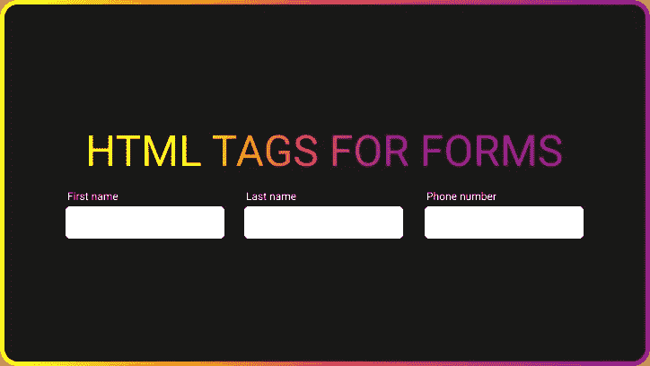
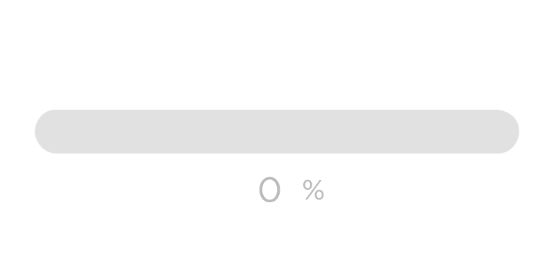
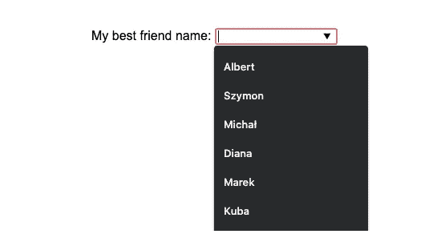

# 6 个你可能不知道的与表单相关的 HTML 标签

> 原文：<https://betterprogramming.pub/6-form-related-html-tags-you-might-not-know-about-e477439d0c47>

## HTML5 增加了很多新标签。让我们来发现一些你可能不知道的

作者照片。

HTML5 在 2014 年实现了 W3C 推荐，增加了很多新标签。其中一些，如`<main>`、`<nav>`、`<header>`或`<footer>`，是常用的`
`的语义替换。每个人都在谈论这些标签，但是有许多不同的和不太为人所知的标签。在今天的文章中，让我们来发现六个你可能不知道的与表单相关的 HTML 元素。

# 1.进度条

如何快速原型化多个用例的进度条？作者史蒂文·道格拉斯。

当您创建一个表单并且有一个文件上传输入时，您应该显示文件已经上传了多少。这是一个很大的 UX(用户体验)改进。您的第一个想法可能是“我将创建一个`div`并在进度变化时制作背景动画。”

这没关系。但是我们有一个特殊的 HTML 标签来显示进度指示器！`<progress>`添加了其他 HTML5 元素。让我们来看看:

正如你所看到的，有一个简单的基本 CSS 布局。此外，还有一些 JavaScript 代码来伪造文件上传。在`<input type='file' />`更改时，我在`setInterval`中初始化一个假的进度函数。五秒钟后，我们的假上传完成，我们有一个“成功”的文本。这是`<progress>`标签最简单的用法。

你可以在 [CSS-Tricks](https://css-tricks.com/html5-progress-element/) 上阅读更多关于样式`<progress>`的内容。

## 独特的属性

该元素包括两个属性:

*   `max` —此属性指定任务总共需要多少工时。如果`max`属性存在，则其值必须大于`0`。默认值为`1`。
*   `value` —此属性指定任务已经完成了多少。

# 2.数据列表

创建`<datalist>`元素是为了用作输入的推荐列表。您可以选择可用选项或键入自己的答案。浏览器使用这个元素来提供自动完成功能。

`<datalist>`是你输入的隐形帮手。你可以动态地给它添加选项，使它对你的应用程序的每个用户都是个性化的。

关于`<datalist>`，您需要记住的唯一一件事就是它的 ID 必须等于输入元素的 list 属性。这使得浏览器知道这个`<datalist>`属于`<input>`。

# 3 & 4.字段集和图例

`<fieldset>`元素将几个输入组合在一个表单中，`<legend>`元素将相关的元素组合在一起。把它想成是一个`<label>`，但是不止一个元素。

这两个元素可以一起使用，对表单的一部分进行分组(`<fieldset>`)并为其添加一个全局标签(`<legend>`)。

# 5.输出

元素是我最喜欢的鲜为人知的 HTML 标签之一。这个元素可以注入用户计算的结果。

在我的例子中，我们有两个输入类型号和一个类型范围。数学模式看起来是这样的: *(a * b) + c = d* 。

# 6.Optgroup

这个 HTML 标签允许我们分组选择选项。例如，如果您选择了一个国家，您可以按洲对其进行分组。

# 结论

感谢阅读！今天到此为止。在下一篇文章中，我将讲述其他鲜为人知的 HTML 标签。

*原载于*[*https://www.albertwalicki.com*](https://www.albertwalicki.com/6-form-related-HTML-tags-you-might-not-know)*。*