# 发现学习编程语言的最佳免费在线书籍和资源

> 原文：<https://betterprogramming.pub/6-free-online-books-and-resources-that-cover-most-programming-languages-d85980be671d>

## 找到免费的书籍，小抄，策划列表和资源


[丹尼尔](https://unsplash.com/@setbydaniel?utm_source=medium&utm_medium=referral)在 [Unsplash](https://unsplash.com?utm_source=medium&utm_medium=referral) 上的照片

[更新时间 2021 年 4 月 22 日]

# 介绍

有组织的列表帮助你导航你的编程学习。书籍是深入学习任何编程语言的绝佳途径。备忘单是搜索汇总信息的一种简单方法。在本文中，您将找到针对您的目标编程语言的资源。

# 1.守门员

[守门员](https://goalkicker.com/)创造了 48 本编程笔记和书籍。有些书有 400 多页。所有的书都是 PDF 格式的，可以免费下载。

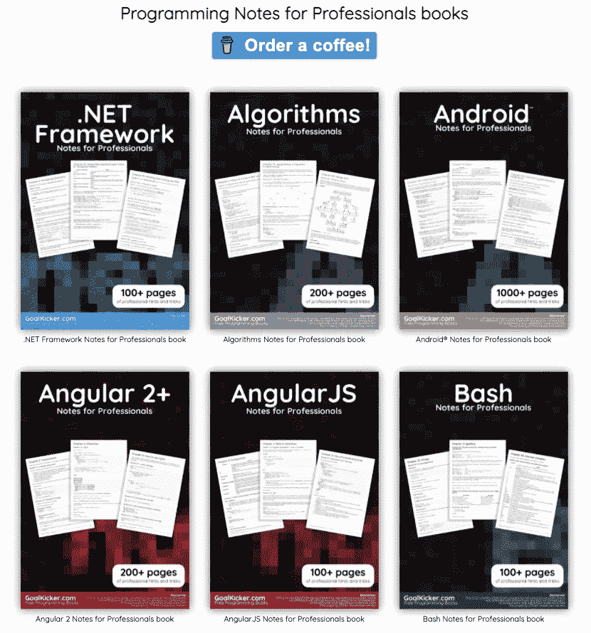

图片来源:[Goalkicker.com](https://goalkicker.com/)

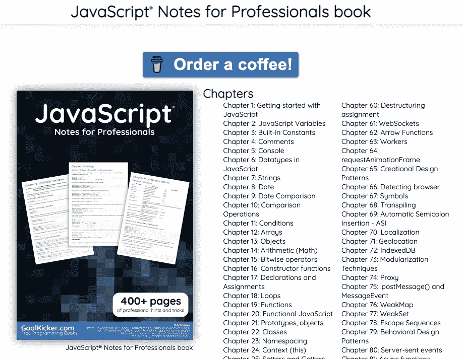

[Goalkicker.com 专业人士 JavaScript 笔记](https://goalkicker.com/JavaScriptBook/)有 400 多页。

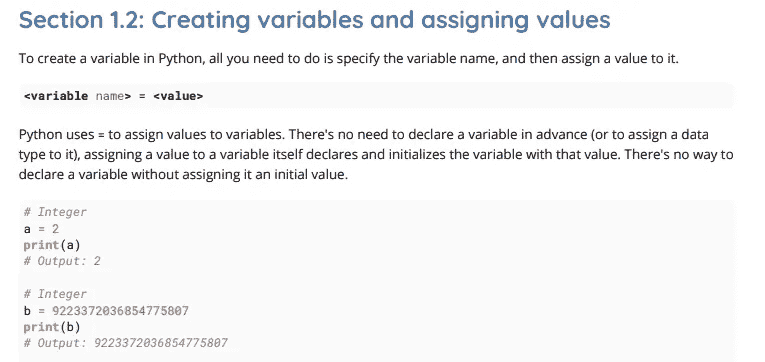

[面向专业人士的 Python 笔记](https://goalkicker.com/PythonBook/)有 800 多页。

# 2.电子书基金会

电子书基金会已经策划了一份英语和 30 多种其他语言的免费编程书籍清单。该列表包含 3000 本免费编程书籍和其他免费编程资源。这些列表由社区维护。

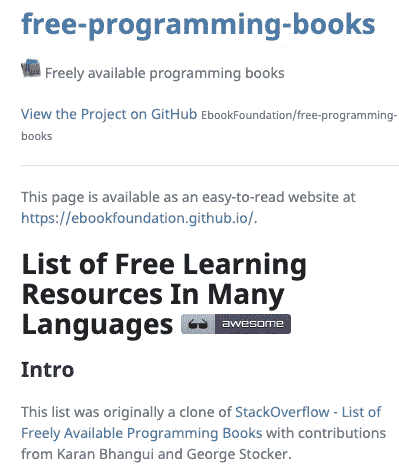

来自[电子书基金会](https://ebookfoundation.github.io/free-programming-books/)的截图

[英文页面](https://github.com/EbookFoundation/free-programming-books/blob/master/books/free-programming-books.md)包含超过 140 种编程语言和工具。

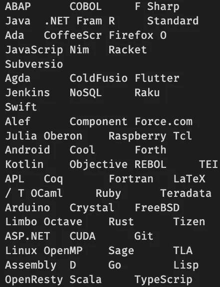

电子书基金会列出的部分编程语言(图片由作者提供)

类别包括:

*   编程语言
*   人工智能
*   云计算
*   计算机科学
*   机器学习

这些链接将带你到网上的 HTML 书籍，PDF 书籍，或者到策划列表的链接。

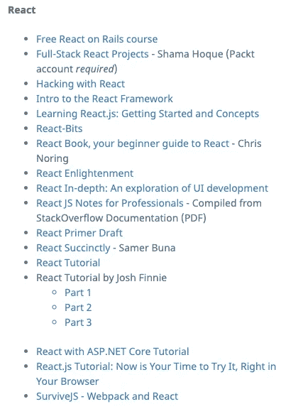

React 资源来自[电子书基金会](https://ebookfoundation.github.io/free-programming-books/books/free-programming-books.html#react)

# 3.DuckDuckGo 备忘单

搜索引擎 [DuckDuckGo](https://duckduckgo.com/) 提供了一个叫做[即时回答](https://help.duckduckgo.com/duckduckgo-help-pages/features/instant-answers-and-other-features/)的 API。程序员最大的收获之一就是备忘单搜索。你可以搜索大部分的编程语言备忘单。您需要单击底部的加号图标来展开工作表。

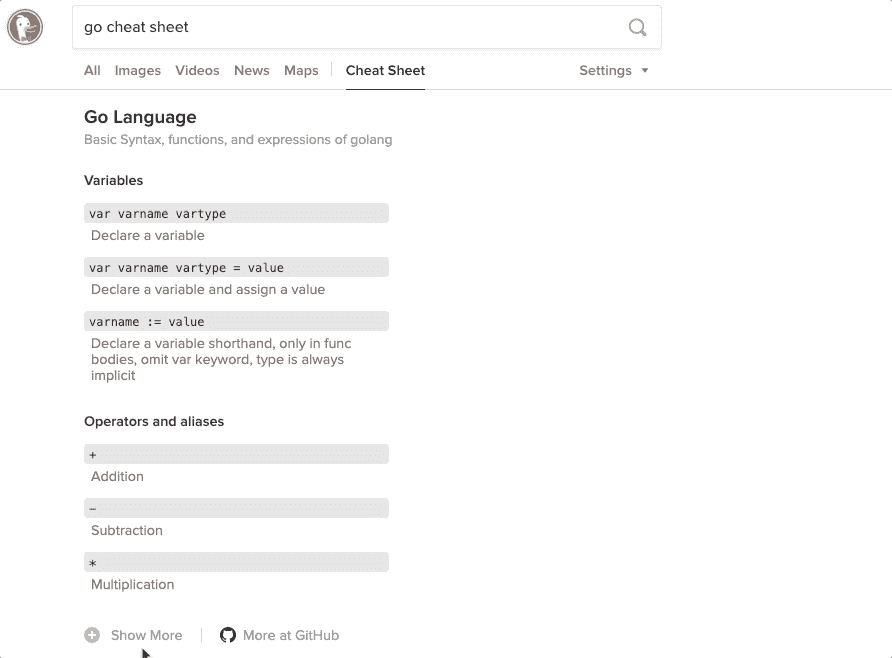

搜索“css border”会在搜索结果的右侧显示信息。

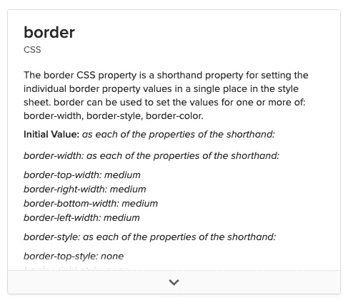

**额外提示:**你可以运行一个 [figlet 命令](https://towardsdatascience.com/the-ultimate-guide-to-your-terminal-makeover-e11f9b87ac99#0918)。

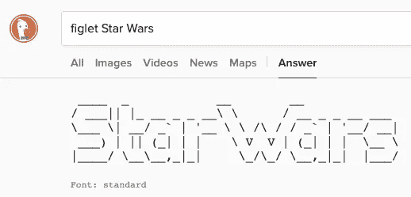

# 4.基本编程书籍

Stack Overflow 的几个程序员在 Stack Overflow 文档项目下编写了 32 本编程书籍。即使该项目于 2017 年 8 月结束，但许多内容仍然有效，仍然活着。

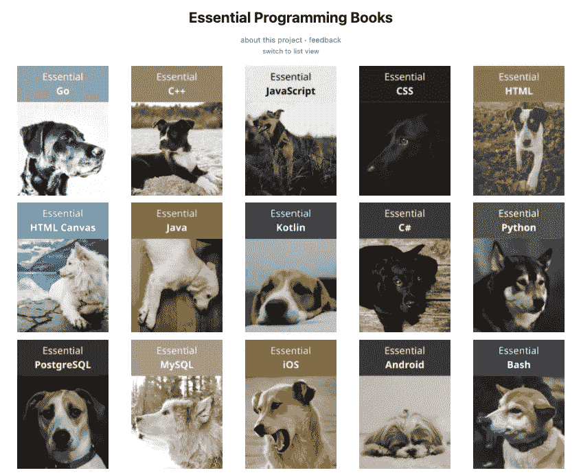

摘自[基本编程书籍](https://www.programming-books.io/index-grid)

书由例带动，文章环环相扣。

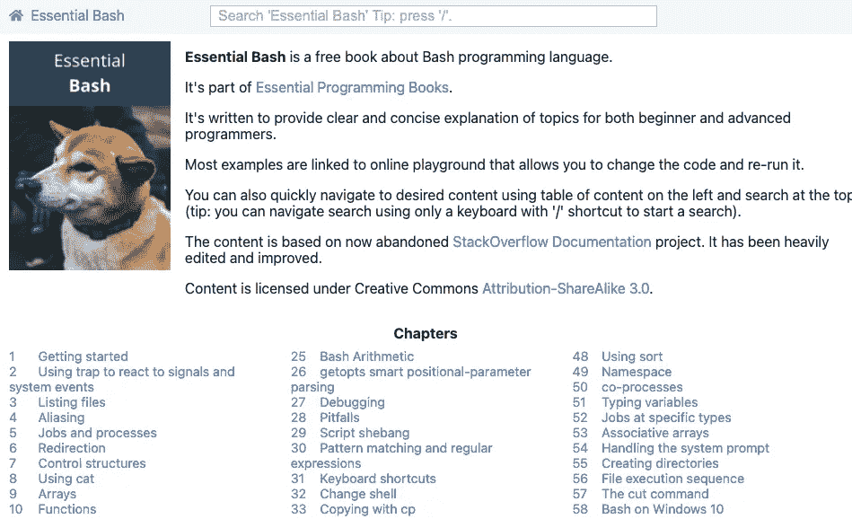

基本编程书籍中的一个 Bash 编程语言[的例子](https://essential-bash.programming-books.io/)

该格式是一本在线书籍，一些代码示例有一个“在线试用”链接。

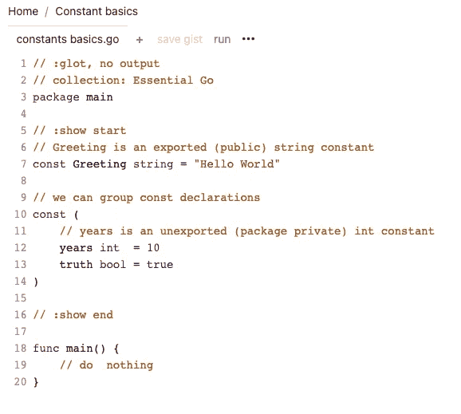

[转到](https://www.codeeval.dev/gist/26ed4afc610949390fcd2efab4326110)示例“在线试用”链接

# 5.令人敬畏的名单

GitHub 有一个主题页面叫做[牛逼列表](https://github.com/topics/awesome)。在这里，您可以找到所有内容的精选列表，包括编程语言。有 4000 多个列表可供选择。

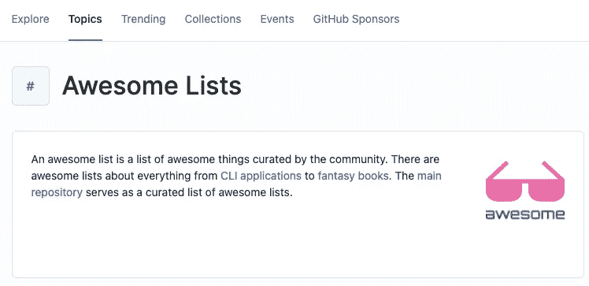

[GitHub 牛逼排行榜](https://github.com/topics/awesome)

该网站包括编程语言、课程、操作系统应用、框架、ML、AI、图像、插件等等。

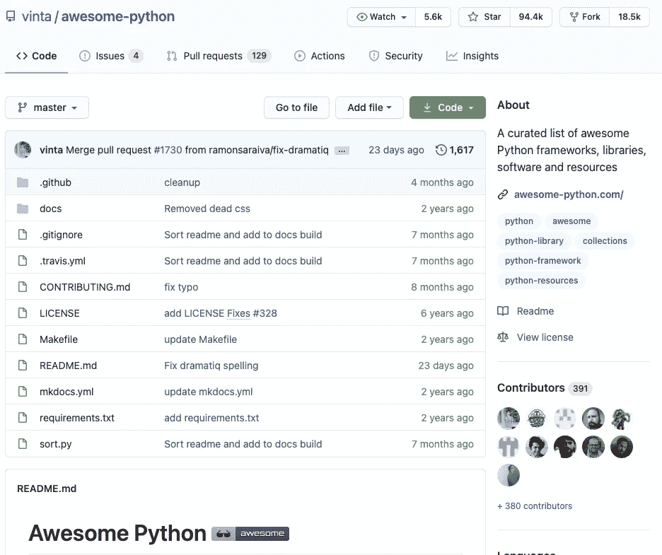

[牛逼的例子之一——python](https://github.com/vinta/awesome-python)(图片作者)

# 6.作弊. sh

Cheat.sh 是一个不需要安装的备忘单工具。您使用`curl`命令从您的终端找到一个备忘单。它涵盖了 56 种编程语言。sh 是一个社区驱动的备忘单，你可以从你的终端访问它。

```
$ curl sheat.sh/ls
$ curl cht.sh/go/Pointers
$ curl cht.sh/scala/Functions
$ curl cht.sh/python/lambda
$ curl cht.sh/go/reverse+a+list
$ curl cht.sh/python/random+list+elements
$ curl cht.sh/js/parse+json
$ curl cht.sh/lua/merge+tables
$ curl cht.sh/clojure/variadic+function
```

您可以为您的终端创建一个别名:

```
# zshrc
# usage cheat ls
cheat() {
  curl cht.sh/"$1" | less
}
```

# 7.媒介上的实用程序员书籍

它不是严格意义上的免费，因为你需要成为一个中等会员才能阅读实用主义书架的书籍。

[务实书架出版](https://medium.com/pragmatic-programmers)在 Medium 平台上增加了一百多本编程书籍。

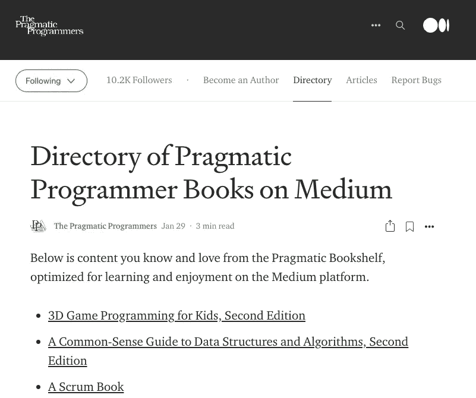

截屏来自 Medium 上的实用程序员书籍。

书籍经过优化，每章都有一个到目录、上一章和下一章的链接。


每个页面都有便于导航的链接。

# 8.奥赖利·卡塔科达


O'Reilly Katacoda 主页截图。

如果你喜欢互动学习，奥莱利有超过 20 门课程，涵盖 Docker，Kubernetes，机器学习，Linux，Networking，Tensorflow，Java，。NET 等等。

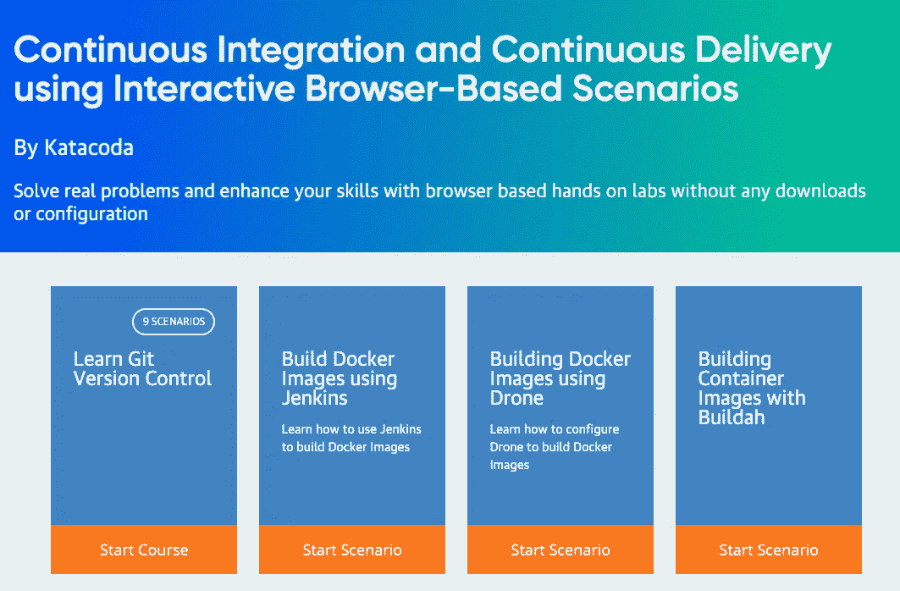

卡塔柯达的课程之一。作者截图。

所有课程都是基于终端的，您将通过解决任务来学习。

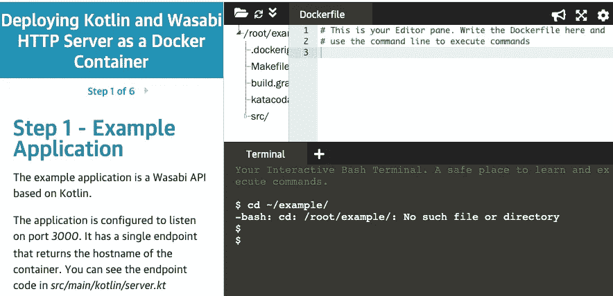

你用一个终端来学习。作者截图。

# 结论

我希望你能从这些列表中找到新的资源来探索。DuckDuckGo 是一种快速查找小抄的方法。Awesome Lists 提供了您可以深入研究的所有必要资源。电子书基金会包含由社区维护的免费书籍列表。基本编程书籍是 Stack Overflow 运行的另一个社区成果。Goalkicker 提供了 48 本编程 PDF 书籍。您可以使用 Cheat.sh 从您的终端访问最好的社区驱动的备忘单。

**通过** [**成为**](https://blog.codewithshin.com/membership) **会员，可以完全访问媒体上的每一个故事。**


[https://blog.codewithshin.com/subscribe](https://blog.codewithshin.com/subscribe)