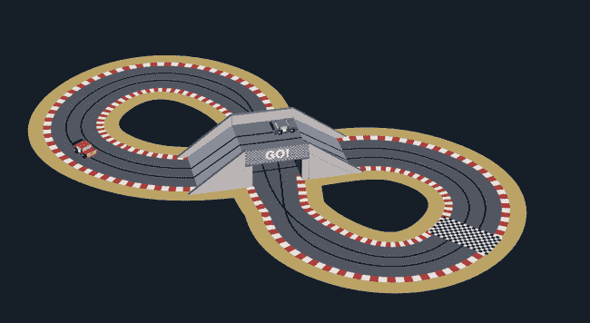
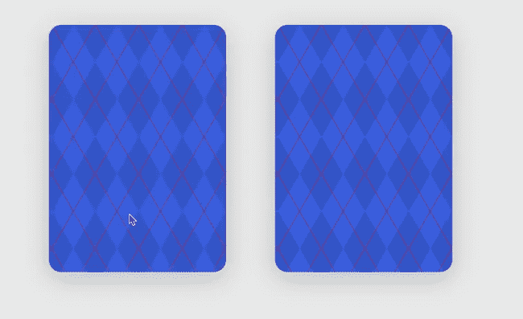
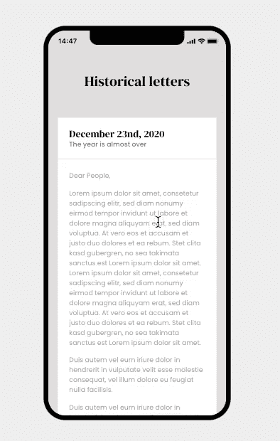
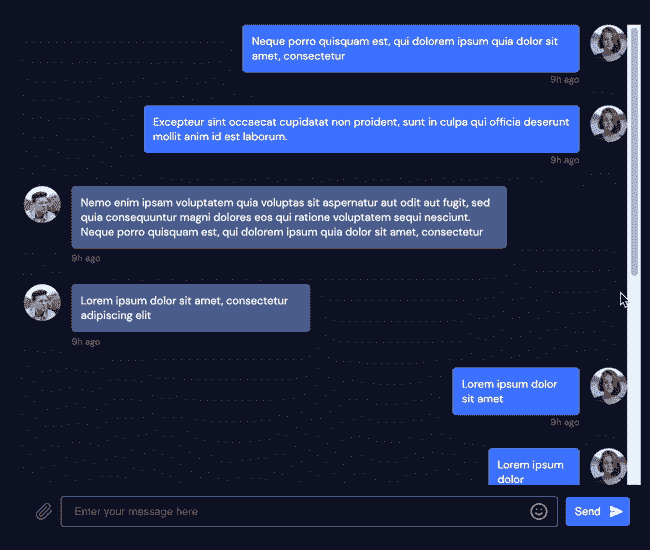
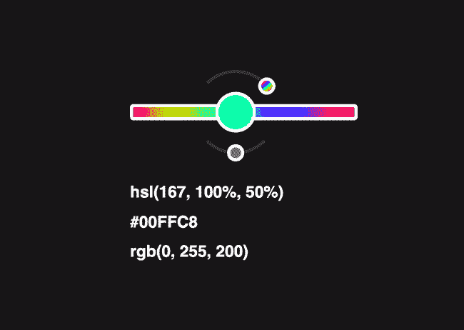

# 6 个前端编码想法会让你对编码充满热情

> 原文：<https://betterprogramming.pub/6-front-end-coding-ideas-that-will-get-you-fired-up-to-code-d084a1e6a4a8>

## 这里有一点编码灵感

约书亚·阿拉贡在 [Unsplash](https://unsplash.com?utm_source=medium&utm_medium=referral) 上拍摄的照片。

掌握编程包括投入*吨*的工作。你将不得不尽可能频繁地编码，以达到精通的程度。有些人是天生的——我不是其中之一——但即使是天才也需要付出努力。

事不宜迟，下面是今天的编码思路。把每一个都作为灵感的来源。选择一些让你对编码感兴趣的事情，然后继续做下去。

使用你喜欢的任何工具或编程语言。我还会包括你通过建立每个想法将会学到什么。

# 1.移动汽车的动画赛道

这是一条有两辆车环绕的赛道。它是用 HTML、CSS 和 SVG 构建的。

"[CS)scale xtrix😎🚗](https://codepen.io/jh3y/pen/eYdGrMW)”——作者 [Jhey](https://codepen.io/jh3y) 。

## 你将从建造动画赛道中学到什么

*   循环循环循环循环。你需要重新计算大量的图形。
*   HTML、CSS 和 JavaScript。
*   如何使用 SVG，CSS 动画，以及两者的结合。

# 2.可点击的法国卡片

这些可点击的法语卡片有两种状态:隐藏和可见。每次你隐藏卡片，它会产生一个随机的新值。

[“CSS 随机卡](https://codepen.io/Adir-SL/pen/RwRMPwR)”—由 [Adir](https://codepen.io/Adir-SL)

## 通过制作可点击的法语卡片，你将学到什么

*   事件监听器——每次你点击卡片，都会有事情发生。你需要用 JavaScript 或 CSS 来连接这个卡。
*   HTML、CSS 和 JavaScript。
*   如何跟踪每张卡的状态并为该卡生成一个新值。

# 3.滚动字母

当你向下滚动时，这封信会被包起来。当你向上滚动时，信会再次打开。

[“滚动字母](https://codepen.io/aaroniker/pen/BaLwKJR)”——作者[亚伦·伊克尔](https://codepen.io/aaroniker)

## 通过构建动画滚动字母，您将学到什么

*   使用鼠标滚动事件侦听器。每当用户滚动时，折叠字母，反之亦然。
*   当用户在页面上滚动时，如何迭代循环和重新计算图形。
*   让应用程序在更小的屏幕上运行(例如手机或平板电脑)。

# 4.自定义单选按钮

这些是一些看起来很漂亮的自定义单选按钮！

[“自定义单选按钮](https://codepen.io/Metty/pen/MWjOavR)”—作者[梅蒂](https://codepen.io/Metty)

## 通过构建自定义单选按钮，您将学到什么

*   使用 HTML 和 CSS。
*   编写语义正确的 HTML 表单。
*   使用表单并创建自定义输入和单选按钮。查看[来源](https://codepen.io/Metty/pen/MWjOavR)获取灵感或指示。

# 5.快速聊天克隆

Quickchat 是一个黑暗主题和干净外观的聊天室。想知道如何建立一个聊天室吗？你的机会来了！

" [Quickchat UI 主题](https://codepen.io/aybukeceylan/pen/jOMazYe) " —作者 [Aybüke Ceylan](https://codepen.io/aybukeceylan)

## 通过构建快速聊天克隆，您将学到什么

*   简洁现代的用户界面设计原则。
*   如何写出高质量的 HTML 和 CSS？

# 6.HSL 滑块

HSL 滑块是一个可以左右拖动的滑块。它根据开关的位置改变颜色。

请注意如何启用渐变和更改颜色的深度。

[“反应 HSL 滑块](https://codepen.io/jh3y/pen/gOwegKr)”—作者 [Jhey](https://codepen.io/jh3y)

## 通过构建 HSL 滑块，您将学到什么

*   当用户拖动滑块时，重新计算图形和颜色。不要忘记渐变和色深控制器！
*   如何使用 HSL、RGB 和十六进制代码？

# 结论

[**P.S:寻找更多编码思路？永远不要耗尽编码的想法，永远不要。在这里访问我提出的一系列前端挑战。**](https://gumroad.com/l/IuqKc)

感谢阅读和快乐编码！