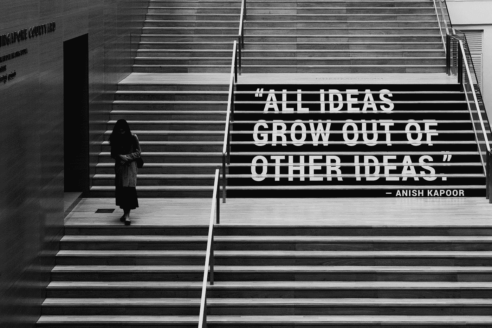
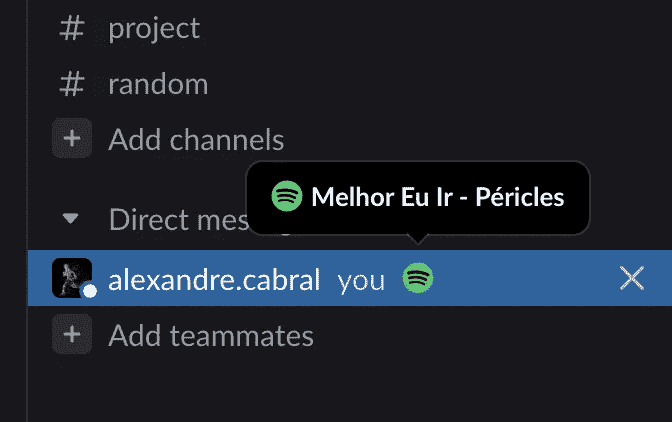
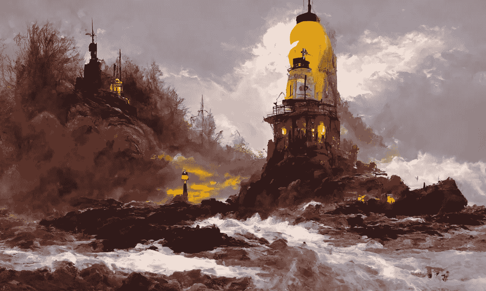

# 本周，我们最新的创作者带来了 6 个有趣的编码项目

> 原文：<https://betterprogramming.pub/6-fun-coding-projects-by-our-newest-creators-this-week-f152a8c1a4ab>

## 第 40 版咖啡字节，由更好的编程通讯

[CJ Dayrit](https://unsplash.com/@cjred?utm_source=medium&utm_medium=referral) 在 [Unsplash](https://unsplash.com?utm_source=medium&utm_medium=referral) 上的照片

在本期《咖啡字节》中，我们发现了一个创意项目的宝库，所以让我们开始吧。

# [用 Python 制作 NBA 集锦](https://medium.com/better-programming/automatically-creating-nba-highlights-in-5-minutes-7f90bfedd775)

新媒体作家诺姆·埃夫拉特经常错过 NBA 比赛，因为比赛发生在凌晨。如果你也在努力跟上完整的游戏，这个有趣的项目值得你花时间。他向我们介绍了一个教程，通过使用开源计算机视觉模型从视频帧中跟踪时钟时间来自动创建高光的过程。

# [对漫威人物进行分类](/marvel-character-classification-by-fine-tuning-vision-transformer-45c14a7d8719)

[Dingu Sagar](https://medium.com/u/4c84b2a2a60d?source=post_page-----f152a8c1a4ab--------------------------------) 的第一本关于更好编程的教程概述了通过微调视觉转换器模型来检测漫威字符的过程。爱这个 3000！

模型的输入图像。输出标签:钢铁侠

# [开发一个 Slack 应用程序，了解你的队友在 Spotify 上听什么](/building-a-slack-app-for-spotify-with-go-64ff71959bd1)

亚历山大·卡布拉尔也将于本周在媒体上首次亮相。在这个伟大的教程中，他帮助我们建立了一个 Slack 应用程序，插入 Discord 已经拥有的缺失的 Spotify 功能。使用 Go 从头开始构建。

# [使用 JavaScript 检测并模糊网站上的人脸](/detect-and-blur-human-faces-on-your-website-8c4a2d69a538)

[Hrishikesh Pathak](https://medium.com/u/a4a743f55d37?source=post_page-----f152a8c1a4ab--------------------------------) 提出了一种创造性的方法，通过使用普通 JavaScript 和 Pixlab API 的人工智能模型来模糊人脸，来缓和网站上的内容。

# [用 P5.js 构建一个贪吃蛇游戏](/how-to-build-your-first-snake-game-with-p5-js-577a45909fd7)

[马特奥·屈夫勒](https://medium.com/u/fdcb0b2fd944?source=post_page-----f152a8c1a4ab--------------------------------)开始制作他的第一款贪吃蛇游戏。但是如何在 HTML 画布上设置和绘制蛇呢？不要担心，作为图形编程库，P5.js 用最少的样板代码为您处理它。

# [这个人工智能工具从文字描述中创造出令人惊叹的画作](/this-ai-tool-creates-stunning-paintings-from-text-descriptions-9d9288719465)

你们中的一些人可能已经知道[吉姆·克莱德·蒙奇](https://medium.com/u/819323b399ac?source=post_page-----f152a8c1a4ab--------------------------------)——这位作家通过书籍描述重新想象[哈利·波特角色，展示了《达尔-E 2》的巨大能力。](https://medium.com/mlearning-ai/ai-reimagines-10-harry-potter-characters-based-on-book-descriptions-3e6b312720a7)

他在我们这里的第一篇文章探索了另一个文本到艺术的生成器工具——迪斯科扩散……结果非常有趣。

## 需要更多的灵感来编码？

Sarah Mary Noble 是《更好的编程》杂志最年轻的作者之一，她分享了一些关于计算机编程的令人振奋的观点。学习很有趣！

这一期到此结束。直到你下次喝咖啡，

[Anupam](https://anupamchugh.medium.com/) 以及更好的编程团队。