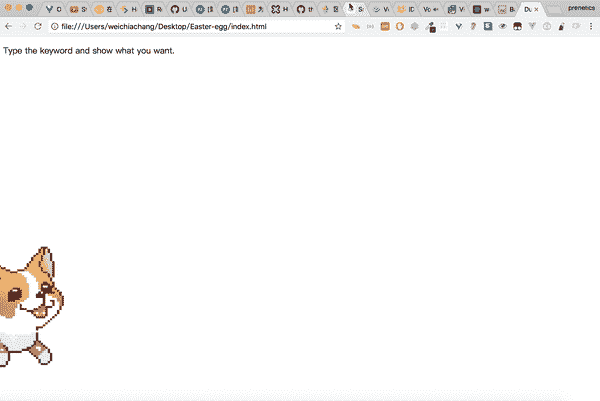
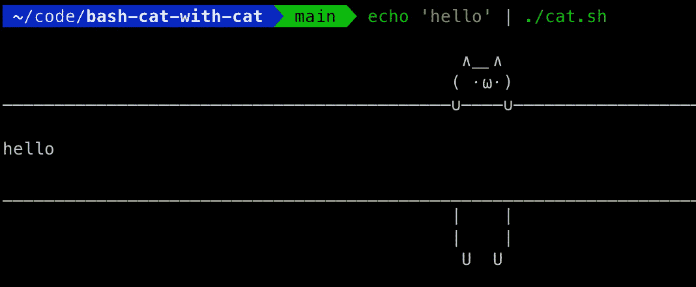

# 6 个有趣的 GitHub 回复，可以快速提神

> 原文：<https://betterprogramming.pub/6-funny-github-repos-for-a-quick-pick-me-up-1cf346cace65>

## 最好的开源喜剧

罗曼·辛克维奇在 [Unsplash](https://unsplash.com/s/photos/github?utm_source=unsplash&utm_medium=referral&utm_content=creditCopyText) 上拍摄的照片

开发有时真的很麻烦。连续几个小时盯着同样的充满角色的令人心碎的屏幕。试图修复同一个恼人的错误，只是不会消失。这真的会让你头脑发热。有时候你需要的只是休息一下，开怀大笑。

GitHub 拥有笑声。是的，微软拥有的庞大的代码库公司也可以偶尔提供一些乐趣。

在这篇文章中，我们将释放一些蒸汽。让我们从困扰你的代码中退一步，看看 GitHub 上一些有趣的东西。

# 1.黑客脚本

 [## GitHub - NARKOZ/hacker-scripts:基于真实故事

### English | 简体中文 xxx: OK, so, our build engineer has left for another company. The dude was literally living inside the…

github.com](https://github.com/NARKOZ/hacker-scripts) 

这太棒了。显然，在一名工程师离开他们的公司后，一名员工被要求查阅他的一些旧数据，并找到了这个脚本库。他们做一些非常有趣和聪明的事情。其中一个脚本甚至连接到一个咖啡机，定期煮咖啡。

自从知识库建立以来，许多贡献者已经添加了各种不同语言的脚本版本。他们甚至可能有你最喜欢的。

# 2.复活节彩蛋收藏

 [## GitHub -魏家场/复活节彩蛋-收藏:🐰一个用来欺骗同事的有趣的图书馆。

### 一个包含复活节彩蛋的 javascript 库。原文来源:感谢理查德·丹顿！所有的图像都是…

github.com](https://github.com/WeiChiaChang/easter-egg-collection) 

这个很有趣。你知道那些藏在页面里的小复活节彩蛋吗？你输入一个特定的单词，就会出现一个图像。这是一个致力于此的图书馆。

[来源](https://github.com/WeiChiaChang/easter-egg-collection)。

有了这个复活节彩蛋收藏，你可以将秘密的小动画图像嵌入到任何网页中，然后当用户在页面上的任何地方键入关键字时显示它们。

(口袋妖怪是我的最爱)

# 3.哑密码规则

 [## GitHub-duffn/dumb-password-rules:用哑密码规则羞辱网站。

### 用愚蠢的密码规则羞辱网站。请随意提交包含您遇到的愚蠢规则的 pull 请求。看…

github.com](https://github.com/duffn/dumb-password-rules) 

你有没有注册过一个新网站，在创建密码时需要一些愚蠢的规则？这个存储库是这些站点的集合。不仅仅是一个集合，而是一个庞大的网站列表，强制执行一些非常讨厌的密码复杂性规则。

有些要求简直荒谬。我最喜欢的是给[Copyright.gov](https://github.com/duffn/dumb-password-rules#copyrightgov):

[来源](https://github.com/duffn/dumb-password-rules/blob/master/screenshots/copyright-gov.png)。

# 4.无代码

 [## GitHub - kelseyhightower/nocode:编写安全可靠的应用程序的最佳方式。写…

### 没有代码是编写安全可靠的应用程序的最佳方式。什么都不写；无处部署。从不写开始…

github.com](https://github.com/kelseyhightower/nocode) 

绝对经典。该回购协议字面上包含*无代码*。这个回购协议是由谷歌开发者、Kubernetes 的大力支持者凯尔西·海托华(Kelsey Hightower)创建的，是对许多其他开源项目的常见格式的讽刺。

回购协议的描述最好地总结了无代码的喜剧:

> “编写安全可靠的应用程序的最佳方式。什么都不写；无处部署。”

# 5.用猫打猫

 [## GitHub-GuidoFe/bash-cat-with-cat:经典的 cat 命令，但是带有一只猫

### 经典的猫命令，但有一只猫。完美的化名。如果使用该命令，它会退回到原来的 cat

github.com](https://github.com/GuidoFe/bash-cat-with-cat) 

它是一只猫，但是*对*发出了`cat`命令。现在，当你`cat`某样东西时，它会显示一只可爱的小猫围绕着它:

用猫对猫的方式。

多可爱啊。现在当你`cat`东西的时候，你会毫不夸张地说你在糟蹋它们。

# 6.马德哈希

 [## GitHub - telekinesis-inc/madhash:搞笑，人类难忘，sha-256 指纹

### 有趣的，人类难忘的，SHA-256 指纹人类可读的代表 SHA-256 指纹使用…

github.com](https://github.com/telekinesis-inc/madhash) 

这个其实挺有用的。

*   试图记住一个 [SHA-256](https://en.wikipedia.org/wiki/SHA-2) 哈希？没门儿。
*   试图记住一个马德西 SHA-256 哈希？更好的机会。

这个存储库允许您从常规的 SHA-256 散列中创建人类可读的散列。你所要做的就是输入你的哈希值，然后就会出现一串字典单词。

测试一下:[https://madhash.telekinesis.cloud/](https://madhash.telekinesis.cloud/)

当你想创建人们可能需要重新输入的散列时，这真的很方便。输入一串普通的单词比输入一长串胡言乱语要简单得多。

不幸的是，字典生成器过滤掉了脏话。

感谢阅读！我希望你喜欢和我一起探索这些有趣的宝库。你最喜欢的是什么？