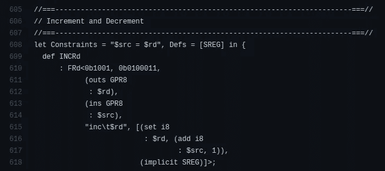

# 6 去了解那些有用的用例

> 原文：<https://betterprogramming.pub/6-go-use-cases-which-are-good-to-know-a57ab99440ce>

## 在这些情况下使用 Go，帮助 Go 与 JavaScript 和 Python 竞争


Emile Perron 在 [Unsplash](https://unsplash.com/s/photos/programming?utm_source=unsplash&utm_medium=referral&utm_content=creditCopyText) 上拍摄的照片，由 Canva 编辑。

Go(又名 Golang)是一种静态类型和编译的编程语言，它提供了两个主要优势:简单性和性能。由于架构限制和复杂的语言规范，大多数编程语言无法平衡简单性和性能。例如，Python 为您提供了最简单的语言语法，但是由于抽象和解释的原因，它会产生很慢的程序。C 语言提供了高效的特定于平台的二进制文件，但是它没有给你一个人性化的开发环境。同时，由于最小的语言规范和令人印象深刻的语言设计原则，Go 语言保持了简单性和性能因素。

Golang 适合所有需要高性能和开发人员友好的语言语法的用例。但是，现在很多开发者选择 Golang 只是为了云平台开发和 web 开发。一些开发人员也倾向于使用 Go 来构建 CLI 程序。比如官方的 [GitHub CLI](https://github.com/cli/cli) 就是用 Go 写的。

当编程语言到达更多的开发者社区时，它们无疑会变得更受欢迎。现在，Golang 试图通过令人印象深刻的开源创新来接触更多的开发者社区。在本文中，我将解释几个鲜为人知的 Golang 用例。尝试在这些场景中使用 Go，让 Go 更受欢迎，更有竞争力的与其他排名靠前的语言竞争。

# 使用 Go 尝试移动应用程序

如今，现代移动开发人员使用 React Native 或 Flutter 构建跨平台的移动应用程序。如果你选择 React Native——你必须学习 React.js 和 web 技术(Flexbox，JavaScript 等)。).另一方面，Flutter 需要省道和材质 UI 知识。如果您只处理基于 Go 的项目，您可以尝试使用 [Go mobile](https://github.com/golang/mobile) 项目来构建跨平台的移动应用程序。Go mobile 项目正在构建使用 Go 开发移动应用程序的工具。

Go mobile 项目仍然是实验性的，他们还没有提供开发者支持。但是，代码库显示了积极的发展和充满希望的未来。Go mobile 团队正试图将一切整合在一起，为 gophers (Go 开发者)提供一个基于 Go 的跨平台应用开发环境。

该项目提供了两种使用 Go 进行移动开发的不同方式:完全使用 Go 编写应用程序，以及将 Go 作为特定平台代码库(基于 Android Studio 或 Xcode)的一部分。跨平台移动应用开发方法通过 [Cgo](https://pkg.go.dev/cmd/cgo) 使用 [OpenGL ES](https://en.wikipedia.org/wiki/OpenGL_ES) 绑定，并为平台 SDK 提供一些实验性抽象(应用生命周期、键盘、触摸和音频)。如果开发团队决定在 Go mobile framework 上构建 UI 工具包，这个项目将成为游戏规则的改变者，因为它使用特定于平台的图形库，不像 Flutter。

现在，使用 Go mobile 和 [GopherJS](https://github.com/gopherjs/gopherjs) 开发基于 Go 的混合移动应用是可能的，尽管这个项目是实验性的。

# 在网络浏览器上运行 Go

Web 浏览器本身支持 JavaScript。但是，现在，WebAssembly 特性可以在浏览器上执行用任何编程语言编写的代码——通过一种类似中间汇编的独立于浏览器的语言。我们已经知道，我们可以通过 [wasm-pack](https://github.com/rustwasm/wasm-pack) 将 Rust 编译成 wasm，通过 [Emscripten](https://github.com/emscripten-core/emscripten) 将 C/C++编译成 WASM。我们也可以通过官方的 Go 编译器或者 [TinyGo](https://github.com/tinygo-org/tinygo) 编译 Golang 到 WASM。此外，我们可以通过 GopherJS 将文件转到 JavaScript，并且仍然可以在浏览器上运行。

你可以用官方的 Go 编译器编译 Go to WASM，如下图。

```
GOOS=js GOARCH=wasm go build -o hello.wasm hello.go
```

官方的 Go 编译器通常会生成大量的输出，甚至对于 WASM 目标也是如此。我为一个简单的`fmt.Println`程序得到了一个两兆字节的 WASM 二进制文件。但是，您可以使用 TinyGo 将 WASM 包减少到千字节。

您可以通过 GopherJS 将下面的 Go 片段转换成 JavaScript。以下 Go 代码的 transpiled 版本在 web 浏览器上显示了一条警告消息。你可以在 GopherJS [游乐场](https://gopherjs.github.io/playground/)在线尝试 GopherJS。

```
package mainimport "syscall/js"func main() {
    js.Global().Call("alert", "Hello Gophers!")
}
```

GopherJS 社区还为 React.js、Vue.js、Angular.js、Electron 等流行的 JavaScript 库/框架创建了 Go 绑定。现在，您可以使用 Go 为浏览器构建 web 应用程序前端和繁重的数据处理程序。

# Go and Go+(原 qlang)面向数据科学

作为一种高级编程语言，C 编程语言具有最少的功能。由于这些最小的特性，大多数程序员甚至认为 C 是一种低级编程语言。后来，C++用许多抽象特性使 C 对开发人员友好。

与 C 和 C++ journey 类似，围棋编程爱好者创造了 Go 和 [Go+](https://github.com/goplus/gop) journey。即使 Go+为 Go 创造了一个令人印象深刻的扩展，它仍然没有被广泛使用。

Go+为数据处理/数据科学提供了令人印象深刻的特性，比如原生有理数支持、动态类型特性、类似 Python 的列表理解、for-range 语句和 lambda 表达式。

Go+以 Pythonic 语法为目标，面向数据处理、数据科学和科学用例。一些开发人员可能会认为，为数据科学使用静态类型的编程语言是一种反模式。但是，go+、 [tfgo](https://github.com/galeone/tfgo) (Tensorflow Go 绑定)和 [Gonum](https://github.com/gonum/gonum) (一个类似 NumPy 的 Go 库)为 Go 驱动的数据科学创造了一个充满希望的未来。

# 使用 Go 实现自动化和开发运维

程序员使用 DevOps 概念来交付具有高效开发工作流的高质量和稳定的软件。

DevOps 概念激励软件开发团队通过自动化保持生产力。下面的故事进一步解释了 DevOps 的原则:

[](https://levelup.gitconnected.com/how-to-improve-your-programming-skills-by-learning-devops-73071b9ea507) [## 如何通过学习 DevOps 来提高自己的编程技能

### 成为程序员不需要 DevOps 技能，但成为程序员需要 DevOps 技能。

levelup.gitconnected.com](https://levelup.gitconnected.com/how-to-improve-your-programming-skills-by-learning-devops-73071b9ea507) 

DevOps 工程师和程序员经常使用 Bash 或 Python 进行自动化活动。如今，web 开发人员倾向于使用 JavaScript 来实现自动化。

由于有了[脚本](https://github.com/bitfield/script)包，现在我们可以使用 Golang 进行自动化活动。脚本包为标准库提供了可链接的包装函数。所以你可以用这个包用 Go 编写类似 Bash 的 shell 脚本。

例如，我们可以用下面的代码片段列出当前目录中的所有文件。

```
package mainimport "github.com/bitfield/script"func main() {
  script.ListFiles(".").Stdout()
}
```

使用这种方法，您可以通过重用现有的 Go 包来编写快速的基于 Go 的 shell 脚本。此外，像 Python 一样，您甚至可以在基于 Go 的 shell 脚本中高效地使用 Bash 命令。

# 致力于嵌入式系统编程

我们已经知道，官方的 Go 编译器会生成有些沉重的二进制文件。对于基于云的用例来说，这不会造成任何问题，但对于较小的计算设备(如嵌入式系统)来说，高于平均大小的二进制文件是有问题的。

TinyGo 项目支持为这些较小的计算设备编译 Go——通过一个基于 [LLVM](https://github.com/llvm/llvm-project) 的 Go 编译器实现。TinyGo 通过一些中间优化编译 Go 到 LLVM IR，然后，LLVM 为目标微控制器发出汇编代码。

最后，TinyGo 提供了将输出二进制对象写入微控制器的必要工具。LLVM 为许多微控制器实现代码生成，如下例所示。



[LLVM](https://github.com/llvm/llvm-project/blob/4cd768ed5e735da5f97be22c6da9483a39e20f3d/llvm/lib/Target/AVR/AVRInstrInfo.td#L609) 中 AVR Assembly INC 操作码定义，作者截图。

TinyGo 从 Go 源文件产生千字节大小的二进制文件。它为 70 种不同的微控制器板生成二进制代码，包括 BBC micro:bit 和 Arduino。

与此同时， [Gobot](https://github.com/hybridgroup/gobot) 项目通过一个包含电池的框架为物联网(IoT)开发提供了一个抽象层。

# 使用 Go 构建混合桌面应用

混合桌面应用正在取代原生桌面应用。由于各种技术优势，即使是大型科技公司也倾向于构建混合桌面应用，而不是原生应用。例如，像 Skype、Teams、Visual Studio Code、Slack 和 Discord 等流行的桌面应用程序都使用电子。Electron 允许开发人员通过 Node.js 抽象编写操作系统级的操作。

但是，如果您想用 Go 后端构建混合桌面应用程序呢？Lorca 项目让你用 Go 和 JavaScript 编写桌面应用程序。此外，通过结合 GopherJS 和 Lorca，完全用 Go 编写 Lorca 应用程序是可能的。Lorca 使用您已经安装的 Chromium 浏览器作为 web 渲染器，并通过 Chrome DevTools WebSocket 协议将 Go 函数导出到浏览器上下文。

Lorca 没有将 Chromium 实例捆绑到应用程序包中，所以 Lorca 应用程序通常不会像典型的电子应用程序那样臃肿。此外，还可以从 [Neutralinojs](https://github.com/neutralinojs/neutralinojs) 应用程序中调用 Go 后端。

# 结论

像任何其他软件项目一样，编程语言需要时间才能大放异彩。Python 已经有 30 多年的历史了，但仍然试图进入移动开发生态系统。JavaScript 已经有 25 年以上的历史了，但仍在试图调整它的语法/内置来与 Python 的简单性竞争。

Go 很年轻，只有十岁，但是它有一个很有前途的语言规范。Go 在云生态系统中变得有竞争力——但你只能通过将它用于上述用例来激活它的超能力。

感谢阅读。