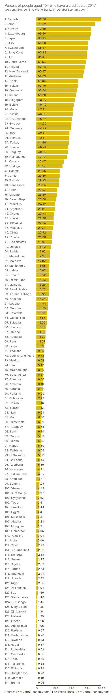
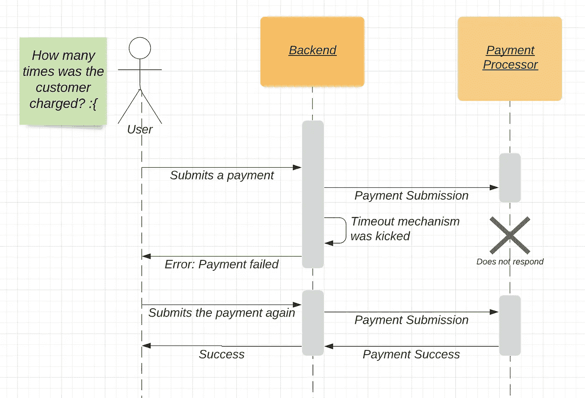

# 6 构建支付系统的惨痛教训

> 原文：<https://betterprogramming.pub/6-hard-learned-lessons-from-building-payment-systems-1d8ca7233f82>

## 记住这些，远离麻烦

马修·布罗德在 [Unsplash](https://unsplash.com?utm_source=medium&utm_medium=referral) 上的照片

几年来，我负责开发计费和支付系统。对我来说幸运(或者不幸)的是，我不得不在没有支付专家太多指导的情况下，从零开始构建这些系统。我犯了很多错误，但也改正了大部分。一些错误存在于应用程序的核心深处，这使得它们很难修复，因此重写比试图修复它们要好。那也不好玩。如果你想在建立支付系统的时候少受点苦，遵循下面的建议吧！

# 术语的时刻

*小单位*和*大单位*——一种货币的小数部分。也称为*子单元*。例如，对于美国货币 USD，美分是次要单位，而美元是主要单位。

# 第一课。避免在后端逻辑中使用小数点来表示货币

因此，货币在每个主要单位中都有 100 个次要单位，这是否意味着您应该在内存、数据库和计算中使用小数点来表示这些信息？这很诱人，但你绝对不应该这样做。这里有两个原因:

## 1.把钱表示成浮点会让你赔钱

这可能令人惊讶，但是浮点类型**不能准确地表示小数**。计算机只“理解”二进制，在当前的 32/64 位二进制表示下，0.0 和 1.0 之间唯一可以准确表示的数字是 0、0.25、0.5、0.75 和 1.0。计算机不能正确地表示分数，所以它们是近似值:尽管 1.999997 看起来非常接近于 2，但是如果你乘、加、减它的次数足够多，你将会损失一些钱，并且会有很多麻烦。

## 2.货币并不总是每种主要货币都有 100 个次要单位

假设你可以使用小数，是植根于所有货币都有 10/100/1000 个小单位的错误观念。嗯，有些货币，像日元，根本没有小单位，有些甚至是非十进制的。这是另一个暗示，十进制不是货币的正确表示。

## 有什么更好的表述？

整数。在你的系统中总是用整数来表示钱。决定所有的钱在你的后端都用小单位表示。例如，在您的系统中，3 美元 14 美分应表示为 314 美元次要单位。最好在您的所有系统中都这样做，因为每一次计算，包括浮点和整数之间的转换，都会让您赔钱。

我推荐使用流行的库，比如[ruby money](https://github.com/RubyMoney/money)/[go-money](https://github.com/Rhymond/go-money)来帮你处理这个问题。

# 第二课。不要假设付款处理是即时的

小心误解，所有的网上支付处理都很快——你点击按钮，几秒钟内就会得到回复。那是错误的。这种误解会导致非常糟糕的客户体验。这是一种误解，原因有二:

## 1.即使是最大的支付处理商，如 Adyen、Stripe 和 PayPal，也经常遇到速度缓慢的问题

即使与最大的支付处理商合作，每几百次支付都会遇到缓慢的响应也是很常见的。如果您的系统没有准备好处理缓慢的响应，甚至对于信用卡，这将导致糟糕的客户体验。在更好的情况下，客户付款将失败，但在更坏的情况下，客户可能会被双重收费(有关这方面的更多详细信息，请参见第 6 课)。

支付处理器保证 SLO，但这是平均水平，所以要确保你的系统能够处理任何异常情况(包括极长的响应时间)。

## 2.一些支付方式可能需要*天*才能获得支付确认

许多流行的支付方式(例如，英国的 [BACS 的](https://www.adyen.com/payment-methods/bacs-direct-debit))可能需要几天才能收到付款确认。这意味着你最好设置你的应用程序，使付款在成功之前可以“等待”一段时间。

## 解决办法

确保你的应用可以异步处理付款:

*   后端应该准备好支付处于“待定”状态，如果超时发生或支付方法需要很长时间才能完成。
*   前端应该准备好处理超过几秒钟的支付。它应该总是向用户指示付款的正确状态。

# 第三课。不要以为信用卡到处都在使用

为了获得良好的全球覆盖，仅仅接受信用卡是不够的。即使在最大的市场中，信用卡在世界各地的受欢迎程度也大不相同。

## 1.信用卡的使用比你想象的要少得多

从下表可以看出，如果你只支持信用卡，你会错过 60%的法国成年人、80%的俄罗斯成年人和 91%的墨西哥成年人。错过了很多生意。

[https://www . the global economy . com/rankings/people _ with _ credit _ cards/](https://www.theglobaleconomy.com/rankings/people_with_credit_cards/)

好的，那么除了信用卡还有什么其他支付方式？那要看国家了。

## 2.不同的国家使用截然不同的支付方式

世界经济的发展是相互独立的，许多支付方式都是针对特定国家或地区的。一些支付方式可以覆盖多个国家，例如[欧元区 SEPA](https://www.ecb.europa.eu/paym/integration/retail/sepa/html/index.en.html) 。而另一些则是超本地化的，只在一个特定的国家工作，例如巴西的 [Boleto](https://en.wikipedia.org/wiki/Boleto) 。尽管特定市场的超局部性非常强大，可能值得专门的支持。

重要的是要明白，这些支付方式的行为可能与信用卡非常不同。例如，在用 Boleto 付款时，一个人从网上卖家那里得到一张“票”,打印它，去最近的杂货店/加油站/等等，用现金或任何其他形式的付款，只有这样，付款才完成。因此，这种支付方式不仅是异步的，而且要求您提供一个可打印的“票证”并与外部系统集成。在构建系统时，请记住灵活性。

# 第四课。确保每个市场的货币格式正确

很容易误以为我们本国使用的货币格式就是各地格式化的方式。这与事实相去甚远。以 12，345.67 美元的美国格式为例:

1.  货币符号
2.  用逗号分隔的主要单位，表示千、百万等。
3.  小数点
4.  次要单位金额

这种格式对美国和其他几个国家来说很好，但是实际上世界上有几十种不同的货币格式。以下是如何用不同的货币和国家写下上述金额:

*   巴西——12.345.67 雷亚尔
*   波兰——12 345.67 兹罗提
*   加拿大——12，345.67 美元(英语区)或 12，345.67 美元(法语区)

在欧元区，它是同样的货币，但格式不同，这使得它更加令人困惑:

*   德国——12.345，67 €
*   希腊——€12.345，67 (是的，是斜体)
*   意大利— €12.345，67
*   爱尔兰— €12，345.67

有许多开源库可以为你抽象所有这些格式逻辑，例如，Ruby 的 [Money gem](https://github.com/RubyMoney/money) ，或者 Golang 的[this](https://github.com/Rhymond/go-money)。使用它们！

# 第五课。避免在你的服务器上有信用卡的详细信息

你应该远离信用卡的详细资料(号码，有效期，CVV，姓名等)。)在您的服务器上。这些信息可能会泄露，让你陷入困境。如果你一定要有卡号，确保你的系统是 PCI 兼容的。

有一个标准叫做 *PCI 兼容*。PCI 代表“支付卡行业”——这是一个由主要卡处理商创建的委员会，如果你不遵守他们的规则，它可以惩罚你。他们的规则完全合理，旨在保护客户免受由于您可能的疏忽或不专业而在您的系统上发生的数据泄露。

PCI 委员会实施了一套相当大的安全实践,为了处理信用卡支付，必须实施这套安全实践。实现所有这些安全机制将是困难的，但是即使你实现了它们，并且你有一个漏洞，你也可能被罚款。

这就是为什么我建议，千万不要碰信用卡的细节:

*   不要在对服务器的请求中包含它们
*   不要让它们出现在你的日志中
*   不要把这些细节保存在你的数据库里
*   只是不要靠近他们

那么你能做什么呢？您有两个主要选择:

1.  **客户端加密(CSE)**—Adyen、Stripe、Zooz 等大多数支付处理商都提供库和其他方法来加密前端的信用卡详细信息，这些信息位于客户的计算机上，远离您的服务器。然后，您可以通过您的服务器将这些不可用的信息传递给支付处理器。因为这些不再是信用卡的详细信息，所以您不受 PCI 规则的约束。
2.  **重定向到支付处理者的页面** —不使用您自己的表单在前端获取信用卡详细信息，而是重定向(或打开一个模式/弹出窗口)到支付处理者的站点(符合 PCI)进行处理，并与他们合作以获得支付的批准，等等。

# 第六课。让你的交易幂等

一个常见的错误是认为使用可靠的远程服务有点像使用函数——您调用它，它每次都会返回一个响应。

如果你读过分布式计算的 8 个谬误，你就会知道你不能依靠一个请求-响应循环来获得成功。即使您的代码运行良好，网络本身也不可靠，服务器的硬件也可能会出现故障。

要了解这个问题有多重要，请回答这个问题:

## 可能的结果

**结果#1 —** *客户支付了一次费用，一切正常。*
处理器收到请求前网络出现故障，重试帮助完成循环。幸运的是，一切都很好。

**结果#2 —** *客户被收取了两次费用，而您需要扑灭一场垃圾箱火灾。* 哦——哦，那可不好。处理器得到请求后网络出现故障，所以支付成功但你的后端并不知道。当客户重试时，他们再次被收费。

**解法:*等幂***

[幂等被维基百科](https://en.wikipedia.org/wiki/Idempotence)定义为“(一种)可以多次应用而不改变初始应用之外的结果的操作。”让它沉淀一分钟——这种支付可以提交任意次，但只收取一次费用。那就是神奇了。

你是怎么做到的？有许多方法可以实现这一点。这里有一些相当简单的方法:

1.  大多数支付处理者允许传递幂等键——这是最简单的解决方案。处理器保证，如果您传递相同的幂等键(在某个时间范围内，比如说两天)，收费将只发生一次。
2.  一些支付处理器允许您检查支付的状态——如果您不能使用幂等键，请查询处理器的后端(如果支持)以查看支付是成功、失败还是不存在。这样，如果您不确定在超时期间支付是否成功，您可以在重试之前进行检查。

在这两种情况下，您还必须管理您这边的幂等性。系统中的幂等性实际上取决于系统的用例。例如，如果您有一个每月收取重复费用的系统，您可以:

*   使用每个 fee 的惟一 id 作为幂等键
*   在接下来的几小时或几天内随意重试

但是，如果您有一个购物车，一个客户在等待回复，您可以，例如:

*   使用购物车的惟一 id 作为幂等键
*   向客户确认购买
*   重试，直到货件准备好
*   如果付款未通过，请联系客户

这真的取决于什么对你的业务和客户群有意义。

# **结论**

长话短说:

*   在您的系统中建立类似于行业中常见的支付模型，以避免令人痛苦的计算错误。
*   了解你的客户！在世界不同的地方，支付方式有很大的不同。
*   保持 PCI 兼容的最佳方式是在您的系统上不要有任何信用卡详细信息。
*   您正在编写一个分布式系统，所以要注意故障，并准备好保护措施。支付系统的失败会对真实的人造成真正的伤害。

我希望你喜欢这篇文章，它是有帮助的。祝你好运！不要犯我犯过的错误！:D

# 资源

*   [非十进货币](https://en.m.wikipedia.org/wiki/Non-decimal_currency)
*   [RubyMoney](https://github.com/RubyMoney/money)
*   [围棋钱](https://github.com/Rhymond/go-money)
*   [信用卡流行图表](https://www.theglobaleconomy.com/rankings/people_with_credit_cards/)
*   [欧元区 SEPA](https://www.ecb.europa.eu/paym/integration/retail/sepa/html/index.en.html)
*   [不同的货币格式](https://fastspring.com/blog/how-to-format-30-currencies-from-countries-all-over-the-world/)
*   [欧元格式](https://www.evertype.com/standards/euro/formats.html)
*   [PCI 符合性](https://www.cimcor.com/blog/a-beginners-guide-to-the-pci-compliance-levels)
*   [分布式计算的 8 个谬误](https://www.simpleorientedarchitecture.com/8-fallacies-of-distributed-systems/)
*   [等幂维基百科](https://en.wikipedia.org/wiki/Idempotence)