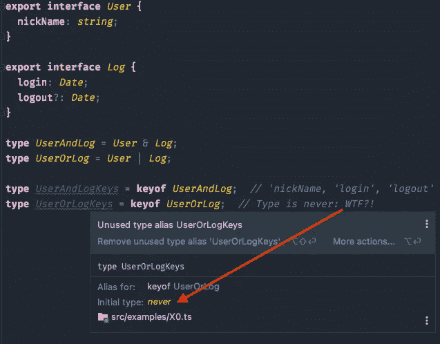
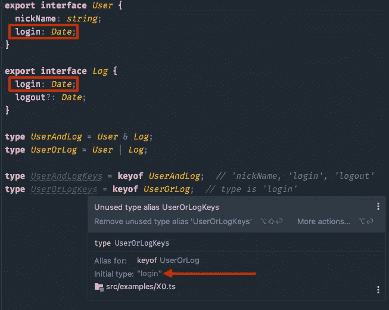
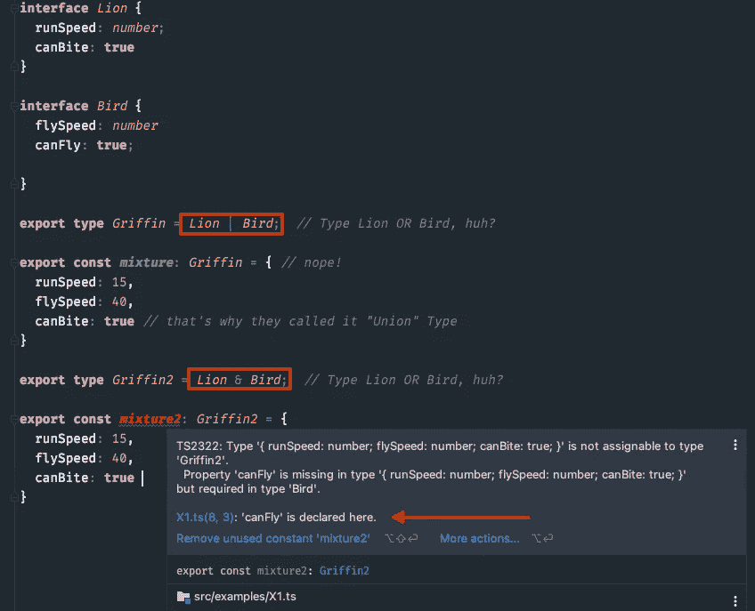
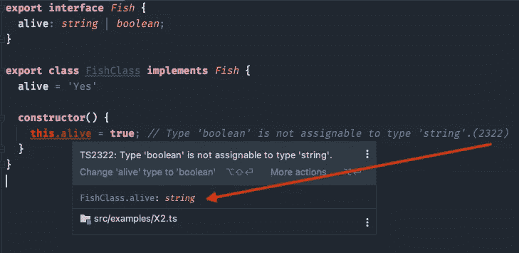
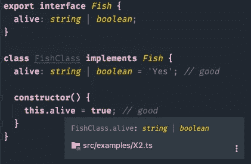
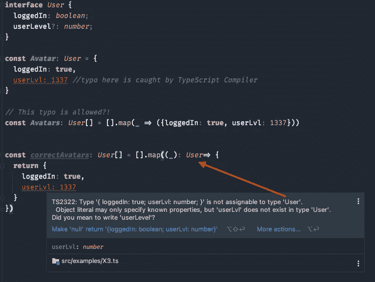
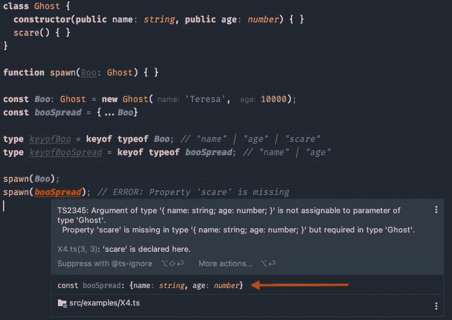
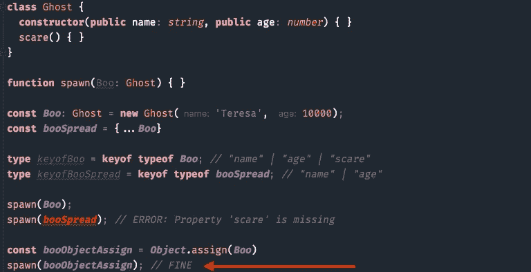
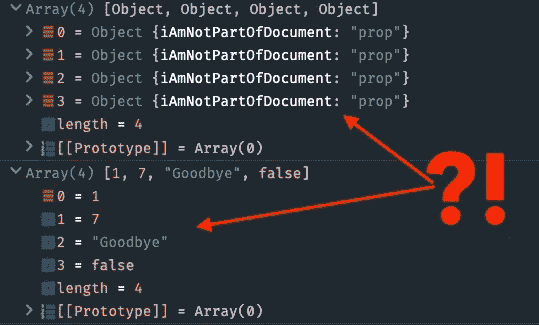
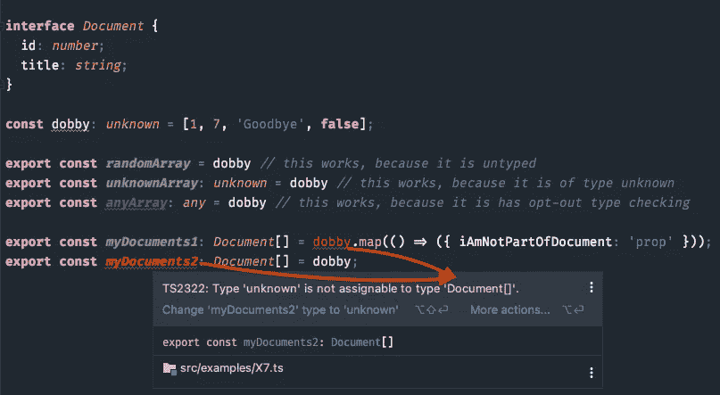

# TS 4.4.4 中您应该知道的 6 个隐藏的 TypeScript 陷阱

> 原文：<https://betterprogramming.pub/6-hidden-pitfalls-of-typescript-you-should-know-d7bae9cf4aa5>

## 这些陷阱将向你揭示


照片由 [Esteban Lopez](https://unsplash.com/@exxteban?utm_source=medium&utm_medium=referral) 在 [Unsplash](https://unsplash.com?utm_source=medium&utm_medium=referral) 上拍摄

*为什么介绍？这些陷阱已经浪费了足够多的时间，我们走吧！*

> 在 TS 版本 4.4.4 中经过测试和验证

# 1.希望你永远不会看到“永远”这种类型

不要用两个不同的接口来构建一个类型。

使用`&`操作符保持安全，但不要使用`|`操作符，否则打字稿会用`never`打你。

在下面的例子中，检查您是否创建了来自`User`或`Log`的联合`UserOrLog`。接下来，您想用`[keyof](https://www.typescriptlang.org/docs/handbook/2/keyof-types.html)`操作符检查文字并集，您将得到`never`的 *fantastico* 类型。



never.ts 的 TypeScript 编译器提示

## 为什么会这样？以及如何修复。

`keyof Union`导致 never 的原因是因为`keyof`总是返回一个类型的可访问键。

在联合的情况下，那将仅仅是公共键。

由于接口`User`和`Log`没有共享公共键，因此类型为`never`。



正确操作时 never.ts 的 TypeScript 编译器提示

# 2.你很容易被“|”虐待

你和我已经完全理解了`|`的意义，不是吗？

不，如果你把它用于类型，你不会得到或的区别，相反，你会得到两种类型的混合。这就是为什么他们在打字稿总部称之为`union`的原因。

看看这个例子，看看如何将命令`Lion | Bird`变成`Griffin`。*变量* `mixture` *可以兼得，虽然看起来不应该。*

## *为什么会这样？以及如何修复。*

联合类型的表达式`A | B`可以赋给`A`或`B`。它必须具有来自`A`或`B`(或两者)的属性。

`A & B`的交集，A 和 b 的必备属性。

查看下图，可以看到`mixture`需要至少拥有两个接口的一个属性，而`mixture2`需要拥有所有四个属性才能成为有效的类型化变量。



狮子|鸟浓缩成混合物，狮子和鸟浓缩成混合物 2

# 3.当一个类实现一个接口时要保持怀疑

具有两种可能类型的属性的接口与类结合在一起是非常危险的。

类`FishClass`实现接口`Fish`并应用类型`string`的值`'Yes'`。现在在构造函数中，您决定附加`true`的值。尽管定义说你是被允许的，但是类预先锁定了类型。

**无路可退。**



classAndInterface.ts 的 TypeScript 编译器错误

## 为什么会这样？以及如何修复。

类成员并不是由他们打算实现或扩展的类型上下文类型化的。

`class`的`extends`或`implements`声明不会影响类实例的类型。相反，它只是对超类或接口执行事后类检查。所以如果你的类没有实现或者扩展你声明的，你会得到一个编译器警告。

但是对于结果类型，就好像您完全删除了 extends 或 implements 子句一样。不，没人喜欢那样。

说到成员是如何推断出来的。由于`alive`属性是用`"Yes"`的`string`值初始化的，编译器推断它属于`string`类型。后来当我把`true`赋给它时，这是一个错误，因为你不能把`boolean`赋给`string`。注意`string`可赋给`string | boolean`，所以对`FishClass implements Fish`的检查成功；您可以缩小子类型的属性。

现在，您必须接受这个事实，并重复该字段的联合声明来修复这种情况:



classAndInterface.ts 的类型脚本解析

# 4.属性中的拼写错误是允许的

输入错误可能会导致几个小时的搜索，好在 TypeScript 为我们检查了它，不是吗？

看看下面的例子。当您使用可选属性时，TypeScript 不执行 sh*t。属性`userLvl`在接口`User`中不存在。

在第 8 行，一切正常，编译器抛出一个错误。但是第 12 行让我哭了，因为它是允许的，而且完全合法——编译器没有任何抱怨。

## 为什么会这样？以及如何修复。

问题是，根据 OOP 规则，派生类型应该与基本类型兼容(`loggedIn`和`userLevel`)

超额属性检查无效的原因是为`map`执行类型检查的方式。首先，回调的返回类型是从对象文字派生而来，派生为`{ loggedIn: boolean, userLvl: number }`。

该类型用作`map`的返回类型，因此它返回一个`Array<{loggedIn: boolean, userLvl: number}>`。然后这被分配给`User[]`，这是第一个规则所允许的。我没有在应该是`User`的地方分配一个对象文字。

得到错误的一种方法是不要让 typescript 推断传递给`map`的回调的结果。我们可以通过向回调添加注释来做到这一点。然后我们直接在期望`User`的位置分配一个对象文字:



获取 map-method 类型检查的解决方案。

# 5.在类上使用 Spread 运算符会导致失败

通常的做法是用 spread 运算符组合对象。

检查作为扩展运算符失败见证的示例。函数`spawn`接受定义为`class`的类型`Ghost`。您决定通过将现有对象`Boo`扩展到`booSpread`中并将其传递给`spawn`函数来创建一个对象。这是艰难时期开始的地方。*缺少属性* `scare` *。*



spreadFail.ts 中的 TypeScript 编译器错误

## 为什么会这样？以及如何修复。

在对象字面量中使用 [spread 操作符不会得到一个与原始对象相同类的对象。来自](https://developer.mozilla.org/en-US/docs/Web/JavaScript/Reference/Operators/Spread_syntax#Spread_in_object_literals)[文档](https://developer.mozilla.org/en-US/docs/Web/JavaScript/Reference/Operators/Spread_syntax#Spread_in_object_literals):

> ECMAScript 提案(ES2018)的 [Rest/Spread 属性为](https://github.com/tc39/proposal-object-rest-spread)`[object literals](https://developer.mozilla.org/en-US/docs/Web/JavaScript/Reference/Operators/Object_initializer#1)`增加了 Spread 属性。它将自己的可枚举属性从一个提供的对象复制到一个新对象上。
> 
> 使用比`[Object.assign()](https://developer.mozilla.org/en-US/docs/Web/JavaScript/Reference/Global_Objects/Object/assign)`更短的语法，对象的浅层克隆(不包括原型)或合并现在是可能的。

所以你干脆“克隆”了`Ghost`。原型中包含的任何东西，比如方法，都会被忽略。如果你使用`Object.assign()`，这些方法也将被复制。



修正了使用属性扩展对象的问题。

# 6.定义一个接口并将所有内容映射到

你定义一个接口是为了让任何人坚持使用它。

但是您可以通过使用`Array.prototype`的`map`方法轻松地解决这种情况。数组`dobby`是`any`的类型，因此除了`Document`的已定义属性之外，里面什么都有。

创建一个名为`myDocuments`的类型为`Document[]`的新数组现在应该可以阻止你将除了类型`Document`之外的任何东西赋给那个数组了——不，不，是。



myDocuments1 和 myDocuments2 的 Console.log

*看第 11 行，这个应该是非法的。呼叫 9–1–1*。

## 为什么会这样？以及如何修复。

如果你决定使用`any`作为类型，你就退出了类型检查。

这样做可以让您分配随机内容数组`dobby`，并允许该值通过编译时检查。

您可以很容易地将`any`更改为`unknown`来获得类型安全的副本。然后再次启用类型检查，并且不允许您将`dobby`赋值给`myDocuments1`和`myDocuments2`的类型化数组。



世界地图的分辨率. ts

大多数都在 GitHub 上有很好的记录，但是经常会发现关于以前收集的 bug。

*加入 Medium，发现我的故事和数百万其他有用的故事:*

[https://arnoldcode.medium.com/membership](https://arnoldcode.medium.com/membership)

```
[*Get the 26 Cheatsheets and Study Only What You Truly Need to Land Your First Web Developer Job!*](https://arnoldcodeacademy.ck.page/26-web-dev-cheat-sheets)
```


[Arnold Code Academy 26 网站开发者备忘单](https://arnoldcodeacademy.ck.page/26-web-dev-cheat-sheets)