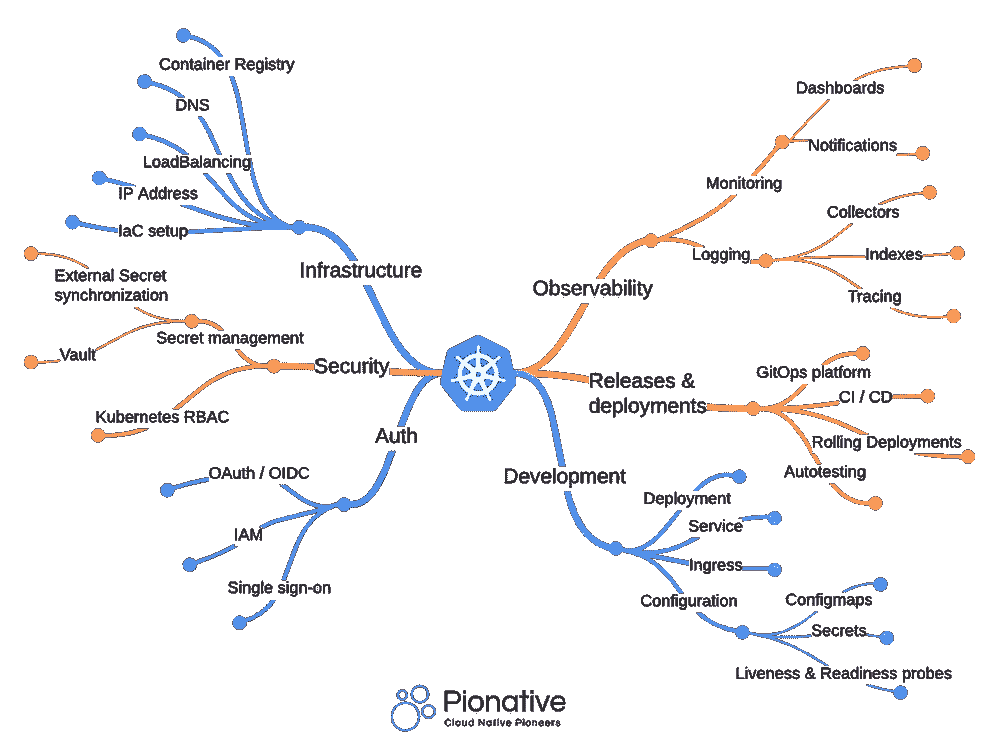

# 在生产中运行 Kubernetes 需要的 6 件重要事情

> 原文：<https://betterprogramming.pub/6-important-things-you-need-to-run-kubernetes-in-production-d573d61258c5>

## 让您的集群更上一层楼

托马斯·米洛特在 [Unsplash](https://unsplash.com?utm_source=medium&utm_medium=referral) 上拍摄的照片

Kubernetes 的采用率在[创下历史新高](https://www.cncf.io/announcements/2022/02/10/cncf-sees-record-kubernetes-and-container-adoption-in-2021-cloud-native-survey/)。几乎每个主要的 IT 组织都投资于容器策略，Kubernetes 是目前使用最多、最流行的容器编排技术。

虽然 Kubernetes 有许多风格，但像 AKS、EKS 和 GKE 这样的管理解决方案是目前最受欢迎的。Kubernetes 是一个非常复杂的平台，但只要您选择托管云解决方案，建立 Kubernetes 集群就相当容易。除非你有非常好的理由，否则我永远不会建议你自行管理 Kubernetes 集群。

运营 Kubernetes 有很多好处，但如果没有丰富的 Kubernetes 知识，自己建立一个坚实的平台需要时间。根据最佳实践建立 Kubernetes 堆栈需要专业知识，并且对于建立一个经得起未来考验的稳定集群是必要的。仅仅运行托管集群和部署应用程序是不够的。

运行生产就绪的 Kubernetes 集群还需要一些额外的东西。一个好的 Kubernetes 设置让开发人员的生活变得更加轻松，并让他们有时间专注于交付商业价值。在本文中，我将分享在生产中运行 Kubernetes 堆栈所需的最重要的东西。

# **1。基础设施代码(IaC)**

首先，使用期望的状态配置(基础设施即代码— IaC)来管理您的云基础设施有很多好处，并且是一般的云基础设施最佳实践。

将它声明性地指定为代码*将使您能够在非生产环境中测试您的基础设施(变更)。它不鼓励或防止手动部署，使您的基础架构部署更加一致、可靠和可重复。*

实施 IaC 的团队快速、大规模地交付更稳定的环境。像 [Terraform](https://www.terraform.io/) 或 [Pulumi](https://www.pulumi.com/) 这样的 IaC 工具非常适合在您选择的云中部署整个 Kubernetes 集群，以及网络、负载平衡器、DNS 配置，当然还有集成的容器注册中心。

# **2。监控和集中记录**

Kubernetes 是一个非常稳定的平台。它的自我修复能力将解决许多问题，如果你不知道去哪里找，你甚至不会注意到。然而，这并不意味着监控不重要。我见过团队在没有适当监控的情况下运行生产，突然一个证书过期，或者节点内存过量使用导致停机。

通过适当的监控，您可以轻松防止这些故障。 [Prometheus](https://prometheus.io/) 和 [Grafana](https://grafana.com/) 是 Kubernetes 最常用的监控解决方案，可用于监控*您的平台和应用*。应该为 Kubernetes 集群的关键问题设置警报(例如使用 Alertmanager ),这样可以防止停机、故障甚至数据丢失。

除了使用指标进行监控之外，运行集中式组件(如 [Fluentd](https://www.fluentd.org/) 或 [Filebeat](https://www.elastic.co/beats/filebeat) 来收集日志记录并将其发送到集中式日志记录平台(如 [ElasticSearch](https://www.elastic.co/) )也很重要，这样就可以在一个中心位置跟踪应用程序错误日志和日志事件。这些工具可以集中设置，因此无需开发人员的努力，所有应用程序都可以自动进行标准监控。

# **3。带 SSL 证书管理的集中式入口控制器**

Kubernetes 有一个入口的概念。一个简单的配置，描述流量应该如何从 Kubernetes 外部流向您的应用程序。中央入口控制器(例如 Nginx)可以安装在集群中，以管理每个应用的所有传入流量。当入口控制器链接到公共云负载平衡器时，所有流量都会在节点间自动实现负载平衡，并发送到正确的 pods IP 地址。

由于其集中化，入口控制器具有许多优点。它还可以处理 HTTPS 和 SSL。名为 cert-manager 的集成组件是 Kubernetes 中集中部署的应用程序，负责处理 HTTPS 证书。

可以使用 Let's Encrypt、通配符证书甚至是公司内部信任证书的私有证书颁发机构来配置它。所有传入流量将使用 HTTPS 证书自动加密，并转发到正确的 Kubernetes pods。开发人员不需要担心的另一件事。

# **4。基于角色的访问控制(RBAC)**

不是每个人都应该成为 Kubernetes 管理员。当涉及到 Kubernetes 访问时，我们应该始终应用最小特权原则。基于角色的访问控制应该应用于整个 Kubernetes 栈(Kubernetes API、部署工具、仪表板等)。).

当我们将 Kubernetes 与 Keycloak、Azure AD 或 AWS Cognito 等 IAM 解决方案集成时，我们可以使用 OAuth2 / OIDC 为平台工具和应用程序集中管理认证和授权。可以定义角色和组，使用户能够根据他们的团队或角色访问他们需要访问的资源。

# **5。GitOps 部署**

与 Kubernetes 合作的每个人都以这样或那样的方式使用`kubectl`。但是使用`kubectl apply`命令手动部署到 Kubernetes 并不是最佳实践，在生产中更是如此。

Kubernetes 期望的状态配置应该存在于 GIT 中，我们需要一个部署平台来部署到 Kubernetes。 [ArgoCD](https://argo-cd.readthedocs.io/en/stable/) 和 [Flux](https://fluxcd.io/) 是 Kubernetes 部署的两个领先 GitOps 平台。两者都非常适合处理实时声明性状态管理，确保 Git 是 Kubernetes 状态的唯一真实来源。

即使一个流氓开发人员试图在生产中手动更改某些东西，GitOps 平台也会立即将更改回滚到所需的更改。通过 GitOps 引导技术，我们可以管理环境、团队、项目、角色、策略、名称空间、集群、应用程序组和应用程序。仅使用 Git。GitOps 确保对所有 Kubernetes 环境的所有更改都是 100%可跟踪的、易于自动化和可管理的。

# **6。秘密管理**

Kubernetes secret manifests 用于将秘密注入到容器中，作为环境变量或文件映射。最好是，不是每个人都应该能够访问所有的秘密，尤其是在生产中。对团队成员和应用程序的机密使用基于角色的访问控制是一种安全最佳实践。

可以使用 CI / CD 工具或者(更糟)通过本地开发环境将秘密注入到 Kubernetes 中，但是这可能导致配置状态漂移。这是不可追踪的，也不容易管理。同步机密的最佳方式是使用中央保险库，如 Azure Key Vault、Hashicorp Vault、AWS Secrets Manager 和中央机密操作员，如[外部机密操作员](https://external-secrets.io/)。

这样，秘密引用可以存储在 GIT 中，指向外部 secrets Vault 中的一个条目。对于更注重安全的公司来说，也可以选择不让所有开发者知道 Kubernetes 使用 RBAC 的秘密。他们将能够引用机密，并在容器中使用它们，但永远无法直接访问它们。

# **结论**

启动一个托管的 Kubernetes 集群很容易，但是如果您没有相关的专业知识，正确地设置它需要时间。拥有良好的基础设施作为代码解决方案、适当的监控、RBAC 以及安全、可管理和可跟踪的部署机制是非常重要的。越早越好。使用标准化的开源工具根据最佳实践设置 Kubernetes 集群将帮助您节省时间、减少故障和麻烦，特别是从长远来看。当然，这些都是对你的 Kubernetes 栈最基本的要求，尤其是对企业级的公司。其他没有提到的重要考虑事项是 ServiceMesh、安全扫描/合规性和端到端可追溯性，这些将在以后的文章中讨论。

[Pio native Kubernetes quick start 包](https://www.pionative.com/kubernetes-quickstart)将根据最新的开源标准/最佳实践为您提供所需的所有基础知识，并为您节省时间和金钱。如果你需要帮助，一些建议或者只是简单的聊天，我很乐意帮忙。欢迎在 [LinkedIn](https://www.linkedin.com/in/hijmen-fokker-b84bab63/) 上联系我！

*原载于*[*https://www.pionative.com*](https://www.pionative.com/post/6-important-things-you-need-to-run-kubernetes-in-production)