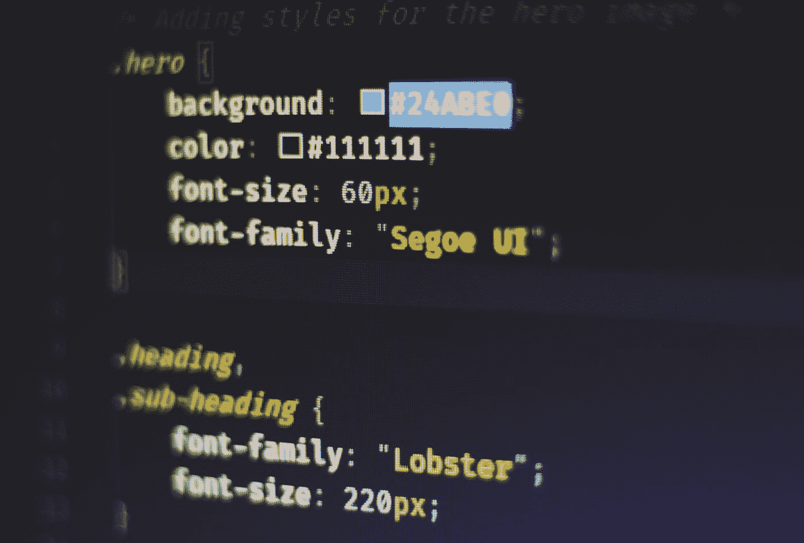
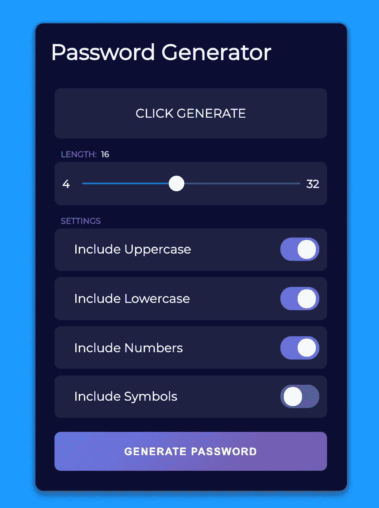
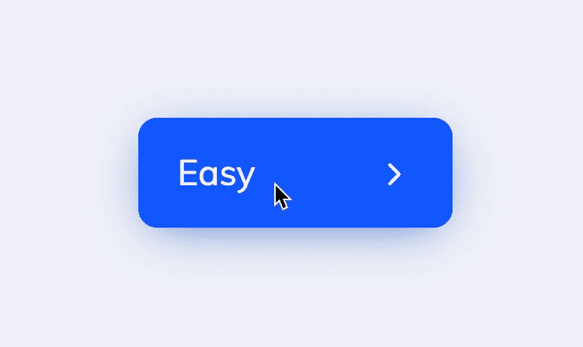
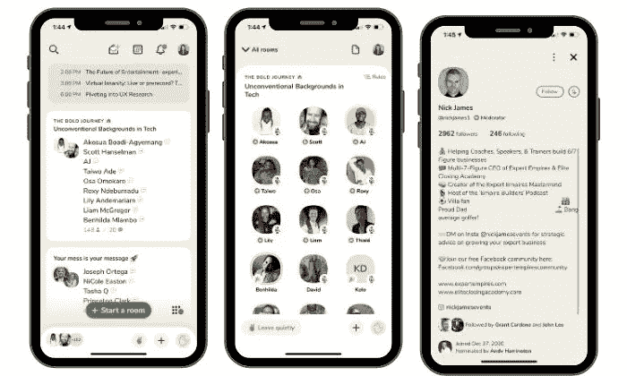
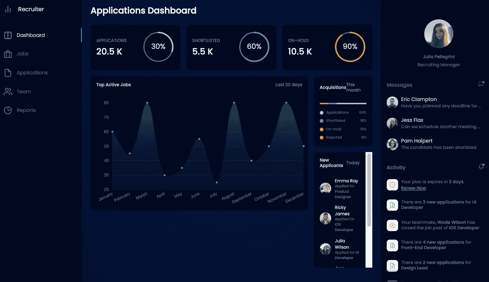

# 6 个鼓舞人心的前端挑战

> 原文：<https://betterprogramming.pub/6-inspiring-frontend-challenges-87c18813723a>

## 从这些令人敬畏的挑战中获得编码灵感

费伦茨·阿尔马西在 [Unsplash](https://unsplash.com?utm_source=medium&utm_medium=referral) 上拍摄的照片。

提高编码水平最有效的方法之一就是简单地构建尽可能多的东西。

编码挑战是一种通过构建东西来提升技能的有趣方式。用这篇文章作为灵感的来源，从列表中抓取一些东西，让我们开始构建吧！

如果你赶时间，不想耗尽编码的灵感，我在这里整理了一个超过 100 个挑战的列表。

你可以在挑战中使用任何你喜欢的工具，所以如果你有想练习的东西，可以试一试。

# 1.任务管理器用户界面

多么漂亮的应用程序！一个干净、现代、智能的用户界面。

“[带有 CSS 网格的任务管理器 UI](https://codepen.io/TurkAysenur/pen/QWyPMgq)”—作者 [Aysenur Turk](https://codepen.io/TurkAysenur)

## 您将从构建任务管理器 UI 中学到什么

*   如何在 HTML 中使用 CSS？如果你尝试新的 [CSS 网格](https://developer.mozilla.org/en-US/docs/Web/CSS/grid)会有加分。
*   如何创建好看的 web 应用程序？

# 2.随机密码生成器

选择新密码的长度，应用过滤器、数字、符号等。，并生成新密码！

## 通过构建随机密码生成器，您将学到什么

*   如何使用 JavaScript 生成安全密码？你可以随意使用任何你认为合适的开源 NPM 库！
*   如何创建自定义主题的输入表单元素？注意切换按钮——这些是`input` HTML5 元素。

# 3.动画按钮

这里有一个看起来很光滑的按钮，当你切换不同的模式时，它会发出动画。随意尝试不同的风格和动画。

[UI //按钮选择类型](https://codepen.io/coswise/pen/YzyVZgJ)—[Cosimo Scarpa](https://codepen.io/coswise)

## 通过构建动画按钮，您将学到什么

*   CSS 动画、变换和过渡是如何工作的。你将需要使文本过渡进和出。

# 4.VU 流量计(仅 CSS)

> “音量单位(VU)表或标准音量指示器(SVI)是音频设备中显示信号电平的装置。”— [维基百科](https://en.wikipedia.org/wiki/VU_meter)

" [VU 米(纯 CSS in one div)](https://codepen.io/noleli/pen/zYNvEwJ) " —作者[诺亚](https://codepen.io/noleli)

## 通过构建仅支持 CSS 的 VU 量表，您将了解到什么

*   如何只用 CSS 在网页上创建对象？
*   应用 CSS 动画、变换、过渡等。

# 5.会所克隆

随着 Clubhouse 的疯狂成功，谁还没有建立一个 Clubhouse 克隆？为什么不通过构建一个克隆体来了解它是如何工作的呢？我们开始吧！

官方会所应用。

## 你将从建造克隆会所中学到什么

*   如何创建看起来像会所的原生移动应用程序？您可以随意添加您喜欢的功能。

# 6.招聘人员仪表板

图表、黑暗主题、聊天——你在现代网络应用中看到的一切。每个雇主都希望你知道如何编写代码。试试看能不能复制仪表盘！

"[招聘人员仪表板 UI](https://codepen.io/aybukeceylan/pen/poEqdWZ) " —作者[艾伯克·塞兰](https://codepen.io/aybukeceylan)

## 通过构建招聘人员控制板，您将了解到什么

*   如何用 JavaScript 和 CSS 创建漂亮的数据图表？
*   如何在 WebSockets 中创建快速实时的聊天？
*   如何创建响应式布局？

# 结论

感谢阅读。编码快乐！

寻找更多的编码思路？永远不要耗尽编码的想法，永远不要。[在此获得我的一系列前端挑战。](https://gumroad.com/l/IuqKc)