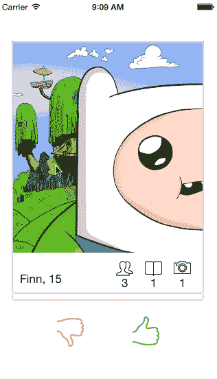
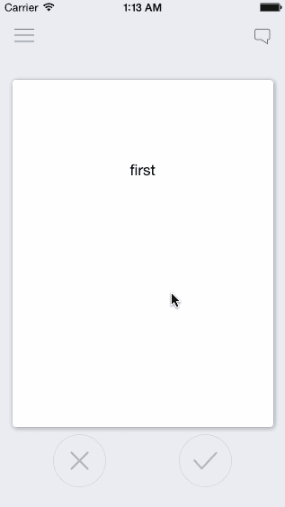
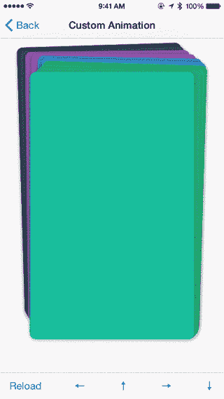
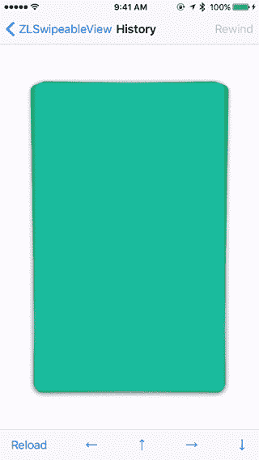

# 6 个 iOS 库来创建类似 Tinder 的可刷卡器

> 原文：<https://betterprogramming.pub/6-ios-libraries-to-create-tinder-like-swipeable-cards-33525620f4fc>

## 查看、滑动和排序

Tinder 引入了一种查看和排序数据的奇妙模式。约会不一定要有资格的人；它可以是任何东西。让我们来看看六个有用的 iOS 库，将可滑动、可排序的卡引入你的应用。

# 1.科洛达

演职员表[https://yalantis.com](https://yalantis.com/)

演职员表[https://yalantis.com](https://yalantis.com/)

Koloda 是一个旨在简化 Tinder 类卡片实现的类。它还为我们提供了类似于`UITableView`和`UICollectionView`的委托和数据源方法，这使得我们更容易处理不同的情况，例如卡片的`selection`和`swiping`。

这个库与 iOS 11+版本和 Xcode 11+兼容

根据我的个人经验，这是实现类似 Tinder 的卡的最好的库。我在生产中使用过这个，从来没有任何问题。每当发布新版本的 iOS 时，开发人员都会更新这个库。

 [## 雅兰蒂斯/科洛达

### 查看我们博客上的这篇文章。我们博客 KolodaView 上的另一篇文章是一个旨在简化…

github.com](https://github.com/Yalantis/Koloda) 

# 2.MCDSwipeToChoose

演职员表[https://github.com/modocache/MDCSwipeToChoose](https://github.com/modocache/MDCSwipeToChoose)

这是开源市场上的一个老库，是用 ObjectiveC 构建的。所有想使用它的 Swift 开发人员都可以创建一个`Bridging header`，并在您的 Swift 项目中使用它。

该库与 iOS 8+版本兼容。

 [## modocache/MDCSwipeToChoose

### 滑动以“喜欢”或“不喜欢”任何视图，就像 Tinder.app 一样。在…

github.com](https://github.com/modocache/MDCSwipeToChoose) 

# 3.卡片滑块

https://github.com/saoudrizwan/CardSlider

这个库提供了对 Tinder 卡的增强。除了`Swiping Left and Right`，它还附带了`Pivot in any direction`的功能。

这个库不能通过`CocoaPods`或`Swift Package Manager`获得，所以您必须手动使用具有实现代码的文件。你可以定制它提供的旋转动作的数量。默认情况下。它有六个枢轴动作(三个在左边，三个在右边)。如果您决定添加更多的动作，您将需要修改 UI 以便适当地容纳它们。

 [## saoudrizwan/CardSlider

### 大量应用程序使用 Tinder 风格的界面，用户可以向右滑动卡片表示“喜欢”，向左滑动卡片表示“不喜欢”。但是…

github.com](https://github.com/saoudrizwan/CardSlider) 

# 4.RKSwipeCards

演职员表[https://github.com/cwRichardKim/RKSwipeCards](https://github.com/cwRichardKim/RKSwipeCards)

这也是一个用 Objective-C 写的老库，但是它为你提供了很多不费吹灰之力的修改。这个库的创建者甚至写了一篇关于如何以最好的方式使用它的文章。

提供的简单修改有:

1.  动作余量(动作发生所需的中间距离)。
2.  挤压比(极限、强度)。
3.  旋转(强度、极限、角度)。

 [## cwRichardKim/RKSwipeCards

### 受 Tinder 启发并受 http://guti.in 影响的可刷卡界面的基础知识意味着…

github.com](https://github.com/cwRichardKim/RKSwipeCards) 

# 5.ZLSwipeableViewSwift

演职员表[https://github.com/zhxnlai/ZLSwipeableViewSwift](https://github.com/zhxnlai/ZLSwipeableViewSwift)

演职员表[https://github.com/zhxnlai/ZLSwipeableViewSwift](https://github.com/zhxnlai/ZLSwipeableViewSwift)

这是最新的更新库，带有许多不同的动画。您甚至可以使用这个库使用`Storyboards`来构建一个 UI。

这个库没有提供`Delegate`或`Data Source`方法，而是提供了`Callbacks`。

这个库支持 iOS 7+版本。

 [## zhxnlai/zlswipeableviewswith

### 一个简单的观点，建立像 Tinder 和 Potluck 卡一样的界面。ZLSwipeableViewSwift 是基于…

github.com](https://github.com/zhxnlai/ZLSwipeableViewSwift) 

# 6.MXCardLayout

演职员表[https://github.com/zqpmaster/MXCardLayout](https://github.com/zqpmaster/MXCardLayout)

这个库不提供类似火绒的卡片；取而代之的是，它帮助你创造这些天每个`iOS device`都会出现的`App Switcher`。

这是用 ObjectiveC 写的，兼容 iOS 8+版本。

 [## ZP master/MXCardLayout

### MXCardLayout reproduces the behavior seen in iOS9's multitasking switcher. MXCardLayout 是仿 iOS9 多任务切换实现的一个卡片流布局。 There are…

github.com](https://github.com/zqpmaster/MXCardLayout) 

# 5 个有趣的 iOS 库来改善你的用户界面

如果你有兴趣了解一些有助于增强和改进你的 UI 的库，你可以看看我的[早期媒体文章](https://medium.com/better-programming/5-fun-ios-libraries-to-improve-your-ui-2da28865b55)。