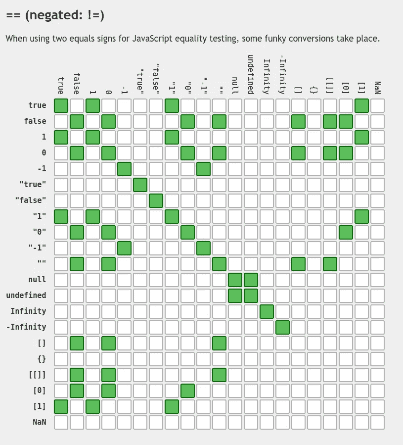

# 6 JavaScript 应该做和不应该做的事情

> 原文：<https://betterprogramming.pub/6-javascript-dos-and-don-t-e020a4228dfa>

## 优化和拥有可读一致代码的技巧

作者捕获

JavaScript 语言自诞生以来经历了快速的发展。有如此多的新特性、变化和新框架，很难跟踪好的实践。

在本文中，我们将检查一些最适合在 JavaScript 中使用的通用经验法则。这些精选的技巧将帮助我们写出更好的代码。它们非常适合初学者和有经验的 JavaScript 开发人员。

# 1.每行声明一个变量

在 JavaScript 中，每行可以声明多个变量。不过，这是我不愿意做的事情。通过每行声明一个变量，代码将变得更容易阅读和理解。

让我们来看一些代码:

一行程序可能看起来有点酷，但是不切实际。这使得代码更难阅读。这种技术也可能导致不希望的结果。

在下面的例子中，即使看起来`x`、`y`和`z`是常量变量，但事实并非如此。只有`x`是常量。

像所有的规则一样，有时也有例外。使用`ES6`析构特性时，你可以每行声明多个变量。

让我们看一个例子:

在上面的例子中，这是最好的解决方案。每行声明一个变量会显得重复。

# 2.了解浏览器优化

因为 JavaScript 没有被编译，所以引擎可以进行优化的唯一方式就是在运行时。他们将得出结论，并找出在旅途中执行优化的方法。

这些优化是隐藏的，有时很难理解。每个供应商都有自己的优化实现。比如在 Chrome 的`v8`上，那个优化引擎叫做`TurboFan`。通过理解其内部的一些基础知识，我们可以产生一个更有效的代码。

如果我们选择完全忽略引擎，我们可能会产生一些性能损失的代码。我们的应用程序执行速度会变慢，这会损害用户的体验。

让我们来看几个我们可能从中受益的快速成功案例:

## 原型

JavaScript 引擎知道原型突变很少见。对象原型通常是可预测的和稳定的。这就是引擎试图在原型对象的早期执行一些优化的原因。

然而，这也有不好的一面。当改变一个原型对象时，引擎必须重新计算所有的优化。这使得这种变异对性能产生不利影响，可能会降低我们的代码速度。它甚至可能会降低一些与原型交互的代码的速度。

让我们看一个虚拟的例子:

如果你真的需要做类似上述场景的事情，只需使用对象属性。这些不会导致原型及其优化被重新计算。

让我们修正前面的例子:

你可以在下面的 MDN 文章[中找到关于这个主题的更多信息。](https://developer.mozilla.org/en-US/docs/Web/JavaScript/The_performance_hazards_of_prototype_mutation)

## 类型专门化

由于 JavaScript 使用了一种编译方法，这意味着它必须在执行任何函数之前进行大量的检查。它严重依赖优化来提高性能。

优化是如何发生的？当一个函数被频繁调用时，它会变热。引擎存储其编译版本。当函数变得更热时，它将被发送到优化编译器。那里有很多优化策略。

其中一个优化就是类型规范。该函数将为类型和参数的每个组合创建一个存根。这意味着，如果我们的函数是单态的(具有相同的参数和类型)，它将只需要一个存根。如果它是多态的，那么每个参数和类型组合都需要一个存根。

因此，通过尝试保持相同的参数和类型，我们的方法将更加有效和高性能。

让我们看一个例子:

如果我们用不同的参数调用这个方法，它不会执行得那么快。

让我们看看上面这个函数的一个不好的用法:

像 TypeScript 这样的工具可以帮助我们尽可能高效地保持我们的方法。

# 3.早点回来

我们已经习惯了这种模式，几乎没有质疑过它。但是，通过经验，你可能会意识到，一个充满了`if`和`else`的代码是:

*   无能的
*   难以阅读
*   难以维护

我们如何改进我们的代码库？只是通过拥抱 ***回归早期模式*** 。

“提前返回”是一种模式，建议尽早返回结果，而不是使用`else`语句。

让我们实现经典的`FizzBuzz`功能。

下面的代码可能是一个解决方案:

但是，如果我们应用提前返回模式，上面的代码可以简化:

因此，我们的代码库可以变成:

*   更加做作
*   可读性更强
*   更有效率

# 4.拥抱函数式编程

JavaScript 语言是多范例的。我们可以在面向对象编程和函数式编程风格之间进行选择。添加了`ES6`类后，前者变得更加容易访问。最近添加的`private fields`增加了 JS 社区长期要求的特性。

然而，对于 JavaScript 原型继承行为来说，这只是一种简单的语法。这会导致挣扎、困惑和沮丧。

在我看来，函数式编程方法导致代码更加模块化和易于测试。

我们可以看看 React 团队是如何通过摒弃类方法来简化开发过程的。即使你没有在 React 中编写代码，你也能体会到巨大的不同。

让我们看一个使用 React 类的例子:

让我们使用新的函数方法重写相同的组件:

因此，我们在仪式上花费更少的代码，这使得它不那么令人分心，更容易跟随。

函数式编程有更多的好处。它让我们避免了许多变异实体带来的问题。

# 5.总是使用三重等式

双重相等`==`是一个比较运算符，它转换操作数以匹配相同的类型。

它使用类型强制来比较值。例如，当比较`number`和`string`时，引擎会将`string`转换为`number`，然后进行比较。

`==`操作符检查值的相等性，而不是类型。

让我们看一些例子:

这可能会导致一些有趣的等式，如下图所示:

来自[https://dorey.github.io/](https://dorey.github.io/)的平等表

为了防止不必要的行为，最好检查类型和值。这可以通过使用严格相等运算符`===`来实现。

严格相等将首先比较值类型。如果它们不相等，它将返回 false。只有当它们匹配时，它才会检查它的值。

*⚠️有其特殊性，即* `*NaN*` *的值永远不会严格相等。为此，我们可以使用* `*isNan*` *运算符。*

让我们来看看操作人员的工作情况:

# 6.等待承诺

在 JavaScript 出现之前，用 JavaScript 处理异步操作是很乏味的。都是通过复试完成的。这就导致了俗称的`callback hell`。代码很难阅读和维护。Promise 帮助我们写出了更好的代码，但它远非完美，它可能会导致`promise hell`。

`aysnc/await`功能作为`ES7`规格的一部分发布。它简化了我们在 JavaScript 中处理承诺的方式。我们现在可以用更同步的方式编写代码。引擎会帮我们做所有的重活。`ES12`中`top level await`的发布增加了该功能缺失的最后一块。

如今，我们想要使用承诺而不是`async/await`的场景并不多。使用`async/await`确实增加了代码的可读性和可维护性。

让我们看一个例子:

如果我们用`async/await`重写代码，它确实变得更容易阅读:

`async/await`与新的 Promise APIs 如`Promise.all`、`Promise.any`、`Promise.allSettled`、…

让我们看一个带有最新`ES12` Promise 特性和`async/await`的例子:

# 最后一个音符

所以当谈到用 JavaScript 编码时，这些是我的选择。当然，还有很多技巧，但这是我最喜欢的六个。使用`Strict`的重要性紧随其后。幸运的是，我们不必太担心它，因为已经有工具为我们执行了。

必须使用`ESLint`。它将使开发周期自动化，并帮助我们编写更好的代码。这将加速代码审查过程。尽早获得快速反馈总是受欢迎的。

您是否发现缺少任何提示？让我知道哪些是你最喜欢的。

 [## 编写高效高性能 JavaScript 代码的 7 个技巧

### 提升您的 JavaScript 应用程序的性能

better 编程. pub](/7-tips-to-write-efficient-and-performant-javascript-code-bccbdb9662ae)