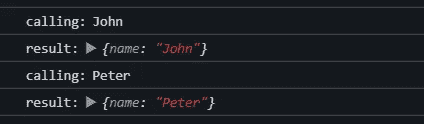

# 6 提高代码可读性和可维护性的 JavaScript 技术

> 原文：<https://betterprogramming.pub/6-javascript-techniques-to-help-you-write-cleaner-code-a5f867a6c750>

## 用这 6 种代码清理技术提升你的 JavaScript 技能


[巴赫尔·凯里](https://unsplash.com/@baher366?utm_source=unsplash&utm_medium=referral&utm_content=creditCopyText)在 [Unsplash](https://unsplash.com/s/photos/six?utm_source=unsplash&utm_medium=referral&utm_content=creditCopyText) 拍摄的照片

JavaScript 灵活而强大。然而，有时会很棘手。在 JavaScript 不断发展并带来新挑战的同时，我们在日常工作中也反复遇到类似的问题。

在本文中，我们将讨论 6 个技巧，它们可以帮助您编写干净且可维护的 JavaScript 代码。

*向前跳跃:*

*   [同时或顺序执行多个异步承诺](#64d1)
*   [使用 console.time 解决性能问题](#01e5)
*   [使用选项对象模式处理传递给函数的多个参数](#44d8)
*   [组合多种功能](#8854)
*   [使用析构提取数据](#543e)
*   [有效使用数组](#27ec)

# 1.同时或顺序执行多个异步承诺

默认情况下，JavaScript 是同步的。为了处理异步代码，一种常见的方法是使用 Promise。与可能导致[回调地狱](http://callbackhell.com/)的回调相比，Promise 提供了一种更好的方式来处理多个异步请求。

当处理多个异步请求时，我们可能需要根据用例同时或顺序处理它们。

## **同时处理多个承诺**

JavaScript 提供了`Promise.all()`方法来处理并发请求。

## **依次处理多个承诺**

当您需要一个接一个地执行多个异步请求时，这可能有点棘手。你的第一反应可能是使用`forEach` 或`map`，但它们并不像预期的那样工作。承诺不会等到完成后才开始下一个。

如果不使用第三方库，最好的方法是使用`[reduce](https://developer.mozilla.org/en-US/docs/Web/JavaScript/Reference/Global_Objects/Array/reduce)` [](https://developer.mozilla.org/en-US/docs/Web/JavaScript/Reference/Global_Objects/Array/reduce)metod。

在上面的 reduce 方法中，我们在每次迭代中返回一个解析为另一个承诺的承诺。结果是一连串的承诺，使得异步操作一个接一个地执行。

如输出中所示，虽然我将第一个承诺的超时设置为 4 秒，第二个承诺的默认值为 2 秒，但是第一个承诺在第二个承诺之前首先被解析。



虽然`reduce` 本身是同步的，但是它允许我们将承诺返回给累加器的能力使得解决方案很好地工作。

# 2.使用 console.time 解决性能问题

有时候，我们需要调试 JavaScript 函数来分析性能。 `console.time`方法是现成的，可以帮助我们测量执行时间。

控制台对象提供了`time()`和`timeEnd()`方法。首先，我们用一个唯一的字符串标签调用`console.time()`方法，它启动一个计时器来跟踪代码执行的持续时间。然后我们运行要测量的函数。最后，我们用相同的标签调用`console.timeEnd()`，持续时间将在浏览器控制台中打印出来。

如果需要用多个步骤调试代码，可以启动多个计时器，用单独的计时器测量不同的步骤，以获得更清晰的画面。

下面是一个有两个定时器的例子:

输出是:

```
Time taken accumlateNumbers: 9.656005859375 msTime taken by callAccumlateFunction: 10.19677734375 ms
```

请注意`console.time`不适合需要高精度的时间测量。

# 3.使用 Options 对象模式处理传递给函数的多个参数

options 对象模式是为了解决向函数传递许多参数的问题。

在向函数传递参数列表的正常方式中，我们需要注意参数的顺序。不正确的顺序会产生难以检测的缺陷。

```
function createUser(lastName, firstName, jobTitle, role){};// we try to create a admin user
createUser(“John”,”Paul”,"admin", ”Manager”);
```

对于 options 对象模式，我们只需要传递一个参数，它是一个包含所有参数选项的命名键的对象。

```
function createUser({lastName, firstName, jobTitle, role}){};const user = {
  firstName: 'John', 
  lastName: 'John', 
  jobTitle:'Manager', 
  role: 'Admin'
};
createUser(user);
```

如上面的代码片段所示，不仅我们不需要担心参数的顺序，而且带有 option 对象模式的命名参数使代码更容易阅读。

options 对象模式通常用于四个或更多参数的情况。

# 4.组合多种功能

函数组合是将多个函数组合在一起，并将每个函数应用于前一个函数的结果的方法。当在正确的用例中使用时，函数组合可以使您的代码简洁而优雅。

这里有一个简单的例子:

上面的方法是可行的，但是当更多的函数组合在一起时，就很难理解了。更好的方法是使用下面的 compose 函数。

通用的`compose` 函数可以接受多个函数作为输入，并逐个调用它们。因此我们称`compose` 为[高阶函数](https://en.wikipedia.org/wiki/Higher-order_function)。高阶函数的优势在于它能够以一种极具表现力的方式组合多个运算。

请注意，它使用了`reduceRight` ，这意味着功能是从右向左执行的。另一种方法是下面的`pipe` 方法。它用的是`reduce`，所以顺序是从左到右。

应用功能组合鼓励开发人员将程序分解成更小的部分，并将动作或行为抽象成功能。它让你先考虑输入和输出，而不是关注实现细节。

结果将是更具可读性、可测试性和可重用性的代码。

在现实世界的项目中，函数组合的正确用例包括数据处理、复杂规则的计算、工作流操作等。

# 5.使用析构来提取数据

析构是将值从对象属性或数组解包到多个变量的一种简单而简洁的方法。

析构的基本例子有:

```
const user = {
    name: 'John Paul',
    age: 23
};
// from object properties
const {name, age} = user;const count= ['one', 'two', 'three'];
// array destructuring
const [first, second, third] = count;
```

提供了一些有用的析构特性，包括默认值、跳过数组元素、分配新的变量名等。你可以在这里找到完整的列表[。](https://developer.mozilla.org/en-US/docs/Web/JavaScript/Reference/Operators/Destructuring_assignment)

这里有一些我经常使用的实际例子。

## 从函数结果析构

```
function getUser() {
  return {name: ‘John’, age: 24};
}
const {name, age} = getUser(); // name='John', age=24
```

## 分割数组

```
const [first, ...rest] = ['1', '2', '3', '4'];
// output: first='1', rest=['2', '3', '4']
```

## 从数组中获取第一个元素

```
const fruits = [‘apple’, ‘orange’, ‘pear’];[first] = fruits; // first= 'apple'
```

## promise.all()的析构结果

```
Promise.all([ promise1, promise2, promise3])
.then( results =>{    
    const [first, second, third] = results;
})
```

# 6.有效地使用阵列

数组是我们大多数人日常处理的最常见的数据结构。以下是对阵列操作的一些提示:

## **使用切片对数组进行不变排序**

我们经常希望对数组进行排序，并得到一个不可变的副本。不幸的是，`.sort`会改变原来的数组。使用下面的`slice` ,我们可以得到一个排序后的数组，而不会影响原来的数组。

```
const newArr = arr.slice().sort()
```

请注意，切片返回原始数组中元素的浅层副本。如果你需要做深度克隆，你可能喜欢使用[不同的方法](https://javascript.plainenglish.io/deep-clone-an-object-and-preserve-its-type-with-typescript-d488c35e5574?sk=34e6444aa1dfa44621a315c2f3ed936c)。

## **从数组中删除重复项**

有多种方法可以从数组中删除重复项。最简单也是我最喜欢的方法是使用[设置](https://developer.mozilla.org/en-US/docs/Web/JavaScript/Reference/Global_Objects/Set)。

Set 是在 ES6 中引入的，它表示唯一值的列表。在下面的示例中，我们使用 spread 运算符将集合运算的结果作为数组返回。

```
const arr = [1,2,3,2,3,4,5];
console.log([...new Set(arr)]); // [1,2,3,4,5]
```

请注意，Set 方法只对原始值有效。

## **从数组中过滤出 falsy 值**

在 JavaScript 中，falsy 值可以是空字符串、false、0、null、NaN 或 undefined。下面是我最喜欢的从数组中过滤虚假值的方法。

```
const arrToFilter = ["user", "", 0,  NaN, 9, true, undefined, "red", false];
const result = mixedArr.filter(Boolean);
console.log(result); // returns ["user", 9, true, "red"]
```

如果你以前没有用过，你可能会想知道 `filter(Boolean)`是如何工作的？

布尔是一个对象包装器。在`filter(Boolean)`方法中，数组中的每一项都被传入并按如下方式计算。结果不是 true 就是 falsy，falsy 值将被过滤掉。

```
.filter(x=> Boolean(x));
```

## **使用 Array.every 和 Array.some 简化代码**

`Array.every`和`Array.some`是简化代码的非常方便的方法。与其他方法如`forEach` 或`reduce`相比，`Array.every`和`Array.some`使代码更具可读性和简洁。

```
const users = [
    { name: 'john', role: 'admin' },
    { name: 'peter', role: 'dev' },
    { name: 'mary', role: 'dev' }
  ];
const isAllDeveloperRole = users.every(f => f.role === 'dev');const hasDeveloperRole = users.some(f => f.role === 'dev');
```

希望这篇文章对你有用。如果你有其他的 JavaScript 技巧可以分享，请添加到下面的评论中。

如果你喜欢这篇文章，你也可以看看下面的文章。

[](/6-typescript-code-patterns-to-make-your-code-more-robust-bbe54354f39f) [## 6 种类型脚本代码模式，使您的代码更加健壮

### 您可以在日常工作中应用的简单实用的解决方案

better 编程. pub](/6-typescript-code-patterns-to-make-your-code-more-robust-bbe54354f39f) 

快乐编程