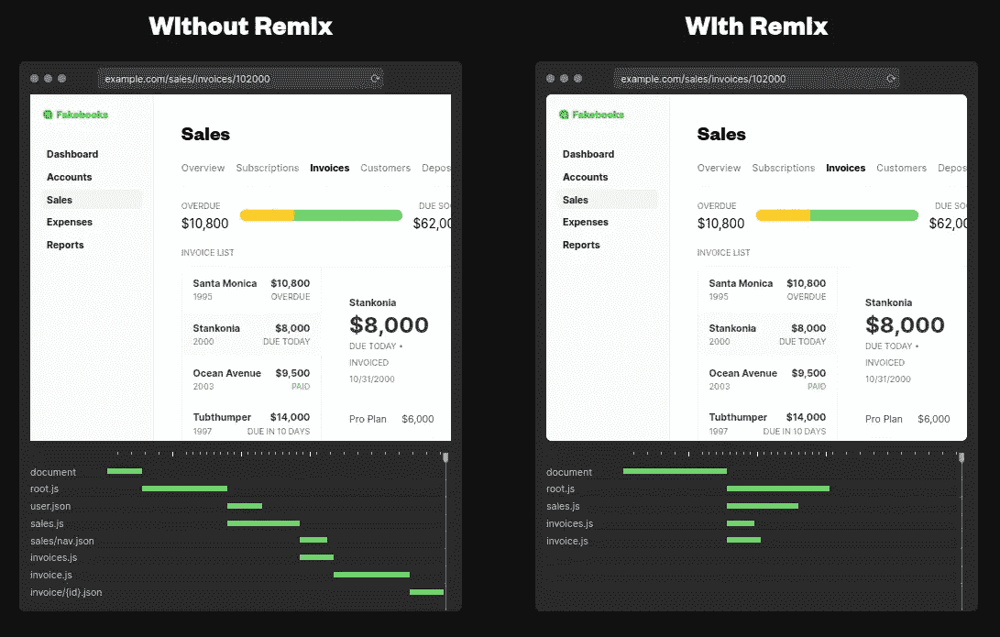
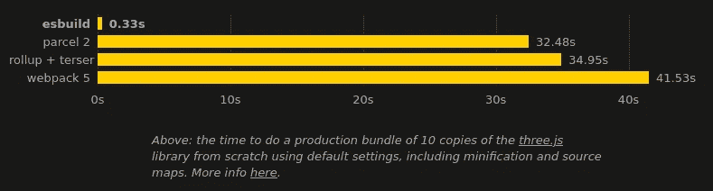

# 混音版的 6 个黑仔特色

> 原文：<https://betterprogramming.pub/6-killer-features-from-remix-3d7e01b0789e>

## 改变游戏规则的全栈 JavaScript 框架的主要亮点


remix.run 的标题

React web 生态系统从未如此之好。2021 年，我们看到了 Next.js 12 版本的大发布。它带来了令人敬畏的功能，如基于 SWC Rust 的编译器、中间件、对 React 18 的支持和 URL 导入。

当我们以为这一年结束了，我们刚刚得到了最新发布的混音。它已经转变为一个免费和开源的全栈框架。他们最近登上了肯特·c·多兹号。他是谁？`React Testing Library`的创造者。一个非常棒的测试库，它改变了我们现在测试 React 组件的方式。从那以后，他用混音版重写了他的整个博客。

突然之间，选择一个框架变得更加困难。不过这并不是坏消息，在开始新项目时，我们还有另一个很棒的全栈框架可以考虑。

在本文中，我们将看到使这个框架如此神奇的特性，以及为什么您应该在您的下一个项目中考虑它。

# 1.易于安装

一个框架应该总是易于安装和开始。这促进了它的采用。Remix 确实选中了那个框。

它有一个直观的设置，我们所要做的就是运行下面的命令

```
**npx create-remix@latest**
```

我们必须回答两个问题。第一个是关于我们希望在哪里托管我们的应用程序:应用程序:Remix App Server、Express Server、AWS Lambda、Fly.io、Netlify、Vercel 或 Cloudflare Pages。我们可以很容易地改变这一点。

接下来，我们必须定义我们的项目是基于 JavaScript 还是基于 Typescript。

瞧，就这样我们都准备好了。不到一分钟，我们都准备好了。

执行我们的项目非常容易。我们可以使用很多 yarn/npm 任务。让我们看看如何直接进入开发模式:

```
// after setup
cd [whatever you named the project]
**npm install
npm run dev**
```

或者，我们仍然可以进行手动安装。我们只需要安装依赖项并添加几个配置文件。这不太方便，但可行。

# 2.渐进增强

JavaScript 使我们能够构建更快、更高效的网站。它使**S**single**P**age**A**应用范例成为可能。但是，JavaScript 仍然可以被禁用。通常这会破坏整页。再混合就不会这样了。唯一的副作用将是交互体验降级。它是如何实现的？主要依靠默认的内置浏览器语言，如表单和链接。

我们需要以一种特定的方式来构建我们的应用程序以获得渐进增强的支持吗？是的，我们将不得不接受固执己见的混合方法。

Remix 框架尽可能地利用服务器的计算能力。默认的重新混合行为是执行服务器端渲染。因此，当 JavaScript 不可用时，我们的用户不会看到空白页面。他们将获得相同的 HTML 页面，但与原始的 HTML 体验。页面不会被水合，因为没有 JavaScript 将被执行。

像表单和路由这样的交互特性会发生什么？当 JavaScript 可用时，它通过阻止默认浏览器行为来增强特性。当它被禁用时，将使用浏览器原始行为。我们将在表单、路由和数据加载特性中看到更多细节。

这使得 JavaScript 不仅仅是一个需求，而是一个特性。禁用它只会降低用户体验。

# 3.数据加载

这是一个很好的特性。通常我们做的是加载路线，然后在一个`useEffect(..., [])`钩子上加载数据。重新混合的方法是不同的。相反，它会在根页面模块上寻找一个导出的`loader`函数。如果可用，它将在服务器上执行，并将结果传递给浏览器。

我们可以从任何地方获取数据:JSON、API、数据库……我们可以访问路径参数。怎么会？它们可以作为`loader`函数的一个参数。

我们如何使这些类型安全呢？params 对象是`string`和`string | undefined`联合的键值。我们只需要断言参数不为空。为此，我们可以使用`tiny-invariant`库:

```
import invariant from "tiny-invariant";export const Loader: LoaderFunction = async ({params}) => {
  ...
  // ✅ if param is absent we will thrown an error
  **invariant**(params.id, "Expected id Parameter");
  ...
}
```

让我们来看一个完整的例子，一个`/posts/${id}`页面的示例`loader`函数:

在上面的代码中，我们向客户端公开了数据。在那里我们如何能接近它？通过提供的自定义挂钩:

```
import { useLoaderData } from "remix";export default function PostDetails() {
    let post = **useLoaderData**();
...
}
```

Remix 框架提供了我们需要的一切，以提供闪电般的用户数据加载体验。

数据什么时候重新加载？Remix 框架通过刷新表单提交和其他用例的加载器来解决这个问题。我们可以选择退出，用`unstable_shouldReload`处理程序自己管理它。

# 4.内置表单

这一开始是一个令人震惊的特性。早在 JavaScript 出现之前，表单就已经存在了，现在，表单的重新组合包含了这种原始的行为。它们只是使用`action`方法重定向到一个动作的`POST`请求，或者在不存在时使用相同的路由。

当 JavaScript 启用时，表单提交将使用`event.preventDefault()`禁用，所有事情都将通过 AJAX 发生。表单将在服务器上进行序列化和处理。然后，数据将返回给客户端。我们也可以执行类似于`redirect`的操作。

所有的表单验证都将在服务器上处理。在 Remix 中，如果有任何错误，最好返回一个`errors`键值对象。

混音将如何处理提交后的表单？我们需要在表单`root`页面上公开一个`action`功能。

以上是我们在服务器端处理表单提交所需做的全部工作。我们在客户端有什么 API？

*   `useSubmit`:返回以编程方式提交表单的函数。
*   `useTransition`:它告诉我们关于表单提交状态需要知道的一切。我们可以显示加载状态，禁用表单提交，乐观更新…等等。
*   `useFormAction`:使用 React 路由器的相对路径解析`<form action>`的名称。
*   `useActionData`:返回提交表单的数据。这是将错误从服务器传回 web 客户端的首选方式。

当 JavaScript 被禁用时，表单以传统方式提交。浏览器知道如何序列化和发送表单。表单将继续执行，并且`action`仍将在提交时执行。显然，上面的 JavaScript APIs 不会在客户端运行。

# 5.内置路由

就像 Next.js 一样，Remix 框架有一种固执己见的路由方式。它允许嵌套路由。然而，Remix 是建立在`React Router v6`之上的。它是最流行的 React 路由器库之一，我们可以通过 remix 访问它们的 API 和组件。

这意味着我们可以使用我们最喜欢的 react-router V6 API:

*   `Outlet`:嵌套页面的占位符。
*   `useLocation`:返回当前位置对象。
*   `useNavigate`:返回以编程方式导航的函数。
*   `useParams`:返回 URL 参数和路由路径 URL 的匹配项。
*   `useResolvedPath`:返回解析后的 URL 路径。

路由将预加载所有嵌套的路由，并并行传递这些路由。这可能会导致初始负载稍长，但交互时间会更短。

让我们看看下面标题中的网络选项卡。我们可以看到 Remix 是如何并行加载所有嵌套路由的。



如何加载资产

关于路由的一个很酷的特性是它将依赖于 HTML 导航。这意味着我们不需要 JavaScript 来让它正常工作。当 JavaScript 存在时，路由系统将工作得最好。必须喜欢表单功能，它只会在 JavaScript 可用时增强其行为。

混合路由支持路由范围内的元配置。我们所要做的就是在模块页面中导出一个`meta`函数。

# 6.快速发展

Remix 框架不再使用 Webpack 了。相反，它依赖于 esbuild。这使得它超级快速。



来自 esbuild.github.io 的标题

它目前支持以下功能:

*   ES6 和 CommonJS 模块
*   ES6 模块的树抖动
*   类型脚本和 JSX 语法
*   源地图
*   缩小
*   插件

这个生成器是用 Go 编程语言构建的，主要由 Ewan Wallace 维护。可惜还没到`1.0.0`。因此，我们可以预期这里和那里会有一些错误和问题。然而，现在离阿尔法阶段还很远。我们可以认为这是一个测试阶段。

我个人认为 Next.js 选择的构建器更加稳定和成熟。只有时间能证明这是否值得。我的手表模式出现了一些小故障，我希望能尽快修复🤞。

# 包裹

起初，我不愿意尝试混音。当 Next.js 如此之好的时候，我不明白我为什么要费心去尝试它。起初，我不喜欢必须记住它所有的惯例。一切都连接好了，我们所要做的就是用正确的名称在正确的位置导出特性。

然而，在摆弄了一段时间后，我越来越喜欢它了。这是一种不同于我们传统的构建 web 应用程序的方法，需要一些时间来适应。

我只提到了它的一些关键特性，但它还有更多。例如，它的文件是杰出的。它很直观，也很有趣。毫无疑问，这是载人飞船的必备装备。

我必须说我被迷住了。当我在 2022 年为我的下一个项目选择一个框架时，这个框架将会出现在我的顶层列表中。

干杯。

[](/next-js-vs-remix-analyzing-key-aspects-and-differences-8674beaba695) [## Next.js vs. Remix:分析关键方面和差异

### 通过比较 Remix 和 Next.js 的最新版本，知道哪一个适合你

better 编程. pub](/next-js-vs-remix-analyzing-key-aspects-and-differences-8674beaba695) [](/5-new-killer-features-of-next-js-12-dfd1d766b539) [## Next.js 12 的 5 个新黑仔功能

### 改变游戏规则的版本的主要亮点

better 编程. pub](/5-new-killer-features-of-next-js-12-dfd1d766b539)