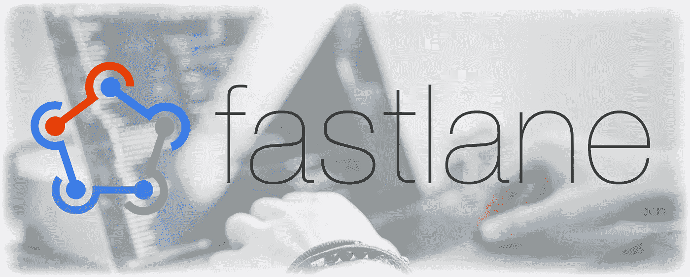
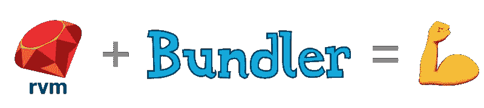
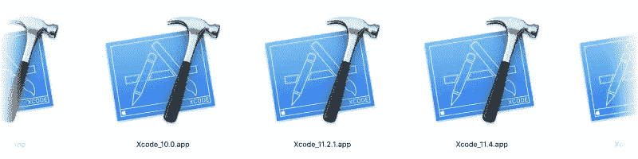
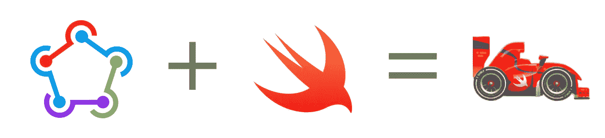

# 我从使用浪子中学到的 6 个教训

> 原文：<https://betterprogramming.pub/6-lessons-i-learned-from-using-fastlane-cb35f53021b3>

## 这是一个神奇的工具，但有些事情可以解释得更好一点



照片由 [Zan](https://unsplash.com/@zanilic?utm_source=unsplash&utm_medium=referral&utm_content=creditCopyText) 在 [Unsplash](https://unsplash.com/s/photos/xcode?utm_source=unsplash&utm_medium=referral&utm_content=creditCopyText) 上拍摄

就个人而言，我会推荐任何参与 iOS 开发的人使用浪子。一旦你掌握了窍门，它可以节省你大量的时间。设置它并不难，但是获得一些正确设置的指导可能会有所帮助。以下是一些帮助您开始或改进设置的提示。

# 简单回顾一下

如果你不熟悉浪子，这是一个使用 [Xcode](https://en.wikipedia.org/wiki/Xcode) 命令行工具链来自动化大量任务的工具链。最重要的是，它允许你毫不费力地构建、测试、签署和上传你的应用程序版本。

这些工具大部分是用 Ruby 编写的，可以通过几个配置文件来设置，其中最主要的是`Fastfile`。在此文件中，您可以指定车道。每个通道运行一个或多个您想要分组和自动化的命令。

# 正确管理您的 Ruby 环境

对于大多数 iOS 开发者来说，Ruby 不是你的朋友。但是既然我们被它困住了，我们最好充分利用它。一个常见的问题是使用 Ruby 系统安装来安装 gems。这是一个坏主意，因为你不拥有 Ruby 环境，也不能保证操作系统不会在软件更新或重启时破坏你的东西。

然后是`sudo`的问题。

只有在你确定确实需要的情况下，才应该对任何命令使用`sudo`。使用`sudo` 安装 gems 意味着文件和文件夹将作为根用户创建，这意味着访问它们也需要`sudo`等。等。你去兔子洞。

有几种方法可以设置自己的 Ruby 环境来防止这种情况。我强烈推荐使用 [RVM](https://rvm.io) 或者 [rbenv](https://github.com/rbenv/rbenv) 。我个人更喜欢 RVM，但是使用这两个工具中的任何一个都可以帮助您保持环境的简单和易于维护。

> “RVM 是一个命令行工具，它允许您轻松地安装、管理和使用多种 ruby 环境，从解释器到 gem 集。”— [rvm.io](https://rvm.io)

真的就这么简单。遵循安装说明，确保避免使用`sudo`。

# 使用 Bundler 管理您的宝石



正如 RVM 管理你的 Ruby 环境一样， [Bundler](https://bundler.io) 可以帮助你以一种更加本地化和可维护的方式管理你的宝石。可以把它想象成 Ruby gems 的 CocoaPods:您可以精确地指定想要使用哪个版本的依赖项。事实上，由于 CocoaPods 也是一种 Ruby 宝石，所以可以用同样的方法来管理它。很像《盗梦空间》，对吧？老实说，我对更多的开发人员不使用 Bundler 开发 Cocoapods 感到有点惊讶。

使用 Bundler 可以做两件事:

*   为不同的项目使用不同版本的 gems
*   确保开发人员(和构建服务器)使用相同版本的 gems

虽然这种情况很少发生，但我遇到过关于运行时崩溃和代码设计问题的奇怪问题，因为使用了错误版本的 gem。创建一个 Gemfile 需要几分钟，这与在 repo 中创建一个 Podfile 非常相似。然后，不用运行`pod install`，你只需使用 Bundler 通过调用`bundle exec pod install`或`bundle exec fastlane release`为你的浪子发布通道确认你使用的是本地版本。

# 指定您想要使用的 Xcode 版本



你的团队还没准备好更新到最新的 Xcode 吗？您可以[并行下载并安装](https://developer.apple.com/download/more/)多个版本。只需重命名`.app`文件，并将它放在`Applications`文件夹中其他文件的旁边。这对应用程序来说很好，但是浪子使用的命令行工具需要知道使用哪个版本的 Xcode。

使用`[xcode-select](https://developer.apple.com/library/archive/technotes/tn2339/_index.html#//apple_ref/doc/uid/DTS40014588-CH1-HOW_DO_I_SELECT_THE_DEFAULT_VERSION_OF_XCODE_TO_USE_FOR_MY_COMMAND_LINE_TOOLS_)`命令，您可以指定您希望使用哪个版本的 Xcode。浪子有一个内置的[动作来利用这一点。这又一次防止了你遇到讨厌的问题，因为 Xcode 的版本是在你背后更新的。](https://docs.fastlane.tools/actions/xcode_select/)

如果版本安装在正确的位置，浪子将为您找到它。否则，它将失败，停止构建，并告诉您发生了什么。

# 别忘了去浪子看看。迅速发生的



它不像普通的浪子那么远，但可能足够满足你的需要了。非常坦率地说，它还可以防止您陷入对一个`Fastfile`的 Ruby 语法的理解。相反，您可以从 Xcode 享受漂亮的 Swift 语法和代码完成。它仍处于测试阶段，但在我的努力中，我很少因为这个碰到问题。[这里有可用的文档](https://docs.fastlane.tools/getting-started/ios/fastlane-swift/)，而且足够广泛，可以开始使用。

不过不要担心:如果你真的陷入了困境，恢复到 Ruby 版本并不是太多的工作。毕竟，Swift 版本中所有可用的命令都在那里。可能还需要一段时间来适应 Ruby 的语法。

# 慢慢来，正确设置钥匙串

每个 iOS 开发人员都记得他们刚开始开发 iOS 应用程序时的挣扎，他们必须签署他们的第一个应用程序。这些年来，这个过程已经变得简单多了，但是当在构建服务器上构建和签署一个应用程序时，它并不总是像你希望的那样简单。

## 使用匹配

浪子为我们提供了一个名为 [Match](https://docs.fastlane.tools/actions/match/) 的工具，它将简化代码设计并与你的开发团队共享证书。基本上，Match 会接管管理你的证书，把它们存储在一个集中的地方。使用该工具时，您和您的团队将共享一组凭据，从而使新用户的加入和证书的续订变得更加容易。

## 从远程连接签名

可能有你不能或不想使用这个的原因。或者也许你只是还没有时间去改变你的过程。此外，代码签名错误是隐晦的，尤其是当它们使用命令行发生时。

我不止一次遇到的一个错误是:

```
security error -25308
Error: 0xFFFF9D24 -25308 User interaction is not allowed.
```

这是因为在常规会话中默认解锁的钥匙串(即照常登录到机器)在通过 SSH 远程登录时实际上是锁定的。

幸运的是，浪子有一个`[unlock_keychain](https://docs.fastlane.tools/actions/unlock_keychain/)`命令可以解决这个问题。在尝试构建/签署您的应用程序之前运行此程序，您应该可以开始了！

# 使用浪子尽快建造和交付每一架试飞飞机

这可能听起来微不足道，但是当你陷入其他需要你注意的任务时，很容易推迟这件事。一旦你有了这样的设置，它不仅会为你节省最多的时间，而且你还会注意到你交付中间测试版本的频率更高了，这意味着更快的反馈和更快乐的测试人员。

当你启动并运行它的时候，也是你意识到你应该更快地自动化你的构建的时候。此外，现在自动化更多流程的下一步突然触手可及。

感谢阅读！有建议或者补充？一定要让我知道！