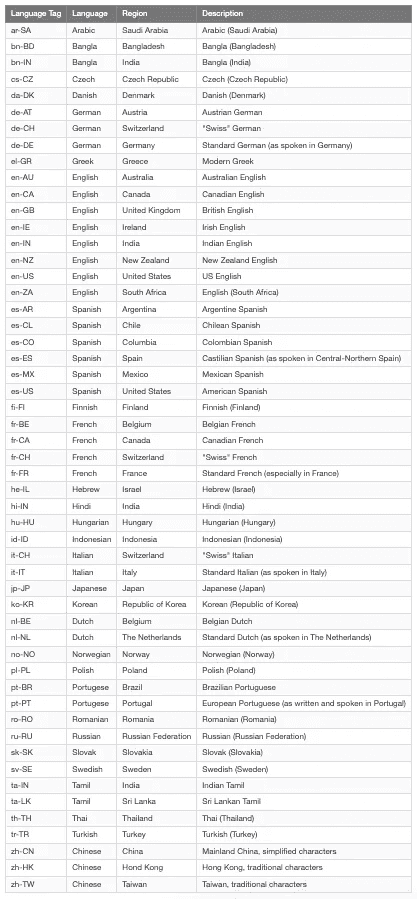

# Node.js 19 的 6 大特性

> 原文：<https://betterprogramming.pub/6-major-features-of-node-js-19-b98e28b9670c>

## Node.js 19 新特性的细节，包括实验性的节点观察模式和 HTTP(S)/1.1 默认保持活动


照片由[马修·沃特斯](https://unsplash.com/@mathew_waters?utm_source=medium&utm_medium=referral)在 [Unsplash](https://unsplash.com?utm_source=medium&utm_medium=referral) 上拍摄

Node.js 主版本每六个月推出一次。新版本变成了为期六个月的`Current`版本，这给了库作者时间来添加对他们的支持。

六个月后，奇数版本(如 19)变得不受支持，偶数版本(如 18)转移到`Active LTS`(长期支持)状态，并准备好供一般使用。

`LTS`发布通常保证关键缺陷将在总共 30 个月内得到修复。生产应用程序应该只使用`Active LTS`或`Maintenance LTS`版本。

[Node.js 19](https://nodejs.org/en/blog/release/v19.0.0/) 发布于 2022 年 10 月 18 日。它变成了`Current`版本。它有 6 个主要特点:

*   实验节点观察模式
*   默认情况下 HTTP(S)/1.1 KeepAlive
*   稳定的网络加密
*   自定义 ESM 分辨率调整
*   已放弃 DTrace/SystemTap/ETW 支持
*   V8 JavaScript 引擎已更新至 V8 10.7

让我们来探索它们是什么以及如何使用它们。

# 使用 NVM 浏览节点

在[之前的一篇文章](/how-to-use-nvm-to-manage-node-js-19-and-npm-9-bc5656d52d5f)中，我们提供了关于使用 [NVM(节点版本管理器)](https://github.com/nvm-sh/nvm)管理 Node.js 和 NPM 版本的说明。

运行命令安装节点 19.0.0:

在任何窗口上，运行命令以使用节点 19:

现在我们准备探索:

# 实验节点观察模式

在[服务器端渲染 React 18 应用的实践指南](https://javascript.plainenglish.io/a-hands-on-guide-for-a-server-side-rendering-react-18-app-4e630aae274c)中，我们通过执行`npm run build`构建了一个生产 [Create React 应用](/an-in-depth-guide-for-create-react-app-5-cra-5-b94b03c233f2)。

我们创造了`server/index.js`:

服务器运行的是`nodemon`，这是一个帮助开发 Node.js 应用程序的工具，它可以在检测到文件更改时自动重启应用程序。命令是`nodemon server`。

有了 node.js 19，我们不再需要安装额外的工具。相反，我们可以执行`node --watch`来在检测到文件更改时自动重启应用程序。

# 默认情况下 HTTP(S)/1.1 KeepAlive

Node.js 19 默认设置`keepAlive`为真。这意味着任何传出的 HTTP(s)连接都将自动使用 HTTP 1.1 `keepAlive`。默认`keepAlive`持续时间为 5 秒。

将上述`server/index.js`改为:

使用 node.js 16 执行服务器代码:

*   在第 18 行，它显示`http.globalAgent`设置`keepAlive`为假。
*   在第 40 行，它显示`https.globalAgent`设置`keepAlive`为假。

使用 node.js 19 执行服务器代码:

*   在第 14 行，它显示`http.globalAgent`将`keepAlive`设置为真。
*   在第 16 行，它显示默认的`keepAlive`持续时间是 5 秒(5000 毫秒)。
*   在第 42 行，它显示`https.globalAgent`将`keepAlive`设置为真。
*   在第 44 行，它显示默认的`keepAlive`持续时间是 5 秒(5000 毫秒)。

启用`keepAlive`将提供更好的吞吐量，因为默认情况下会重用连接。

此外，代理能够解析服务器可能发送的响应`keepAlive`。这个头指示客户端保持连接的时间。

另一方面，当调用`close()`时，HTTP 服务器将自动断开空闲客户端。通过`http(s).Server.close`内部调用`closeIdleConnections`来完成。

通过这些更改，HTTP(S)/1.1 请求在默认情况下可能会体验到更好的吞吐量/性能。

# 稳定的网络加密

WebCrypto API 是一个使用加密技术构建系统的接口。有了 node.js 19，WebCrypto API 就稳定了(除了这些算法:`Ed25519`、`Ed448`、`X25519`和`X448`)。

我们可以使用`globalThis.crypto`或`require('node:crypto').webcrypto`来访问这个模块。下面的`server/index.js`以`subtle`为例，`SubtleCrypto`接口提供了一些底层加密功能:

*   在第 5–9 行，生成了一个 HMAC 键。HMAC 是一种特殊类型的消息认证码(MAC ),它包含加密哈希函数和秘密密钥。生成的密钥可用于同时验证消息的数据完整性和真实性。
*   在第 13–14 行，对消息`I love cupcakes`进行编码。
*   在第 18–20 行，使用`key`和`message`创建一个消息摘要。消息摘要是一种加密哈希函数，包含由单向哈希公式创建的一串数字。

以下控制台信息显示了`key`、`message`和`digest`的值:

# 自定义 ESM 分辨率调整

Node.js 已经移除了`--experimental-specifier-resolution`标志，因为它的功能可以通过定制加载器来实现。

克隆[范例库](https://github.com/nodejs/loaders-test.git):

```
git clone https://github.com/nodejs/loaders-test.git
```

转到示例目录:

```
% cd loaders-test/commonjs-extension-resolution-loader
```

安装软件包:

```
% yarn install
```

这里是`loaders-test/commonjs-extension-resolution-loader/test/basic-fixtures/index.js`:

*   第 1 行未使用。
*   在第 3 行，`valueInFile`是从`'./file'`导入的，没有指定文件扩展名。如果没有自定义加载程序，节点的 ESM 说明符解析不会自动解析文件扩展名，如`./file.js`或`./file.mjs`。

这里是`loaders-test/commonjs-extension-resolution-loader/test/basic-fixtures/file.js`:

```
export const valueInFile = 'hello from file.js';
```

*   在第 4 行，`valueInFolderIndex`是从`'./folder'`导入的，没有指定索引文件名。如果没有自定义加载程序，节点的 ESM 说明符解析就无法导入包含索引文件的目录，如`./folder/index.js`或`./folder/index.mjs`。

这里是`loaders-test/commonjs-extension-resolution-loader/test/basic-fixtures/folder/index.js`:

```
export const valueInFolderIndex = 'hello from folder/index.js';
```

我们在[的另一篇文章](/what-might-be-coming-in-npm-9-6985cf2678a6)中提到过，有两种方法可以执行 ESM 代码:

1.  在`package.json`中设置`"type": "module"`。
2.  将`index.js`改为`index.mjs`，运行`node index.mjs`。

无论如何，以下两个命令都将失败。

```
% node test/basic-fixtures/index
% node test/basic-fixtures/index.js
```

但是，所有这些问题都可以通过自定义加载器解决，`loaders-test/commonjs-extension-resolution-loader/loader.js`:

使用加载程序，上述失败的命令运行良好:

对于定制加载器，不需要`--experimental-specifier-resolution`标志。

# 已放弃 DTrace/SystemTap/ETW 支持

由于以下两个原因，Node.js 放弃了对 DTrace/SystemTap/ETW 的支持:

*   没有明确的迹象表明有人在使用 DTrace、SystemTap 或 ETW。
*   维护支持这些工具的复杂性已被证明是不值得努力的。

# V8 JavaScript 引擎已更新至 V8 10.7

Node.js 19 已经将 V8 JavaScript 引擎更新到了 V8 10.7，其中包含了一个新的函数`Intl.NumberFormat`，用于对语言敏感的数字格式化。

```
Intl.NumberFormat(locales, options)
```

`**locales**`是一个可选参数，它是一个 BCP 47 语言标签，或者是这样的字符串数组。以下是 BCP 47 语言标签列表:



作者图片

`**options**`也是一个可选参数，是一个具有以下部分或全部属性的对象:`compactDisplay`、`currency`、`currencyDisplay`、`currencySign`、`localeMatcher`、`notation`、`numberingSystem`、`signDisplay`、`style`、`unit`、`unitDisplay`、`useGrouping`、`roundingMode`、`roundingPriority`、`roundingIncrement`、`trailingZeroDisplay`、`minimumIntegerDigits`、`minimumFractionDigits`、`maximumFractionDigits`、`minimumSignificantDigits`和`maximumSignificantDigits`

其中，`style`选择格式样式，支持以下值:

*   `"decimal"`用于普通数字格式(默认)。
*   `"currency"`用于货币格式化。
*   `"percent"`为百分比格式。
*   `"unit"`为单位格式。

如果`style`设置为`'currency'`，则需要`currency`属性。`currency`采用[中列出的 ISO 4217 货币代码，该表](https://www.localeplanet.com/icu/currency.html)。默认情况下，`minimumFractionDigits`和`maximumFractionDigits`都设置为 2。

让我们来看看这个例子:

*   在第 3 行，`'de-DE'`是德语。`'EUR'`代表欧元。打印值为`123.456,79 €`，默认为 2 位小数。
*   在第 4 行，`'ja-JP'`是日语。`'JPY'`是对日元。打印值为`￥123,457`，因为日元不使用小单位。
*   在第 5 行，`'ar-SA'`是阿拉伯语。`'EGP'`是埃及镑。打印的值是١٢٣٬٤٥٦٫٧٩ ج.م.‏，默认为两位小数。
*   在第 6 行，`'zh-CN'`是中文。`'CNY'`是中国的人民币。打印值为`¥123,456.79`，默认为 2 位小数。

# 结论

Node.js 19 有许多新的特性和改进，包括实验性的节点观察模式和默认的 HTTP(S)/1.1 KeepAlive，以及 V8 JavaScript engine 10.7 特性。直到 node.js 20 发布之前都是`Current`发布。

如果您想了解以前版本的特性，请阅读以下文章:

*   [node . js 18 的 5 大特色](/5-major-features-of-node-js-18-5f4a164cc9fc)
*   [node . js 17 的 3 大特色](/3-major-features-of-node-js-17-4bee7135df02)
*   [快速浏览 Node.js 16 特性](/a-quick-look-at-the-node-js-16-features-d616e8b2f29)
*   [node . js 15 的新功能](/whats-new-in-node-js-15-fc24e87e2590)

以下是 npm 功能的列表:

*   [探索 npm 9 中的新功能](https://medium.com/p/bea4631a96d6)
*   [快速浏览 npm 8 特性和对 npm 9 的预测—近距离观察 es 模块(ESM)](/what-might-be-coming-in-npm-9-6985cf2678a6)
*   [理解和采用 npm 7 的分步指南](https://medium.com/better-programming/the-step-by-step-guide-to-understanding-and-adopting-npm-7-914504f7090f)

感谢阅读。

```
**Want to Connect?**If you are interested, check out [my directory of web development articles](https://jenniferfubook.medium.com/jennifer-fus-web-development-publications-1a887e4454af).
```