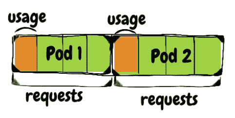
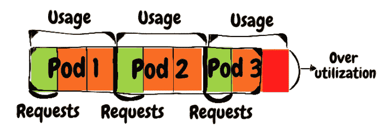

# 您的 K8s 集群需要关注的 6 项指标

> 原文：<https://betterprogramming.pub/6-metrics-to-watch-for-on-your-k8s-cluster-76d58f08397f>

## 要监控的最重要的 Kubernetes 指标

米凯尔·麦克维利在 [Unsplash](https://unsplash.com?utm_source=medium&utm_medium=referral) 上拍摄的照片

库伯内特。如今，该行业中的公司似乎分为两类:已经在生产工作负载中大量使用 it 的公司和正在将工作负载迁移到 it 的公司。

Kubernetes 的问题在于，它不是 Redis RabbitMQ 或 PostgreSQL 那样的单一系统。它是几个控制平面组件(例如 etcd、API 服务器)的组合，通过一组虚拟机在用户(数据)平面上运行我们的工作负载。

乍看之下，控制平面组件、虚拟机和您的工作负载产生的指标数量可能多得令人应接不暇。从这些指标中形成一个全面的可观察性堆栈需要在管理 Kubernetes 集群方面有相当的知识和经验。

那么，如何处理大量的度量标准呢？阅读这篇文章可能是一个好的开始。

我们将涵盖基于 k8s 元数据的最关键指标，这些指标为监控您的工作负载并确保它们处于健康状态提供了良好的基准。为了让这些指标可用，您需要安装 [kube-state-metrics](https://github.com/kubernetes/kube-state-metrics) 和 Prometheus 来收集它所公开的指标，并存储它们以供以后查询。

我们不打算在这里涵盖安装过程，但一个很好的线索是[普罗米修斯头盔图](https://github.com/prometheus-community/helm-charts/tree/main/charts/prometheus)，它安装两者的默认设置。

对于列出的每个指标，我们将涵盖指标的含义、您为什么应该关注它，以及您应该如何在其中设置警报。

# 1.CPU /内存请求与实际使用

什么:每个容器都可以(也应该！)定义对 CPU 和内存的请求。Kubernetes 调度程序使用这些请求来确保选择一个有能力托管 pod 的节点。这是通过计算节点上未使用的资源来实现的，考虑节点的容量减去当前调度的 pods 的请求。

让我们看一个例子来更清楚地说明这一点:假设您有一个节点，它有八个 CPU 核心，运行三个 pod，每个 pod 有一个请求一个 CPU 核心的容器。该节点有五个未预留的 CPU 核心，供调度程序在分配 pod 时使用。

5 个内核可用于其他 pod

请记住，我们所说的“可用”并不是指实际使用情况，而是指当前安排到节点中的 pods 尚未请求(保留)的 CPU 核心。需要六个 CPU 核心的 pod 不会被安排到此节点中，因为没有足够的可用 CPU 核心来托管它。

“实际使用”指标跟踪 pod 在运行时使用了多少资源。当我们测量实际使用情况时，通常是在一组 pod 上(部署、`statefulset`等)。)，所以我们应该参考百分位数而不是单个 pod 的使用量。第 90 百分位应该是这个问题的一个好的起点。

例如，要求每个 pod 有 1 个 CPU 核心的部署可能会在其副本中使用 0.7 个核心。

原因:保持请求和实际使用的一致性很重要。高于实际使用量的请求会导致资源使用效率低下(利用不足)。想象一下，当一个请求四个核心的 pod 在第 90 百分位使用一个核心时会发生什么。

K8s 可以将这个 pod 调度到一个具有四个空闲核心的节点中，这意味着没有其他 pod 能够使用保留的三个未使用的核心。下图显示每个 pod 保留了四个核心，但实际上使用了一个核心，这意味着我们在节点上“浪费”了六个核心。它们将不会被使用。

请求高于实际使用量=未充分利用

记忆也是如此。如果我们将请求设置得比使用量高，我们将无法使用可用的内存。

未对齐的另一个选项是 pod 的请求低于其实际使用量(过度利用)。在 CPU 过度使用的情况下，由于节点上的资源不足，您的应用程序会运行得更慢。

想象三个豆荚。他们每个人都要求一个内核，但实际上使用了三个。这三个 pod 可能被调度到一个 8 核机器中(1 个请求* 3 =3 个<8), but when they do, they’ll compete for CPU time since their actual usage — 9 cores — exceeds the number of cores on the node.

*pod 实际使用量超过了一个节点上的核心数*

而对于 CPU，当内存请求低于要求时，您会经历缓慢的应用程序执行，您可能会遇到其他类型的问题。

如果我们有三个单元，每个单元请求 1 GB 内存，但使用 3 GB，那么它们可能都被安排到一个 8GB 内存的节点中。在运行时，当一个进程试图分配比节点更多的内存时，它会被内核杀死(内存不足杀死),使用 K8s，它会重新启动。

当我们的进程崩溃时，它可能会丢失任何正在运行的请求，并且在它重新启动之前不可用，这使我们的能力不足。一旦启动，它可能会由于冷缓存或其依赖项(数据库、其他服务等)的空连接池而遭受冷启动。).

方法:让我们将 pod 请求定义为 100%。实际使用(CPU 或内存，这并不重要)的合理范围是第 90 百分位的 60%-80%。

例如，如果您有一个请求 10GB 内存的 pod，其实际使用量的第 90 百分位应该是 6GB-8GB。如果它低于 6GB，那么您就没有充分利用您的内存，浪费金钱。如果它高于 8GB，您将会面临由于内存不足而被杀死的风险。我们应用于内存请求的规则也可以应用于 CPU 请求。

# 2.CPU /内存限制与实际使用

内容:当调度程序使用资源请求将工作负载调度到节点时，资源限制允许您在运行时定义工作负载的资源使用边界。

原因:了解 CPU 和内存限制的实施方式非常重要，这样您就能意识到超出这些限制的工作负载的影响:

当一个容器达到 CPU 限制时，它将受到限制，这意味着它从操作系统获得的 CPU 周期比它能够获得的要少，最终导致执行时间变慢。托管 pod 的节点是否有空闲的 CPU 周期并不重要 docker 运行时调节容器。

在没有意识到的情况下被 CPU 节流是非常危险的。系统中随机流的延迟会增加，如果系统中的某个组件受到抑制，并且您没有预先设置所需的可观察性，那么可能很难查明根本原因。这种情况可能会导致部分服务中断或完全不可用，以防被节流的服务参与到我们系统的核心流中。

内存限制和 CPU 限制的实施方式不同:当你的容器达到内存限制时，它会被杀死。这与由于节点上的内存不足而被关闭的效果相同:进程将丢弃正在进行的请求，服务将处于容量不足状态，直到容器重新启动，然后它将进行冷启动。

如果进程积累内存的速度足够快，它可能会进入`CrashLoop`状态。这种状态表明进程要么在启动时崩溃，要么在反复启动后的短时间内崩溃。崩溃循环 pod 通常意味着服务不可用。

方法:监视资源限制的方法类似于我们监视 CPU/内存请求的方法。您的目标应该是超出第 90 百分位限制的 80%的实际使用率。例如，如果我们有一个 pod，其 CPU 限制为两个核心，内存限制为 2GB，则警报应该设置为 1.6 个核心的 CPU 使用率或 1.6GB 的内存使用率。

任何高于这一水平的因素都会导致您的工作负载根据超出的阈值而被抑制或重启的风险。

# 3.所需副本中不可用单元的百分比

内容:当您部署一个应用程序时，您设置它应该运行的所需副本(pod)的数量。有时，由于多种原因，某些 pod 可能不可用，例如:

*   由于资源请求的原因，一些 pod 可能不适合群集中任何正在运行的节点。这些 pod 将转换为挂起状态，直到某个节点释放资源来托管它们，或者满足要求的新节点加入集群。
*   一些 pod 可能没有通过活性/就绪性探测，这意味着它们要么正在重新启动(活性)，要么正从服务端点中取出(就绪性)。
*   如上所述，一些 pod 可能会达到其资源限制，并进入崩溃循环状态。
*   由于各种原因，一些 pod 可能被托管在故障节点上，如果该节点不健康，大多数情况下托管在其上的 pod 将不能很好地运行。

原因:pod 不可用对您的系统来说不是一种健康的状态。这可能会导致从轻微服务中断到完全服务不可用的任何情况，具体取决于不可用的 pod 占所需副本数量的百分比，以及缺少的 pod 在系统核心流中的重要性。

如何:我们在这里要监控的函数是不可用的 pod 占期望的 pod 数量的百分比。您应该在 KPI 中设定的确切百分比取决于服务及其在您系统中的每个 pod 的重要程度。

对于某些工作负载，只要系统能够自行恢复健康状态，并且对客户没有影响，我们就可以接受 5%的 pod 在某段时间内不可用。对于某些工作负载，即使一个不可用的 pod 也可能成为问题。一个很好的例子就是`statefulsets`，其中每个 pod 都有其独特的身份，让它不可用可能是不可接受的。

# 4.HPA 最大副本数中的所需副本数

内容:Horizontal Pod Autoscaler (HPA)是一种 k8s 资源，允许您根据您定义的目标功能调整工作负载正在运行的副本数量。常见的用例是根据部署中 pod 的平均 CPU 使用率与 CPU 请求数的比较来自动扩展。

原因:当部署的副本数量达到 HPA 中定义的最大值时，您可能会遇到需要更多单元，但 HPA 无法纵向扩展的情况。根据您设置的`scale up`功能，结果可能会有所不同。这里有两个例子来说明这一点:

*   如果`scale up`函数使用 CPU 使用率，那么现有 pod 的 CPU 使用率将增加到达到极限并被抑制的程度(详见第 2 点)。这最终会降低系统的吞吐量。
*   如果`scale up`函数使用定制的度量标准，比如队列中未决消息的数量，那么队列可能会被未决消息填满，这会在处理管道中造成延迟。

如何:监控这个指标非常简单。您需要为当前副本数除以 HPA 最大副本数设置一个`X%`阈值。一个理智的`X`可能是 85%允许你在达到最大值之前做出必要的改变。

请记住，增加副本的数量可能会影响系统的其他部分，因此您最终可能会更改比 HPA 配置更多的内容来支持这个`scale up`操作。

一个典型的例子是，当您增加副本的数量并且有更多的 pod 尝试连接到数据库时，该数据库将达到其最大连接限制。这就是为什么在这种情况下，将足够大的缓冲区作为准备时间是非常有意义的。

# 5.状态检查失败的节点

内容:kubelet 是一个 k8s 代理，运行在集群上的每个节点上。在它的职责中，kubelet 发布一些指标(称为节点状况)来反映它所运行的节点的健康状态:

*   `Ready` —如果节点正常并准备好接受 pod，则为真
*   `DiskPressure` —如果节点磁盘的可用存储空间不足，则为真
*   `MemoryPressure` —如果节点内存不足，则为真
*   `PIDPressure` —如果节点上运行的进程太多，则为真
*   `NetworkUnavailable` —如果节点的网络配置不正确，则为真

健康节点应在`Ready`条件下报告`True`，在所有其他四种条件下报告`False`。

原因:如果`Ready`条件变为负值，或者任何其他条件变为正值，这可能意味着该节点上运行的部分或全部工作负载运行不正常，这是您应该注意的事情。

对于 DiskPressure、`MemoryPressure`和`PIDPressure`，根本原因非常清楚——一个进程以节点无法维持的速度写入磁盘/分配内存/产生进程。

`Ready`和`NetworkUnavailable`的情况有点复杂，需要进一步调查才能弄清问题。

如何实现:首先，我预计正好有 0 个节点不健康，这样每个不健康的节点都会触发一个警报。

# 6.持久卷利用率

内容:永久卷(PV)是一种 k8s 资源，代表一个存储块，可以连接到系统中的 pod，也可以从 pod 中分离。PV 的实现是特定于平台的。

例如，如果您的 Kubernetes 部署基于 AWS，那么一个 PV 将由一个 EBS 卷来表示。与每个数据块存储一样，它也有容量，可能会随着时间的推移而变满。

原因:当一个进程使用一个没有空闲空间的磁盘时，就会发生混乱，因为故障可能有一百万种不同的表现形式，而且堆栈跟踪并不总是能找到根本原因。除了避免将来的失败之外，观察这个指标还可以用于规划记录和添加数据的工作负载。

Prometheus 是这种工作负载的一个很好的例子，因为它将数据点写入其时序数据库，这意味着磁盘中的可用空间量减少。由于 Prometheus 写入数据的速度非常一致，因此很容易使用 PV 利用率指标来预测删除旧数据或为磁盘购买更多容量所需的时间。

如何实现:kubelet 公开了 PV 的使用和容量，因此在它们之间进行简单的划分就可以提供 PV 的利用率。很难提出一个合理的警报阈值，因为它实际上取决于利用率图表的轨迹，但根据经验，在耗尽光伏存储之前，至少要给自己两到三周的时间。

# 摘要

正如您已经知道的，处理 Kubernetes 集群不是一件容易的事情。有大量的可用指标，选择重要的指标需要大量的专业知识。

让一个仪表板监视您的集群的关键指标，既可以作为一种预防措施来避免问题的发生，也可以作为一种工具来排除系统中潜在的问题。

**注** *:这篇博客也发表在* [*Komodor*](https://komodor.com/blog/6-metrics-to-watch-for-on-your-kubernetes-cluster/) *的科技博客上。*