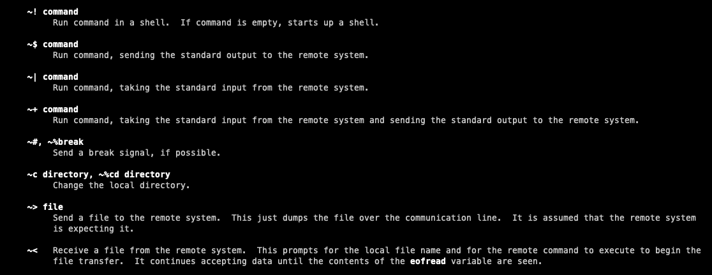
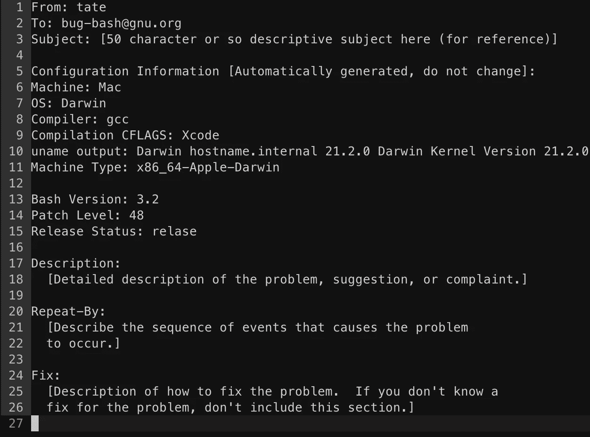

# 您应该尝试的 6 个古怪的 Linux 实用程序

> 原文：<https://betterprogramming.pub/6-more-oddball-linux-utilities-you-should-try-7ba8552c2e2e>

## 回到我们最喜欢的目录中寻找一些奇怪的发现


由 [Lukas](https://unsplash.com/@lukash?utm_source=unsplash&utm_medium=referral&utm_content=creditCopyText) 在 [Unsplash](https://unsplash.com/s/photos/linux?utm_source=unsplash&utm_medium=referral&utm_content=creditCopyText) 上拍摄的照片

我们再次在`/usr/bin`的深处寻找一些隐藏的宝石。搜索隐藏在选项海洋中的有趣程序，等待被重新整理和播放。这些令人着迷的 Linux 实用程序似乎是无穷无尽的。

在本版中:“*嘿，这看起来很整洁！*“我们正在寻找一些真正的怪人，他们的用法更多的是在新颖性而不是功能性方面。这些实用程序可能不太为人所知，可能已经过时了，但是它们仍然有着有趣的用途，并且可以让我们了解 Linux 本身的历史。

让我们来看看。

# 1.离开

不，等等，不要真的离开！我保证这个很酷。

`leave`程序实际上是作为一种通知终端用户何时应该去赴约或休息的方式而创建的。

用法很简单。您可以通过发出以下命令来设置希望直接收到通知的时间:

```
leave 1050
```

这将在上午 10:50 或下午 12 小时内通知您。

或者，您可以通过在当前时间前加一个`+`来输入当前时间的小时数和分钟数:

```
leave +0010
```

这会通知你十分钟后离开。

这个工具显然已经过时了，已经被大量新的通知系统所取代，尤其是我们手机上的通知系统。但是它非常简单，而且只能做一件极其有限的事情。在当今异常复杂的世界中，这是一个简单程序的优雅例子。

下次你想提醒自己短暂休息时，试试用`leave`。

# 2.逃亡

这不是拼写错误的“羔羊”版本。这是`lam`实用程序，是“层压板”的缩写。这个程序将把两个文件的内容并排放到控制台中。就像是花式版的`cat`。

假设我们有两个文件:

```
# file01
line 1
line 2
line 3# file02
line 4
line 5
line 6
```

现在让我们把这些坏男孩层压起来:

```
> lam file01 file02line 1line 4
line 2line 5
line 3line 6
```

简单。现在它们在同一条线上被“层压”在一起。

起初这似乎完全没有用，是的，你完全可以用大约一百个其他实用程序做类似的事情，但是`lam`可能是最简洁的方法。它是专门为此任务而构建的。

使用像`awk`这样的其他实用程序，您将把许多命令串在一起以获得相同的输出。有了`lam`，你会得到你所期望的。*层压*。

# 3.喷雾

别担心，这里没有实际的液体。`spray`实用程序只喷洒网络数据包。

这个恶作剧的小程序真的会向主机喷射成吨的数据包。您可以指定一组数据包的数量、大小和每个数据包之间的延迟。

这对于网络或主机负载测试之类的事情很有用，尤其是如果您的目标是查看如何处理流量的突然峰值。

您可以通过发出以下命令(以 root 用户身份)来测试 spray，但是要小心！该程序会影响主机和网络性能:

```
spray <host_ip>
```

`spray`实用程序还记录发送/接收的数据包数量。查看[手册](https://www.unix.com/man-page/freebsd/8/spray/)了解更多详情。

# 4.铜


cu 实用程序手册页的一节。

`cu`或“呼叫”实用程序是拨号计算时代的一个有趣的遗留物。这个程序让你真正地*拨*另一台 Unix 机器并在其上执行操作。您也可以通过像串行端口这样的本地端口执行这些操作。

`cu`程序是一个为广泛用途而设计的应用程序的例子。你不仅可以发送和接收来自远程机器的命令，还可以复制文件。还有大量详细的连接模式和选项。



cu 手册页中有关命令类型的部分。

不幸的是，正如手册页中所言，这个程序似乎不再被维护，并且“不能很好地工作”。

# 5.巴什布格

`bashbug`实用程序是一个纯粹为了方便而设计的程序的例子。这个程序帮助您构建一个详细的 Bash bug 报告。报告是预先格式化的，并自动在您首选的默认文本编辑器中打开。

`bashbug`实用程序消除了提交错误报告的猜测和偏差。作者们显然希望报告的撰写更加一致，但又不增加用户提交报告的摩擦。创建`bashbug`降低了根据维护者指南提交干净有序的错误报告的障碍。

当然，作者可以发布一个模板供任何人使用，但是他们更进一步，为它创建了一个专用的实用程序。



Bashbug 输出准备在 vim 中编辑。

如果您确实遇到了您认为是 Bash 中合法的 bug，请使用`bashbug`提交报告。只需执行`bashbug`，您将被带到您的默认编辑器，一份报告已经准备好，等待填写。

# 6.en 猜猜

观察力敏锐的读者可能已经猜到了这个工具的作用。`encguess`程序试图猜测一个文本文件的编码。再说一次，这可能看起来很琐碎，但当试图解析外国文本文件时，这可能是天赐之物。

文本数据并不总是以标准格式接收的。无论您是从用户上传数据，还是通过不同的脚本收集数据，或者只是从 web 上抓取数据，它都有可能以各种编码类型出现。

使用`encguess`程序，您可以快速尝试确定编码。假设我们有一个简单的文本文件，包含以下纯文本:

```
# test.txt
this is a test
```

如果您运行`encguess text.txt`，您将收到以下输出:

```
test.txt US-ASCII
```

显然，这是一个极其简单的例子。当然，它可以找出标准的 ASCII 字符。一个充满表情符号的文件怎么样？

😀😀😀

对这个文件运行`encguess`会产生预期的格式:

```
emoji_test.txt UTF-8
```

这个工具相当准确，在试图破译外国编码风格时非常有用。如果您知道应该使用什么类型，您也可以在运行`encguess`时通过传递`-s`标志来指定“可疑”的编码类型。

感谢您的阅读！如果您错过了本系列的早期版本，请花点时间查看一下:

*   [*6 你应该知道的端子命令*](/6-terminal-commands-you-should-know-8e9767bdfec)
*   [*6 更多你应该知道的终端命令*](/6-more-terminal-commands-you-should-know-3606cecdf8b6)
*   [*6 个鲜为人知的 Linux 命令你应该试试*](https://medium.com/swlh/6-lesser-known-linux-commands-you-should-try-ab739e1088d)