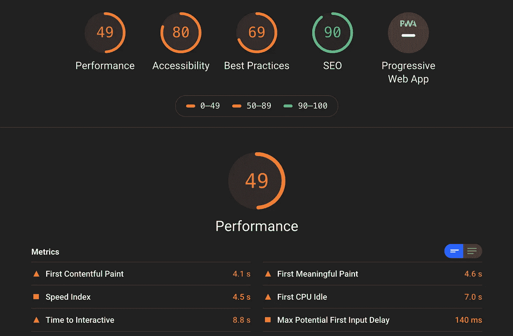
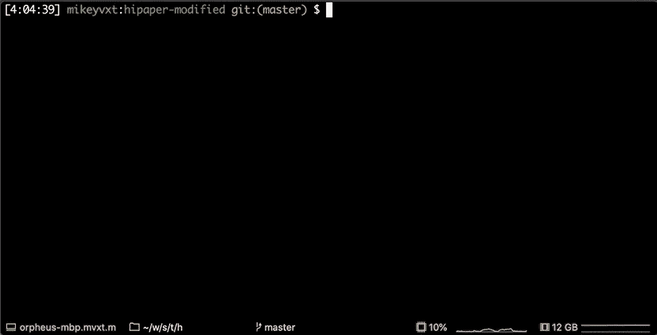
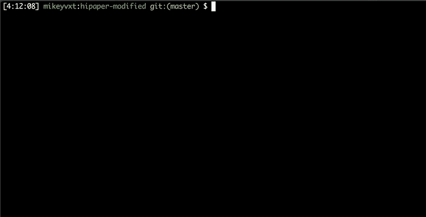

# 开发人员必备的 6 个工具

> 原文：<https://betterprogramming.pub/6-must-have-tools-for-developers-430fd56933dd>

## Lighthouse、direnv 等等


由[叶夫根尼·切尔卡斯基](https://unsplash.com/@evgenit?utm_source=unsplash&utm_medium=referral&utm_content=creditCopyText)在 [Unsplash](https://unsplash.com/s/photos/lighthouse?utm_source=unsplash&utm_medium=referral&utm_content=creditCopyText) 上拍摄的照片

# 哦，我的 Zsh

Oh My Zsh 是一个 Z shell 的包装器，让你的终端成为一个令人愉快的工作工具。

除了[各种主题](https://github.com/ohmyzsh/ohmyzsh/tree/master/themes/)、便利功能和内置默认设置，你还可以享受各种扩展功能的插件，包括 [Docker](https://github.com/ohmyzsh/ohmyzsh/tree/master/plugins/docker) 、 [Kubernetes Kubectl](https://github.com/ohmyzsh/ohmyzsh/tree/master/plugins/kubectl) 和 [tmux](https://github.com/ohmyzsh/ohmyzsh/tree/master/plugins/tmux) 、[等等](https://github.com/ohmyzsh/ohmyzsh/tree/master/plugins)。

我最喜欢的功能是标签完成和标签循环。我可以通过反复按下[标签](https://github.com/ohmyzsh/ohmyzsh/tree/master/plugins/tmux)来快速遍历目录和文件。


我提到我的提示有多酷了吗？它给了我任何时候需要的一切:

`[TIMESTAMP] USER:CURRENT_DIRECTORY VCS:(BRANCH) $`

这个 Oh My Zsh 的主题是 [geoffgarside](https://github.com/ohmyzsh/ohmyzsh/wiki/Themes#geoffgarside) ，我在 iTerm2 中的配色是探戈黑。点击查看更多 [iTerm 配色方案。](https://iterm2colorschemes.com/)

# 迪伦夫

[direnv](https://direnv.net/) 是一个 shell 扩展，当您`cd`进入一个目录时，它会自动加载环境变量。

这件事为我节省了很多时间，尤其是当我处理许多项目时，这些项目都需要不同的 ENV 变量——甚至同一个 ENV 变量需要不同的值。

它很容易安装，编写`.envrc`文件甚至更容易，因为它只是你已经在`.profile`或`.*rc`文件中编写的一堆`export BLAH=BLAH`语句。

当您使用`.envrc`文件退出目录时，它会自动清除那些 ENV 变量。方便！

请看下面的实际操作。


# Lighthouse/Chrome 开发工具

light house(Chrome 内置的功能)是一个开源插件，用于检查你的网站的性能。

从文本压缩到渲染阻塞资源，该工具扫描给定的网站，并生成一份报告来帮助您找出是什么东西拖慢了您的页面。

这对于网站的可访问性和性能都非常重要。

许多开发人员投身于 web 开发，主要是学习如何创建看起来非常漂亮的网站。但是性能是一个经常被忽视的原则，可以说它和美学一样重要。

一些网站规模太大，加载了太多的资源，以至于在慢速互联网连接下几乎无法使用，或者耗尽了移动设备的大量电池。

使用它，看看你可以加快和优化你的网站。

**注意**:这个工具也可以通过 Chrome web Tools 在本地托管的 Web 服务器上运行。Cmd+Alt+I →审计选项卡→生成报告。



# vim-plug 和 MELPA 稳定

如果你是 Vim 或 Emacs 的狂热用户，你会知道这两种文本编辑器都有大量非常有用的插件，让生活变得更加轻松。

从语法突出显示到符号索引，这些插件要么可以增加一点便利，要么基本上将你的文本编辑器变成自金属音乐以来最激烈的东西。例如，看看 [Emacs Live](http://overtone.github.io/emacs-live/) 的 Clojure 特性。

[vim-plug](https://github.com/junegunn/vim-plug) 和 [MELPA Stable](https://stable.melpa.org/#/) 分别是 vim 和 Emacs 的插件管理器。使用它们来安装你需要的所有插件，让整个体验变得无缝和内置。


使用 vim-plug 安装/更新 vim 插件

# 命令行模糊查找器(fzf)

[命令行模糊查找器](https://github.com/junegunn/fzf)(或 fzf)是一个模糊搜索工具，用于在目录树中快速查找文件。顺便说一下，它是由制作 vim-plug ( [Junegunn Choi](https://github.com/junegunn) )的同一个工程师编写的。

这个工具非常快，因为它是用 Go 编写的，并且使用并发线程来分而治之。

为了更好地使用 fzf，我实际上在我的 shell 配置文件中映射了这两个别名:

```
alias v='nvim'
alias f='v `fzf -i`'
```

我可以只输入字母`v`后跟一个文件名，在 [Neovim](https://neovim.io/) 中打开它。

我将它与 fzf 结合起来，对特定文件进行快速搜索。fzf 的输出是带有完整路径的文件名。然后，我将它作为参数传递给我的别名`v`。

结果呢？在 Neovim 中快速文件搜索和快速文件打开。生活是美好的。



# 白银搜寻者(Ag)

白银搜索者(Ag)基本上是一个聪明、递归的类固醇 T2。

虽然 fzf(如上)非常适合搜索文件名，但是 Ag 非常适合搜索这些文件中的内容以查找特定的标记和匹配。

让它真正伟大和令人敬畏的是，它自动忽略的文件是你的`.gitignore`文件的一部分。一个`grep -r`会在你的`node_modules`里吐出一堆不相关的匹配，Ag 的搜索速度极快，因为它只搜索重要的文件。

默认情况下，Ag 输出结果也会给出一个行号。从技术上来说，你可以通过向`grep`提供大量的参数来实现 Ag 所做的一切，但是最终，Ag 仍然要快几倍——并且继续变得[更快](https://geoff.greer.fm/ag/speed/)。



# 结论

编码快乐！感谢阅读。