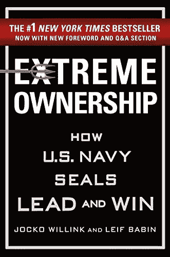
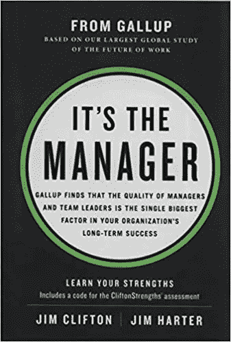
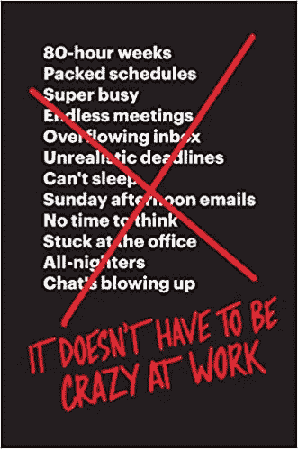
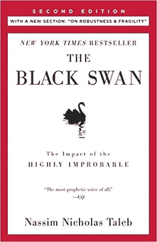
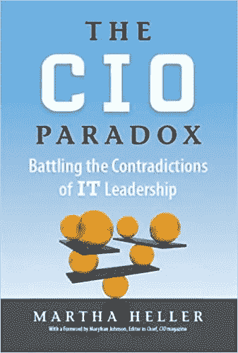

# 新技术主管的 6 本必读书籍

> 原文：<https://betterprogramming.pub/6-must-read-books-for-new-technical-leads-99e9737b8630>

## 减轻你对新的管理角色的焦虑

照片由[克里斯蒂娜](https://unsplash.com/@wocintechchat?utm_source=unsplash&utm_medium=referral&utm_content=creditCopyText)在 [Unsplash](https://unsplash.com/s/photos/books-and-laptop?utm_source=unsplash&utm_medium=referral&utm_content=creditCopyText) 上拍摄

走向管理是一个巨大的挑战。也是很大的成就。

作为一名技术人员，在我们的培训和职业生涯开始期间，大部分注意力都放在个人工作和个人表现上。成为一名技术领导者似乎令人生畏。

世界上最难的问题的答案可以在书中找到。我们为新的技术线索编制了一个包含六大资源的列表。我们希望他们能让你更顺利地过渡到管理层。

# 1.极端所有权:美国海军海豹突击队队员如何领导和取胜

乔科·威林克是一名职业美国海军海豹突击队，《极端所有权》是对海豹突击队领导方法的描述，与商业原则相关。不出所料，其主要思想是，对与你的团队、产品和使命相关的一切拥有极端的所有权。一切都需要采取严肃的态度。

从本书中最重要的收获是倾听和信任你的团队。因为你已经被提升到管理职位，他们是你所在领域的新专家——而不是你。你的新工作是为他们的成功扫清道路。不同的人对成功有不同的需求，经理的角色是找出这是什么，以及如何让他们成功。

# 2.《经理人的素质》——朱莉·卓

《管理者的成就》( 2019)探讨了新经理在头三个月及以后可以做些什么来确保他们的团队取得优异的成绩。首先要记住的一件事是，如果你在职业生涯中达到了这个阶段(技术领导)，这意味着有人足够相信你，给了你这个机会。

正如朱莉·卓(Julie Zhuo)指出的那样，新经理总觉得自己像个冒牌货——力不从心，配不上这个角色。

25 岁时，朱莉被任命管理脸书的设计团队。起初，她认为自己的工作包括召开会议、提供反馈以及决定提拔或解雇谁。她很快意识到这种方法并不关注长期目标。几年后，她意识到她的工作是确保她的团队一起顺利工作，团队中的每个人都为个人成功做好了准备，每个人都觉得自己可以实现职业目标。

凭借近十年的管理经验，朱莉现在认为，经理的工作就是*让你的团队取得更好的成果。*

# 3.工作中不一定要疯狂——杰森·弗里德和大卫·海涅迈尔·汉森

在工作中不一定要疯狂，这是我们推荐列表中的一本书，它将与你将从其他资源中阅读和学习的所有内容相抵触。

Basecamp 的联合创始人杰森·弗里德和大卫·海涅迈尔·汉森认为，一个成功、盈利的公司不应该要求员工疯狂工作，放弃假期，生活在持续的压力下。他们认为，有一种更冷静的方式来经营企业，即牺牲疯狂的短期增长，以支持可持续、持续的长期增长。

如果有人能谈论可持续增长，那就是这两个人。Basecamp 已经有 21 年左右的历史了(是的——base camp 成立于 1999 年！)今年的收入为 2500 万美元，外部投资为 0 美元，拥有 63 名员工。

这本书的一个重要观点是，目前社交媒体上有很多关于建立一家成功公司所需的疯狂态度和牺牲的言论。有口号支持这一点，如“极端的天赋不是必要的，但极端的承诺是必要的！”这本书讲述了一个关于查尔斯·达尔文的故事，这位传奇的进化科学家一生写了 19 本书，据说他每天的工作时间从未超过 4 个半小时。作者认为，解决这种疯狂的办法是“和平主义”:专注于自己的事业，而不是竞争。

作为一名新的技术主管，你有责任让你的员工拥有健康的生活和工作平衡，他们的压力水平不会一直处于疯狂状态(老实说，没有完全没有压力的技术工作，但压力是可以管理的)。你的主要目标是保护员工的时间。“没有可以用电子邮件代替的会议”是实现这一目标的一个很好的经验法则。

# 4.高产出管理——安德鲁·s·格罗夫

《高产出管理》是一本关于愿景变革力量的革命性书籍。安德鲁·格罗夫是一名商人，曾任英特尔公司董事长兼首席执行官。自 1979 年被任命为首席执行官以来，他在将该公司打造为全球最大的半导体制造商方面发挥了重要作用。

在 Andrew 看来，经理的角色是识别和解决阻碍团队实现最大效率的瓶颈。可用的解决方案通常是雇佣更多的劳动力或购买更多的设备。这就引出了经理的下一个关键任务，平衡一切成本效益。

这本书的另一个重要观点是，每个经理都应该选择至少五个企业状况的指标。这些指标需要每天早上看一下。

最后一点是，管理是团队的努力。对经理的评价不仅仅是他们的技能和成就，而是他们团队的表现。

# 5.纳西姆·尼古拉斯·塔勒布的《黑天鹅》

《黑天鹅》探索了我们所感知的随机事件的本质，以及导致我们错过更大图景的逻辑陷阱。“黑天鹅”是被认为不可能发生的事件，但它还是发生了。在有人见过黑天鹅之前，人们认为所有的天鹅都是白色的。

这本书的一个启示是，作为一名经理，你面临着你以前从未面临过的挑战。作为人类，我们极易受到哪怕是最基本的逻辑谬误的伤害。我们倾向于根据我们对过去的了解来创作故事。作为管理者，你需要打破这个习惯，转而去分析眼前的数据。

# 6.首席信息官悖论:对抗 IT 领导的矛盾精装版——玛莎·赫勒著

玛莎·赫勒的《首席信息官悖论》可能是六部书中我最喜欢的一部。我们都同意，对于大多数企业来说，它已经成熟，甚至在与流行病相关的封锁开始之前，我们的大部分生活都转移到了网上。CIO(或首席信息官)负责弥合业务的技术方面与其他方面之间的差距。它昂贵、复杂，而且对大多数企业来说，绝对至关重要。

这本书讲述了一些关于成功首席信息官的故事，但我最喜欢的一本是关于贝克特尔全球工程首席信息官盖尔·拉姆莱斯的。当 Ramleth 加入 Bechtel 时，他注意到 IT 部门以外的员工将 IT 视为阻碍工作完成的障碍。Ramleth 继续将 Bechtel 的 33 个不同的 IT 帮助台合并成一个单一的单元，具有一个 24/7 可用的通用售票系统。通过这样做，Ramleth 将解决的问题数量从 20%增加到 65%以上，并将总体 IT 成本降低了 30%以上。

本书的一个重要启示是，首席信息官和任何技术领导者都有责任在关注创新的同时维护和改善日常运营。但是一个技术领导者也必须留意在业务中创造巨大差异的机会。通常，他们依靠商业智能来寻找这样的机会。

# 关闭

走向管理并不容易。这些书可以帮助你平稳过渡，增加你的团队成员跟随你成为领导者的几率。

所有这些书中反复出现的主题是，一旦你迈出这一步，你必须接受你不再是创造者的事实。你现在是推动者。你的更高目标是确保为你工作的创造者有最好的机会提升他们的职业生涯并实现他们的目标。

Catalin ( [@cionescu1](https://twitter.com/cionescu1) )是 Ruby on Rails 的顾问，是免费约会管理软件[Organisely](https://www.organisely.app/)的创始人，也是《T4 现代铁路——在 Ruby on Rails 中构建 CRM 的作者。