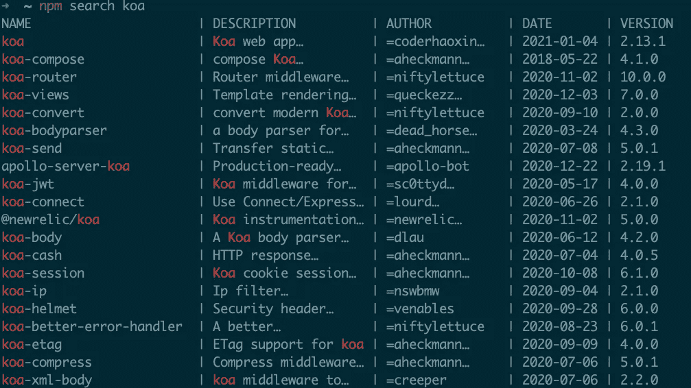

# 高效开发人员使用的 6 个 npm 命令

> 原文：<https://betterprogramming.pub/6-npm-commands-used-by-highly-productive-developers-af2bf9a8bb99>

## 使用这些 npm CLI 提示增强您的版本控制流程


由[扬·廷伯格](https://unsplash.com/@craft_ear?utm_source=medium&utm_medium=referral)在 [Unsplash](https://unsplash.com?utm_source=medium&utm_medium=referral) 上拍摄的照片

npm 是世界上使用最多的 Node.js 包管理器，自 2010 年首次发布以来，它已经成为 JavaScript 开发人员真正的游戏规则改变者。

代码可共享性的这种进步使 JavaScript 社区呈指数级增长，使这种编程语言成为 IT 界最受欢迎的语言之一。

现在，在其第七个主要版本中，npm 随着时间的推移而发展，继续带来许多新的特性，并在他们的日常操作流程中帮助开发人员。

npm 如此出色的原因是它不可思议的 CLI，它提供了许多命令来完成我们几乎需要的任何事情。这里真正的问题是:我们真的了解他们所有人吗？我将分享那些我认为最有用的，以及那些不常使用的，但帮助我改善了日常编码程序中一些重复部分的方法。

# npm 医生

您多久会遇到一次 npm 脚本出现问题，而您的应用程序无法运行的情况？您可能会问自己出了什么问题——之后，您的第一个方法可能是删除所有的`node_modules` 并进行全新安装，对吗？但是如果这样不行呢？

问题通常不在代码中，而可能仅仅是您的本地 npm 安装中出现了问题。

npm 医生运行一组检查来控制(npm 缓存可用性、npm 注册表等。)如果您的安装具有在您的机器中顺利工作所需的所有组件。

```
$ npm doctor
```

# npm 缓存

正如您肯定能猜到的，这个命令允许开发人员管理 npm 本地安装的内部缓存。即使它没有提供各种各样的选项，但如果您想快速清理缓存或验证其完整性，这绝对值得一试。

它的 API 带有以下命令:

```
// Clean the cache for a specific path
npm cache clean [<path>]// Verify cache integrity, garbage collection, etc...
npm cache verify// Add manually a package to the cache
npm cache add <tarball file | folder | <name>@<version>>
```

# npm 链接

这可能是我发现最有用的一个，因为它使我能够安装本地依赖项，就像它们是 npm 注册表中真正的 npm 包一样。

它主要做的是在你的`node_modules`文件夹中为指定的依赖关系创建一个链接，允许你在两个不同的项目上工作，而不需要发布它们来检查它们是否能很好地一起工作。

如[官方文档](https://docs.npmjs.com/cli/v6/commands)中所述，链接操作分为两步:

1.  首先，我们需要直接在包项目的根文件夹中使用`npm link`来创建我们想要公开的依赖项的符号链接。
2.  之后，您可以使用`npm link <package-name>`在`node_modules`文件夹中创建一个符号链接，将链接的文件夹连接到另一个项目。

# npm ls

更好的理解是`npm list`，这个简短的命令通过列出项目中已安装的依赖项来提供帮助。它采用了多种选项，可以给出关于我们已经安装的内容的更有趣的结果。

我个人是该命令的忠实粉丝——它在过去确实帮助我了解了计算机的当前状态，并在依赖关系有冲突的地方进行了调试。

毫无疑问，最受欢迎的命令是:

```
npm ls -g --depth 0
```

它将显示您机器上当前版本 Node 的所有全局安装的依赖项，让您更广泛地了解可能影响您项目的依赖项的因素。

# npm 搜索



npm 搜索 koa

npm CLI 工具的`search`命令是一个非常好的工具，如果你想在安装软件包之前找到它的基本细节的话。它试图匹配传递的查询并找到相关的包，返回一些有用的信息。

需要一长串参数才能使您的搜索更加精确。试一试，并尝试找到您的公共包！

# npm 回购

最后但同样重要的是，这是我使用最多的命令。如果项目的`package.json` 具有用有效 URL 定义的`repository` 字段，该命令会将您直接带到该页面，打开您喜欢的编辑器的一个新标签。

当在项目的终端上工作时，它特别有用，并且您需要快速访问存储库来检查现有的 PRs、贡献者等。

```
npm repo
```

# 结论

npm 通过其 CLI 提供的命令和选项列表比我谈到的这六个要长得多，将它们集成到您的日常工作流中肯定会帮助您自动化一些重复的过程。我强烈推荐阅读[完整文档](https://docs.npmjs.com/cli)。

我希望你喜欢这篇文章。感谢阅读！