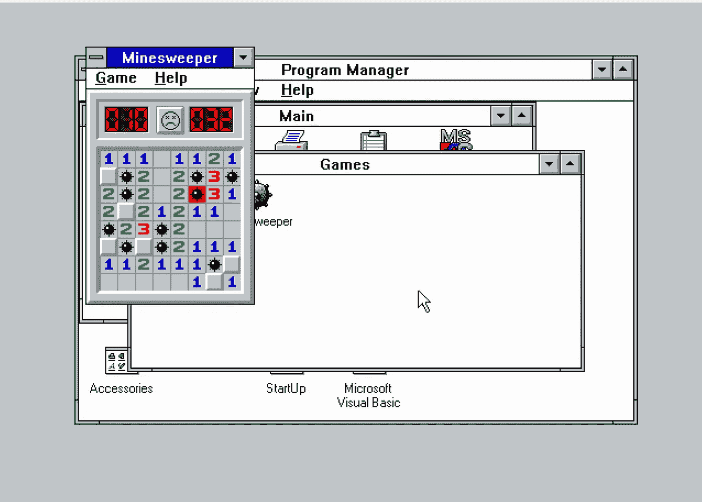
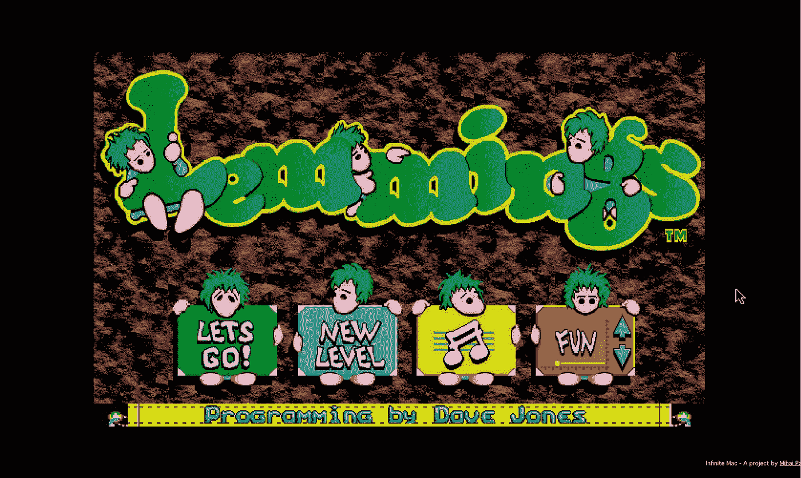
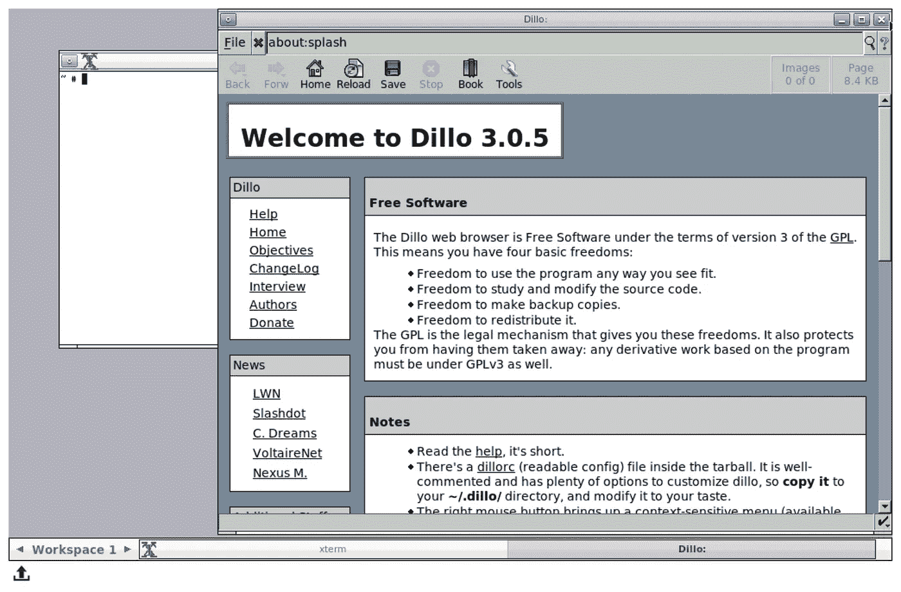
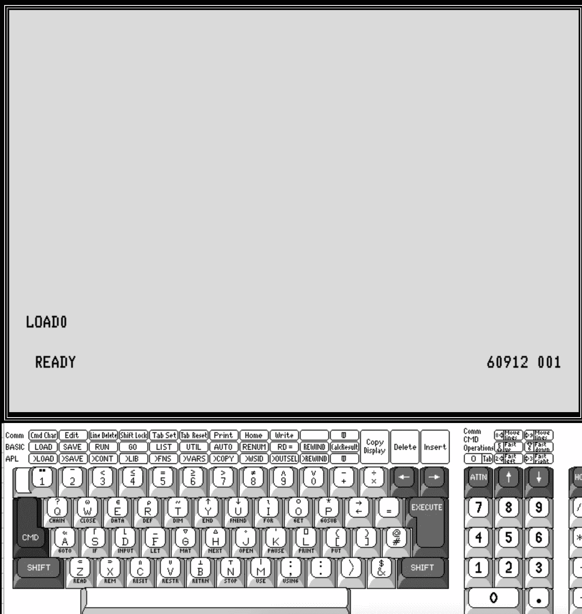
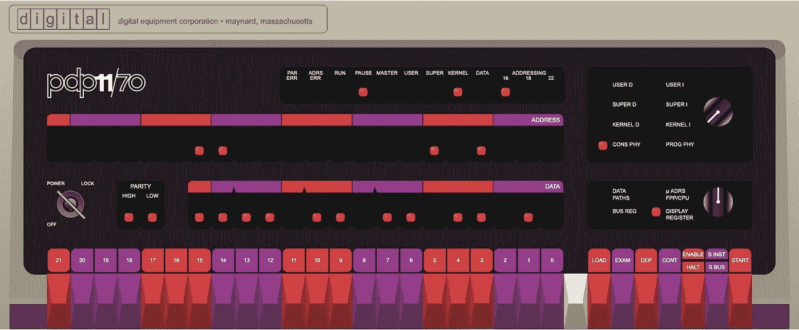
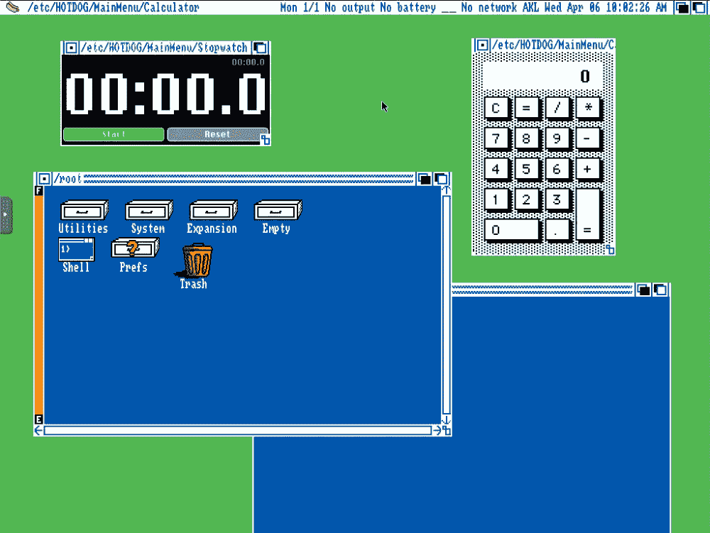
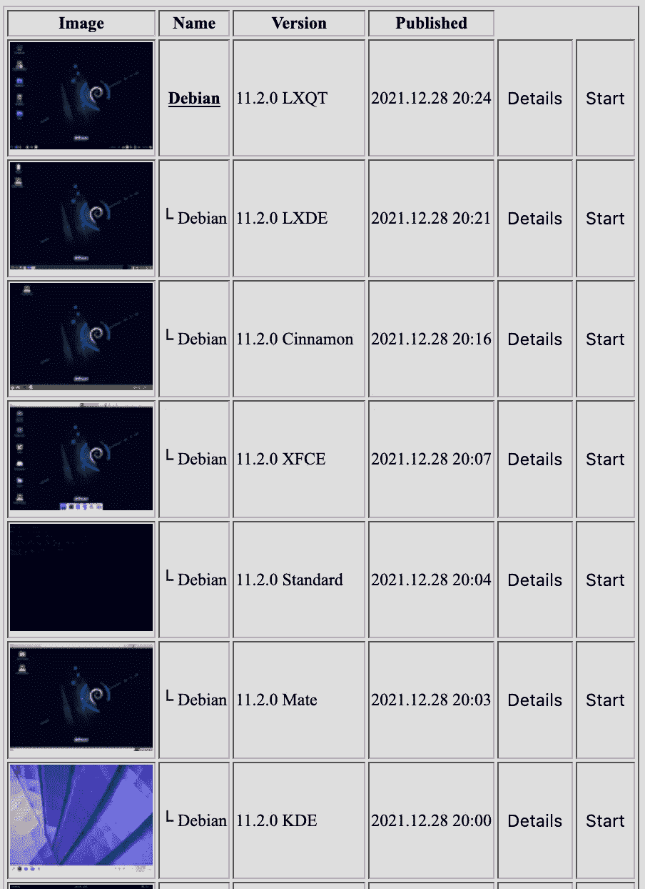

# 6 个完全用 JavaScript 编写的操作系统模拟器

> 原文：<https://betterprogramming.pub/6-operating-system-emulators-written-entirely-in-javascript-5506a4df2d04>

## 运行整个操作系统，无需离开舒适的浏览器

照片由 [Unsplash](https://unsplash.com/s/photos/web?utm_source=unsplash&utm_medium=referral&utm_content=creditCopyText) 上的 [Clément Hélardot](https://unsplash.com/@clemhlrdt?utm_source=unsplash&utm_medium=referral&utm_content=creditCopyText) 拍摄

如果你和我一样，那么你会对 JavaScript 又爱又恨。它在网络上无处不在，运行在浏览器中，几乎是所有网络应用的支柱。然而，JavaScript 并不是最健壮的语言。它可能令人费解和沮丧，但仍然是最通用和广泛使用的语言之一。

***它也是浏览器中唯一可用的脚本语言……***

JavaScript 可以用于无数不同的应用程序。从前端到后端的一切。从移动到桌面以及介于两者之间的一切。最棒的是，由于许多开发人员对 JavaScript 的“怪癖”感到沮丧，它一直在不断改进。

ECMAScript 标准的出现开始改善 JS 并为其添加特性，使其更加灵活和兼容。如今，在现代浏览器中，你可以构建令人印象深刻的复杂应用程序，很少需要离开浏览器引擎。

那么，您如何处理这样一个灵活的工具呢？

当然是运行整个操作系统。

在本文中，我们将探索一些完全在浏览器中运行的最好的 JavaScript OS 模拟器。你不需要安装任何东西，你会有一个(*主要是*)功能操作系统在你的指尖运行。让我们来看看一些很棒的例子。

## 1. [Windows 3.1](https://www.pcjs.org/software/pcx86/sys/windows/3.10/) (及更多)

使用 PCjs 在 Windows 3.1 上玩扫雷。

PCjs.org 的模拟器目录非常庞大。他们有从拱廊橱柜到手持 TI 图形计算器的各种仿真。该系列中最令人印象深刻的无疑是 Windows 3.1 选项。这是一个非常实用的操作系统版本，它在浏览器中运行得非常好。

关于 PCjs.org 上的仿真，一个方便的事情是它们带有一套工具来控制底层系统。你可以加载不同的软盘，改变 CPU 速度和其他基本控制。有些浏览器模拟器并不总是提供这些选项。

查看完整的[PCjs.org 目录](https://www.pcjs.org/)寻找更多复古商品。

## 2.无限 Mac ( [系统 7](https://system7.app/) & [Mac OS 8](https://macos8.app/) )

使用 Infinite Mac 在 Mac OS 8 上玩旅鼠。

Infinite Mac 项目是对 System 7 和 Mac OS 8 操作系统的高速浏览器模拟。这是对最初的 Macintosh Quadra 机器的直接模仿，那是 90 年代早期的 Mac，旨在获得更高的性能。

这个仿真绝对是我用过的最流畅的一个。与大多数其他模拟器相比，输入延迟要小得多。虽然没有你在 PCjs.org 找到的那么多附加功能，但这是一个非常好的模拟。模拟器周围的 Mac 显示器边框也是一个不错的复古风格。

*   系统 7 版本在这里有: [https://system7.app](https://system7.app/)
*   Mac OS 8 版本可从这里获得: [https://macos8.app](https://macos8.app/)

原作者 Mihai Parparita 维护着一个博客，上面有关于项目[的非常详细的信息，请点击这里](https://blog.persistent.info/2022/03/blog-post.html)。

## 3. [JSLinux](https://bellard.org/jslinux/)

使用 JSLinux 在 Alpine Linux 上浏览 web。

在你模拟了 Mac 和 Windows 之后，下一个合乎逻辑的步骤是尝试 Linux。幸运的是，法布里斯·贝拉已经成功地用 JavaScript 创建了一个有效的 Linux 仿真。这个项目叫做 JSLinux，它提供了几个 Linux 发行版供您模仿。

您可以运行 GUI 和仅控制台版本的发行版，如 Alpine 和 Fedora。这个模拟器不是最流畅或最快的，但它很灵活，允许您利用多个构建块发行版，这些发行版可以根据您的需要进行扩展和调整。

JSLinux 也提供了几个 RISC-V 架构仿真。

查看[官方 JSLinux 站点](https://bellard.org/jslinux/)了解更多信息和仿真选项。

## 4. [IBM 5110](https://norbertkehrer.github.io/ibm_5110/emu5110.html)

IBM 5110 仿真器。[来源](https://norbertkehrer.github.io/ibm_5110/emu5110.html)。

没有什么比 IBM 更怀旧了。

这个项目旨在模拟 IBM 5110 机器。这是一个庞大而强大的[系统/360 大型机](https://en.wikipedia.org/wiki/IBM_System/360)的精简“移动”版本。5110 诞生于一个时代，在那个时代，拥有一台能够执行与房间大小的主机相同的功能的“便携式”计算机是非常特殊的。

由 Norbert Kehrer 构建的 IBM 5110 emulation 非常简洁和优雅。我最喜欢的功能之一是内置键盘。这几乎是一个要求，因为旧的大型机风格的键盘有特殊的功能键，现代键盘已经没有了。

IBM 5110 模拟器状态栏。[来源](https://norbertkehrer.github.io/ibm_5110/emu5110.html)。

另一个非常好的触摸是状态栏，它包括一些复古外观的开关和一个整洁的处理指示器。就像最初的 5110 一样，你可以使用 BASIC 或 APL。

点击查看[官方模拟器网站。](https://norbertkehrer.github.io/ibm_5110/emu5110.html)

如果你需要复习 APL，[这是一本极好的入门书](https://xpqz.github.io/learnapl/intro.html)。

## 5. [PDP 11/70](https://skn.noip.me/pdp11/pdp11.html)

用 JS 写的 PDP 11/70 仿真器。[来源](https://skn.noip.me/pdp11/pdp11.html)。

[PDP-11](https://en.wikipedia.org/wiki/PDP-11) 是一款经典的计算机图标。这台小型机是 20 世纪最有影响力、最受欢迎、设计最精美的机器之一。它以多种不同的物理形式被永生，包括克隆体、复制品，甚至功能性的[树莓派工具包](https://www.tindie.com/products/obso/pdp-11-replica-kit-the-pidp-11/)。

现在 PDP-11 作为仿真器继续存在。这个由 Paul Nankervis 编写的仿真器是对经典机器的一个极好的致敬。它有一个设计精美的前面板，配有功能按钮和灯，下面还有一个交互式控制台(一个现代化的、非常方便的功能)。

Paul 还提供了大量的细节，记录了他如何以及为什么编写这个模拟器。有图表，不同启动代码的片段，和一些链接到其他伟大的资源。

点击查看现场模拟器和博客文章[。](https://skn.noip.me/pdp11/pdp11.html)

## 6.[最差](https://distrotest.net/index.php)

在[DistroTest.net](https://distrotest.net/)上运行[热狗 Linux](https://hotdoglinux.com/) 。

如果您真的想试用一个特定的 Linux 发行版或桌面环境，但不想经历安装它的麻烦，该怎么办？嗯，[DistroTest.net](https://distrotest.net/index.php)为你报道。

这个网站提供了超过 380 个不同的独特的操作系统版本供您试用。那太多了。

他们不仅提供了基本的操作系统，还提供了大量不同的变体和桌面环境。如果你在一个特定的桌面风格之间犹豫不决，并且不想浪费时间更换或重新安装，你可以在这里做一个演示。这比你自己实际下载操作系统映像花费的时间要少。

在 DistroTest.net[上有各种各样的 Debian 桌面。](https://distrotest.net/Debian)

尽管 DistroTest 确实利用了后台运行的虚拟机，但它仍然使用一个名为 [noVNC](https://github.com/novnc/noVNC) 的纯 JavaScript VNC 库来代理连接。你不需要安装任何东西，你仍然可以从你的浏览器获得一个“仿真”的体验。

请记住，因为这是一项免费服务，并且运行所有这些系统需要资源，所以您可能需要等待一个“插槽”来尝试一些东西。此外，像前面列出的许多其他模拟器一样，您将无法保存文件或使用完全不受限制的互联网连接。

在 DistroTest 查看超过 380 个操作系统的完整目录。

感谢您的阅读。如果您喜欢本文中的任何模拟器，请考虑支持它们或作为贡献者伸出援手。

想要更多吗？下面是我的一些其他文章:

*   [*怀旧爱好者的复古计算资源*](https://medium.com/swlh/vintage-computing-resources-for-the-nostalgic-enthusiast-ca16d5fef839)
*   [*其实不错的免费开源 Linux 游戏*](https://medium.com/swlh/free-open-source-linux-games-that-are-actually-good-6cb97177c6e6)