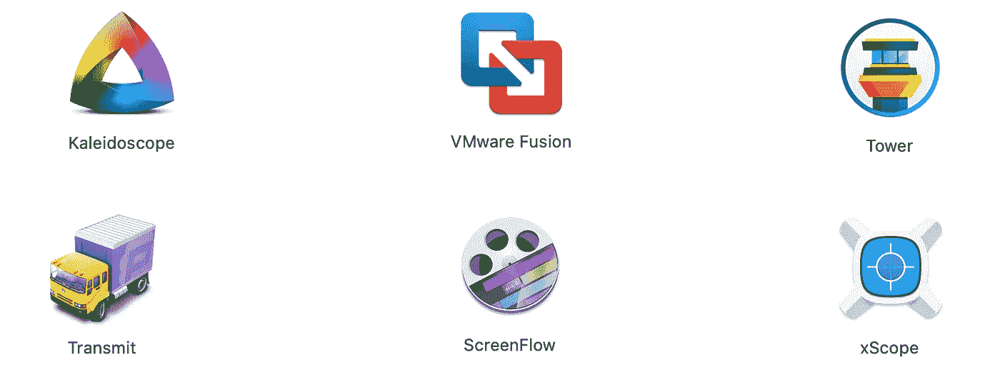
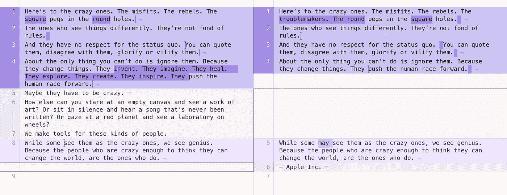
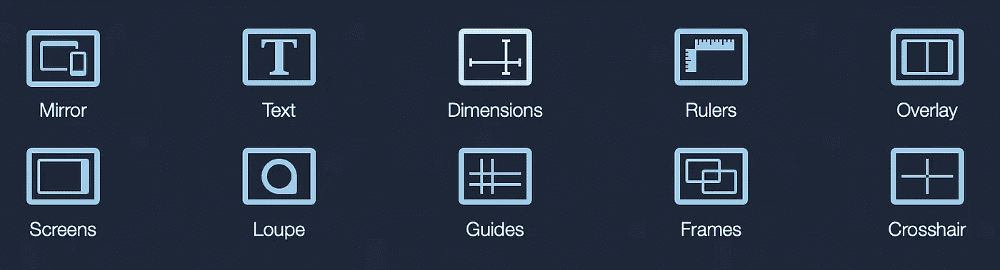
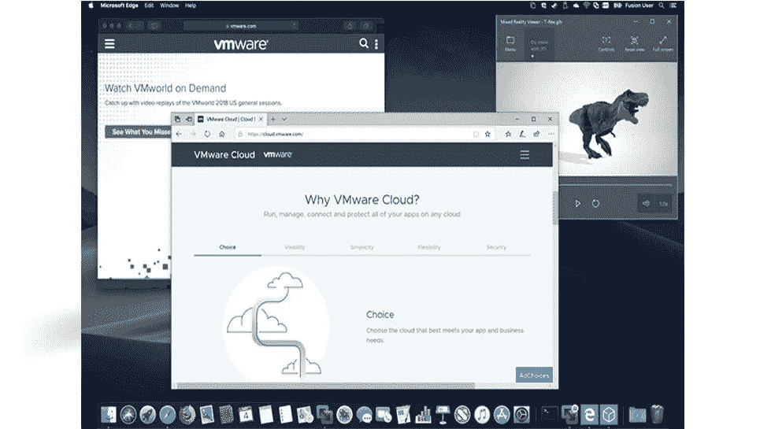
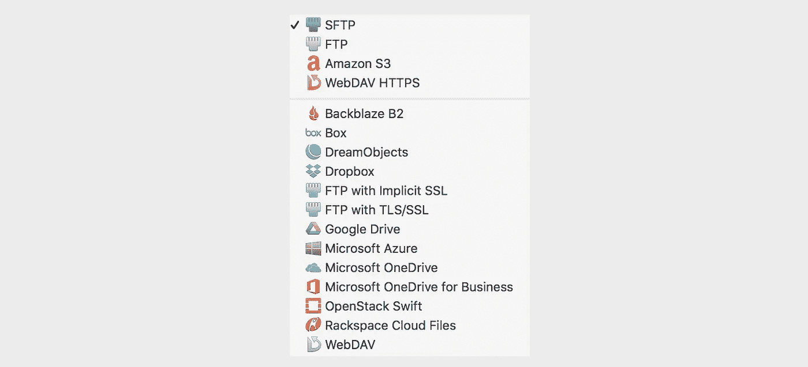
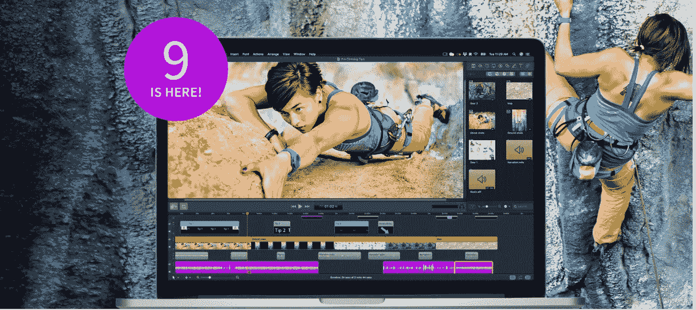

# 面向 Mac 和 iOS 开发人员的 6 款强大工具

> 原文：<https://betterprogramming.pub/6-power-tools-for-mac-and-ios-developers-2717d167f0bb>

## 一系列杀手级应用将加速您的工作流程

我在 Mac 平台上开发软件已经超过 15 年了，在此期间，我逐渐完善了一系列有助于日常开发的工具和实用程序。

这些工具中的一些实际上有助于编写或组织代码的过程，一些有助于与设计者的协作，另一些有助于测试。所有，我推荐并定期使用。

# 1.塔

用于 Mac 和 Windows 的塔式 git 客户端

我每天都在用这个软件，仅次于 Xcode，是我用得最多的开发工具。

对我来说， [Tower](https://www.git-tower.com/mac) 是使用 Git 存储库的游戏规则改变者，它使每项 Git 任务都比使用命令行简单一个数量级。

## **主要特点**

*   拖放合并，拉动，精选。
*   轻松解决冲突。
*   撤销一切的能力。
*   部分藏匿。
*   拉请求。

# 2.千变万化

万花筒文本差异

[万花筒](https://www.kaleidoscopeapp.com)是高塔的终极伴侣。塔对 Git 的作用，万花筒对 diff 的作用！

我使用这两者的方式是，当我需要解决复杂的合并冲突时，我让 Tower 在 Kaleidoscope 中打开相关文件，然后我将更改保存回我的工作树。

## **关键特性**

*   无缝文本差异可视化和双向合并。
*   Image diff…直观地比较两幅图像。
*   在文件夹范围和文件范围之间轻松导航。

# 3.xScope

xScope 工具

xScope 是一款真正神奇的软件。想象一下，你可以在屏幕上放一把虚拟尺子，以像素或屏幕点为单位精确测量任何东西的尺寸…这就是 xScope 的功能。还有更多！

我在做 UI 工作的时候经常使用 xScope，我得到的是一个没有大小和颜色的渲染设计。它也是一个有用的测试工具，用于双重检查代码，以确保它正在做它应该做的事情。

## **主要特点**

*   屏幕上的标尺、参考线和十字准线。
*   放大镜工具用于放大和测量颜色。
*   将设计可视化，就像它们出现在不同设备上一样。

# 4.VMWare Fusion

VMWare Fusion Unity 模式

通常，仅仅知道一些东西在另一个平台上会是什么样子是不够的，你还需要在那些平台上实际构建或测试。

这就是 [VMWare Fusion](https://www.vmware.com/products/fusion.html) 的用武之地。Fusion 允许您在 Mac 上运行 Windows、Linux，甚至旧版本的 macOS。

## **主要特性**

*   在 Mac 上运行其他操作系统和这些系统的不同版本。
*   使用“unity”模式在虚拟机外运行特定应用程序，就像它们是本机应用程序一样。

# 5.传输

传输 Web 服务选项

通常，软件会涉及到与外部 web 服务的交互。这可能是 Dropbox，用于与同事共享文件，也可能是亚马逊 S3，用于大规模文件服务。

传输在一个用户友好的界面中处理所有这些不同的服务和协议。

## **主要特点**

*   存储您经常使用的驱动器和服务器，只需双击即可访问。
*   同步设备之间的登录列表。
*   拖拽复制，轻松权限设置。
*   简单的 API 键设置。

# 6.屏幕流

ScreenFlow 促销图像

作为一个完全远程工作的人，我们的团队经常想要共享演示或屏幕截图来说明错误以供审查。 [ScreenFlow](http://www.telestream.net/screenflow/overview.htm) 让这个过程变得超级简单。

除了捕捉屏幕和声音，它还可以突出鼠标点击和显示按下的按键。它也是一个优秀的可用性测试工具，用于记录用户交互。

最后，它是一个足够强大的视频编辑器，可以制作简单的宣传视频。

## **关键特性**

*   简单的用户友好界面。
*   捕捉屏幕和网络摄像头，实现画中画。
*   视频和音频编辑功能。
*   能够添加标题和注释。

# 结论

虽然这些应用程序都不便宜，但它们都会给你的工作流程带来显著的价值。这些年来，这些已经成为我的“首选”应用程序，以协助开发的各个方面，并且它们每年都在不断改进。

我觉得投资高质量的工具是非常值得的，因为它节省了时间，提高了生产率。

你最喜欢的帮助开发的工具是什么？