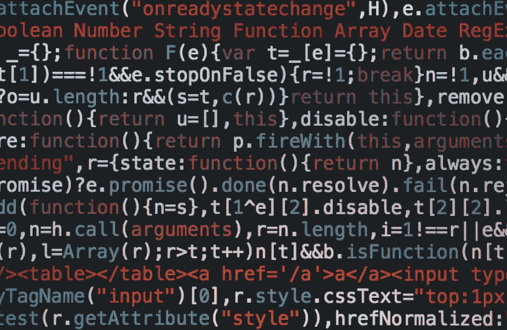
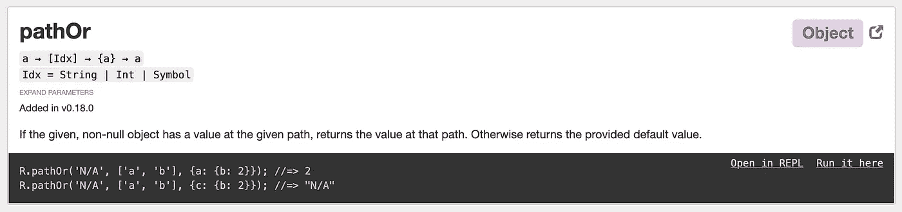
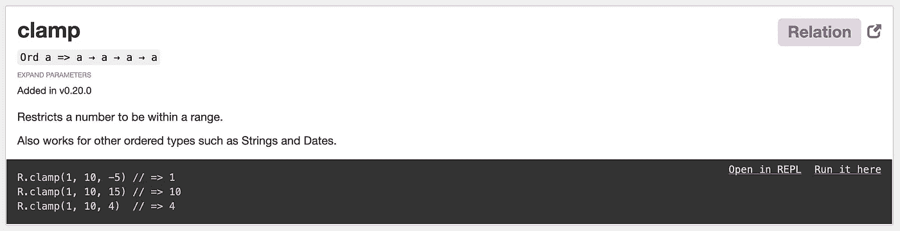
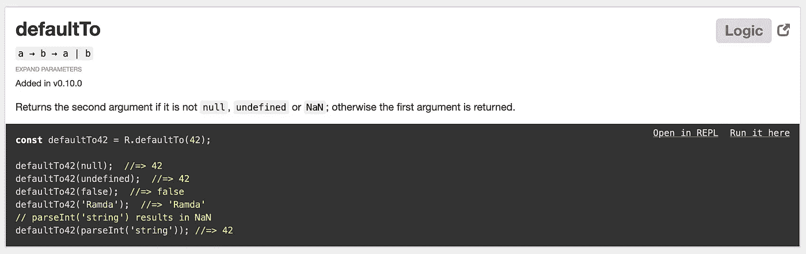
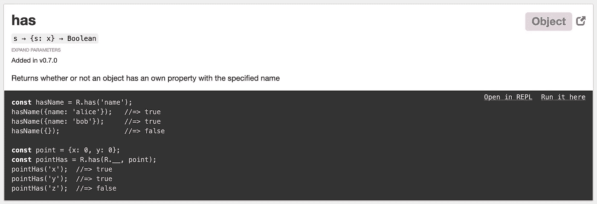
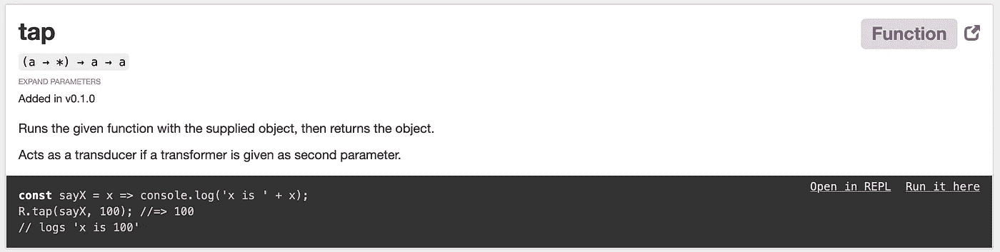
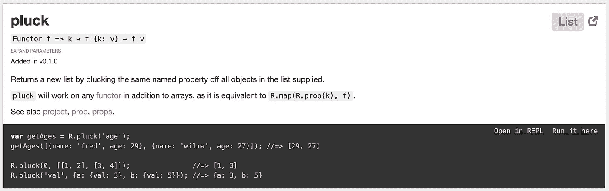

# JavaScript 的 6 个强大的 Ramda 函数

> 原文：<https://betterprogramming.pub/6-powerful-ramda-functions-for-javascript-7b0326c3f1d1>

## 一个快速和功能强大的库，用于增强您的代码



由[马库斯·斯皮斯克](https://unsplash.com/@markusspiske?utm_source=unsplash&utm_medium=referral&utm_content=creditCopyText)在 [Unsplash](https://unsplash.com/s/photos/coding?utm_source=unsplash&utm_medium=referral&utm_content=creditCopyText) 上拍摄

如果你没有听说过用于 JavaScript 的 Ramda 库，那么你就错过了这种语言的一个漂亮的增强。这个库塞满了大量有用的函数和实用程序，它们不仅能解决常见问题，还能让 JavaScript 在函数式编程方面做得更好。

Ramda 是作为一个[功能](https://en.wikipedia.org/wiki/Functional_programming)库开发的，它提供了简洁、优雅但最重要的*功能*实用程序。这意味着许多包含的函数几乎没有副作用，被[处理](https://en.wikipedia.org/wiki/Currying)并提供灵活的管道接口。有了 Ramda，你最终可以在 JavaScript 中实现函数式编程原则。

在本文中，我们将探索该库提供的几个我最喜欢的函数，并展示它们如何使您的代码更具功能性和减少重复性的示例。让我们开始吧。

## 1.[病理](https://ramdajs.com/docs/#pathOr)



[来源](https://ramdajs.com/docs/#pathOr)。

如果说 JavaScript 中有一项任务一直在出现，那就是“挖掘”嵌套对象。想想有多少次你不得不从一个深度嵌套的对象中获取一个值。有多少次那个物体发生了轻微的变异或者丢失了一把钥匙？您真的应该手动检查链中每个中间密钥的存在吗？

这听起来很乏味。

请使用 Ramda 的`pathOr`函数。这个函数可以代替少量的代码。看看这个:

```
const R = require('ramda');let myObject = {
  key1: {
    key2: {
      key3: { targetKey: 1234 }
    }
  }
}let path = ['key1', 'key2', 'key3', 'targetKey'];
let result = R.pathOr(0, path, myObject);console.log(result);
```

让我们来分析一下这里发生了什么:

*   首先，我们用一些数据设置一个简单的嵌套对象。我们的目标是拉出`targetKey`值。
*   接下来，我们设置一个数组，其中包含我们将深入研究的有序键名。
*   最后，我们应用`pathOr`函数，传递一个默认值、路径和要键入的对象。

如果`targetKey`不存在或者中间键之一丢失，那么`pathOr`将返回第一个默认参数，即`0`。

下次需要安全地挖掘嵌套对象时，只需使用`pathOr`。

## 2.[夹钳](https://ramdajs.com/docs/#clamp)



[来源](https://ramdajs.com/docs/#clamp)。

这是一个非常简单的函数，但是非常方便。`clamp`函数确保一个数字落在一个特定的范围内。这意味着，如果您传递一个过高或过低的数字，该函数会将该数字“箝位”到您提供的范围内最接近的可接受数字。

这里有一个简单的例子:

```
const R = require('ramda');let result = R.clamp(10, 20, 5);console.log(result);
```

在本例中，我们将范围固定在 10 到 20 之间。当我们传入 5 时，这低于范围的底端，所以它改为固定到 10。如果我们传入任何高于 20 的值，它会被固定到 20。

您还可以将`clamp`加入到它自己的自定义验证函数中，如下所示:

```
let clampBetweenRange = R.clamp(10, 20);let result = clampBetweenRange(5);console.log(result)
```

这个特殊的功能有大量的应用。您可以将用户输入限制在特定的范围内，或者用它来防止来自其他处理管道的杂乱数据输出。

## 3.[默认为](https://ramdajs.com/docs/#defaultTo)



[来源](https://ramdajs.com/docs/#defaultTo)。

你被野生`undefined`或`null`烧伤过几次？有多少次你不得不回过头来为一个看似简单的功能构建一些复杂的`try/catch`语句？

使用`defaultTo`功能，您可以避免这些麻烦。

`defaultTo`函数将接受默认值作为第一个参数，接受任何值作为第二个参数。如果第二个参数是`null`、`undefined`或`NaN`，则返回第一个参数。这也可以加入到它自己的包装函数中，以获得可读性更强、更简洁的代码:

```
const R = require('ramda');let resultNotCurried = R.defaultTo('error', undefined);console.log(resultNotCurried);let defaulted = R.defaultTo('error');
let resultCurried = defaulted(undefined);console.log(resultCurried);
```

现在，你所要做的就是将你的函数或数据包装在定制的`defaulted`函数中，以避免错误的值。

## 4.[有](https://ramdajs.com/docs/#has)



[来源](https://ramdajs.com/docs/#has)。

虽然这与 JavaScript 的内置`hasOwnProperty`函数非常相似，但是有一个关键的区别。你可以咖喱这个功能，让它更优雅(很明显，*功能性*)。

```
const R = require('ramda');let hasAge = R.has('age');let myObject = { name: 'Bob', age: 24 }console.log(hasAge(myObject));
```

只需将一个键名传递给`has`就可以准备好这个定制的函数。现在，要检查键是否存在，您所要做的就是在新函数中包装对象。极致的便利。

您甚至可以使用一个 [Ramda 管道](https://ramdajs.com/docs/#pipe)将它与前面的`defaultTo`函数结合起来。这将创建一个可以轻松重用的健壮的数据验证管道。查看下一节的示例。

## 5.[点击](https://ramdajs.com/docs/#tap)



[来源](https://ramdajs.com/docs/#tap)。

你是否曾希望自己能进入管道的中间，看看在某一特定阶段发生了什么？通过`tap`功能，你可以做到这一点。

当您将大量函数链接在一起时，中间的一些数据的状态可能会变得混乱。通过利用`tap`，您可以记录一些输出或者将数据保存在其他地方以供查看。

下面是一个用 Ramda“接入”管道中间的例子:

```
const R = require('ramda');let logOutput = val => console.log(val);let pipeline = R.pipe(
  R.inc,
  R.tap(logOutput),
  R.inc,
  R.inc
);let result = pipeline(100);console.log(result);
```

以下是这些步骤的细目分类:

*   首先，我们设置一个函数来将我们的输出记录到控制台。这是一个简单的函数，它接受一个值并记录下来。
*   接下来，我们建立我们的管道。这是一个简单的 Ramda 管道，将逐渐增加一个数字。实际上，这可能是一个更复杂的处理数据的管道，但是对于这个例子，我们将保持它的简单。
*   在我们的管道中间，我们插入了我们的`tap`函数，并将我们的日志记录函数传递给它。
*   最后，我们调用管道并为其提供一个值。

如果您运行上面的例子，您会看到控制台记录了两个值:`101`和`103`。

使用`tap`和管道，我们可以很容易地调查步骤之间发生了什么，并减少检查复杂函数链的总工作量。

## 6.[拔毛](https://ramdajs.com/docs/#pluck)



[来源](https://ramdajs.com/docs/#pluck)。

这个函数乍一看似乎很简单。JavaScript 中的一个常见主题是处理对象列表。无论是从数据库返回的数据还是一些静态 JSON 对象，操作这些模型都是一项非常频繁的任务。

`pluck`功能允许您通过从每个对象中“提取”数据来操作这些对象列表。通过指定要从每个对象中“提取”的关键点，可以从对象列表中生成新的值列表。

```
const R = require('ramda');let myObjects = [
  { name: 'Bob', age: 22 },
  { name: 'Sally', age: 32 }
];let results = R.pluck('name', myObjects);console.log(results);
```

通过指定要拾取的关键点并传入对象列表，您可以构建一个只包含这些关键点的新列表。

最棒的是,`pluck`函数还可以处理不同类型的结构。你可以很容易地从列表和常规对象中选择。

# 结论

函数式编程的世界可能非常庞大和复杂。Ramda 库提供了一种清晰而简单的方式将这个世界带入 JavaScript，而不会让开发人员不知所措。

即使你还没有喝函数式编程的 Kool-Aid，对于更传统的开发风格，这个库中仍然有很多有用的函数。

要更深入地了解 Ramda 和函数式编程的基本原理，请查看由 Marius Ibsen 撰写的[*Ramda your JavaScript*](https://medium.com/compendium/ramda-your-javascript-e72bfaef01d5)。

感谢阅读！如果你喜欢这篇文章，可以看看下面我写的其他一些 JavaScript 文章:

*   [*6 个完全用 JavaScript 编写的操作系统模拟器*](/6-operating-system-emulators-written-entirely-in-javascript-5506a4df2d04)
*   [*操纵声音的最佳 JavaScript 音频库*](https://medium.com/swlh/the-best-javascript-audio-libraries-for-manipulating-sound-6fe319e32d49)